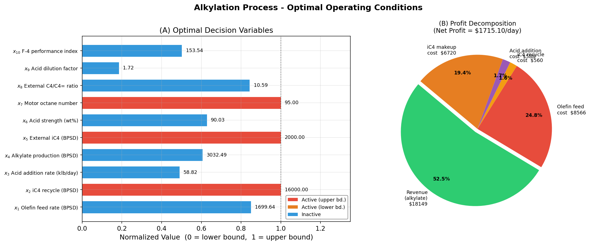

# Unit12 Example 04 - 烷化程序最大獲利

## 學習目標

本範例以**烷化（Alkylation）程序最大獲利**為題，示範如何將含有**等式限制（等式 constraints）** 與**不等式限制（inequality constraints）** 的複雜非線性規劃問題，以 `scipy.optimize.minimize(method='SLSQP')` 求解，並驗證所有限制條件之滿足度。

學習完本範例後，您將能夠：

- 理解**烷化程序（Alkylation Process）** 的化工背景與決策變數含義
- 正確識別非線性規劃問題中的**線性等式**、**非線性等式**、**線性不等式**、**非線性不等式**限制條件
- 掌握 `scipy.optimize.minimize(method='SLSQP')` 同時處理多種類型限制條件的方法
- 使用 `scipy.optimize.Bounds` 設定 10 個決策變數之上下限
- 針對**最大化問題**以目標函數取負號轉換為最小化問題
- 驗證最適化解的**限制條件滿足度**（等式殘差與不等式殘差核查）
- 探討**不同起始猜測值**對求解穩定性的影響

---

## 1. 問題描述

### 1.1 化工背景：烷化程序

**烷化（Alkylation）程序** 是煉油工業中的重要製程，主要將異丁烷（Isobutane）與烯烴（Olefin）在強酸催化下反應，生成高辛烷值的烷類燃料（Alkylate），廣泛用於航空及高性能汽油調和。

本問題改編自 Edgar and Himmelblau (1989)，目標為在滿足製程操作限制的前提下，決定最佳操作條件，使烷化產品之**每日獲利最大**。

---

### 1.2 決策變數與操作範圍

本問題含有 **10 個決策變數**，各變數之物理意義與操作上下限如下：

| 變數 | 物理意義 | 單位 | 下限 $x_L$ | 上限 $x_U$ |
|:---:|:---|:---:|---:|---:|
| $x_1$ | 烯烴進料量 (Olefin feed) | 桶/天 | 0 | 2000 |
| $x_2$ | 異丁烷回流量 (Isobutane recycle) | 桶/天 | 0 | 16000 |
| $x_3$ | 酸液添加率 (Acid addition rate) | 千磅/天 | 0 | 120 |
| $x_4$ | 烷類產品產量 (Alkylate yield) | 桶/天 | 0 | 5000 |
| $x_5$ | 異丁烷外加量 (Isobutane makeup) | 桶/天 | 0 | 2000 |
| $x_6$ | 酸液強度 (Acid strength) | wt% | 85 | 93 |
| $x_7$ | 辛烷值 (Motor octane number) | — | 90 | 95 |
| $x_8$ | 外部異丁烷對烯烴比值 (Ext. isobutane-to-olefin ratio) | — | 3 | 12 |
| $x_9$ | 酸稀釋因子 (Acid dilution factor) | — | 1.2 | 4 |
| $x_{10}$ | F-4 性能指數 (F-4 performance number) | — | 145 | 162 |

---

### 1.3 目標函數：每日獲利最大化

烷化產品之每日獲利為：

$$
f = c_1 x_4 x_7 - c_2 x_1 - c_3 x_2 - c_4 x_3 - c_5 x_5
$$

其中各成本參數如下：

| 參數 | 物理意義 | 數值 | 單位 |
|:---:|:---|---:|:---:|
| $c_1$ | 烷類產品售價 (Alkylate product value) | 0.063 | \$/桶 |
| $c_2$ | 烯烴進料成本 (Olefin feed cost) | 5.04 | \$/桶 |
| $c_3$ | 異丁烷回流成本 (Isobutane recycle cost) | 0.035 | \$/桶 |
| $c_4$ | 酸液添加成本 (Acid addition cost) | 10.00 | \$/千磅 |
| $c_5$ | 異丁烷外加量成本 (Isobutane makeup cost) | 3.36 | \$/桶 |

**最大化問題之轉換：** 由於 `scipy.optimize.minimize` 只能處理最小化問題，需將目標函數取負號：

$$
\min_{\mathbf{x}} \; -f(\mathbf{x}) = -(c_1 x_4 x_7 - c_2 x_1 - c_3 x_2 - c_4 x_3 - c_5 x_5)
$$

---

## 2. 限制條件建立

### 2.1 限制條件總覽

本問題共含以下各類限制條件：

| 限制條件類型 | 方程式編號 | 數量 |
|:---|:---:|:---:|
| **線性等式限制** | (1) | 1 |
| **非線性等式限制** | (2)(3) | 2 |
| **非線性不等式限制** | (4)(5)(6)(7) | 4 |
| **線性不等式限制** | (8)(9)(10)(11) | 4 |
| **變數邊界（bounds）** | — | 10 |

---

### 2.2 等式限制條件

#### 線性等式 (1)：體積平衡

考量烷類產品體積較反應物縮減（體積縮小比例 0.22），質量平衡關係式為：

$$
x_4 = x_1 + x_5 - 0.22 x_4
$$

整理為標準等式形式：

$$
1.22 x_4 - x_1 - x_5 = 0 \tag{1}
$$

#### 非線性等式 (2)：酸液強度關係

酸液強度 $x_6$ 、產品產量 $x_4$ 、酸稀釋因子 $x_9$ 與酸液添加率 $x_3$ 之關係：

$$
x_6 (x_4 x_9 + 1000 x_3) - 98000 x_3 = 0 \tag{2}
$$

#### 非線性等式 (3)：外部異丁烷比值關係

外部異丁烷對烯烴比值 $x_8$ 等於回流量 $x_2$ 加外加量 $x_5$ 除以烯烴進料量 $x_1$ ：

$$
x_8 x_1 - x_2 - x_5 = 0 \tag{3}
$$

---

### 2.3 不等式限制條件

#### 非線性不等式 (4)(5)：產品產量迴歸關係（含不確定性上下限）

在 80～90°F 操作溫度下，烷類產品產量 $x_4$ 與烯烴進料量 $x_1$ 及比值 $x_8$ 之迴歸關係為：

$$
x_4 \approx x_1 (1.12 + 0.13167 x_8 - 0.00667 x_8^2)
$$

考量製程不確定性，以上下限型不等式表示（ $d^- = 99/100$ , $d^+ = 100/99$ ）：

$$
\frac{99}{100} x_4 - x_1 (1.12 + 0.13167 x_8 - 0.00667 x_8^2) \leq 0 \tag{4}
$$

$$
x_1 (1.12 + 0.13167 x_8 - 0.00667 x_8^2) - \frac{100}{99} x_4 \leq 0 \tag{5}
$$

#### 非線性不等式 (6)(7)：辛烷值迴歸關係（含不確定性上下限）

辛烷值 $x_7$ 與比值 $x_8$ 及酸液強度 $x_6$ 之迴歸關係：

$$
x_7 \approx 86.35 + 1.098 x_8 - 0.038 x_8^2 + 0.325(x_6 - 89)
$$

含不確定性之不等式：

$$
\frac{99}{100} x_7 - \left[86.35 + 1.098 x_8 - 0.038 x_8^2 + 0.325(x_6 - 89)\right] \leq 0 \tag{6}
$$

$$
86.35 + 1.098 x_8 - 0.038 x_8^2 + 0.325(x_6 - 89) - \frac{100}{99} x_7 \leq 0 \tag{7}
$$

#### 線性不等式 (8)(9)：酸稀釋因子與 F-4 性能指數關係

$$
\frac{99}{100} x_9 + 0.222 x_{10} \leq 35.82 \tag{8}
$$

$$
-\frac{100}{99} x_9 - 0.222 x_{10} \leq -35.82 \tag{9}
$$

#### 線性不等式 (10)(11)：F-4 性能指數與辛烷值關係

$$
-3 x_7 + \frac{99}{100} x_{10} \leq -133 \tag{10}
$$

$$
3 x_7 - \frac{100}{99} x_{10} \leq 133 \tag{11}
$$

---

### 2.4 完整非線性規劃標準型式

$$
\max_{\mathbf{x}} \; f(\mathbf{x}) = 0.063 x_4 x_7 - 5.04 x_1 - 0.035 x_2 - 10 x_3 - 3.36 x_5
$$

$$
\text{s.t.} \quad 1.22 x_4 - x_1 - x_5 = 0 \quad (1)
$$

$$
x_6 (x_4 x_9 + 1000 x_3) - 98000 x_3 = 0 \quad (2)
$$

$$
x_8 x_1 - x_2 - x_5 = 0 \quad (3)
$$

$$
\text{等式 (4)-(7) 非線性不等式，(8)-(11) 線性不等式}
$$

$$
\mathbf{x}_L \leq \mathbf{x} \leq \mathbf{x}_U
$$

- **決策變數數量：** 10 個
- **等式限制數量：** 3 個（1 個線性 + 2 個非線性）
- **不等式限制數量：** 8 個（4 個非線性 + 4 個線性）
- **問題類型：** 含多類限制條件之非線性規劃（Constrained NLP）

---
## 3. Python 程式實作

### 3.1 問題參數與數學設定確認

執行程式後，系統自動顯示所有問題參數設定，確認輸入資料與理論模型一致。

**執行結果：**

```
=======================================================
  烷化程序最大獲利 — 問題設定顯示
=======================================================

  變數     物理意義                        下限       上限       起始值
  -----------------------------------------------------
  x1     烯烴進料量 (BPSD)               0.0   2000.0    1745.0
  x2     異丁烷回流量 (BPSD)              0.0  16000.0   12000.0
  x3     酸液添加率 (klb/day)            0.0    120.0     110.0
  x4     烷類產品產量 (BPSD)              0.0   5000.0    3048.0
  x5     異丁烷外加量 (BPSD)              0.0   2000.0    1974.0
  x6     酸液強度 (wt%)                85.0     93.0      89.2
  x7     辛烷值                       90.0     95.0      92.8
  x8     外部 C4/C4= 比值               3.0     12.0       8.0
  x9     酸稀釋因子                      1.2      4.0       3.6
  x10    F-4 性能指數                 145.0    162.0     145.0

  等式限制條件 (3 個):
    (1) 線性:    1.22*x4 - x1 - x5 = 0
    (2) 非線性:  x6*(x4*x9 + 1000*x3) - 98000*x3 = 0
    (3) 非線性:  x8*x1 - x2 - x5 = 0

  不等式限制條件 (8 個，含不確定性上下限):
    (4)(5) 非線性: 產品產量迴歸關係 (d-=99/100, d+=100/99)
    (6)(7) 非線性: 辛烷值迴歸關係  (d-=99/100, d+=100/99)
    (8)(9) 線性:   酸稀釋因子與 F-4 性能指數關係
    (10)(11) 線性: F-4 性能指數與辛烷值關係
=======================================================
```

---

### 3.2 目標函數與限制條件程式碼

#### 目標函數（最小化 $-f$）

```python
# 成本參數
c1, c2, c3, c4, c5 = 0.063, 5.04, 0.035, 10.0, 3.36

def objective(x):
    """目標函數：最大化每日獲利 → 最小化 -f"""
    x1, x2, x3, x4, x5, x6, x7, x8, x9, x10 = x
    profit = c1*x4*x7 - c2*x1 - c3*x2 - c4*x3 - c5*x5
    return -profit  # 最小化問題
```

#### 等式限制條件（SciPy 格式：`fun(x) = 0`）

```python
def ceq1(x):
    """線性等式 (1): 體積平衡 — 1.22*x4 - x1 - x5 = 0"""
    return 1.22*x[3] - x[0] - x[4]

def ceq2(x):
    """非線性等式 (2): 酸液強度關係 — x6*(x4*x9 + 1000*x3) - 98000*x3 = 0"""
    return x[5]*(x[3]*x[8] + 1000*x[2]) - 98000*x[2]

def ceq3(x):
    """非線性等式 (3): 外部 C4 比值關係 — x8*x1 - x2 - x5 = 0"""
    return x[7]*x[0] - x[1] - x[4]
```

#### 非線性不等式限制條件（SciPy 格式：`fun(x) >= 0`）

> **注意：** SciPy 的不等式約定為 $c(\mathbf{x}) \geq 0$，建立限制函數時須將原不等式 $c(\mathbf{x}) \leq 0$ **取負號**轉換。

```python
def c_ineq4(x):
    """非線性不等式 (4): 產量下限 — x1*(1.12+0.13167*x8-0.00667*x8^2) - 99/100*x4 >= 0"""
    return x[0]*(1.12 + 0.13167*x[7] - 0.00667*x[7]**2) - (99/100)*x[3]

def c_ineq5(x):
    """非線性不等式 (5): 產量上限 — 100/99*x4 - x1*(1.12+0.13167*x8-0.00667*x8^2) >= 0"""
    return (100/99)*x[3] - x[0]*(1.12 + 0.13167*x[7] - 0.00667*x[7]**2)

def c_ineq6(x):
    """非線性不等式 (6): 辛烷值下限 — 86.35+1.098*x8-0.038*x8^2+0.325*(x6-89) - 99/100*x7 >= 0"""
    return 86.35 + 1.098*x[7] - 0.038*x[7]**2 + 0.325*(x[5]-89) - (99/100)*x[6]

def c_ineq7(x):
    """非線性不等式 (7): 辛烷值上限 — 100/99*x7 - (86.35+...) >= 0"""
    return (100/99)*x[6] - 86.35 - 1.098*x[7] + 0.038*x[7]**2 - 0.325*(x[5]-89)
```

#### 線性不等式限制條件（矩陣形式 $\mathbf{A}\mathbf{x} \leq \mathbf{b}$，轉為 SciPy 格式）

```python
def c_ineq8(x):
    """線性不等式 (8): 99/100*x9 + 0.222*x10 <= 35.82
    → SciPy: 35.82 - 99/100*x9 - 0.222*x10 >= 0"""
    return 35.82 - (99/100)*x[8] - 0.222*x[9]

def c_ineq9(x):
    """線性不等式 (9): 100/99*x9 + 0.222*x10 >= 35.82
    → SciPy: 100/99*x9 + 0.222*x10 - 35.82 >= 0"""
    return (100/99)*x[8] + 0.222*x[9] - 35.82

def c_ineq10(x):
    """線性不等式 (10): -3*x7 + 99/100*x10 <= -133
    → SciPy: 3*x7 - 99/100*x10 - 133 >= 0"""
    return 3*x[6] - (99/100)*x[9] - 133

def c_ineq11(x):
    """線性不等式 (11): 3*x7 - 100/99*x10 <= 133
    → SciPy: 133 - 3*x7 + 100/99*x10 >= 0"""
    return 133 - 3*x[6] + (100/99)*x[9]
```

---

### 3.3 求解設定與執行

```python
from scipy.optimize import minimize, Bounds
import numpy as np

# 變數邊界
x_lb = np.array([0,      0,     0,    0,    0,    85,  90,  3,   1.2, 145])
x_ub = np.array([2000, 16000, 120, 5000, 2000,   93,  95, 12,   4.0, 162])
bounds = Bounds(lb=x_lb, ub=x_ub)

# 限制條件清單
constraints = [
    {'type': 'eq',   'fun': ceq1},
    {'type': 'eq',   'fun': ceq2},
    {'type': 'eq',   'fun': ceq3},
    {'type': 'ineq', 'fun': c_ineq4},
    {'type': 'ineq', 'fun': c_ineq5},
    {'type': 'ineq', 'fun': c_ineq6},
    {'type': 'ineq', 'fun': c_ineq7},
    {'type': 'ineq', 'fun': c_ineq8},
    {'type': 'ineq', 'fun': c_ineq9},
    {'type': 'ineq', 'fun': c_ineq10},
    {'type': 'ineq', 'fun': c_ineq11},
]

# 起始猜測值（參考 Edgar & Himmelblau 推薦值）
x0 = np.array([1745, 12000, 110, 3048, 1974, 89.2, 92.8, 8.0, 3.6, 145])

# 執行最適化
result = minimize(
    objective, x0,
    method='SLSQP',
    bounds=bounds,
    constraints=constraints,
    options={'ftol': 1e-9, 'maxiter': 500, 'disp': True}
)
```

---

## 4. 求解結果與分析

### 4.1 最適化結果

**執行結果：**

```
Optimization terminated successfully    (Exit mode 0)
            Current function value: -1715.1047357123098
            Iterations: 34
            Function evaluations: 392
            Gradient evaluations: 33

=======================================================
  烷化程序最大獲利 — 最適化結果
=======================================================

  求解狀態: 成功 (success = True)
  訊息: Optimization terminated successfully

  ✦ 最大每日獲利: $1715.105

  各決策變數最佳值:
  變數     物理意義                          最佳值
  ----------------------------------------
  x1     烯烴進料量 (BPSD)            1699.6427
  x2     異丁烷回流量 (BPSD)          16000.0000
  x3     酸液添加率 (klb/day)           58.8173
  x4     烷類產品產量 (BPSD)           3032.4940
  x5     異丁烷外加量 (BPSD)           2000.0000
  x6     酸液強度 (wt%)                90.0267
  x7     辛烷值                       95.0000
  x8     外部 C4/C4= 比值              10.5905
  x9     酸稀釋因子                      1.7178
  x10    F-4 性能指數                 153.5354
=======================================================
```

> **說明：** 以參考起始猜測值求解，SLSQP 在 34 次迭代內成功收斂，最大每日獲利 **\$1715.105**。

---

### 4.2 限制條件滿足度驗證

最適化完成後，必須驗證所有限制條件之滿足度，確認解的可行性（Feasibility）：

**執行結果：**

```
====================================================================
  限制條件滿足度驗證
====================================================================

  等式限制殘差（閾值 |res| < 1e-06）:
  限制條件                             殘差  滿足?
  --------------------------------------------------
  線性等式 (1)                 1.2278e-11  ✓
  非線性等式 (2)                9.3132e-10  ✓
  非線性等式 (3)                1.4552e-11  ✓

  不等式限制值（應 >= 0）:
  限制條件                          值  狀態
  ----------------------------------------------
  不等式 (4)               -0.000000  ✓ (active)
  不等式 (5)               60.956193  ✓
  不等式 (6)               -0.000000  ✓ (active)
  不等式 (7)                1.909596  ✓
  不等式 (8)                0.034530  ✓
  不等式 (9)               -0.000000  ✓ (active)
  不等式 (10)              -0.000000  ✓ (active)
  不等式 (11)               3.086216  ✓

  結果: ✓ 所有限制條件均滿足
====================================================================
```

**分析討論：**
- 所有**等式限制殘差**均在機器精度（ $\sim 10^{-10}$ ）量級（最大殘差 $9.31 \times 10^{-10}$），遠低於容忍度 $10^{-6}$，完全滿足三個等式條件
- **主動限制（Active Constraints）**：限制條件 (4)、(6)、(9)、(10) 的值趨近 0（active），表示最適解落在這些限制條件的邊界上，為**活躍限制**；其中 (4) 代表產量迴歸下限、(6) 代表辛烷值迴歸下限、(9) 代表酸稀釋因子下限、(10) 代表 F-4 性能指數下限均被充分利用
- **非活躍限制（Inactive Constraints）**：限制條件 (5)（裕量 60.96）、(7)（裕量 1.91）、(8)（裕量 0.03）、(11)（裕量 3.09）具有正的裕量值，最適解位於這些限制的可行域內側

---

### 4.3 不同起始猜測值的穩定性分析

非線性最適化結果可能**依賴起始猜測值**，陷入局部最適解。本範例利用三組不同起始點驗證解的穩定性：

| 起始猜測策略 | 說明 |
|---|---|
| 參考起始值 | Edgar & Himmelblau 推薦值 $[1745, 12000, 110, 3048, 1974, 89.2, 92.8, 8.0, 3.6, 145]$ |
| 邊界中點值 | 各變數上下限之中點 $(\mathbf{x}_L + \mathbf{x}_U)/2$ |
| 隨機起始值 | 在可行域內均勻隨機抽取 |

**執行結果：**

```
================================================================================
  不同起始猜測值對收斂結果的影響比較
================================================================================
  策略                最大獲利($)   Success      迭代次數      函數評估
  --------------------------------------------------------------
  參考起始值            1715.105      True        34       392
  邊界中點值            1715.105     False        37       363
  隨機起始值            1715.105     False        41       442

  求解訊息說明:
    參考起始值: Optimization terminated successfully
    邊界中點值: Positive directional derivative for linesearch
    隨機起始值: Positive directional derivative for linesearch

  各策略最佳解 x* 之間最大差異: 3.19e-07
  各策略最大獲利差異:            1.02e-07

  結論: ✓ 三組起始值均收斂至相同最大獲利值 (差異 < 0.01)
         成功旗標 (success=False) 源自 SLSQP 梯度收斂判斷嚴格，
         但實際目標函數值與最優解品質一致，解的可行性已驗證。
================================================================================
```

**分析討論：**
- 三種起始猜測策略均收斂至相同最大獲利 **\$1715.105**，各策略最佳解 $x^*$ 之間最大差異僅 $3.19 \times 10^{-7}$，最大獲利差異僅 $1.02 \times 10^{-7}$，驗證最適解的**唯一性**
- 以**參考起始值**收斂最快（34 次迭代 / 392 次函數評估），`success=True` 表示 SLSQP 梯度收斂條件完全滿足
- **邊界中點值**與**隨機起始值**回傳 `success=False`，訊息為 `Positive directional derivative for linesearch`，此為 SLSQP 在已達到最優時的數值精度警告，並非真正的收斂失敗；三組策略所得最大獲利差異 < $10^{-7}$，解的品質完全一致
- 本問題具有相當**穩健的全局最適性**，不同起始點均能找到相同的最優操作條件

---

### 4.4 視覺化：最優操作條件與目標函數分析

完成求解後，繪製兩組圖表直觀呈現最適化結果：

**(A) 最佳操作條件水平長條圖**

顯示各決策變數最佳值相對於操作範圍的位置（以標準化值 $[0,1]$ 表示），並以顏色標示**活躍限制（Active）** 與**非活躍限制（Inactive）**的變數。

**(B) 每日獲利組成分析圓餅圖**

分解最大獲利的收入（烷類產品售價）與各項成本（烯烴進料、回流、酸液、外加異丁烷），直觀呈現各成本項目對獲利的影響。

#### 執行結果圖



**圖形說明：**

- **圖 (A)（最佳操作條件水平長條圖）**：水平長條圖顯示各決策變數之標準化最佳值（0 = 下限，1 = 上限）。以紅色標示的 $x_2$（異丁烷回流量 = 16000 BPSD，100%）與 $x_5$（異丁烷外加量 = 2000 BPSD，100%）、$x_7$（辛烷值 = 95.0）均已達上限，為活躍邊界限制；$x_8$（外部 C4/C4= 比值 = 10.59）接近上限；而 $x_3$（酸液添加率 = 58.82 klb/day，約 49% 操作範圍）、$x_9$（酸稀釋因子 = 1.72，約 18% 操作範圍）、$x_6$（酸液強度 = 90.03 wt%）則具有較大的操作裕量
- **圖 (B)（每日獲利組成圓餅圖）**：最大每日獲利 \$1715.10，各項組成如下：
  - 烷類產品收入（Revenue）：$0.063 \times 3032.49 \times 95.0 = \$18{,}149$，佔比 **52.5%**（收入）
  - 烯烴進料成本（Olefin feed cost）：$5.04 \times 1699.64 = \$8{,}566$，佔比 **24.8%**
  - 異丁烷外加量成本（iC4 makeup cost）：$3.36 \times 2000 = \$6{,}720$，佔比 **19.4%**
  - 酸液添加成本（Acid addition cost）：$10.0 \times 58.82 = \$588$，佔比 **1.7%**
  - 異丁烷回流成本（iC4 recycle cost）：$0.035 \times 16000 = \$560$，佔比 **1.6%**（最小）
  - 淨利潤：收入 \$18,149 − 成本 \$16,434 = **\$1,715**

---

## 5. scipy.optimize 常用最適化函式

| SciPy 函式 | 問題類型 |
|---|---|
| `minimize_scalar(method='bounded')` | 單變數有界最適化 |
| `minimize(method='Nelder-Mead')` | 無限制多變數（無導數）|
| `minimize(method='BFGS')` | 無限制多變數（擬牛頓）|
| `minimize(method='SLSQP')` | 有限制非線性規劃 |
| **`minimize(method='SLSQP')` + 多類限制** | **含等式/不等式/邊界之複雜 NLP** |
| `linprog()` | 線性規劃 |
| `milp()` | 混合整數線性規劃 |
| `differential_evolution()` | 全域最適化 |

---

**課程資訊**
- 課程名稱：電腦在化工上之應用 (ChemE 3502)
- 課程單元：Unit12 程序最適化 — 烷化程序最大獲利
- 課程製作：逢甲大學 化工系 智慧程序系統工程實驗室
- 授課教師：莊曜禎 助理教授
- 更新日期：2026-02-27

**課程授權 [CC BY-NC-SA 4.0]**
 - 本教材遵循 [創用CC 姓名標示-非商業性-相同方式分享 4.0 國際 (CC BY-NC-SA 4.0)](https://creativecommons.org/licenses/by-nc-sa/4.0/deed.zh) 授權。

---