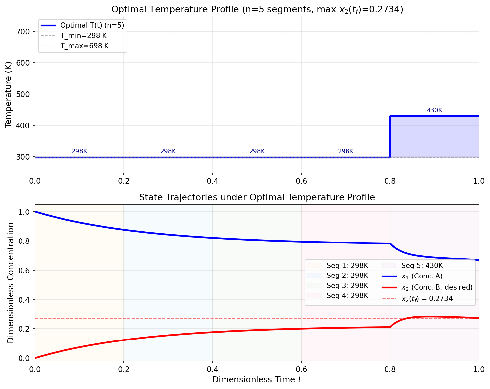
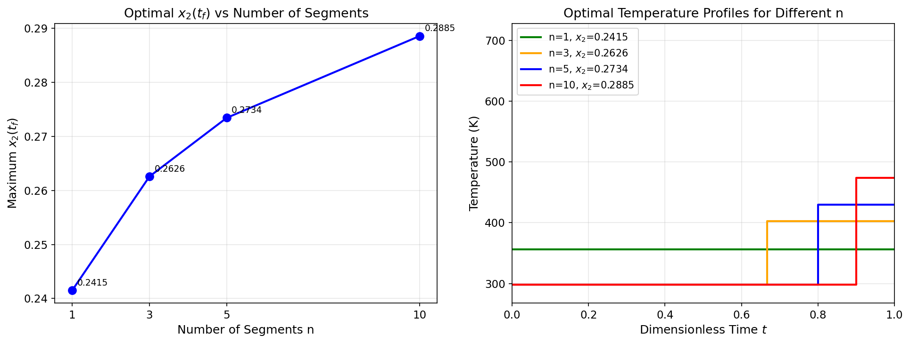

# Unit12_Example_05 | 管型反應器之最佳操作溫度分布

本 Notebook 使用 `Unit12/` 目錄下之範例程式，結合 `scipy.integrate.solve_ivp()` 與 `scipy.optimize.minimize(method='SLSQP')` 求解管型反應器之最佳操作溫度分布問題。

## 目標
- 建立含溫度依賴速率常數之連串反應 ODE 模型
- 以分段均勻溫度參數化 (Piecewise Constant Temperature Parameterization) 將動態最適化問題轉換為靜態 NLP
- 使用 SLSQP 搭配 `solve_ivp()` 於目標函數中求解 ODE，找出使產物 B 濃度最大之最佳溫度分布
- 探討時間分割區段數 $n$ 對最佳解品質的影響
- 繪製最佳溫度分布之階梯圖與系統狀態隨時間之變化曲線

資料來源：改編自教科書 ch6 範例 6-2-7

---

## 1. 問題描述

### 1.1 反應系統

管型反應器中進行以下連串反應：

$$
A \xrightarrow{k_1} B \xrightarrow{k_3} C \quad \text{（含逆反應 } B \xrightarrow{k_2} A\text{）}
$$

其中 $A$ 為原料， $B$ 為目標產物， $C$ 為不欲副產物。以 $x_1$ 與 $x_2$ 分別表示 $A$ 和 $B$ 之無因次濃度，反應動態方程式（ODE 系統）為：

$$
\frac{dx_1}{dt} = -k_1(T)\, x_1^2 + k_2(T)\, x_2
$$

$$
\frac{dx_2}{dt} = k_1(T)\, x_1^2 - [k_2(T) + k_3(T)]\, x_2
$$

初始條件：

$$
x_1(0) = 1.0, \quad x_2(0) = 0.0
$$

反應在 $t \in [0,\ 1]$ （無因次時間）內進行。

### 1.2 Arrhenius 速率常數

各反應速率常數依 Arrhenius 方程式隨溫度 $T$ （K）而變化：

$$
k_i(T) = k_{i0} \exp\!\left(-\frac{E_i}{T}\right), \quad i = 1, 2, 3
$$

其中 $E_i = E_{a,i}/R$ 為活化溫度（K），模型參數如下：

| 參數 | $k_{i0}$ | $E_i$ (K) |
|:-----|:--------:|:---------:|
| $k_1$ （ $A \to B$ ） | 4000 | 2500 |
| $k_2$ （ $B \to A$ ） | 2000 | 2000 |
| $k_3$ （ $B \to C$ ） | 1000 | 3000 |

### 1.3 最適化問題設定

決策變數為反應器軸向溫度分布 $T(t)$ 。為使問題可求解，將時間區間 $[0, 1]$ 均分為 $n$ 段，假設各段溫度均一：

$$
T(t) = T_j, \quad t \in \left[\frac{(j-1)}{n},\ \frac{j}{n}\right), \quad j = 1, 2, \ldots, n
$$

最適化問題形式為：

$$
\max_{\mathbf{T}} \quad x_2(t_f)
$$

$$
\text{s.t.} \quad T_{\min} \leq T_j \leq T_{\max}, \quad j = 1, \ldots, n
$$

溫度操作範圍： $T_{\min} = 298\ \text{K}$ ， $T_{\max} = 698\ \text{K}$ 。

---

## 2. 求解策略

### 2.1 動態最適化轉換為靜態 NLP

將時間離散化後：
- **決策變數**： $n$ 個溫度值 $\mathbf{T} = [T_1, T_2, \ldots, T_n]$
- **目標函數**：給定 $\mathbf{T}$ 後，以 `solve_ivp()` 積分 ODE 至 $t_f$ ，取 $-x_2(t_f)$ 作為最小化目標
- **限制條件**：僅有邊界限制（ $T_{\min} \leq T_j \leq T_{\max}$ ），無等式或不等式限制

### 2.2 SciPy 實作要點

```python
from scipy.integrate import solve_ivp
from scipy.optimize import minimize, Bounds

def objective(T_profile):
    """給定溫度分布，積分 ODE，回傳 -x2(tf)"""
    sol = integrate_reactor(T_profile)        # 分段積分 ODE
    return -sol.y[1, -1]                      # 最小化 -x2(tf) = 最大化 x2(tf)

bounds  = Bounds(lb=298.0, ub=698.0)          # 各段溫度邊界
options = {'ftol': 1e-10, 'maxiter': 1000}    # 高精度容差

# 多起始點策略，避免陷入局部最佳解
for T0 in [np.full(n, 400.0),                 # 均一中溫
           np.full(n, 350.0),                 # 均一低溫
           np.linspace(500, 300, n)]:         # 遞降初始猜測
    res = minimize(objective, T0, method='SLSQP', bounds=bounds, options=options)
    if res.fun < best_fun:                    # 保留目標值最小（x2 最大）的結果
        best_res = res
```

**注意事項**：
1. 每次目標函數評估都需完整積分 ODE，計算成本較高（ $n=5$ 約需 360 次評估，耗時 ~5 秒）
2. SLSQP 使用數值梯度，設定 `ftol=1e-10` 確保收斂精度
3. 求解器 `method='RK45'` 適用本問題（平滑解）；設定 `rtol=1e-6, atol=1e-8` 確保積分精度
4. **多起始點策略**（400 K、350 K、遞降線段）可降低陷入局部最佳解的風險

---

## 3. 分析結果

### 3.1 最佳溫度分布特徵（ $n=5$ 求解結果）

#### 速率常數隨溫度之變化

執行 Cell 7 確認各反應在不同溫度下的速率常數：

```
速率常數示例:
   T (K)     k1        k2        k3
      350   3.1620    6.5970    0.1894
      450  15.4637   23.4873    1.2726
      550  42.4614   52.6960    4.2768
      650  85.4470   92.2018    9.8984
```

可見 $k_3$ （ $B \to C$ ）對溫度最為敏感（活化能 $E_3 = 3000\ \text{K}$ 最高），升溫對側反應的促進程度遠大於主反應 $k_1$ 。

#### ODE 模型等溫測試

Cell 9 以均一溫度 $T = 500\ \text{K}$ 驗證 ODE 模型：

```
等溫測試 (T=500K, n=5): x1(tf)=0.4036, x2(tf)=0.1149
```

等溫下 $x_2(t_f) = 0.1149$ ，作為後續最佳化的比較基準。

#### SLSQP 最佳化結果（ $n=5$ ）

Cell 11 以 SLSQP 求解 5 段最佳溫度分布，結果如下：

```
求解狀態: 成功 | Optimization terminated successfully
最大 x2(tf): 0.273410 | 函數評估次數: 360
段  1: t=[0.00, 0.20]  T = 298.00 K
段  2: t=[0.20, 0.40]  T = 298.00 K
段  3: t=[0.40, 0.60]  T = 298.00 K
段  4: t=[0.60, 0.80]  T = 298.00 K
段  5: t=[0.80, 1.00]  T = 429.60 K
終端狀態: x1(tf) = 0.670589, x2(tf) = 0.273410
```

最佳溫度分布圖（階梯圖）與狀態曲線如下：



**最佳策略解析**：數值結果呈現「**先低後高 (Low-then-High)**」之溫度分布，與直覺相反：
- **前 4 段（ $t \in [0, 0.8]$ ）， $T = 298\ \text{K}$**：維持低溫，大幅抑制活化能最高的 $B \to C$ 側反應（ $k_3$ ），使已生成之 $B$ 不易降解；同時 $A \to B$ 仍緩慢進行
- **末段（ $t \in [0.8, 1.0]$ ）， $T = 430\ \text{K}$**：末端短暫升溫，促使殘餘大量 $A$ （ $x_1 \approx 0.77$ ）加速轉化為 $B$ ，在 $B$ 無法及時進一步降解前達到 $t_f$
- 相較等溫 500 K 基準（ $x_2 = 0.1149$ ），最佳策略使 $x_2(t_f)$ 提升至 $0.2734$ ，**改善幅度達 138%**

### 3.2 區段數 $n$ 的影響

Cell 15 逐一求解 $n = 1, 3, 5, 10$ 並比較結果：

| 區段數 $n$ | 最大 $x_2(t_f)$ | 改善率（相對 $n=1$ ） | 壁鐘時間 | 最佳溫度摘要 |
|:----------:|:---------------:|:---------------------:|:--------:|:------------:|
| 1 | 0.2415 | 0.00% | 0.27 s | [356 K] |
| 3 | 0.2626 | 8.72% | 2.08 s | [298, 298, 403 K] |
| 5 | 0.2734 | 13.21% | 5.24 s | [298, 298, 298, 298, 430 K] |
| 10 | 0.2885 | 19.48% | 23.88 s | min=298 K, max=474 K, 末段=474 K |

各 $n$ 之最佳溫度分布與收斂曲線如下：



**觀察重點**：
- 所有 $n \geq 3$ 的最佳解均呈現「**先低後高**」模式，前段維持接近 $T_{\min} = 298\ \text{K}$ ，末段升至不同程度
- $n$ 增加時，末段高溫可更精確地調整（ $n=10$ 末段達 474 K），進一步提升 $x_2(t_f)$
- 邊際效益遞減：從 $n=1$ 到 $n=3$ 改善 8.72%，從 $n=5$ 到 $n=10$ 僅改善 5.5%，但計算時間從 5 s 增至 24 s
- 隨 $n$ 增加，解的品質提升但計算成本也顯著增加（每次函數評估需完整積分 ODE）

---

## 4. 程式碼執行說明

本 Notebook 含以下段落：

1. **環境設定**：路徑設定，兼容 Colab 與本地環境
2. **載入套件**：numpy、matplotlib、scipy
3. **問題參數定義**：反應參數與操作範圍
4. **ODE 模型與目標函數**：`reactor_ode()`、`integrate_reactor()`、`objective()`
5. **求解（ $n=5$ ）**：SLSQP 求解最佳 5 段溫度分布
6. **驗證與視覺化**：最佳溫度分布圖（階梯圖）+ 狀態曲線圖
7. **區段數比較**：探討 $n = 1, 3, 5, 10$ 之解品質
8. **總結**：最佳結果與學習重點

---

## 5. 附錄：SciPy 函式說明

### `scipy.integrate.solve_ivp()`

```python
sol = solve_ivp(fun, t_span, y0,
                method='RK45',
                t_eval=None,
                rtol=1e-3, atol=1e-6)
# sol.y.shape = (n_equations, n_time_points)
# sol.y[:, -1] = 終點狀態值
```

### `scipy.optimize.minimize(method='SLSQP')`

```python
result = minimize(fun, x0,
                  method='SLSQP',
                  bounds=Bounds(lb, ub),
                  options={'ftol': 1e-10, 'maxiter': 1000})
# result.x = 最佳解
# result.fun = 最佳目標值（注意：已取負號）
```

---

## 6. 學習重點

1. **動態最適化轉換**：透過時間離散化，將 ODE-constrained 最適化問題轉換為帶邊界限制的 NLP，是化工動態系統最適化的重要技巧
2. **ODE 求解器嵌套最適化**：最適化函式每次評估時呼叫 `solve_ivp()`，體現了「數值函數組合」的程式設計思路
3. **參數化方法的取捨**：分段均勻溫度為中控制理論 (Control Vector Parameterization, CVP) 的最簡形式，區段數 $n$ 需平衡解的精度與計算成本
4. **物理直覺驗證與修正**：數值求解結果揭示「**先低後高 (Low-then-High)**」之最佳溫度策略（ $T=[298\ \text{K}\times 4,\ 430\ \text{K}]$ ），而非直覺預期的「先高後低」。根本原因在於 $k_3$ （ $B \to C$ ）活化能最高（ $E_3 = 3000\ \text{K}$ ），低溫可有效抑制目標產物 $B$ 的降解；末段短暫升溫則在無足夠時間使 $B$ 進一步反應前，將大量殘餘 $A$ 轉化為 $B$ 。此案例說明數值最適化有時能揭露反直覺的最佳策略

---

**課程資訊**
- 課程名稱：電腦在化工上之應用 (ChemE 3502)
- 課程單元：Unit12 程序最適化 — 管型反應器之最佳操作溫度分布
- 課程製作：逢甲大學 化工系 智慧程序系統工程實驗室
- 授課教師：莊曜禎 助理教授
- 更新日期：2026-02-28

**課程授權 [CC BY-NC-SA 4.0]**
 - 本教材遵循 [創用CC 姓名標示-非商業性-相同方式分享 4.0 國際 (CC BY-NC-SA 4.0)](https://creativecommons.org/licenses/by-nc-sa/4.0/deed.zh) 授權。

---
