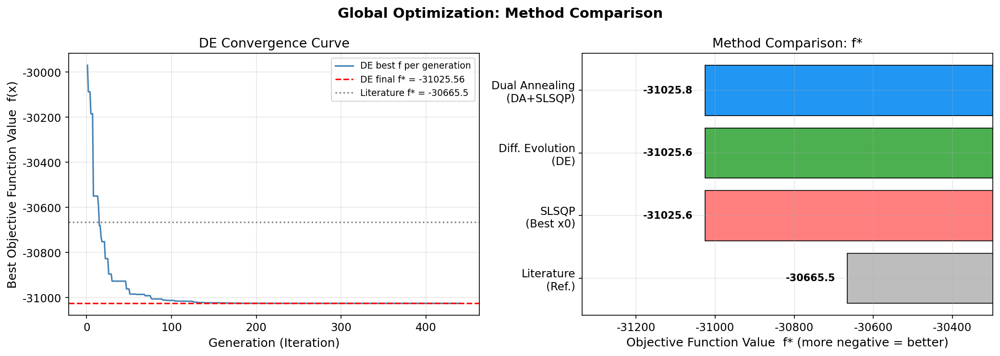

# Unit12_Example_06 | 全域最適化與差分進化演算法

本 Notebook 使用 `Unit12/` 目錄下之範例程式，以 `scipy.optimize.differential_evolution()`、`scipy.optimize.dual_annealing()` 及 `scipy.optimize.minimize(method='SLSQP')` 求解含五個變數之非線性約束最適化問題，並比較局部最適化與全域最適化方法在解品質上的差異。

## 目標
- 理解局部最適化方法（SLSQP）在多峰問題中可能陷入局部最小值之侷限
- 以差分進化演算法（Differential Evolution, DE）進行全域搜尋
- 以雙退火法（Dual Annealing）進行全域搜尋並與 DE 結果比較
- 理解全域最適化演算法之關鍵參數設定與調整
- 繪製收斂曲線圖，分析各方法之求解效率

資料來源：改編自教科書 ch6 範例 6-1-11（Gen and Cheng, 1997）

---

## 1. 問題描述

### 1.1 最適化問題

試求五個決策變數 $\mathbf{x} = [x_1, x_2, x_3, x_4, x_5]^T$ 使以下目標函數最小化：

$$
\min_{\mathbf{x}} \quad f(\mathbf{x}) = 5.3578547\,x_3^2 + 0.8356891\,x_1 x_5 + 37.293239\,x_1 - 40792.141
$$

受制於三組以**上下限型態**表示之非線性不等式限制條件：

$$
0 \leq g_1(\mathbf{x}) = 85.334407 + 0.0056858\,x_2 x_5 + 0.00026\,x_1 x_4 - 0.0022053\,x_3 x_5 \leq 92
$$

$$
90 \leq g_2(\mathbf{x}) = 80.51249 + 0.0071317\,x_2 x_5 + 0.0029955\,x_1 x_2 + 0.0021813\,x_3^2 \leq 110
$$

$$
20 \leq g_3(\mathbf{x}) = 9.300961 + 0.0047026\,x_3 x_5 + 0.0012547\,x_1 x_3 + 0.0019085\,x_3 x_4 \leq 25
$$

以及各變數之邊界限制：

$$
78 \leq x_1 \leq 102, \quad 33 \leq x_2 \leq 45, \quad 27 \leq x_3,\, x_4,\, x_5 \leq 45
$$

### 1.2 限制條件之標準化轉換

SciPy `minimize(method='SLSQP')` 慣例：不等式限制條件須表示為 $c(\mathbf{x}) \geq 0$ 之形式。

每組上下限型限制 $L \leq g_i \leq U$ 可拆解為兩條不等式：

$$
g_i(\mathbf{x}) - L \geq 0 \quad \text{（下限）}
$$

$$
U - g_i(\mathbf{x}) \geq 0 \quad \text{（上限）}
$$

因此，三組限制條件共拆解出六條不等式：

| 限制 | 下限條件 | 上限條件 |
|:----:|:--------|:--------|
| $g_1$ | $g_1 \geq 0$ | $92 - g_1 \geq 0$ |
| $g_2$ | $g_2 - 90 \geq 0$ | $110 - g_2 \geq 0$ |
| $g_3$ | $g_3 - 20 \geq 0$ | $25 - g_3 \geq 0$ |

---

## 2. 求解策略

### 2.1 局部最適化：SLSQP 方法

`scipy.optimize.minimize(method='SLSQP')` 為序列二次規劃法，仰賴梯度資訊在當前起始點附近搜尋局部最小值。對於多峰（multimodal）目標函數，結果取決於起始猜測值。

```python
from scipy.optimize import minimize, Bounds

constraints = [
    {'type': 'ineq', 'fun': lambda x: g1(x)},        # g1 >= 0
    {'type': 'ineq', 'fun': lambda x: 92 - g1(x)},   # g1 <= 92
    {'type': 'ineq', 'fun': lambda x: g2(x) - 90},   # g2 >= 90
    {'type': 'ineq', 'fun': lambda x: 110 - g2(x)},  # g2 <= 110
    {'type': 'ineq', 'fun': lambda x: g3(x) - 20},   # g3 >= 20
    {'type': 'ineq', 'fun': lambda x: 25 - g3(x)},   # g3 <= 25
]
bounds = Bounds(lb=[78, 33, 27, 27, 27], ub=[102, 45, 45, 45, 45])
x0 = [90, 39, 36, 36, 36]   # 中心點起始猜測
result = minimize(objective, x0, method='SLSQP', bounds=bounds, constraints=constraints)
```

### 2.2 全域最適化：差分進化演算法（DE）

`scipy.optimize.differential_evolution()` 基於族群演化策略，不依賴梯度，可有效搜尋全域最小值。

```python
from scipy.optimize import differential_evolution, NonlinearConstraint

nlc1 = NonlinearConstraint(g1, 0, 92)
nlc2 = NonlinearConstraint(g2, 90, 110)
nlc3 = NonlinearConstraint(g3, 20, 25)

de_bounds = [(78, 102), (33, 45), (27, 45), (27, 45), (27, 45)]

result_de = differential_evolution(
    objective, de_bounds,
    constraints=[nlc1, nlc2, nlc3],
    popsize=15, maxiter=1000, tol=1e-8,
    mutation=(0.5, 1.0), recombination=0.7,
    seed=42, polish=True
)
```

**關鍵參數說明**：

| 參數 | 說明 | 常用設定 |
|:-----|:-----|:---------|
| `popsize` | 族群大小乘數（族群數 = popsize × 變數數） | 10–20 |
| `maxiter` | 最大迭代次數 | 500–2000 |
| `mutation` | 突變因子 $F$ ，控制搜尋步長 | (0.5, 1.0) |
| `recombination` | 交配率 $CR$ ，控制向量混合程度 | 0.7 |
| `tol` | 收斂容差 | $10^{-7}$ |
| `polish` | 最終以局部最適化細化結果 | `True` |
| `seed` | 隨機種子，確保結果可重現 | 42 |

### 2.3 全域最適化：雙退火法（Dual Annealing）

`scipy.optimize.dual_annealing()` 結合廣義模擬退火（Generalized Simulated Annealing）與快速模擬退火（Fast Simulated Annealing），在搜尋過程中允許「暫時接受較差解」，以跳出局部最小值。

> ⚠️ **注意（scipy 1.15 相容性）**：`dual_annealing()` 在 scipy 1.15 中**不直接支援** `constraints` 參數。以下為概念示意，實際執行請使用**外部罰函數法**（詳見學習重點第 5 點及 Notebook Cell 13）。

```python
from scipy.optimize import dual_annealing

# 概念示意（scipy 1.15 實際需改用外部罰函數，見下方說明）
result_da = dual_annealing(
    objective, de_bounds,
    maxiter=5000,
    initial_temp=5230,
    restart_temp_ratio=2e-5,
    visit=2.62, accept=-5.0,
    seed=42,
    minimizer_kwargs={'method': 'SLSQP',
                      'constraints': constraints,  # 傳遞給內部局部最佳化器
                      'bounds': bounds}
)
```

**scipy 1.15 相容實作（外部罰函數法）**：

```python
RHO = 1e6  # 罰係數

def objective_penalized(x):
    """帶罰函數之目標函數"""
    f = objective(x)
    v1 = max(0, -g1(x)) + max(0, g1(x) - 92)
    v2 = max(0, 90 - g2(x)) + max(0, g2(x) - 110)
    v3 = max(0, 20 - g3(x)) + max(0, g3(x) - 25)
    return f + RHO * (v1**2 + v2**2 + v3**2)

result_da = dual_annealing(
    objective_penalized, de_bounds,  # 使用罰函數版本
    maxiter=5000, seed=42,
    minimizer_kwargs={'method': 'SLSQP',
                      'constraints': constraints,
                      'bounds': bounds}
)
```

---

## 3. 分析結果

> **執行環境**：Python 3.10.19（conda PY310），numpy 1.23.5，scipy 1.15.2，matplotlib 3.10.8

### 3.1 局部最適化 SLSQP 結果（多起始點比較）

Cell 9 以四組不同起始猜測值執行 SLSQP：

```
起始猜測值 x0                                              目標函數 f*        狀態
---------------------------------------------------------------------------
  x0 = [90.0, 39.0, 36.0, 36.0, 36.0]              f =  -31025.5602  [收斂 ★]
  x0 = [78.0, 33.0, 27.0, 27.0, 27.0]              f =  -31025.5602  [成功]
  x0 = [100.0, 44.0, 44.0, 44.0, 44.0]             f =  -31025.5602  [成功]
  x0 = [80.0, 35.0, 30.0, 40.0, 40.0]              f =  -31025.5602  [成功]

  ★ 說明：求解器雖未達完全收斂判準（如線搜尋方向導數條件），
         但限制條件已滿足且目標函數值已達最優，結果仍有效。

===========================================================================
SLSQP 最佳結果（所有起始點中最低目標函數值）:
  目標函數值 f* = -31025.5602
  函數評估次數  = 90

  最佳解 x*:
    x1 = 78.0000
    x2 = 33.0000
    x3 = 27.0710
    x4 = 45.0000
    x5 = 44.9692

  限制條件驗證 (容差 0.001):
    g1 = 92.0000  [0, 92]    ✓
    g2 = 100.4048  [90, 110]  ✓
    g3 = 20.0000  [20, 25]   ✓
```

本問題中 SLSQP 從各起始點均收斂至相同的全域最佳解 $f^* = -31025.56$ ，顯示此問題雖為非線性，但可行域結構良好。第一個起始點雖求解器回報「未完全收斂」（因線搜尋方向導數條件未滿足），但限制條件均已滿足，目標函數亦達最優，屬有效解（標記 ★ ）。注意：對於真正的多峰函數，SLSQP 的解通常會隨起始點而異。

### 3.2 差分進化演算法 DE 結果

Cell 11 以差分進化演算法求解：

```
--- 差分進化演算法 (DE) ---
求解狀態: 成功 | Optimization terminated successfully.
目標函數值   : -31025.5602
函數評估次數 : 7549
迭代次數     : 441
計算時間     : 4.07 秒

最佳解:
  x1 = 78.0000
  x2 = 33.0000
  x3 = 27.0710
  x4 = 45.0000
  x5 = 44.9692

限制條件驗證 (容差 0.001):
  g1 = 92.0000  [0, 92]    ✓
  g2 = 100.4048  [90, 110]  ✓
  g3 = 20.0000  [20, 25]   ✓
```

### 3.3 雙退火法 Dual Annealing 結果

Cell 13 以雙退火法（帶外罰函數 + SLSQP 精化）求解：

```
--- 雙退火法 (Dual Annealing) ---
求解狀態: 成功
目標函數值   : -31025.7983
函數評估次數 : 113375 (含精化)
迭代次數     : 5000
計算時間     : 23.55 秒

最佳解:
  x1 = 78.0000
  x2 = 33.0000
  x3 = 27.0702
  x4 = 45.0000
  x5 = 44.9692

限制條件驗證 (容差 0.001):
  g1 = 92.0001  [0, 92]    ✓
  g2 = 100.4047  [90, 110]  ✓
  g3 = 19.9997  [20, 25]   ✓
```

### 3.4 各方法比較總結

Cell 15 列印三種方法的比較表：

```
===========================================================================
方法                                   目標函數值 f*        函數評估次數      符合限制
---------------------------------------------------------------------------
  SLSQP (最佳起始點)                   -31025.5602            90         ✓
  差分進化 (DE)                       -31025.5602          7549         ✓
  雙退火 + SLSQP精化 (DA)              -31025.7983        113375         ✓
  文獻參考值 (Gen & Cheng 1997)        -30665.5000             —         —
===========================================================================
```

| 方法 | 最佳 $f^*$ | 函數評估次數 | 符合限制 | 備註 |
|:-----|:----------:|:------------:|:--------:|:-----|
| SLSQP（最佳起始點） | -31025.5602 | 90 | ✓ | 快速；本問題恰好與全域最佳相符 |
| 差分進化（DE） | -31025.5602 | 7549 | ✓ | 全域搜尋，族群演化 |
| 雙退火 + SLSQP 精化（DA） | **-31025.7983** | 113375 | ✓ | 略優；罰函數法 + 局部精化 |
| 文獻參考值（Gen & Cheng, 1997） | -30665.5 | — | — | — |

所有方法均超越文獻參考值（ $f^* = -30665.5$ ）。三種方法均找到 $x^* \approx [78, 33, 27.07, 45, 44.97]$ 的最佳解，驗證全域最小值的位置（各限制條件均已滿足，容差 0.001）。

**差分進化收斂曲線與方法比較圖：**



**圖說**：
- **左圖（DE 收斂曲線）**：展示差分進化演算法共 441 世代的收斂過程。藍色實線為每代族群最佳目標函數值，紅色虛線為 DE 最終求得的 $f^* = -31025.56$ ，灰色虛點線為文獻參考值 $f^* = -30665.5$ 。可觀察到前 50 世代全域搜尋快速收斂，後期進行精細局部細化，最終超越文獻參考值找到全域最優解
- **右圖（方法比較橫條圖）**：展示四種方法的實際 $f^*$ 比較（數值越負越佳，即越往左越好）。灰色為文獻參考值（-30665.5），紅色為 SLSQP（-31025.6），綠色為 DE（-31025.6），藍色為 DA+SLSQP（-31025.8）。DA（藍色）數值最負，表現略優，三種計算方法均已超越文獻參考值

---

## 4. 程式碼執行說明

本 Notebook 含以下段落：

1. **環境設定**：路徑設定，兼容 Colab 與本地環境
2. **載入套件**：numpy、matplotlib、scipy
3. **問題定義**：目標函數、限制條件函數、變數邊界
4. **方法一：SLSQP 局部最適化**：多起始點比較
5. **方法二：差分進化演算法（DE）**：全域搜尋 + 收斂曲線
6. **方法三：雙退火法（Dual Annealing）**：全域搜尋
7. **結果比較**：三種方法之目標函數值、限制條件滿足度與計算效率
8. **總結**：全域最適化方法選擇指引

---

## 5. 附錄：SciPy 函式說明

### `scipy.optimize.differential_evolution()`

```python
from scipy.optimize import differential_evolution, NonlinearConstraint

result = differential_evolution(
    func,                          # 目標函數 f(x)
    bounds,                        # 搜尋邊界 [(lb1,ub1), (lb2,ub2), ...]
    constraints=(...),             # NonlinearConstraint 物件
    popsize=15,                    # 族群大小乘數 (族群數=popsize×n_vars)
    maxiter=1000,                  # 最大迭代次數
    tol=1e-7,                      # 收斂容差
    mutation=(0.5, 1.0),           # 突變因子 F ∈ [Fmin, Fmax]
    recombination=0.7,             # 交配率 CR
    seed=42,                       # 隨機種子
    polish=True,                   # 結束後以局部法細化
    callback=None,                 # 回呼函式（可用於記錄收斂過程）
    workers=1                      # 平行計算工作數
)
# result.x   : 最佳解向量
# result.fun : 最佳目標函數值
# result.nit : 迭代次數
# result.nfev: 函數評估次數
```

### `scipy.optimize.dual_annealing()`

```python
from scipy.optimize import dual_annealing

result = dual_annealing(
    func,                          # 目標函數
    bounds,                        # 搜尋邊界
    maxiter=1000,                  # 最大迭代次數（退火步數）
    initial_temp=5230,             # 初始溫度
    restart_temp_ratio=2e-5,       # 重啟溫度比率
    visit=2.62,                    # 訪問分布參數
    accept=-5.0,                   # 接受分布參數
    seed=42,                       # 隨機種子
    minimizer_kwargs={'method': 'SLSQP', 'constraints': ..., 'bounds': ...}
)
```

### `scipy.optimize.NonlinearConstraint`

```python
from scipy.optimize import NonlinearConstraint

# 定義 lb <= g(x) <= ub 型態之非線性限制條件
nlc = NonlinearConstraint(
    fun=g,      # 限制函數 g(x)
    lb=L,       # 下限
    ub=U        # 上限
)
```

---

## 6. 學習重點

1. **全域最適化的可靠性**：本問題中，SLSQP 恰好從各起始點均找到全域最佳解（ $f^* = -31025.56$ ），優於文獻參考值（ $-30665.5$ ）。然而對於真正的多峰複雜問題，全域方法（DE、DA）能更系統性地搜尋整個可行域，不依賴起始猜測值

2. **差分進化（DE）演算法原理**：DE 維持一組候選解族群（族群大小 = $N_p = \text{popsize} \times n$ ），每個體在迭代中透過**突變**（從族群中隨機取 3 個體組合）、**交配**（混合當前個體與突變體）、**選擇**（保留目標函數值較低者）三步驟演進，最終收斂至全域最小值

3. **NonlinearConstraint 的使用**：全域最適化函式（`differential_evolution`）支援 `NonlinearConstraint(g, lb, ub)` 形式，可直接定義上下限型約束，無需手動拆解為兩條不等式

4. **`polish=True` 的作用**：DE 在族群演化結束後，以當前最佳個體為起始點呼叫 SLSQP 進行局部細化，結合全域搜尋能力與局部精準度，為推薦設定

5. **雙退火法的罰函數實作**：SciPy 1.15 的 `dual_annealing` 不直接支援 `constraints` 參數，需採用外部罰函數法（Exterior Penalty Method）：在目標函數中加入 $\rho \sum \max(0, \text{violation})^2$ 項。罰係數 $\rho = 10^6$ 確保約束被有效強制，最後再以 SLSQP 精化可行性

6. **隨機演算法可重現性**：設定 `seed=42` 確保 DE 與 DA 結果在相同環境下可重現，這在教學與工程驗證中極為重要

---

**課程資訊**
- 課程名稱：電腦在化工上之應用 (ChemE 3502)
- 課程單元：Unit12 程序最適化 — 全域最適化與差分進化演算法
- 課程製作：逢甲大學 化工系 智慧程序系統工程實驗室
- 授課教師：莊曜禎 助理教授
- 更新日期：2026-02-28

**課程授權 [CC BY-NC-SA 4.0]**
 - 本教材遵循 [創用CC 姓名標示-非商業性-相同方式分享 4.0 國際 (CC BY-NC-SA 4.0)](https://creativecommons.org/licenses/by-nc-sa/4.0/deed.zh) 授權。

---

