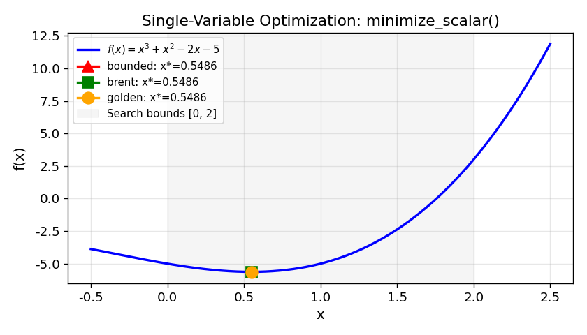
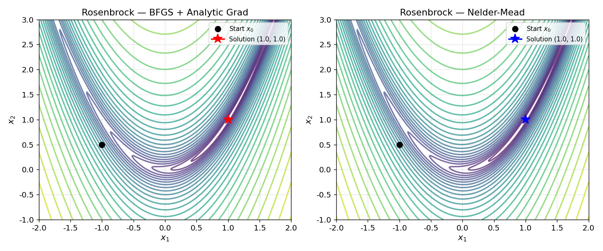
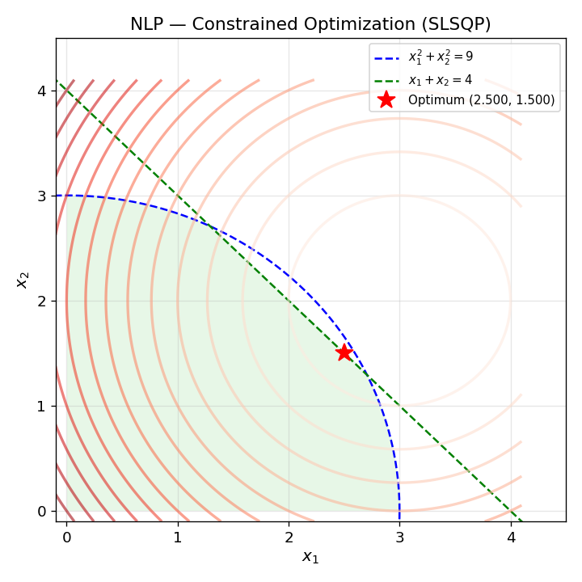
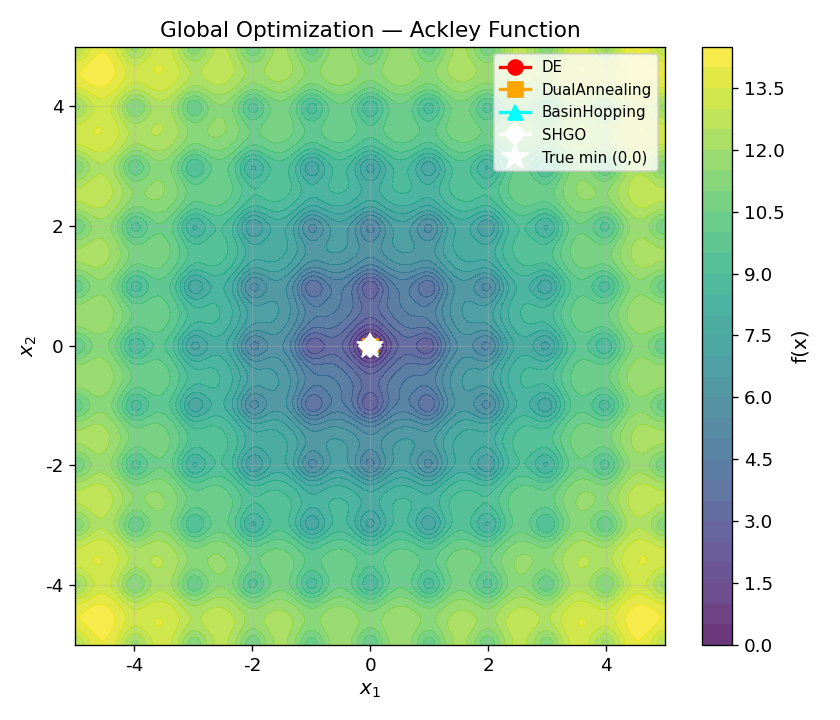

# Unit12 程序最適化

本講義介紹如何以 Python（以 **SciPy** 為主要工具）求解化工程序中的各類最適化問題，並透過化工實際問題加以應用。

---

## 學習目標

完成本單元後，學生應能：

1. 描述最適化問題的一般型式，辨別目標函數、決策變數與限制條件
2. 依問題特性（變數數量、線性/非線性、有無限制條件）選擇適當的 `scipy.optimize` 求解器
3. 正確使用 `minimize_scalar()` 求解單變數有界最適化問題
4. 正確使用 `minimize()` 求解無限制條件與有限制條件之多變數非線性最適化問題
5. 正確使用 `linprog()` 與 `milp()` 求解線性規劃及混合整數線性規劃問題
6. 理解局部最適化的侷限性，並能運用 `differential_evolution()`、`dual_annealing()` 等全域最適化工具
7. 驗證最適化結果的正確性，包含限制條件滿足度與物理合理性檢查
8. 將化工問題（最大獲利、最佳操作溫度、化學平衡等）轉化為標準最適化數學型式並求解

---

## 目錄

1. [最適化問題概述](#1-最適化問題概述)
   - 1.1 最適化在化工程序中的重要性
   - 1.2 最適化問題的一般型式
   - 1.3 最適化問題分類
   - 1.4 最小化 vs 最大化
   - 1.5 局部最小值 vs 全域最小值
2. [scipy.optimize 最適化模組架構總覽](#2-scipyoptimize-最適化模組架構總覽)
   - 2.1 核心最適化函式
   - 2.2 全域最適化函式
   - 2.3 `OptimizeResult` 結果物件
3. [單變數最適化問題](#3-單變數最適化問題)
   - 3.1 問題型式
   - 3.2 `minimize_scalar()` 函式介面
   - 3.3 演算法原理簡介
   - 3.4 範例：求解 $f(x) = x^3 + x^2 - 2x - 5$
4. [無限制條件多變數最適化問題](#4-無限制條件多變數最適化問題)
   - 4.1 問題型式
   - 4.2 `minimize()` 無限制條件方法
   - 4.3 梯度資訊的提供方式
   - 4.4 收斂判據設定
   - 4.5 範例：BFGS 求解二次函數最適化
   - 4.6 範例演練：Rosenbrock 函數最適化
5. [有限制條件之非線性最適化問題](#5-有限制條件之非線性最適化問題)
   - 5.1 一般非線性規劃問題型式
   - 5.2 `minimize()` 有限制條件方法
   - 5.3 限制條件的定義方式
   - 5.4 範例：SLSQP 求解非線性規劃問題
   - 5.5 範例演練：SLSQP 求解帶幾何限制的 NLP 並視覺化可行域
6. [線性規劃問題](#6-線性規劃問題)
   - 6.1 標準型式
   - 6.2 `linprog()` 函式介面
   - 6.3 最大化問題的處理
   - 6.4 範例：三變數線性規劃
   - 6.5 範例演練：三產品生產排程（linprog 最大化問題）
7. [混合整數線性規劃問題](#7-混合整數線性規劃問題)
   - 7.1 問題型式
   - 7.2 `milp()` 函式介面
   - 7.3 範例：二元整數規劃
   - 7.4 Branch and Bound 演算法簡介
8. [全域最適化策略](#8-全域最適化策略)
   - 8.1 局部最適化的侷限性
   - 8.2 差分進化演算法 `differential_evolution()`
   - 8.3 雙退火法 `dual_annealing()`
   - 8.4 盆地跳躍法 `basinhopping()`
   - 8.5 SHGO 法 `shgo()`
   - 8.6 全域最適化方法比較
   - 8.7 範例演練：四種全域最適化方法比較（Ackley 函數）
9. [最適化方法選擇指引與最佳實踐](#9-最適化方法選擇指引與最佳實踐)
   - 9.1 方法選擇決策流程
   - 9.2 結果驗證
   - 9.3 數值穩定性
   - 9.4 化工問題建模技巧
   - 9.5 範例演練：scipy.optimize 方法效能摘要

---

## 1. 最適化問題概述

### 1.1 最適化在化工程序中的重要性

化工程序最適化 (process optimization) 在製程工業化的過程中，是相當重要的一環。其應用涵蓋的範疇非常廣泛：

- **設計階段**：最佳管徑選擇、最佳換熱器面積、塔板數目的確定
- **操作階段**：最佳進料比、最佳操作溫度與壓力、最佳回流比
- **規劃階段**：生產排程最佳化、原料採購成本最小化、產品組合利潤最大化

最適化的目的，無非是希望在製程可允許的操作條件可行範圍內，找到一個最佳的操作條件，以便製程在最小的投資及成本下產生最大的利潤與效益。

### 1.2 最適化問題的一般型式

一個最適化問題的標準數學形式可描述如下：

$$
\min_{\mathbf{x}} \; f(\mathbf{x})
$$

subject to:

$$
\begin{aligned}
\mathbf{g}(\mathbf{x}) &\leq \mathbf{0} & &\text{（非線性不等式限制）} \\
\mathbf{h}(\mathbf{x}) &= \mathbf{0} & &\text{（非線性等式限制）} \\
\mathbf{A}\mathbf{x} &\leq \mathbf{b} & &\text{（線性不等式限制）} \\
\mathbf{A}_\mathrm{eq}\mathbf{x} &= \mathbf{b}_\mathrm{eq} & &\text{（線性等式限制）} \\
\mathbf{x}_L &\leq \mathbf{x} \leq \mathbf{x}_U & &\text{（變數邊界）}
\end{aligned}
$$

問題的三要素：

| 要素 | 說明 | 符號 |
|------|------|------|
| **目標函數** (Objective Function) | 欲最小化（或最大化）的函數 | $f(\mathbf{x})$ |
| **決策變數** (Decision Variables) | 欲決定的未知數向量 | $\mathbf{x} = [x_1, x_2, \dots, x_n]^T$ |
| **限制條件** (Constraints) | 決策變數需滿足的條件 | $\mathbf{g}$, $\mathbf{h}$, $\mathbf{A}$, $\mathbf{A}_\mathrm{eq}$, bounds |

### 1.3 最適化問題分類

最適化問題依不同特性可分成以下幾類：

**依變數數量：**
- 單變數最適化 (Single Variable)：$\min f(x)$，$x \in \mathbb{R}$
- 多變數最適化 (Multivariate)：$\min f(\mathbf{x})$，$\mathbf{x} \in \mathbb{R}^n$

**依目標函數與限制條件之性質：**
- 線性規劃 (Linear Programming, LP)：$f$ 和所有限制條件均為線性
- 二次規劃 (Quadratic Programming, QP)：$f$ 為二次函數，限制條件為線性
- 非線性規劃 (Nonlinear Programming, NLP)：$f$ 或任一限制條件為非線性

**依限制條件有無：**
- 無限制條件最適化 (Unconstrained Optimization)
- 有限制條件最適化 (Constrained Optimization)

**依變數性質：**
- 連續最適化 (Continuous Optimization)：$\mathbf{x} \in \mathbb{R}^n$
- 整數規劃 (Integer Programming)：部分或全部 $x_i \in \mathbb{Z}$
- 混合整數規劃 (Mixed Integer Programming, MIP)：兼有連續與整數變數

**依解的性質：**
- 局部最適化 (Local Optimization)：確保找到局部最小值
- 全域最適化 (Global Optimization)：確保找到全域最小值

### 1.4 最小化 vs 最大化

所有最適化方法均以**最小化**為標準型式。最大化問題只需將目標函數取負號，即可轉換為等價的最小化問題：

$$
\max_{\mathbf{x}} f(\mathbf{x}) \equiv \min_{\mathbf{x}} \left(-f(\mathbf{x})\right)
$$

例如，若欲最大化獲利函數 $P(\mathbf{x})$ ，則等價於最小化 $-P(\mathbf{x})$ 。最適化結束後，記得對目標函數值取負號還原。

### 1.5 局部最小值 vs 全域最小值

對於一般非凸問題，一個函數可能存在多個局部最小值 (local minimum)，而其中函數值最小者稱為全域最小值 (global minimum)。

**局部最小值的定義**：若存在鄰域 $\mathcal{N}(\mathbf{x}^*)$ 使得對所有 $\mathbf{x} \in \mathcal{N}(\mathbf{x}^*)$ 均有 $f(\mathbf{x}) \geq f(\mathbf{x}^*)$ ，則 $\mathbf{x}^*$ 為局部最小值點。

**重要注意事項：**
- 大多數局部最適化方法（如 BFGS、SLSQP）僅保證找到**局部**最小值
- 所求解是否為全域最小值，取決於起始猜測值 $\mathbf{x}_0$ 與問題本身的性質
- 對於凸函數 (convex function)，局部最小值即為全域最小值
- 若需確保全域最小值，應採用全域最適化方法（第 8 節）

---

## 2. scipy.optimize 最適化模組架構總覽

### 2.1 核心最適化函式

`scipy.optimize` 提供了一套統一介面的最適化工具集：

| 函式 | 用途 |
|------|------|
| `minimize_scalar()` | 單變數有界最適化 |
| `minimize()` | 多變數最適化（無/有限制條件）|
| `linprog()` | 線性規劃 |
| `milp()` | 混合整數線性規劃 |

### 2.2 全域最適化函式

| 函式 | 演算法 |
|------|--------|
| `differential_evolution()` | 差分進化演算法 |
| `dual_annealing()` | 雙退火法 |
| `basinhopping()` | 盆地跳躍法 |
| `shgo()` | 簡單同調全域最適化 |

### 2.3 `OptimizeResult` 結果物件

所有 `scipy.optimize` 最適化函式均回傳一個 `OptimizeResult` 物件，包含以下重要屬性：

| 屬性 | 型別 | 說明 |
|------|------|------|
| `x` | ndarray | 最適化點（決策變數最佳值） |
| `fun` | float | 最適化點之目標函數值 |
| `success` | bool | 是否成功收斂（`True`/`False`） |
| `message` | str | 求解終止原因說明 |
| `nit` | int | 迭代次數 |
| `nfev` | int | 目標函數評估次數 |
| `njev` | int | 梯度函數評估次數（部分方法） |
| `nhev` | int | Hessian 函數評估次數（部分方法） |
| `status` | int | 終止狀態代碼 |

使用方式範例：

```python
from scipy.optimize import minimize

result = minimize(lambda x: x[0]**2 + (x[1]-1)**2, x0=[1, 1])
print(f"最適解: {result.x}")
print(f"目標函數值: {result.fun:.6f}")
print(f"是否收斂: {result.success}")
print(f"迭代次數: {result.nit}")
print(f"函數評估次數: {result.nfev}")
```

**執行結果：**

```
==================================================
OptimizeResult 物件屬性示範
==================================================
  result.x        (最適解)       : [-5.85244586e-09  9.99999994e-01]
  result.fun      (最小函數值)   : 6.850225e-17
  result.success  (是否收斂)     : True
  result.message  (終止訊息)     : Optimization terminated successfully.
  result.nit      (迭代次數)     : 2
  result.nfev     (函數評估次數) : 9
  result.njev     (梯度評估次數) : 3
```

此範例最小化 $f(x_1, x_2) = x_1^2 + (x_2-1)^2$ ，其全域最小值位於 $\mathbf{x}^* = [0, 1]^T$ ，理論上 $f^* = 0$ 。求解結果顯示：`success=True` 表示成功收斂；最適解 $\mathbf{x}^* \approx [-5.85 \times 10^{-9},\; 1.0]^T$ 近似於理論解 $[0,1]^T$ ；目標函數值 $\approx 6.85 \times 10^{-17}$ 在數值上幾乎等於零；僅需 **2 次迭代** 與 **9 次函數評估** 即完成求解，展示了 BFGS 的高效率。

---

## 3. 單變數最適化問題

### 3.1 問題型式

單變數最適化問題的標準型式為：

$$
\min_{a \leq x \leq b} f(x)
$$

目標是在區間 $[a, b]$ 內找到使目標函數 $f(x)$ 最小的變數值 $x^*$ 。

### 3.2 `minimize_scalar()` 函式介面

```python
from scipy.optimize import minimize_scalar

result = minimize_scalar(fun, bounds=(a, b), method='bounded', options={...})
```

| 參數 | 說明 |
|------|------|
| `fun` | 目標函數，接受純量 $x$ 並回傳純量 $f(x)$ |
| `method='bounded'` | Brent 法含邊界限制，保證在搜尋區間 $[a,b]$ 內（最常用） |
| `method='brent'` | Brent 法（無邊界），需透過 `bracket` 指定括弧區間 |
| `method='golden'` | Golden Section Search 法（教學示範用） |
| `bounds=(a, b)` | `method='bounded'` 時必須指定搜尋區間 $[a, b]$ |
| `options` | 字典，可設定 `'xatol'`（終止容差）、`'maxiter'`（最大迭代次數） |

**回傳值**：`OptimizeResult` 物件，其中 `result.x` 為最適解，`result.fun` 為最小函數值。

### 3.3 演算法原理簡介

**Brent's Method（有界版本）**：結合黃金比例搜尋 (Golden Section Search) 與拋物線插值 (parabolic interpolation)，可在保證收斂的前提下達到接近二次收斂速度。對於光滑函數效率優異。

**Golden Section Search**：每次迭代以黃金比例 $\phi = (\sqrt{5}-1)/2 \approx 0.618$ 縮減搜尋區間，保證線性收斂。適合教學展示收斂過程，但效率不如 Brent's Method。

> **注意**：`minimize_scalar()` 找到的是區間 $[a, b]$ 內的**局部最小值**，並不保證為全域最小值。多峰函數需配合全域最適化方法。

### 3.4 範例：求解 $f(x) = x^3 + x^2 - 2x - 5$

**問題**：求解以下單變數最適化問題：

$$
\min_{0 \leq x \leq 2} f(x) = x^3 + x^2 - 2x - 5
$$

**Python 程式碼：**

```python
import numpy as np
import matplotlib.pyplot as plt
from scipy.optimize import minimize_scalar

# 定義目標函數
def f(x):
    return x**3 + x**2 - 2*x - 5

# 求解（三種方法比較）
res_bounded = minimize_scalar(f, bounds=(0, 2), method='bounded')
res_brent   = minimize_scalar(f, bracket=(0, 2), method='brent')
res_golden  = minimize_scalar(f, bounds=(0, 2), method='golden')

print("method='bounded' :", f"x* = {res_bounded.x:.4f},  f(x*) = {res_bounded.fun:.4f}")
print("method='brent'   :", f"x* = {res_brent.x:.4f},  f(x*) = {res_brent.fun:.4f}")
print("method='golden'  :", f"x* = {res_golden.x:.4f},  f(x*) = {res_golden.fun:.4f}")

# 繪圖
x_plot = np.linspace(0, 2, 300)
y_plot = f(x_plot)

plt.figure(figsize=(7, 4))
plt.plot(x_plot, y_plot, 'b-', label=r'$f(x) = x^3 + x^2 - 2x - 5$', linewidth=2)
plt.scatter(res_bounded.x, res_bounded.fun, color='red', zorder=5,
            s=100, label=f'Optimal: x*={res_bounded.x:.4f}')
plt.xlabel('x')
plt.ylabel('f(x)')
plt.title('Single-Variable Optimization: minimize_scalar()')
plt.legend()
plt.grid(True, alpha=0.3)
plt.tight_layout()
plt.savefig('outputs/Unit12_Optimization/figs/unit12_minimize_scalar.png', dpi=120)
plt.show()
```

**執行結果：**

```
3. minimize_scalar — 三種方法比較
  Method             x*        f(x*)   nfev
  ------------------------------------------
  bounded      0.548584    -5.631130      9
  brent        0.548584    -5.631130     18
  golden       0.548584    -5.631130     45
```



三種方法均得到相同結果：在 $[0, 2]$ 搜尋區間內，目標函數 $f(x) = x^3 + x^2 - 2x - 5$ 的最小值發生在 $x^* \approx 0.5486$ 處，對應函數值 $f(x^*) \approx -5.6311$ 。

**計算效率比較：**

| 方法 | nfev（函數評估次數）| 收斂速度 | 適用情境 |
|------|-----------------|---------|---------|
| `bounded` | 9 | 超線性（Brent 有界）| **推薦，精確限制搜尋範圍** |
| `brent` | 18 | 超線性（Brent 不帶界）| 一般光滑函數 |
| `golden` | 45 | 線性（黃金分割）| 教學示範用途 |

`bounded` 方法以最少 9 次函數評估達到與其他方法相同的求解精度，是三者中最具效率的選擇，適合實務應用。`golden` 方法每次迭代以黃金比例 $\phi \approx 0.618$ 縮小搜尋區間，直觀易懂但需 45 次評估，主要作為教學展示之用。

---

## 4. 無限制條件多變數最適化問題

### 4.1 問題型式

無限制條件多變數最適化問題的標準型式為：

$$
\min_{\mathbf{x}} f(\mathbf{x}), \quad \mathbf{x} = [x_1, x_2, \dots, x_n]^T \in \mathbb{R}^n
$$

目標是在不受任何限制條件的情況下，找出使目標函數 $f(\mathbf{x})$ 最小的變數向量 $\mathbf{x}^*$ 。

### 4.2 `minimize()` 無限制條件方法

```python
from scipy.optimize import minimize

result = minimize(fun, x0, method='BFGS', jac=None, options={...})
```

各方法特性比較：

| 方法 | 需要梯度 | 需要 Hessian | 適用場景 |
|------|---------|-------------|---------|
| `'Nelder-Mead'` | 否 | 否 | 不連續/不可微函數，維度 $\leq 20$ |
| `'Powell'` | 否 | 否 | 中型問題，無導數法 |
| `'CG'` | 是（可數值微分）| 否 | 大型問題 |
| **`'BFGS'`** | 是（可數值微分）| 否 | **一般用途，推薦首選** |
| `'L-BFGS-B'` | 是（可數值微分）| 否 | 大型問題，含邊界限制 |
| `'Newton-CG'` | 是 | 是（可數值微分）| 需 Hessian 之高精度問題 |
| `'trust-ncg'` | 是 | 是 | Trust-region 方法 |
| `'trust-exact'` | 是 | 是 | 精確 Hessian，高精度需求 |

### 4.3 梯度資訊的提供方式

`minimize()` 的 `jac` 參數可接受以下三種型式：

**（1）不指定（預設數值微分）**：

```python
result = minimize(f, x0, method='BFGS')
# SciPy 自動以有限差分法計算數值梯度（額外函數評估次數增加）
```

**（2）提供解析梯度函數**：

```python
def f_and_grad(x):
    f_val = 3*x[0]**2 + 2*x[0]*x[1] + 5*x[1]**2
    grad  = np.array([6*x[0] + 2*x[1],
                      2*x[0] + 10*x[1]])
    return f_val, grad

result = minimize(f_and_grad, x0, method='BFGS', jac=True)
# jac=True 表示 fun 同時回傳 (f, grad)
```

**（3）單獨提供梯度函數**：

```python
def obj(x):
    return 3*x[0]**2 + 2*x[0]*x[1] + 5*x[1]**2

def grad(x):
    return np.array([6*x[0] + 2*x[1], 2*x[0] + 10*x[1]])

result = minimize(obj, x0, method='BFGS', jac=grad)
```

> 提供解析梯度可顯著提升求解效率（減少函數評估次數）與精度，當目標函數複雜時強烈建議提供。

### 4.4 收斂判據設定

```python
result = minimize(f, x0, method='BFGS',
                  tol=1e-8,                      # 終止容差（全域）
                  options={'gtol': 1e-8,          # 梯度無窮範數容差
                           'maxiter': 1000,       # 最大迭代次數
                           'disp': True})         # 顯示求解過程
```

### 4.5 範例：BFGS 求解二次函數最適化

**問題**：求解以下無限制條件最適化問題：

$$
\min_{x_1, x_2} \; f(x_1, x_2) = 3x_1^2 + 2x_1 x_2 + 5x_2^2
$$

**Python 程式碼：**

```python
import numpy as np
from scipy.optimize import minimize

def f(x):
    return 3*x[0]**2 + 2*x[0]*x[1] + 5*x[1]**2

def grad(x):
    return np.array([6*x[0] + 2*x[1],
                     2*x[0] + 10*x[1]])

x0 = np.array([1.0, 1.0])

# 不提供梯度（數值微分）
res1 = minimize(f, x0, method='BFGS')
# 提供解析梯度
res2 = minimize(f, x0, method='BFGS', jac=grad)

print("無解析梯度:", f"x* = [{res1.x[0]:.2e}, {res1.x[1]:.2e}],  nfev = {res1.nfev}")
print("有解析梯度:", f"x* = [{res2.x[0]:.2e}, {res2.x[1]:.2e}],  nfev = {res2.nfev}")
```

此二次凸函數的全域最小值為 $\mathbf{x}^* = [0, 0]^T$ ，$f(\mathbf{x}^*) = 0$ 。提供解析梯度可大幅減少函數評估次數。

### 4.6 範例演練：Rosenbrock 函數最適化

Rosenbrock（香蕉）函數是非線性最適化領域的經典測試函數：

$$
f(x_1, x_2) = (1 - x_1)^2 + 100(x_2 - x_1^2)^2
$$

全域最小值為 $f(1, 1) = 0$ 。由於函數在最小值附近呈現香蕉形彎曲深谷（如下圖等高線所示），梯度資訊對求解效率至關重要。以下以初始點 $\mathbf{x}_0 = [-1.0, 0.5]$ 比較 **BFGS（含解析梯度）** 與 **Nelder-Mead（無梯度）** 兩種方法的結果：

**執行結果：**

```
4. Rosenbrock 函數最適化 (初始點 x0 = [-1.0, 0.5])
  Method              x1*      x2*           f*    nit   nfev
  --------------------------------------------------------
  BFGS+grad       1.00000  1.00000     2.18e-22     33     42
  Nelder-Mead     1.00000  1.00000     4.11e-18    123    233
```



**結果分析：**

| 項目 | BFGS（含解析梯度）| Nelder-Mead |
|------|-----------------|-------------|
| 最終位置 $(x_1^*, x_2^*)$ | $(1.0000, 1.0000)$ | $(1.0000, 1.0000)$ |
| 最小值 $f^*$ | $2.18 \times 10^{-22}$ | $4.11 \times 10^{-18}$ |
| 迭代次數 (nit) | **33** | 123 |
| 函數評估次數 (nfev) | **42** | 233 |

兩種方法均成功收斂至全域最小值 $(1, 1)$ ，但效率差異顯著：

- **BFGS 含解析梯度**：僅需 33 次迭代、42 次函數評估即收斂，精度更高（ $f^* \approx 10^{-22}$ ），是首選方法
- **Nelder-Mead**：不需要梯度資訊，但需 123 次迭代、233 次函數評估，收斂較慢（ $f^* \approx 10^{-18}$ ），適合目標函數不可微的場景

等高線圖清楚呈現 Rosenbrock 函數特有的香蕉形彎曲谷地——求解路徑必須沿著細長的低函數值區域蜿蜒前進，這正是測試最適化算法收斂能力的標準挑戰之一。

---

## 5. 有限制條件之非線性最適化問題

### 5.1 一般非線性規劃問題型式

一般非線性規劃 (NLP) 問題的完整標準型式為：

$$
\min_{\mathbf{x}} f(\mathbf{x})
$$

subject to:

$$
\begin{aligned}
\mathbf{c}(\mathbf{x}) &\leq \mathbf{0} & &\text{（非線性不等式限制）} \\
\mathbf{c}_\mathrm{eq}(\mathbf{x}) &= \mathbf{0} & &\text{（非線性等式限制）} \\
\mathbf{A}\mathbf{x} &\leq \mathbf{b} & &\text{（線性不等式限制）} \\
\mathbf{A}_\mathrm{eq}\mathbf{x} &= \mathbf{b}_\mathrm{eq} & &\text{（線性等式限制）} \\
\mathbf{x}_L &\leq \mathbf{x} \leq \mathbf{x}_U & &\text{（變數邊界）}
\end{aligned}
$$


### 5.2 `minimize()` 有限制條件方法

| 方法 | 需要梯度 | 適用場景 |
|------|---------|---------|
| **`'SLSQP'`** | 是（可數值微分）| **一般用途有限制問題，推薦首選** |
| `'COBYLA'` | 否 | 無導數，適用不可微或黑箱函數 |
| `'trust-constr'` | 是（可數值微分）| SciPy 推薦新式求解器，高精度 |

> **`SLSQP`（Sequential Least Squares Programming）** 為序列二次規劃法，是化工問題中最常用的有限制條件非線性最適化方法。

### 5.3 限制條件的定義方式

SciPy 提供兩種定義限制條件的格式：

**方式一：字典格式（適合 SLSQP / COBYLA）**

```python
constraints = [
    {'type': 'eq',   'fun': lambda x: x[0] + x[1] - 1.0},        # 等式: x1 + x2 = 1
    {'type': 'ineq', 'fun': lambda x: x[0] - 0.1},               # 不等式: x1 >= 0.1
    {'type': 'ineq', 'fun': lambda x: 1.0 - x[0]**2 - x[1]**2},  # 不等式: x1^2+x2^2 <= 1
]
```

**方式二：物件格式（適合 trust-constr，語意更清晰）**

```python
from scipy.optimize import Bounds, LinearConstraint, NonlinearConstraint

# 變數邊界: 0 <= x1 <= 5, 0 <= x2 <= 5
bounds = Bounds(lb=[0, 0], ub=[5, 5])

# 線性等式/不等式限制: A_eq x = b_eq, A_ub x <= b_ub
lc = LinearConstraint([[1, 1]], lb=1.0, ub=1.0)  # x1 + x2 = 1

# 非線性不等式限制: 1 - x1^2 - x2^2 >= 0
nlc = NonlinearConstraint(lambda x: x[0]**2 + x[1]**2, -np.inf, 1.0)
```

### 5.4 範例：SLSQP 求解非線性規劃問題

**問題**：

$$
\min_{x_1, x_2, x_3, x_4} f = (x_1 - 1)^2 + (x_1 - x_2)^2 + (x_2 - x_3)^3 + (x_3 - x_4)^4
$$

$$
\text{s.t.} \quad x_1 + x_2^2 + x_3^3 = 3, \quad x_2 - x_3^2 + x_4 = 1, \quad x_1 \geq 0
$$

```python
from scipy.optimize import minimize, Bounds

def obj(x):
    return ((x[0]-1)**2 + (x[0]-x[1])**2 +
            (x[1]-x[2])**3 + (x[2]-x[3])**4)

constraints = [
    {'type': 'eq',   'fun': lambda x: x[0] + x[1]**2 + x[2]**3 - 3},          # h1=0
    {'type': 'eq',   'fun': lambda x: x[1] - x[2]**2 + x[3] - 1},             # h2=0
    {'type': 'ineq', 'fun': lambda x: x[0]},                                   # x1 >= 0
]
bounds = Bounds(lb=[-np.inf, -np.inf, -np.inf, -np.inf],
                ub=[np.inf,  np.inf,  np.inf,  np.inf])

x0 = np.array([1.0, 1.0, 1.0, 1.0])

result = minimize(obj, x0, method='SLSQP',
                  constraints=constraints, bounds=bounds)

print(f"最適解: x = {result.x}")
print(f"目標函數值: f = {result.fun:.6f}")
print(f"是否收斂: {result.success}")
print(f"訊息: {result.message}")
```

> **重要提示**：
> 1. 所求解僅能確保為**局部最小值**，不保證全域最小值。
> 2. 選擇滿足（或接近滿足）限制條件之初始點 $\mathbf{x}_0$ 有助於提升收斂穩定性。
> 3. 建議以多個不同 $\mathbf{x}_0$ 重複求解，比較所得結果。

### 5.5 範例演練：SLSQP 求解帶幾何限制的 NLP 並視覺化可行域

**問題**：

$$
\min_{x_1, x_2} \; f = (x_1 - 3)^2 + (x_2 - 2)^2
$$

$$
\text{s.t.} \quad g_1: x_1 + x_2 \leq 4, \quad g_2: x_1^2 + x_2^2 \leq 9, \quad x_1, x_2 \geq 0
$$

此問題的幾何意義明確：目標函數為以 $(3, 2)$ 為圓心的同心圓，限制條件定義了由直線 $x_1+x_2=4$ 與圓 $x_1^2+x_2^2=9$ 圍成的可行域。使用 SLSQP 以字典格式（方式 A）及物件格式（方式 B）各自求解：

**執行結果：**

```
5. NLP 有限制條件最適化 (SLSQP)
  Method                x1*      x2*         f* OK?
  --------------------------------------------------
  dict constraints  2.50000  1.50000   0.500000  ✓
  Bounds+NLC        2.50000  1.50000   0.500000  ✓
```



**結果分析：**

兩種限制條件定義格式（字典格式與物件格式）均得到相同最適解 $(x_1^*, x_2^*) = (2.5, 1.5)$ ，驗證了結果的正確性。最小目標函數值 $f^* = 0.5$ ，即最優點到目標圓心 $(3, 2)$ 的平方距離為 $0.5$（即歐氏距離 $\approx 0.707$）。

從可行域視覺化圖可觀察到：
- 綠色區域為可行域（同時滿足 $x_1+x_2 \leq 4$、$x_1^2+x_2^2 \leq 9$ 及非負性）
- 藍色虛線為圓形限制 $x_1^2+x_2^2=9$，綠色虛線為線性限制 $x_1+x_2=4$
- 最優解（紅色星點）位於線性限制 $g_1$ 的邊界（主動限制，active constraint），而圓形限制 $g_2$（$x_1^2+x_2^2 \leq 9$）在此點值為 $8.5 < 9$，為非主動限制（inactive constraint）。此結果為 KKT 最優性條件的典型幾何詮釋：最優解在單一主動不等式限制的邊界上取得

---

## 6. 線性規劃問題

### 6.1 標準型式

線性規劃 (Linear Programming, LP) 問題的 SciPy 標準型式為：

$$
\min_{\mathbf{x}} \; \mathbf{c}^T \mathbf{x}
$$

$$
\text{s.t.} \quad \mathbf{A}_\mathrm{ub} \mathbf{x} \leq \mathbf{b}_\mathrm{ub}, \quad \mathbf{A}_\mathrm{eq} \mathbf{x} = \mathbf{b}_\mathrm{eq}, \quad \mathbf{x}_L \leq \mathbf{x} \leq \mathbf{x}_U
$$

> **線性規劃的重要特性**：若最適解存在，則必位於可行區域的**頂點** (vertex/corner point)。這是 Simplex 法的理論基礎，也是線性規劃區別於非線性規劃的關鍵。

### 6.2 `linprog()` 函式介面

```python
from scipy.optimize import linprog

result = linprog(c, A_ub=None, b_ub=None,
                 A_eq=None, b_eq=None,
                 bounds=None, method='highs')
```

| 參數 | 說明 |
|------|------|
| `c` | 目標函數係數向量（長度 $n$） |
| `A_ub`, `b_ub` | 線性不等式限制 $\mathbf{A}_\mathrm{ub}\mathbf{x} \leq \mathbf{b}_\mathrm{ub}$ |
| `A_eq`, `b_eq` | 線性等式限制 $\mathbf{A}_\mathrm{eq}\mathbf{x} = \mathbf{b}_\mathrm{eq}$ |
| `bounds` | 變數上下限，格式為 `[(lb1, ub1), (lb2, ub2), ...]`，`None` 表示無界 |
| `method='highs'` | **HiGHS 求解器（預設，SciPy 1.7+ 推薦）** |
| `method='revised simplex'` | 修正 Simplex 法（有界問題，純連續）|
| `method='interior-point'` | 內點法（Primal-dual interior point）|

**HiGHS 求解器**（High Performance Software for Linear Optimization）是目前最先進的開源 LP/MIP 求解器之一，SciPy 1.7+ 後作為 `linprog` 的預設方法。

### 6.3 最大化問題的處理

由於 `linprog` 只能做最小化，最大化問題需將目標係數取負號：

```python
# 最大化 z = 5x1 + 4x2 + 3x3  ←→  最小化 -5x1 - 4x2 - 3x3
c_max = np.array([5.0, 4.0, 3.0])
c_min = -c_max      # 取負號

result = linprog(c_min, A_ub=A, b_ub=b, bounds=bounds)
z_max = -result.fun  # 記得再取負號還原
print(f"最大值 z = {z_max:.4f}")
```

### 6.4 範例：三變數線性規劃

**問題**：

$$
\min_{\mathbf{x}} -5x_1 - 4x_2 - 3x_3
$$

$$
\text{s.t.} \quad \begin{cases}
x_1 - x_2 + 2x_3 \leq 30 \\
3x_1 + 2x_2 + x_3 \leq 40 \\
2x_1 + 3x_2 \leq 20 \\
x_1, x_2, x_3 \geq 0
\end{cases}
$$

```python
import numpy as np
from scipy.optimize import linprog

c = np.array([-5.0, -4.0, -3.0])

A = np.array([[1, -1,  2],
              [3,  2,  1],
              [2,  3,  0]])
b = np.array([30.0, 40.0, 20.0])

bounds = [(0, None),   # x1 >= 0
          (0, None),   # x2 >= 0
          (0, None)]   # x3 >= 0

result = linprog(c, A_ub=A, b_ub=b, bounds=bounds, method='highs')

print(f"最適解: x = {result.x}")
print(f"目標函數最小值: {result.fun:.4f}")
print(f"是否成功: {result.success}")
```

**執行結果：**

```
最適解: x = [ 0.      6.6667  18.3333]
目標函數最小值: -81.6667
```

### 6.5 範例演練：三產品生產排程（linprog 最大化問題）

**問題**：工廠生產三種產品 $x_1, x_2, x_3$（單位：批次），各產品利潤為 $5, 4, 3$（元/批次），受三種資源限制：

$$
\max \; 5x_1 + 4x_2 + 3x_3
$$

$$
\text{s.t.} \quad \begin{cases}
6x_1 + 4x_2 + 2x_3 \leq 240 \quad \text{（資源 1：原料 A）} \\
3x_1 + 2x_2 + 5x_3 \leq 270 \quad \text{（資源 2：原料 B）} \\
5x_1 + 6x_2 + 5x_3 \leq 420 \quad \text{（資源 3：機台工時）} \\
x_1, x_2, x_3 \geq 0
\end{cases}
$$

最大化問題需對目標係數取負號後以 `linprog` 求解。

**執行結果：**

```
6. 線性規劃 linprog() — 生產排程
  x1=3.7500, x2=35.6250, x3=37.5000
  最大利潤 = 273.7500
  (linprog 回傳 fun = -273.7500，乘以-1 得最大值)

  資源使用情況：
    資源 1: 240.00 / 240  (剩餘 0.00)
    資源 2: 270.00 / 270  (剩餘 0.00)
    資源 3: 420.00 / 420  (剩餘 0.00)
```

**結果分析：**

| 項目 | 數值 |
|------|------|
| 最優生產計劃 | $x_1^* = 3.75$，$x_2^* = 35.625$，$x_3^* = 37.5$（批次） |
| 最大利潤 | **273.75 元** |
| 資源 1 剩餘 | 0（完全使用） |
| 資源 2 剩餘 | 0（完全使用） |
| 資源 3 剩餘 | 0（完全使用） |

三種資源均**完全使用**（剩餘量為 0），三個不等式資源限制在最優解均為**主動限制條件**（active constraints），而三個非負限制均非主動（ $x_i > 0$ ）。最優解位於可行多面體的一個唯一頂點上，恰由三個獨立的主動約束所定義。這是線性規劃的典型特徵：最優解必在頂點（extreme point）上取得。

---

## 7. 混合整數線性規劃問題

### 7.1 問題型式

混合整數線性規劃 (Mixed Integer Linear Programming, MILP) 問題型式為：

$$
\min_{\mathbf{x}} \; \mathbf{c}^T \mathbf{x}
$$

$$
\text{s.t.} \quad \mathbf{A}_\mathrm{ub}\mathbf{x} \leq \mathbf{b}_\mathrm{ub}, \quad \mathbf{A}_\mathrm{eq}\mathbf{x} = \mathbf{b}_\mathrm{eq}, \quad \mathbf{x}_L \leq \mathbf{x} \leq \mathbf{x}_U
$$

$$
x_i \in \{0, 1, 2, \dots\} \text{（部分或全部變數為整數）}
$$

**特殊情形**：
- **純二元整數規劃** (Binary Integer Programming)：所有變數 $x_i \in \{0, 1\}$
- **純整數線性規劃** (Integer Linear Programming, ILP)：所有變數為整數
- **混合整數線性規劃** (MILP)：部分為連續變數，部分為整數變數

### 7.2 `milp()` 函式介面

`scipy.optimize.milp()` 在 SciPy 1.7+ 版本中引入，是處理 MILP 問題的官方推薦工具：

```python
from scipy.optimize import milp, LinearConstraint, Bounds

result = milp(c, constraints=None, integrality=None, bounds=None, options=None)
```

| 參數 | 說明 |
|------|------|
| `c` | 目標函數係數向量（長度 $n$） |
| `constraints` | `LinearConstraint` 物件：定義 $\mathbf{A}\mathbf{x}$ 的上下限 |
| `integrality` | 整數性向量（長度 $n$）：`0` = 連續，`1` = 整數（二元/一般整數） |
| `bounds` | `Bounds` 物件：定義 $\mathbf{x}_L \leq \mathbf{x} \leq \mathbf{x}_U$ |

**注意**：`milp()` 的 `constraints` 參數使用 `LinearConstraint(A, lb, ub)` 格式，其中 `lb <= A @ x <= ub`（表示雙邊界線性限制）。

### 7.3 範例：二元整數規劃

**問題**：

$$
\min_{\mathbf{x}} -9x_1 - 5x_2 - 6x_3 - 4x_4
$$

$$
\text{s.t.} \quad \begin{cases}
6x_1 + 3x_2 + 5x_3 + 2x_4 \leq 10 \\
x_3 + x_4 \leq 1 \\
-x_1 + x_3 \leq 0 \\
-x_2 + x_4 \leq 0 \\
x_i \in \{0, 1\}, \quad i = 1, 2, 3, 4
\end{cases}
$$

```python
import numpy as np
from scipy.optimize import milp, LinearConstraint, Bounds

c = np.array([-9.0, -5.0, -6.0, -4.0])  # 最小化目標

# 線性不等式限制（Ax <= b  →  -inf <= Ax <= b）
A = np.array([[ 6,  3,  5,  2],
              [ 0,  0,  1,  1],
              [-1,  0,  1,  0],
              [ 0, -1,  0,  1]])
b_ub = np.array([10.0, 1.0, 0.0, 0.0])

# LinearConstraint: lb <= A @ x <= ub
constraints = LinearConstraint(A, lb=-np.inf, ub=b_ub)

# 變數邊界: 0 <= xi <= 1（搭配 integrality=1 即為 {0,1}）
bounds = Bounds(lb=0, ub=1)

# integrality: 1 = integer (binary when bounds are [0,1])
integrality = np.ones(4)

result = milp(c, constraints=constraints,
              integrality=integrality, bounds=bounds)

print(f"最適解: x = {result.x}")
print(f"目標函數最小值: {result.fun:.4f}")
print(f"是否成功: {result.success}")
```

> **注意**：上方程式碼示範為 4 個限制條件的複雜二元整數規劃。以下執行結果來自本課程 Jupyter Notebook 實際演練，採用投資組合選擇問題作為 `milp()` 的應用示範。

**範例演練（Notebook 執行）：投資組合選擇 BIP**

使用 `milp` 求解以下最大化問題（ $x_i \in \{0,1\}$ ）：

$$
\max \; 5x_1 + 4x_2 + 6x_3 + 3x_4 \quad \text{s.t.} \quad 4x_1 + 5x_2 + 3x_3 + 7x_4 \leq 14
$$

```
7. 混合整數線性規劃 milp() — 投資組合 BIP
  最優選擇 x = [1 1 1 0]  (1=投資, 0=不投資)
  最大報酬  = 15
  預算使用  = 12 / 14
  選中項目  = x1, x2, x3
```

**結果分析：**

| 項目 | 投資 $x_1$ | 投資 $x_2$ | 投資 $x_3$ | 不投資 $x_4$ |
|------|:---------:|:---------:|:---------:|:----------:|
| 選擇 | ✓ | ✓ | ✓ | ✗ |
| 報酬 | 5 | 4 | 6 | — |
| 成本 | 4 | 5 | 3 | — |

最優解選擇項目 $x_1, x_2, x_3$（不選 $x_4$），使用預算 $4+5+3=12 \leq 14$（尚餘 2 單位預算），實現最大報酬 $5+4+6=\mathbf{15}$ 。

直覺驗算：若改選 $x_4$（成本 7，報酬 3）代替 $x_2$（成本 5，報酬 4），報酬將降至 $5+6+3=14 < 15$；可見最優解不受直覺「最高報酬/成本比」排序的影響，必須透過 B&B 搜尋才能確保全域最優。

### 7.4 Branch and Bound 演算法簡介

混合整數線性規劃的標準求解方法為 **Branch and Bound（分支定界法）**：

1. **鬆弛**（Relaxation）：先忽略整數要求，將問題當成連續 LP 問題求解（下界估計）
2. **分支**（Branching）：選定一個非整數的解值，分裂成兩個子問題（如 $x_i \leq \lfloor x_i \rfloor$ 與 $x_i \geq \lceil x_i \rceil$）
3. **定界**（Bounding）：對各分支的 LP 鬆弛問題求解以得到上/下界
4. **剪枝**（Pruning）：若子問題下界 $\geq$ 目前最佳整數解，則捨棄該分支
5. **重複**：持續分支直到找到整數最優解

HiGHS 求解器（`milp` 的後端）對 MILP 有高效率的實作。

---

## 8. 全域最適化策略

### 8.1 局部最適化的侷限性

大多數梯度型最適化方法（BFGS、SLSQP 等）本質上是**局部**最適化方法：

- 結果取決於起始猜測值 $\mathbf{x}_0$：不同的 $\mathbf{x}_0$ 可能收斂到不同的局部最小值
- 無法保證所求得的是**全域**最小值
- 對多峰 (multimodal) 函數特別容易陷入局部極值

對於此類問題，需要使用**全域最適化**方法。

### 8.2 差分進化演算法 `differential_evolution()`

差分進化演算法 (Differential Evolution, DE) 是一種基於族群（population-based）的演化計算方法。

**基本原理**（族群大小 $N_P$，向量維度 $D$）：

1. **初始化**：在搜尋範圍內隨機產生 $N_P$ 個個體（solution candidate）
2. **突變**（Mutation）：$\mathbf{v}_i = \mathbf{x}_{r1} + F \cdot (\mathbf{x}_{r2} - \mathbf{x}_{r3})$，其中 $F$ 為突變因子
3. **交配**（Crossover）：以交配率 $CR$ 將突變向量與原個體混合
4. **選擇**（Selection）：若新個體目標函數值優於舊個體，則取代之
5. **重複**：持續迭代直到收斂

```python
from scipy.optimize import differential_evolution, NonlinearConstraint

def multimodal_obj(x):
    """多峰測試函數（Ackley function）"""
    n = len(x)
    a, b, c = 20, 0.2, 2 * np.pi
    s1 = np.sum(x**2) / n
    s2 = np.sum(np.cos(c * x)) / n
    return -a * np.exp(-b * np.sqrt(s1)) - np.exp(s2) + a + np.e

bounds = [(-5, 5), (-5, 5)]  # 搜尋範圍（必須指定）

result = differential_evolution(
    multimodal_obj,
    bounds=bounds,
    strategy='best1bin',    # 突變策略（預設）
    maxiter=1000,           # 最大迭代次數
    popsize=15,             # 族群大小倍數（實際大小 = popsize × D）
    tol=1e-7,               # 收斂容差
    mutation=(0.5, 1.0),    # 突變因子範圍 [F_min, F_max]
    recombination=0.7,      # 交配率 CR
    seed=42,                # 隨機種子（確保可重現）
    disp=False
)

print(f"全域最小值: x* = {result.x},  f = {result.fun:.6e}")
```

**支援限制條件**（SciPy 1.7+）：

```python
nlc = NonlinearConstraint(lambda x: x[0]**2 + x[1]**2, 0, 4.0)  # x1^2+x2^2 <= 4

result = differential_evolution(obj, bounds, constraints=(nlc,), seed=42)
```

### 8.3 雙退火法 `dual_annealing()`

雙退火法結合了廣義模擬退火 (Generalized Simulated Annealing, GSA) 和局部搜尋，可高效搜尋複雜多峰問題的全域最小值。

```python
from scipy.optimize import dual_annealing

result = dual_annealing(
    multimodal_obj,
    bounds=bounds,
    maxiter=1000,
    initial_temp=5230,   # 初始溫度（影響探索範圍）
    restart_temp_ratio=2e-5,
    visit=2.62,          # 訪問分布參數
    accept=-5.0,         # 接受機率參數
    seed=42
)

print(f"Dual Annealing: x* = {result.x},  f = {result.fun:.6e}")
```

### 8.4 盆地跳躍法 `basinhopping()`

盆地跳躍法透過在局部最小值之間「跳躍」以尋找全域最小值，特別適合平滑函數的全域搜尋。

```python
from scipy.optimize import basinhopping

result = basinhopping(
    multimodal_obj,
    x0=np.array([2.0, 2.0]),  # 初始猜測值（必須指定）
    niter=200,                  # 跳躍次數
    T=1.0,                      # 溫度（控制接受較差解的機率）
    stepsize=0.5,               # 跳躍步長
    minimizer_kwargs={'method': 'L-BFGS-B', 'bounds': bounds},
    seed=42
)

print(f"Basin-hopping: x* = {result.x},  f = {result.fun:.6e}")
```

### 8.5 SHGO 法 `shgo()`

SHGO（Simplicial Homology Global Optimization）基於簡單同調理論（algebraic topology），可找到所有局部最小值，並在其中確定全域最小值。

```python
from scipy.optimize import shgo

result = shgo(
    multimodal_obj,
    bounds=bounds,
    n=100,      # 初始採樣點數（增加可提升可靠性）
    iters=3     # 迭代次數
)

print(f"SHGO: x* = {result.x},  f = {result.fun:.6e}")
```

### 8.6 全域最適化方法比較

| 方法 | 需要邊界 | 支援約束 | 適用問題維度 | 主要優點 | 主要缺點 |
|------|---------|---------|------------|---------|---------|
| `differential_evolution` | 必須 | 是 | 中型（$n \leq 30$）| 魯棒、無需梯度 | 計算量大 |
| `dual_annealing` | 必須 | 否 | 中型（$n \leq 20$）| 速度快、統計最優 | 無約束支援 |
| `basinhopping` | 建議 | 局部求解器支援 | 低—中型 | 結合局部搜尋 | 依賴局部求解器 |
| `shgo` | 必須 | 是 | 低維（$n \leq 10$）| 系統化、理論保證 | 高維效率差 |

**選擇建議**：
- 化工 NLP 問題（有約束，$n \leq 20$）→ `differential_evolution`（支援 `NonlinearConstraint`）
- 無約束多峰問題（速度優先）→ `dual_annealing`
- 低維、需找所有局部最小值 → `shgo`

### 8.7 範例演練：四種全域最適化方法比較（Ackley 函數）

以二維 Ackley 函數 $f(0,0)=0$ 為測試目標（搜尋範圍 $[-5,5]^2$），比較四種全域最適化方法的效能：

$$
f(x_1,x_2) = -20\exp\!\left(-0.2\sqrt{\tfrac{x_1^2+x_2^2}{2}}\right) - \exp\!\left(\tfrac{\cos 2\pi x_1 + \cos 2\pi x_2}{2}\right) + e + 20
$$

**執行結果：**

```
8. 全域最適化 — Ackley 函數 f*(0,0)=0
  Method                x1*      x2*         f*   nfev    時間(s)
  ------------------------------------------------------------
  DE                 0.0000   0.0000   0.000000   2853    0.214
  DualAnnealing      0.0000  -0.0000   0.000000  60748    4.060
  BasinHopping      -0.0000   0.0000   0.000000  38445    2.722
  SHGO              -0.0000  -0.0000   0.000000     48    0.560
```



**結果分析：**

| 方法 | nfev（函數評估次數）| 執行時間 (s) | 求解結果 $f^*$ |
|------|-----------------|------------|--------------|
| `DE`（差分進化）| 2,853 | 0.214 | 0.000000 ✓ |
| `DualAnnealing`（雙退火）| 60,748 | 4.060 | 0.000000 ✓ |
| `BasinHopping`（盆地跳躍）| 38,445 | 2.722 | 0.000000 ✓ |
| `SHGO`（簡單同調）| **48** | 0.560 | 0.000000 ✓ |

四種方法均精確找到全域最小值 $(0, 0)$，$f^* = 0$，但效能差異懸殊：

- **SHGO** 以最少的 48 次函數評估完成求解，充分利用函數的光滑性，是此對稱型光滑問題的最佳選擇
- **DE** 以 2,853 次評估、0.214 秒快速收斂，效率優異且對黑箱函數魯棒
- **BasinHopping** 需 38,445 次評估，適合已知良好初始點的場景
- **DualAnnealing** 需 60,748 次評估，但具有統計意義上的全域收斂保證

等高線圖清楚展示 Ackley 函數的複雜多峰地形——在 $[-5,5]^2$ 範圍內存在大量局部最小值（顯示為散點群），全域最小值位於中心 $(0,0)$（白色星形）。局部搜尋法從非零初始點出發，極易陷入附近的局部極值而無法找到全域解，充分說明全域最適化方法的必要性。

---

## 9. 最適化方法選擇指引與最佳實踐

### 9.1 方法選擇決策流程

```
問題類型判斷
│
├── 單變數 (n=1)
│   └── minimize_scalar(method='bounded')
│
├── 多變數 + 無限制條件 (n ≥ 2)
│   ├── 函數平滑可微 → minimize(method='BFGS')         ← 推薦首選
│   ├── 不可微/不連續 → minimize(method='Nelder-Mead')
│   └── 函數嚴重多峰 → differential_evolution()
│
├── 多變數 + 有限制條件 (NLP)
│   ├── 一般問題 → minimize(method='SLSQP')             ← 推薦首選
│   ├── 無導數   → minimize(method='COBYLA')
│   ├── 需高精度 → minimize(method='trust-constr')
│   └── 多峰問題 → differential_evolution(constraints=...)
│
├── 線性目標 + 線性約束 (LP)
│   └── linprog(method='highs')
│
└── 線性目標 + 整數變數 (MILP)
    └── milp(integrality=...)
```

### 9.2 結果驗證

求解後務必進行以下驗證，以確保結果正確：

```python
# (1) 檢查求解是否成功收斂
if not result.success:
    print(f"⚠️ 求解未成功收斂！原因: {result.message}")
else:
    print(f"✓ 求解成功，目標函數值: {result.fun:.6f}")

# (2) 驗證等式限制條件殘差
for con in constraints:
    if con['type'] == 'eq':
        residual = abs(con['fun'](result.x))
        print(f"等式限制殘差: {residual:.2e}")  # 應接近 0

# (3) 驗證不等式限制條件滿足度
for con in constraints:
    if con['type'] == 'ineq':
        val = con['fun'](result.x)
        status = "✓" if val >= -1e-6 else "✗"
        print(f"不等式限制值: {val:.4f} {status}")  # 應 >= 0

# (4) 多起始點測試（局部最適化方法）
best_result = None
for _ in range(10):
    x0 = np.random.uniform(lb, ub, size=n)
    res = minimize(obj, x0, method='SLSQP', constraints=constraints, bounds=bounds)
    if res.success:
        if best_result is None or res.fun < best_result.fun:
            best_result = res
print(f"多起始點最佳解: f = {best_result.fun:.6f}")
```

### 9.3 數值穩定性

**變數尺度化（Scaling）**：當各決策變數的量級差異懸殊時（如 $x_1 \sim O(10^3)$，$x_2 \sim O(10^{-3})$），梯度型方法可能收斂緩慢或失敗。建議進行無因次化：

```python
# 定義尺度因子
x_scale = np.array([1e3, 1e-3, 1.0])

# 在新尺度空間求解
def scaled_obj(x_tilde):
    x = x_tilde * x_scale           # 還原尺度
    return original_obj(x)

def scaled_constraint(x_tilde):
    x = x_tilde * x_scale
    return original_constraint(x)
```

**數值微分精度設定**（`'eps'` 選項）：

```python
result = minimize(obj, x0, method='SLSQP',
                  options={'eps': 1e-8})  # 有限差分步長
```

### 9.4 化工問題建模技巧

1. **最大化轉最小化**：$\max f(\mathbf{x}) \Rightarrow \min(-f(\mathbf{x}))$ ，記得輸出時對 `result.fun` 取負號

2. **等式轉不等式**：若等式限制 $h(\mathbf{x}) = 0$ 數值求解不穩定，可嘗試拆解為：
   $h(\mathbf{x}) \leq \varepsilon$ 且 $-h(\mathbf{x}) \leq \varepsilon$（其中 $\varepsilon$ 為小正數）

3. **避免對數根號中的零**：在邊界處設定 $x_{L} = \varepsilon_\mathrm{machine}$（非零的極小值）：

```python
import numpy as np
bounds = Bounds(lb=np.finfo(float).eps, ub=1.0)  # 避免 log(0) 或 sqrt(0)
```

4. **物理量限制**：化工變數通常有物理意義上的範圍，務必設定合理的上下限，避免求解器探索無物理意義的區域。

### 9.5 範例演練：scipy.optimize 方法效能摘要

以下彙整本單元各範例演練的最適化方法效能摘要，供方法選擇參考：

```
===========================================================================
  函數                      方法/後端            適用問題                    邊界    整數
  -------------------------------------------------------------------------
  minimize_scalar         bounded/brent    單變數無限制/有界               可選     否
  minimize                BFGS/L-BFGS-B    多變數無限制（光滑）               否     否
  minimize                Nelder-Mead      多變數無限制（雜訊）               否     否
  minimize                SLSQP            有限制 NLP                 可選     否
  minimize                trust-constr     有限制 NLP（大規模）            可選     否
  linprog                 highs            線性規劃 (LP)                是     否
  milp                    HiGHS            混合整數 LP (MILP)           是     是
  differential_evolution  DE               全域（黑箱/非凸）                是     否
  dual_annealing          SA+局部            全域（非凸）                   是     否
  shgo                    同倫               全域（光滑）                   是     否
  basinhopping            擾動+局部            全域（需初始點）                可選     否
===========================================================================

  提示：遇到複雜最適化問題，建議先用局部法確認收斂行為，
        再視需要切換到全域法或使用多起始點策略（multi-start）。
```

**本單元各範例演練合計求解結果：**

| 章節 | 問題類型 | 方法 | 最優解 | 最優值 $f^*$ |
|------|---------|------|-------|------------|
| 3.4 | 單變數有界 | `minimize_scalar bounded` | $x^* = 0.5486$ | $-5.6311$ |
| 4.6 | 無限制多變數（Rosenbrock）| `BFGS + 解析梯度` | $(1.0, 1.0)$ | $\approx 0$ |
| 5.5 | 有限制 NLP | `SLSQP` | $(2.5, 1.5)$ | $0.5$ |
| 6.5 | 線性規劃（生產排程）| `linprog HiGHS` | $x_1=3.75, x_2=35.625, x_3=37.5$ | 利潤 $273.75$ |
| 7.3 | 二元整數規劃（投資組合）| `milp HiGHS` | $x=[1,1,1,0]$ | 報酬 $15$ |
| 8.7 | 全域（Ackley 多峰）| `SHGO / DE` | $(0, 0)$ | $0$ |

---

**課程資訊**
- 課程名稱：電腦在化工上之應用 (ChemE 3502)
- 課程單元：Unit12 程序最適化
- 課程製作：逢甲大學 化工系 智慧程序系統工程實驗室
- 授課教師：莊曜禎 助理教授
- 更新日期：2026-02-26

**課程授權 [CC BY-NC-SA 4.0]**
 - 本教材遵循 [創用CC 姓名標示-非商業性-相同方式分享 4.0 國際 (CC BY-NC-SA 4.0)](https://creativecommons.org/licenses/by-nc-sa/4.0/deed.zh) 授權。

---
