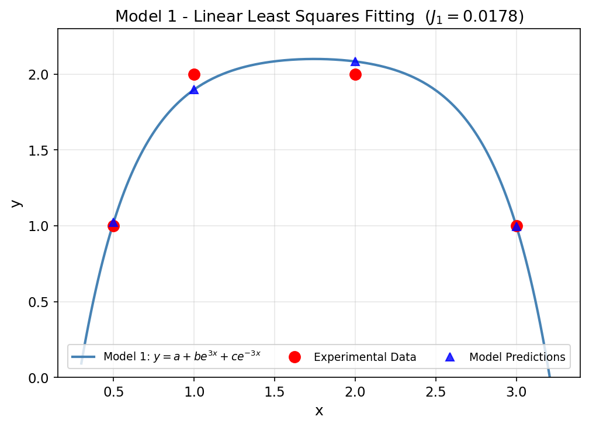
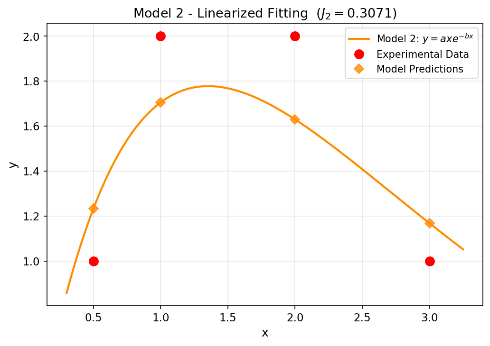
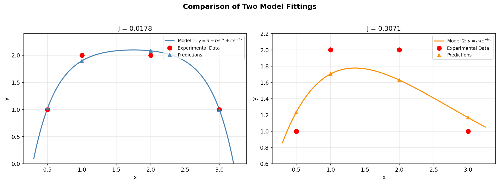

# Unit13 Example 01 - 線性模式參數估計

## 學習目標

本範例以**線性模式參數估計**為題，示範如何由實驗數據建構設計矩陣，並以最小平方法求得模式未知參數之估計值。同時透過「同場加映」，展示如何將一個看似非線性的模式，藉由取對數進行線性化，再以相同方法求解。

學習完本範例後，您將能夠：

- 識別**線性模式**的矩陣標準式 $\mathbf{Y}^M = \mathbf{A}\boldsymbol{\theta}$ ，並正確建構設計矩陣 $\mathbf{A}$
- 推導最小平方法之解析解 $\hat{\boldsymbol{\theta}} = (\mathbf{A}^T\mathbf{A})^{-1}\mathbf{A}^T\mathbf{B}$
- 使用 `scipy.linalg.lstsq()` 求解線性最小平方問題
- 對可線性化之非線性模式（取對數/變數代換）進行轉換並求解
- 計算目標函數值 $J$ （誤差平方和），並以此比較不同模式之擬合品質

---

## 1. 問題描述

### 1.1 實驗數據

進行四次實驗，所得 $(x_i, y_i)$ 數據如下：

| $i$ | $x_i$ | $y_i$ |
|-----|--------|--------|
| 1 | 0.5 | 1 |
| 2 | 1.0 | 2 |
| 3 | 2.0 | 2 |
| 4 | 3.0 | 1 |

### 1.2 待估計模式

**模式一（主要問題）：**

$$
y = a + b e^{3x} + c e^{-3x}
$$

其中 $a$ 、 $b$ 、 $c$ 為三個未知參數。

**模式二（同場加映）：**

$$
y = a x e^{-bx}
$$

其中 $a$ 、 $b$ 為兩個未知參數。此模式表面上呈非線性，但可透過取對數進行線性化。

---

## 2. 模式一：線性最小平方法

### 2.1 建構設計矩陣

對模式 $y = a + be^{3x} + ce^{-3x}$ ，將四個數據點代入可得如下矩陣方程式：

$$
\underbrace{
\begin{bmatrix} y_1 \\ y_2 \\ y_3 \\ y_4 \end{bmatrix}
}_{\mathbf{B}}
=
\underbrace{
\begin{bmatrix}
1 & e^{3x_1} & e^{-3x_1} \\
1 & e^{3x_2} & e^{-3x_2} \\
1 & e^{3x_3} & e^{-3x_3} \\
1 & e^{3x_4} & e^{-3x_4}
\end{bmatrix}
}_{\mathbf{A}}
\begin{bmatrix} a \\ b \\ c \end{bmatrix}
$$

代入 $x = [0.5, 1, 2, 3]$ ，設計矩陣 $\mathbf{A}$ 的數值形式為：

$$
\mathbf{A} =
\begin{bmatrix}
1 & e^{1.5}  & e^{-1.5} \\
1 & e^{3}    & e^{-3}   \\
1 & e^{6}    & e^{-6}   \\
1 & e^{9}    & e^{-9}
\end{bmatrix},
\quad
\mathbf{B} =
\begin{bmatrix} 1 \\ 2 \\ 2 \\ 1 \end{bmatrix}
$$

#### Python 執行結果 — 設計矩陣數值

```
設計矩陣 A:
[[1.00000000e+00 4.48168907e+00 2.23130160e-01]
 [1.00000000e+00 2.00855369e+01 4.97870684e-02]
 [1.00000000e+00 4.03428793e+02 2.47875218e-03]
 [1.00000000e+00 8.10308393e+03 1.23409804e-04]]

觀測值向量 B:
[1. 2. 2. 1.]
```

> **說明：** 設計矩陣第一行全為 1（對應常數項 $a$ ），第二行為 $e^{3x}$ （在 $x = 3$ 時高達 8103），第三行為 $e^{-3x}$ （接近零）。兩列之間的數值差異極大，顯示此問題具有**高條件數（condition number）** 的特性，這正是 `lstsq()` 以 SVD 求解較直接矩陣求逆更為穩定的原因。

### 2.2 最小平方法解析解

目標函數（誤差平方和）為：

$$
J(\boldsymbol{\theta}) = \left(\mathbf{B} - \mathbf{A}\boldsymbol{\theta}\right)^T \left(\mathbf{B} - \mathbf{A}\boldsymbol{\theta}\right)
$$

令 $\dfrac{\partial J}{\partial \boldsymbol{\theta}} = 0$ ，可推導出解析解（Normal Equations）：

$$
\hat{\boldsymbol{\theta}} = \left(\mathbf{A}^T\mathbf{A}\right)^{-1} \mathbf{A}^T \mathbf{B}
$$

> **注意：** 當 $n > p$ （數據點數大於參數數）時為超定系統（overdetermined system），此解即為最小平方意義下的最佳近似解。本例 $n = 4$ ， $p = 3$ ，恰好接近正方形系統，因此解的唯一性需依賴 $\mathbf{A}$ 之條件數（condition number）。

### 2.3 `scipy.linalg.lstsq()` 函式介紹

Python 中以 `scipy.linalg.lstsq()` 計算最小平方解，其函式介面如下：

```python
from scipy.linalg import lstsq

theta, residuals, rank, sv = lstsq(A, B)
```

| 參數 | 類型 | 說明 |
|------|------|------|
| `A` | array, shape (m, n) | 設計矩陣 |
| `B` | array, shape (m,) 或 (m, k) | 右側向量（觀測值） |
| **返回值** | | |
| `theta` | array, shape (n,) | 最小平方解 $\hat{\boldsymbol{\theta}}$ |
| `residuals` | array | 殘差平方和（若 $m > n$ 且 rank = $n$ ） |
| `rank` | int | 矩陣 $\mathbf{A}$ 之秩 |
| `sv` | array | 奇異值（singular values） |

> `lstsq()` 內部以 **SVD（奇異值分解）** 求解，數值穩定性優於直接計算 $(\mathbf{A}^T\mathbf{A})^{-1}$ ，是 Python 中線性最小平方法的首選工具。

### 2.4 求解結果

以 `scipy.linalg.lstsq()` 求解，可得模式一之參數估計值：

| 參數 | 估計值 |
|------|--------|
| $a$ | $\approx 2.1539$ |
| $b$ | $\approx -0.0001$ |
| $c$ | $\approx -5.0711$ |

誤差平方和： $J_1 \approx 0.0178$

#### Python 執行結果 — 各數據點詳細比較

```
模式一參數估計值: y = a + b*exp(3x) + c*exp(-3x)
  a = 2.1539
  b = -0.0001
  c = -5.0711

設計矩陣秩 (rank): 3

各數據點結果:
       x     y_exp     y_model     error
     0.5    1.0000      1.0217   -0.0217
     1.0    2.0000      1.8985    0.1015
     2.0    2.0000      2.0837   -0.0837
     3.0    1.0000      0.9961    0.0039

誤差平方和 J₁ = 0.0178
```

> **結果分析：**
> - 設計矩陣秩為 3（等於參數數），表示三個基底函數 $\{1, e^{3x}, e^{-3x}\}$ 在四個數據點上線性獨立，解唯一存在。
> - 各點誤差均在 $\pm 0.11$ 以內，最大誤差出現在 $x = 1$ 處（ $+0.1015$ ），最小誤差出現在 $x = 3$ 處（ $+0.0039$ ）。
> - 誤差無明顯系統性偏差（有正有負），顯示模式結構適合描述此數據趨勢。

#### 模式一擬合結果圖



> **圖形說明：** 藍色實線為模式一擬合曲線 $y = a + be^{3x} + ce^{-3x}$ ，紅色圓點為四組實驗量測值，藍色三角形為模式預測值。曲線呈現清楚的**鐘形（bell-shaped）** 分佈，在 $x \approx 1.8$ 附近達到峰值 $y \approx 2.1$ ，然後下降。預測點與實驗點高度吻合（ $J_1 = 0.0178$ ），顯示模式一對此數據具有良好的擬合品質。

---

## 3. 同場加映：可線性化模式 $y = axe^{-bx}$

### 3.1 線性化推導

模式 $y = axe^{-bx}$ 本身並非參數線性，但可透過取自然對數進行線性化。對兩側同除 $x$ （ $x > 0$ ）後取對數：

$$
\ln\!\left(\frac{y}{x}\right) = \ln a - bx
$$

令 $\alpha = \ln a$ 為新參數，定義轉換後的觀測值 $z_i = \ln y_i - \ln x_i$ ，則線性方程式為：

$$
z_i = \alpha - b x_i
$$

### 3.2 矩陣方程式

$$
\underbrace{
\begin{bmatrix} z_1 \\ z_2 \\ z_3 \\ z_4 \end{bmatrix}
}_{\mathbf{B}'}
=
\underbrace{
\begin{bmatrix}
1 & -x_1 \\
1 & -x_2 \\
1 & -x_3 \\
1 & -x_4
\end{bmatrix}
}_{\mathbf{A}'}
\begin{bmatrix} \alpha \\ b \end{bmatrix}
$$

求解後由 $\alpha$ 還原原始參數： $a = e^{\alpha}$ 。

#### Python 執行結果 — 線性化矩陣數值

```
線性化後的設計矩陣 A':
[[ 1.  -0.5]
 [ 1.  -1. ]
 [ 1.  -2. ]
 [ 1.  -3. ]]

線性化後的觀測值 B' (= ln(y) - ln(x)):
[ 0.69315  0.69315  0.00000 -1.09861]
```

> **說明：** 設計矩陣 $\mathbf{A}'$ 第一行全為 1，第二行為 $-x$ 。觀測值 $\mathbf{B}' = \ln y - \ln x$ 的計算： $\ln(1) - \ln(0.5) = 0.693$ ， $\ln(2) - \ln(1) = 0.693$ ， $\ln(2) - \ln(2) = 0$ ， $\ln(1) - \ln(3) = -1.099$ ，轉換後的數值差異較原始數據更均衡。

### 3.3 求解結果

以 `scipy.linalg.lstsq()` 求解，可得：

| 參數 | 估計值 |
|------|--------|
| $\alpha = \ln a$ | $\approx 1.2722$ |
| $b$ | $\approx 0.7386$ |
| $a = e^{\alpha}$ | $\approx 3.5685$ |

各數據點之誤差：

| $i$ | $y_i$ （實驗值） | $\hat{y}_i$ （預測值） | 誤差 $e_i$ |
|-----|----------------|----------------------|------------|
| 1 | 1.0 | 1.2333 | −0.2333 |
| 2 | 2.0 | 1.7050 | 0.2950 |
| 3 | 2.0 | 1.6292 | 0.3708 |
| 4 | 1.0 | 1.1676 | −0.1676 |

誤差平方和： $J_2 \approx 0.3071$

> **注意：** 線性化最小平方法最小化的是**對數空間**的誤差平方和，而非原始 $y$ 空間的誤差平方和。因此，此方法所得的 $a, b$ 並非原始問題的最小平方解，僅為近似解。這正是 $J_2$ 較大的原因之一。

#### 模式二擬合結果圖



> **圖形說明：** 橙色實線為模式二擬合曲線 $y = axe^{-bx}$ ，紅色圓點為實驗量測值，菱形圖標為模式預測值。可明顯觀察到模式二的**擬合品質較差**：在 $x = 0.5$ 處預測值（1.233）遠大於實驗值（1.0），在 $x = 1$ 與 $x = 2$ 處預測值（1.705, 1.629）也明顯偏低於實驗值（2.0）。模式曲線的峰值（ $y \approx 1.77$ ）遠不及實驗數據的峰值（ $y = 2.0$ ），誤差平方和 $J_2 = 0.3071$ 遠大於模式一。

---

## 4. 模式比較與結語

### 4.1 兩模式之比較

| 比較項目 | 模式一 $y = a + be^{3x} + ce^{-3x}$ | 模式二 $y = axe^{-bx}$ |
|---------|--------------------------------------|------------------------|
| 未知參數數 | 3（ $a, b, c$ ） | 2（ $a, b$ ） |
| 線性化方式 | 直接設計矩陣 | 取對數後線性化 |
| 求解方法 | `scipy.linalg.lstsq()` | `scipy.linalg.lstsq()`（線性化後） |
| $J$ （誤差平方和） | $\approx 0.0178$ | $\approx 0.3071$ |
| 模式適合度 | **較佳** | 較差 |

#### Python 執行結果 — 模式比較摘要

```
=======================================================
         模式比較摘要
=======================================================
  模式一: y = a + b*exp(3x) + c*exp(-3x)
    a = 2.1539, b = -0.0001, c = -5.0711
    J₁ = 0.0178  ← 較佳

  模式二: y = a*x*exp(-b*x)
    a = 3.5685, b = 0.7386
    J₂ = 0.3071
=======================================================

結論：模式一之 J 值 (0.0178) 遠小於模式二 (0.3071)
      在此組數據下，模式一對實驗數據的擬合品質明顯較佳。
```

#### 兩模式對比圖



> **圖形說明：** 左圖（模式一， $J = 0.0178$ ）展示藍色鐘形曲線與實驗點的高度吻合；右圖（模式二， $J = 0.3071$ ）橙色曲線與實驗點存在明顯偏差。層疊對比可直觀地確認兩模式擬合品質的差距：模式一的預測點（三角形）與實驗點（圓點）高度重疊，而模式二的預測點則系統性地低估實驗值（預測範圍約 1.1~1.8，而實驗值為 1.0~2.0）。

### 4.2 模式選擇準則

利用誤差平方和 $J$ 可作為模式優劣之初步判斷依據：

$$
J = \sum_{i=1}^{n} \left(y_i - \hat{y}_i\right)^2
$$

$J$ 值愈小，模式對實驗數據之擬合度愈佳。**模式一的 $J_1 \approx 0.0178$ 遠小於模式二的 $J_2 \approx 0.3071$**，表示在此組數據下，含三個參數的 $y = a + be^{3x} + ce^{-3x}$ 模式較 $y = axe^{-bx}$ 更為適合。

> **工程實務提醒：** 選擇模式時，除了 $J$ 值，還需考慮：  
> 1. **模式的物理意義**：參數是否有明確的物理/化學意義？  
> 2. **過擬合風險**：參數愈多，擬合愈好，但泛化能力可能較差  
> 3. **數據量充足性**：一般建議數據點數至少為參數數的 5～10 倍  

### 4.3 結語

本範例展示了線性最小平方法在參數估計中的兩種應用場景：

1. **直接設計矩陣法**：針對在參數上呈線性的模式，直接構造設計矩陣並以 `scipy.linalg.lstsq()` 求解，是最直接且數值穩定的方式。

2. **線性化後求解**：對可線性化的非線性模式（如本例取對數），亦可轉換為線性問題求解，但需注意線性化改變了原問題的誤差最小化目標。

在實際化工應用中，若模式為真正的非線性（無法線性化），則需採用非線性最小平方法（如 `scipy.optimize.curve_fit()`），詳見 Unit13 Example 02。

---

## 5. Python 函式快速參照

| 函式 | 套件 | 說明 |
|------|------|------|
| `scipy.linalg.lstsq(A, B)` | `scipy.linalg` | 最小平方法，回傳參數估計值、殘差、秩、奇異值 |
| `numpy.linalg.lstsq(A, B)` | `numpy.linalg` | 功能相同，`scipy` 版本數值穩定性較好 |
| `numpy.exp(x)` | `numpy` | 計算 $e^x$ |
| `numpy.log(x)` | `numpy` | 計算 $\ln x$ |
| `numpy.column_stack(...)` | `numpy` | 水平堆疊向量以建構設計矩陣 |
| `numpy.ones((n, 1))` | `numpy` | 建立全 1 列向量（設計矩陣常數項） |

---

**課程資訊**
- 課程名稱：電腦在化工上之應用 (ChemE 3502)
- 課程單元：Unit13 參數估計 — 範例一
- 課程製作：逢甲大學 化工系 智慧程序系統工程實驗室
- 授課教師：莊曜禎 助理教授
- 更新日期：2026-02-28

**課程授權 [CC BY-NC-SA 4.0]**
 - 本教材遵循 [創用CC 姓名標示-非商業性-相同方式分享 4.0 國際 (CC BY-NC-SA 4.0)](https://creativecommons.org/licenses/by-nc-sa/4.0/deed.zh) 授權。

---