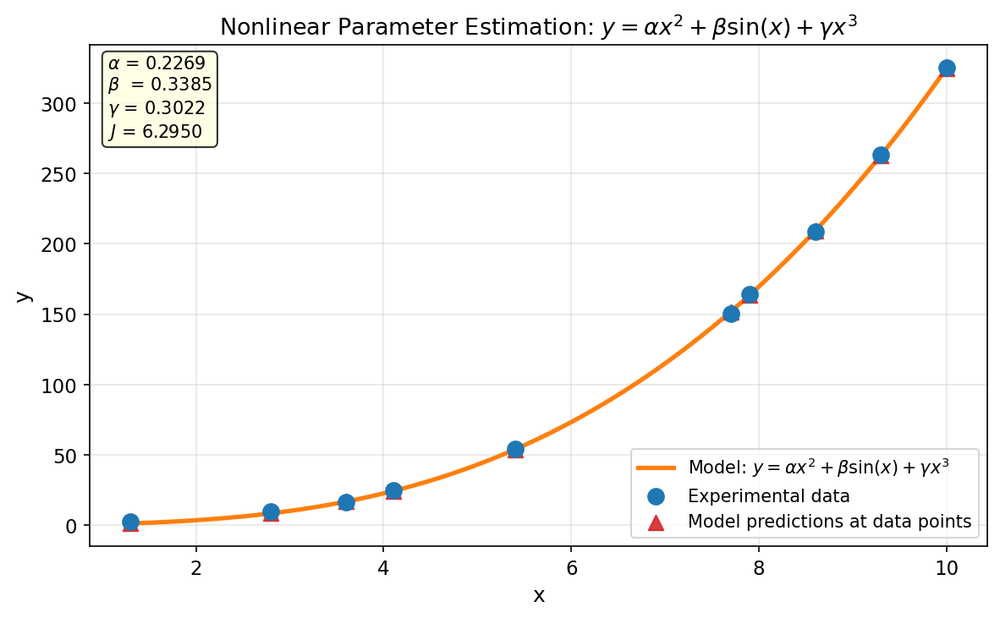
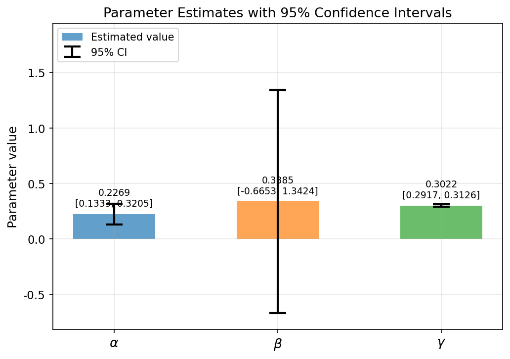
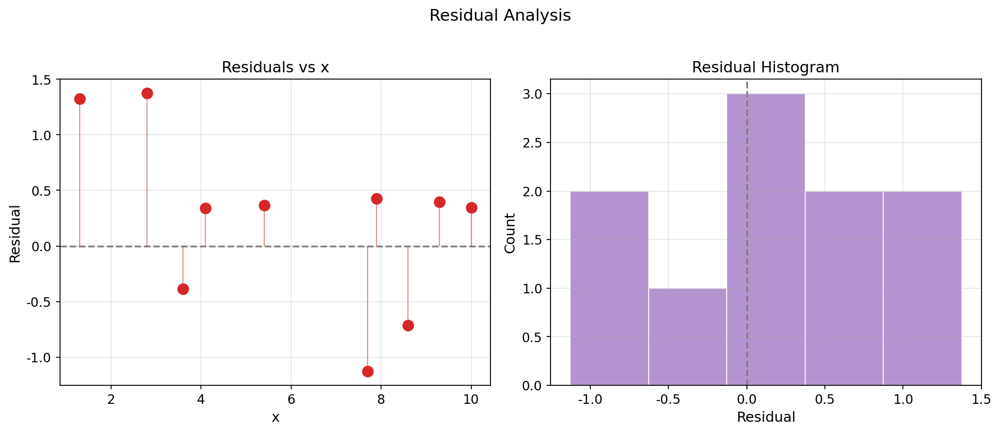

# Unit13 Example 02 - 非線性模式參數估計與置信區間

## 學習目標

本範例以**非線性模式參數估計**為題，示範如何使用 `scipy.optimize.curve_fit()` 對無法線性化的非線性模式進行參數估計，並利用返回的協方差矩陣 `pcov` 計算各參數的 $95\%$ 置信區間（confidence interval）。

學習完本範例後，您將能夠：

- 識別**非線性模式**與線性模式的區別，了解何時須採用非線性最小平方法
- 使用 `scipy.optimize.curve_fit()` 估計非線性模式中的未知參數，並取得協方差矩陣
- 由協方差矩陣對角線元素推算各參數之標準差，進而計算 $95\%$ 置信區間
- 理解置信區間的物理意義與模式可辨識性（identifiability）
- 繪製模式預測結果與實驗數據之吻合度圖並進行殘差分析

---

## 1. 問題描述

### 1.1 實驗數據

進行十次實驗，所得 $(x_i, y_i)$ 數據如下：

| $i$ | $x_i$ | $y_i$ |
|-----|--------|--------|
| 1  | 3.6  | 16.5  |
| 2  | 7.7  | 150.6 |
| 3  | 9.3  | 263.1 |
| 4  | 4.1  | 24.7  |
| 5  | 8.6  | 208.5 |
| 6  | 2.8  | 9.9   |
| 7  | 1.3  | 2.7   |
| 8  | 7.9  | 163.9 |
| 9  | 10.0 | 325.0 |
| 10 | 5.4  | 54.3  |

### 1.2 待估計模式

$$
y = \alpha x^2 + \beta \sin(x) + \gamma x^3
$$

其中 $\alpha$ 、 $\beta$ 、 $\gamma$ 為三個未知參數。求解時以初始猜測值 $p_0 = [0.5,\, 0.5,\, 0.5]$ 作為迭代起點。

### 1.3 問題說明

本模式雖然含有三個未知參數，但因各參數在方程式中以**乘法方式**作用於不同的非線性基底函數（ $x^2$ 、 $\sin(x)$ 、 $x^3$ ），若仔細觀察，其實每個參數對模式輸出的作用是線性疊加的，故此模式實際上是**參數線性**（linear-in-parameters）的模式：

$$
y = \alpha \cdot x^2 + \beta \cdot \sin(x) + \gamma \cdot x^3
$$

可寫成矩陣形式 $\mathbf{Y} = \mathbf{A}\boldsymbol{\theta}$ 。然而，本範例**刻意採用非線性最小平方法** `scipy.optimize.curve_fit()` 求解，目的是示範其一般性用法，並說明如何由其返回的協方差矩陣計算置信區間。

> **補充說明：** 若以 `scipy.linalg.lstsq()` 求解此例（如 Example 01 的方法），理論上可得到與 `curve_fit()` 相同的最佳參數估計值，誤差平方和亦應相同。

---

## 2. 非線性最小平方法原理

### 2.1 目標函數

對於非線性模式 $y = f(x, \mathbf{p})$ ，給定 $n$ 組量測數據 $(x_i, y_i)$ ，參數估計問題為：

$$
\min_{\mathbf{p}} \, J = \sum_{i=1}^{n} e_i^2(\mathbf{p})
$$

其中殘差（residual）為：

$$
e_i(\mathbf{p}) = y_i - f(x_i, \mathbf{p})
$$

與線性最小平方法不同，非線性問題通常**無解析解**，須以迭代法（如 Levenberg-Marquardt 演算法）求解。

### 2.2 Levenberg-Marquardt 演算法簡介

`scipy.optimize.curve_fit()` 預設採用 **Levenberg-Marquardt（LM）演算法**，其更新公式為：

$$
\boldsymbol{\delta} = \left( \mathbf{J}^T \mathbf{J} + \lambda \mathbf{I} \right)^{-1} \mathbf{J}^T \mathbf{e}
$$

$$
\mathbf{p}^{(k+1)} = \mathbf{p}^{(k)} + \boldsymbol{\delta}
$$

其中 $\mathbf{J}$ 為 Jacobian 矩陣（各殘差對各參數的偏微分）， $\lambda$ 為阻尼係數（damping factor）， $\mathbf{e}$ 為殘差向量。

- 當 $\lambda \to 0$ 時，退化為 Gauss-Newton 法（在極小值附近快速收斂）
- 當 $\lambda \to \infty$ 時，近似為梯度下降法（遠離極小值時穩定搜尋）

> **特點：** LM 演算法自動在 Gauss-Newton 與梯度下降之間切換，兼具收斂速度與穩定性，是非線性最小平方問題的標準求解器。

---

## 3. `scipy.optimize.curve_fit()` 函式介紹

### 3.1 函式介面

```python
from scipy.optimize import curve_fit

popt, pcov = curve_fit(f, xdata, ydata, p0=None, bounds=(-np.inf, np.inf))
```

| 參數 | 類型 | 說明 |
|------|------|------|
| `f` | callable | 模式函數，格式為 `f(x, *params)`，回傳模式預測值 |
| `xdata` | array-like | 自變數觀測值 |
| `ydata` | array-like | 因變數觀測值 |
| `p0` | array-like, 選填 | 參數初始猜測值；若未提供，預設全為 1.0 |
| `bounds` | 2-tuple, 選填 | 參數上下限，格式為 `([lb1, lb2, ...], [ub1, ub2, ...])` |
| **返回值** | | |
| `popt` | ndarray, shape (n_p,) | 最佳參數估計值 $\hat{\mathbf{p}}$ （長度等於參數個數 $n_p$ ） |
| `pcov` | ndarray, shape (n_p, n_p) | 參數估計值之漸近協方差矩陣（asymptotic covariance matrix） |

> **注意：** 若 `curve_fit()` 無法收斂（如數據不足或初始值太差），會拋出 `RuntimeError`。建議提供合理的 `p0` 以提升收斂機率。

### 3.2 協方差矩陣 `pcov` 的意義

`pcov` 為 $n_p \times n_p$ 的對稱矩陣（ $n_p$ 為參數個數），其中：

- **對角線元素** `pcov[i, i]` 為第 $i$ 個參數估計值的**方差（variance）**
- **標準差（standard deviation）** 為：

$$
\sigma_i = \sqrt{\mathrm{pcov}[i, i]}
$$

- **95% 置信區間** 為（以 $t$ 分佈臨界值計算，自由度 $\nu = n - n_p$ ）：

$$
\hat{p}_i \pm t_{0.975,\,\nu} \, \sigma_i
$$

當 $n$ 足夠大時 $t_{0.975,\,\nu} \approx 1.96$ （常態近似），但 $n$ 較小時須使用 $t$ 分佈精確值。

> **注意：** `pcov` 是在最佳解附近以線性近似（Jacobian 矩陣）估算的，對於強非線性問題或數據點數過少時，置信區間可能不夠精確。

### 3.3 模式函數定義方式

定義模式函數時，第一個引數固定為自變數 `x` ，其後為各參數：

```python
def model_func(x, alpha, beta, gamma):
    return alpha * x**2 + beta * np.sin(x) + gamma * x**3
```

`curve_fit()` 在內部會自動計算 Jacobian（或用數值差分近似），並以 LM 演算法或 `trf` 演算法迭代求解。

---

## 4. 參數估計求解

### 4.1 求解步驟

本範例的求解流程如下：

1. 定義模式函數 `model_func(x, alpha, beta, gamma)`
2. 設定實驗數據 `xdata`、`ydata` 及初始猜測值 `p0 = [0.5, 0.5, 0.5]`
3. 呼叫 `curve_fit()` 求解，取得最佳參數 `popt` 與協方差矩陣 `pcov`
4. 計算誤差平方和 $J$

### 4.2 求解結果

以 `scipy.optimize.curve_fit()` 並設定 `p0 = [0.5, 0.5, 0.5]` 求解，可得：

| 參數 | 估計值 |
|------|--------|
| $\alpha$ | $\approx 0.2269$ |
| $\beta$ | $\approx 0.3385$ |
| $\gamma$ | $\approx 0.3022$ |

誤差平方和： $J \approx 6.2950$

#### Python 執行結果 — 參數估計

```
參數估計結果: y = α*x² + β*sin(x) + γ*x³
  α (alpha) = 0.2269
  β (beta)  = 0.3385
  γ (gamma) = 0.3022

誤差平方和 J = 6.2950
```

#### Python 執行結果 — 各數據點詳細比較

```
各數據點詳細比較:
       x      y_exp    y_model      error
──────────────────────────────────────────
     3.6     16.500     16.888     -0.388
     7.7    150.600    151.729     -1.129
     9.3    263.100    262.704      0.396
     4.1     24.700     24.362      0.338
     8.6    208.500    209.215     -0.715
     2.8      9.900      8.525      1.375
     1.3      2.700      1.373      1.327
     7.9    163.900    163.471      0.429
    10.0    325.000    324.656      0.344
     5.4     54.300     53.933      0.367
```

> **結果分析：** 各數據點的預測誤差絕對值均在 $\pm 1.4$ 以內（最大正殘差 $+1.375$ 出現在 $x = 2.8$ ，最大負殘差 $-1.129$ 出現在 $x = 7.7$ ），殘差均值為 $0.234$ （略大於零，有一定程度的系統性正偏差），整體上模式能合理描述此實驗數據的趨勢。

#### 模式擬合結果圖



> **圖形說明：** 藍色圓點為十組實驗量測值，橙色實線為模式預測曲線 $y = \alpha x^2 + \beta \sin(x) + \gamma x^3$ （以精細 $x$ 網格繪出），**紅色三角形**為各實驗 $x$ 點之模式預測值。隨 $x$ 增大，模式輸出呈現顯著的冪次成長趨勢（以 $x^3$ 項主導），反映 $y$ 值從 2.7（ $x = 1.3$ ）增至 325.0（ $x = 10.0$ ）的快速增長。

---

## 5. 參數估計值之置信區間

### 5.1 置信區間計算原理

在殘差為獨立同分佈（i.i.d.）常態分佈的假設下，參數估計值 $\hat{p}_i$ 之 $95\%$ 置信區間為：

$$
\hat{p}_i \pm t_{0.975,\,n-n_p} \cdot \sigma_i
$$

**本範例** $n = 10$ 、 $n_p = 3$ ，自由度 $\nu = 7$ ，查 $t$ 分佈表得 $t_{0.975,\,7} = 2.3646$ （注意：當 $n$ 足夠大時才可近似為 $1.96$ ，本例 $n$ 較小，須使用 $t$ 分佈精確值）。置信區間計算式為：

$$
\sigma_i = \sqrt{\mathrm{pcov}[i, i]}
$$

$$
\text{95\% CI:} \quad \left[\hat{p}_i - t_{0.975,\,7}\,\sigma_i,\; \hat{p}_i + t_{0.975,\,7}\,\sigma_i\right] = \left[\hat{p}_i - 2.3646\,\sigma_i,\; \hat{p}_i + 2.3646\,\sigma_i\right]
$$

### 5.2 協方差矩陣

`curve_fit()` 返回之協方差矩陣 `pcov` 由 Jacobian 矩陣 $\mathbf{J}$ 在最佳解點計算：

$$
\mathrm{pcov} \approx s^2 \left(\mathbf{J}^T \mathbf{J}\right)^{-1}
$$

其中 $s^2 = J_{\min} / (n - n_p)$ 為殘差方差估計值（ $n = 10$ 個數據點， $n_p = 3$ 個參數，自由度 $= 7$ ）。

### 5.3 計算結果

#### Python 執行結果 — 協方差矩陣

```
協方差矩陣 pcov:
[[ 1.567e-03 -2.359e-03 -1.729e-04]
 [-2.359e-03  1.802e-01  2.061e-04]
 [-1.729e-04  2.061e-04  1.946e-05]]
```

> **說明：** 對角線元素依序為 $\alpha$ 、 $\beta$ 、 $\gamma$ 的參數方差。非對角線元素反映參數間的共變異（covariance）—— $\alpha$ 與 $\beta$ 之間為**負相關**（covariance = $-2.359 \times 10^{-3}$ ）， $\beta$ 與 $\gamma$ 之間為正相關， $\alpha$ 與 $\gamma$ 之間為負相關，表示在調整 $\alpha$ 時 $\beta$ 需反向調整才能維持模式輸出不變。

#### Python 執行結果 — 置信區間

```
t 分佈臨界值 (df=7, 95% CI): t = 2.3646

=============================================================
                    參數估計值與 95% 置信區間
=============================================================
參數                估計值        標準差        CI 下限        CI 上限
─────────────────────────────────────────────────────────────
α (alpha)      0.2269    0.03958 [  0.1333,   0.3205]
β (beta)       0.3385    0.42454 [ -0.6653,   1.3424]
γ (gamma)      0.3022    0.00441 [  0.2917,   0.3126]
=============================================================
```

> **物理意義分析：**
> - $\gamma$ 的標準差（ $0.00441$ ）遠小於 $\alpha$ 和 $\beta$ ，原因在於 $x^3$ 項在大 $x$ 值（如 $x = 10$ ，貢獻 $1000\gamma$ ）下對模式輸出的靈敏度極高，數據對 $\gamma$ 的約束能力最強，故置信區間最窄。
> - $\beta$ 的置信區間最寬（ $\pm 1.004$ ），因為 $\sin(x)$ 項為週期函數，相對於冪次項在此數據範圍內的貢獻較小，數據對 $\beta$ 的辨識能力較弱。注意 $\beta$ 的 $95\%$ 置信區間包含零（ $[-0.6653,\, 1.3424]$ ），表示在 $5\%$ 顯著性水準下， $\beta = 0$ 的可能性無法排除。

#### 置信區間視覺化圖



> **圖形說明：** 條形圖展示三個參數的估計值（深色條）與 $95\%$ 置信區間（誤差條）的相對大小。 $\gamma$ 的誤差條比例上最短， $\beta$ 的誤差條最長，直觀反映了各參數的可辨識性差異。

---

## 6. 殘差分析

### 6.1 殘差圖

良好的模式擬合要求殘差：

1. **無系統性趨勢**：殘差應在零線附近隨機分佈
2. **方差均一**：各點殘差絕對值大致相等（homoscedasticity）
3. **常態分佈**：殘差的分佈應接近常態

#### Python 執行結果 — 殘差統計

```
殘差統計:
  殘差最大值:    1.375
  殘差最小值:   -1.129
  殘差均值:      0.234  (理論上應接近 0)
  殘差標準差:    0.758
  RMSE:          0.793
```

#### 殘差分析圖



> **圖形說明：** 左圖（殘差 vs $x$ ）顯示各點殘差分佈，最大正殘差 $+1.375$ 出現在 $x = 2.8$ ，最大負殘差 $-1.129$ 出現在 $x = 7.7$ ；殘差均值為 $0.234$ （略大於零，有一定程度的系統性正偏差）；右圖（殘差直方圖）顯示殘差分佈略偏正側，整體仍大致符合常態假設，支持模式結構的合理性，但殘差均值高於零提示未來可進一步檢視模式假設或增加數據點數。

---

## 7. 結語與方法總結

### 7.1 本範例重點回顧

1. **非線性最小平方法**：對無法化為線性系統的模式，使用 `scipy.optimize.curve_fit()` 以 Levenberg-Marquardt 演算法迭代求解。

2. **協方差矩陣**：`curve_fit()` 返回的 `pcov` 矩陣是量化參數不確定度的關鍵工具，其對角線元素平方根即為各參數的標準差。

3. **置信區間**：由 $\hat{p}_i \pm t_{0.975,\,\nu}\,\sigma_i$ 給出 $95\%$ 置信區間（本例 $t_{0.975,\,7} = 2.3646$ ），置信區間的寬窄反映了數據對各參數的辨識能力。

4. **擬合品質評估**：除目標函數值 $J$ 外，殘差分析（殘差 vs $x$ 圖、殘差直方圖）是驗證模式假設的重要工具。

### 7.2 `curve_fit()` 與 `lstsq()` 之比較

| 比較項目 | `scipy.linalg.lstsq()` | `scipy.optimize.curve_fit()` |
|---------|------------------------|------------------------------|
| 適用模式 | 參數線性模式 | 任意非線性模式 |
| 求解方式 | 解析解（SVD） | 迭代法（LM / trf） |
| 初始猜測值 | 不需要 | 需要（`p0`） |
| 協方差矩陣 | 需額外計算 | 直接返回 `pcov` |
| 參數上下限 | 不支援 | 支援（`bounds`） |
| 計算速度 | 快（解析解） | 較慢（迭代） |

> **選擇建議：** 若模式在參數上確實是線性的（如本例），優先使用 `lstsq()` 取得精確解析解；若需要置信區間，可在 `lstsq()` 求解後額外計算協方差矩陣，或直接改用 `curve_fit()` 一步完成。對於真正的非線性模式，`curve_fit()` 是首選。

---

## 8. Python 函式快速參照

| 函式 | 套件 | 說明 |
|------|------|------|
| `scipy.optimize.curve_fit(f, x, y, p0)` | `scipy.optimize` | 非線性最小平方法，回傳最佳參數 `popt` 與協方差矩陣 `pcov` |
| `numpy.sqrt(pcov.diagonal())` | `numpy` | 由協方差矩陣對角線計算各參數標準差 |
| `scipy.stats.t.ppf(0.975, df)` | `scipy.stats` | 計算 $t$ 分佈臨界值（自由度 `df` = $n - n_p$ ） |
| `numpy.sin(x)` | `numpy` | 計算正弦函數 |
| `numpy.linspace(a, b, n)` | `numpy` | 生成等差數值序列（繪製平滑曲線用） |

---

**課程資訊**
- 課程名稱：電腦在化工上之應用 (ChemE 3502)
- 課程單元：Unit13 參數估計 — 範例二
- 課程製作：逢甲大學 化工系 智慧程序系統工程實驗室
- 授課教師：莊曜禎 助理教授
- 更新日期：2026-02-28

**課程授權 [CC BY-NC-SA 4.0]**
 - 本教材遵循 [創用CC 姓名標示-非商業性-相同方式分享 4.0 國際 (CC BY-NC-SA 4.0)](https://creativecommons.org/licenses/by-nc-sa/4.0/deed.zh) 授權。

---
