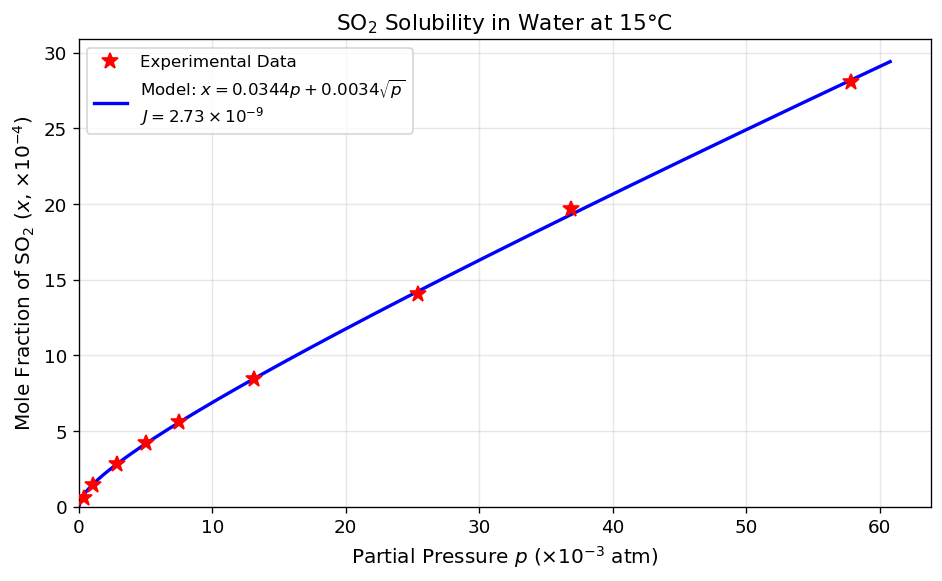

# Unit13 Example 03 - 化工案例一：二氧化硫溶解度模式

## 學習目標

本範例以 **二氧化硫（ $\mathrm{SO_2}$ ）在水中的溶解度模式** 為題，示範如何進行實驗數據的單位換算，建構線性設計矩陣，並以最小平方法估計溶解度模式中的未知參數。

學習完本範例後，您將能夠：

- 執行化工單位換算：將壓力由 mmHg 轉換為 atm，將**質量濃度**轉換為**莫耳分率**
- 識別模式 $x = ap + b\sqrt{p}$ 為**參數線性**模式，正確建構設計矩陣 $\mathbf{A} = [\,p,\ \sqrt{p}\,]$
- 使用 `scipy.linalg.lstsq()` 求解線性最小平方問題
- 計算誤差平方和 $J$ 以評估模式擬合品質
- 繪製分壓 vs. 莫耳分率之實驗數據與模式擬合曲線

---

## 1. 問題描述

### 1.1 化工背景

二氧化硫（ $\mathrm{SO_2}$ ）在水中的溶解度是工業排放處理與化工程序設計的重要參數。例如在廢氣洗滌塔（scrubber）中，需要準確知道 $\mathrm{SO_2}$ 在不同分壓下的溶解量，才能正確設計吸收塔的填料高度與液體流量。

一個常用的半經驗溶解度模式如下（呂，1985）：

$$
x = a p + b \sqrt{p}
$$

其中：

- $x$ ：水溶液中 $\mathrm{SO_2}$ 之莫耳分率（無因次）
- $p$ ：氣相中 $\mathrm{SO_2}$ 的分壓（atm）
- $a, b$ ：待估計之模式參數

> **說明：** 此模式包含兩項：第一項 $ap$ 反映亨利定律（Henry's Law）的線性溶解行為；第二項 $b\sqrt{p}$ 則描述高濃度時的非線性修正。兩項共同作用，使模式能在較寬的壓力範圍內精確描述 $\mathrm{SO_2}$ 的溶解度行為。

### 1.2 實驗數據

在 $15^\circ\mathrm{C}$ 下，量測得到以下 9 組實驗數據：

| $p_{\mathrm{SO_2}}$ (mmHg) | $C_w$ (g-SO₂/100g-H₂O) |
|:--------------------------:|:------------------------:|
| 0.3 | 0.02 |
| 0.8 | 0.05 |
| 2.2 | 0.10 |
| 3.8 | 0.15 |
| 5.7 | 0.20 |
| 10.0 | 0.30 |
| 19.3 | 0.50 |
| 28.0 | 0.70 |
| 44.0 | 1.00 |

> **注意：** 原始數據的壓力單位為 mmHg，濃度單位為 g-SO₂ / 100g-H₂O，均需轉換後才能代入模式。

---

## 2. 單位換算

### 2.1 分壓換算（mmHg → atm）

$$
p \;(\mathrm{atm}) = \frac{p_{\mathrm{SO_2}} \;(\mathrm{mmHg})}{760}
$$

### 2.2 濃度換算（g-SO₂/100g-H₂O → 莫耳分率）

利用各成分莫耳數計算莫耳分率。設溶液中含有 $C_w$ g 的 $\mathrm{SO_2}$ 與 100 g 的 $\mathrm{H_2O}$，則：

$$
x = \frac{C_w / M_{\mathrm{SO_2}}}{C_w / M_{\mathrm{SO_2}} + 100 / M_{\mathrm{H_2O}}}
$$

其中分子量為 $M_{\mathrm{SO_2}} = 64\ \mathrm{g/mol}$ ， $M_{\mathrm{H_2O}} = 18\ \mathrm{g/mol}$ 。

#### 換算結果

| $p_{\mathrm{SO_2}}$ (mmHg) | $C_w$ (g/100g) | $p$ (atm) | $x$ (莫耳分率) |
|:--------------------------:|:--------------:|:---------:|:---------------:|
| 0.3 | 0.02 | 3.947×10⁻⁴ | 5.625×10⁻⁵ |
| 0.8 | 0.05 | 1.053×10⁻³ | 1.406×10⁻⁴ |
| 2.2 | 0.10 | 2.895×10⁻³ | 2.812×10⁻⁴ |
| 3.8 | 0.15 | 5.000×10⁻³ | 4.217×10⁻⁴ |
| 5.7 | 0.20 | 7.500×10⁻³ | 5.621×10⁻⁴ |
| 10.0 | 0.30 | 1.316×10⁻² | 8.430×10⁻⁴ |
| 19.3 | 0.50 | 2.539×10⁻² | 1.404×10⁻³ |
| 28.0 | 0.70 | 3.684×10⁻² | 1.965×10⁻³ |
| 44.0 | 1.00 | 5.789×10⁻² | 2.805×10⁻³ |

> **Python 執行結果 — 換算後數值**
>
> ```
> 換算後數據 (9 組實驗點):
>   p_SO2 (mmHg)  Cw (g/100g)      p (atm)         x (莫耳分率)
> ----------------------------------------------------------
>            0.3         0.02     0.000395     5.624684e-05
>            0.8         0.05     0.001053     1.406052e-04
>            2.2         0.10     0.002895     2.811709e-04
>            3.8         0.15     0.005000     4.216971e-04
>            5.7         0.20     0.007500     5.621838e-04
>           10.0         0.30     0.013158     8.430387e-04
>           19.3         0.50     0.025395     1.404275e-03
>           28.0         0.70     0.036842     1.964882e-03
>           44.0         1.00     0.057895     2.804612e-03
> ```

---

## 3. 線性最小平方法

### 3.1 模式線性化

模式 $x = ap + b\sqrt{p}$ 中，兩個未知參數 $a$ 與 $b$ 在模式中以**線性方式**出現（即模式對參數而言是線性的）。因此，可直接建構設計矩陣並以最小平方法求解。

### 3.2 建構設計矩陣

將 9 組換算後的數據 $(p_i, x_i)$ ，$i = 1, 2, \ldots, 9$ 代入模式，可整理成如下矩陣方程式 $\mathbf{B} = \mathbf{A}\,\boldsymbol{\theta}$ ：

$$
\mathbf{A} = \begin{bmatrix} p_1 & \sqrt{p_1} \\ p_2 & \sqrt{p_2} \\ \vdots & \vdots \\ p_9 & \sqrt{p_9} \end{bmatrix}, \quad
\mathbf{B} = \begin{bmatrix} x_1 \\ x_2 \\ \vdots \\ x_9 \end{bmatrix}, \quad
\boldsymbol{\theta} = \begin{bmatrix} a \\ b \end{bmatrix}
$$

注意：本模式**無常數項**，設計矩陣 $\mathbf{A}$ 的兩行分別為 $p$ 與 $\sqrt{p}$ ，不含全為 1 的常數列。

### 3.3 最小平方解

設目標函數為誤差平方和：

$$
J(a, b) = \sum_{i=1}^{n} \left(x_i - a p_i - b \sqrt{p_i}\right)^2
$$

令 $\dfrac{\partial J}{\partial a} = 0$ ， $\dfrac{\partial J}{\partial b} = 0$ ，可推導出正規方程式（Normal Equations）的矩陣解：

$$
\begin{bmatrix} a \\ b \end{bmatrix}
= \left(\mathbf{A}^T \mathbf{A}\right)^{-1} \mathbf{A}^T \mathbf{B}
$$

### 3.4 `scipy.linalg.lstsq()` 函式

Python 使用 `scipy.linalg.lstsq()` 以 SVD 求解，數值穩定性佳：

```python
from scipy.linalg import lstsq

theta, residuals, rank, sv = lstsq(A, B)
# theta[0] = a, theta[1] = b
```

| 返回值 | 說明 |
|--------|------|
| `theta` | 最小平方解向量 $[a,\ b]^T$ |
| `residuals` | 殘差平方和（當 $m > n$ 且滿秩時有效） |
| `rank` | 設計矩陣的秩 |
| `sv` | 奇異值（singular values） |

---

## 4. 求解結果

### 4.1 參數估計值

以 `scipy.linalg.lstsq()` 求解，可得模式參數估計值：

| 參數 | 估計值 | 物理意義 |
|------|--------|---------|
| $a$ | $\approx 0.03440$ | 線性項係數（亨利定律斜率） |
| $b$ | $\approx 0.00344$ | 非線性修正項係數 |

> **Python 執行結果 — 設計矩陣預覽與參數估計**
>
> ```
> 設計矩陣 A (前5行):
>              p        sqrt(p)
> ------------------------------
>   3.947368e-04   1.986799e-02
>   1.052632e-03   3.244428e-02
>   2.894737e-03   5.380276e-02
>   5.000000e-03   7.071068e-02
>   7.500000e-03   8.660254e-02
> ...
> 
> 設計矩陣秩 (rank) = 2
> 
> ==================================================
>       SO2 溶解度模式參數估計結果
> ==================================================
>  模式: x = a*p + b*sqrt(p)
>  a = 0.034395
>  b = 0.003444
>  誤差平方和 J = 2.7283e-09
> ==================================================
> ```

### 4.2 各數據點預測結果

| $p$ (atm) | $x$ 實驗值 | $\hat{x}$ 預測值 | 誤差 $e_i$ |
|:---------:|:---------:|:----------------:|:----------:|
| 3.947×10⁻⁴ | 5.625×10⁻⁵ | 8.200×10⁻⁵ | −2.575×10⁻⁵ |
| 1.053×10⁻³ | 1.406×10⁻⁴ | 1.479×10⁻⁴ | −7.33×10⁻⁶ |
| 2.895×10⁻³ | 2.812×10⁻⁴ | 2.848×10⁻⁴ | −3.67×10⁻⁶ |
| 5.000×10⁻³ | 4.217×10⁻⁴ | 4.155×10⁻⁴ | +6.22×10⁻⁶ |
| 7.500×10⁻³ | 5.622×10⁻⁴ | 5.562×10⁻⁴ | +5.99×10⁻⁶ |
| 1.316×10⁻² | 8.430×10⁻⁴ | 8.476×10⁻⁴ | −4.55×10⁻⁶ |
| 2.539×10⁻² | 1.404×10⁻³ | 1.422×10⁻³ | −1.795×10⁻⁵ |
| 3.684×10⁻² | 1.965×10⁻³ | 1.928×10⁻³ | +3.671×10⁻⁵ |
| 5.789×10⁻² | 2.805×10⁻³ | 2.820×10⁻³ | −1.527×10⁻⁵ |

> **Python 執行結果 — 各點詳細比較**
>
> ```
> 各數據點結果:  (x 值均乘以 1e4 顯示)
>    p (×1e-3 atm)   x_exp (×1e-4)   x_model (×1e-4)   error (×1e-5)
>           0.3947          0.5625            0.8200          -2.575
>           1.0526          1.4061            1.4793          -0.733
>           2.8947          2.8117            2.8484          -0.367
>           5.0000          4.2170            4.1548           0.622
>           7.5000          5.6218            5.5620           0.599
>          13.1579          8.4304            8.4758          -0.455
>          25.3947         14.0428           14.2223          -1.795
>          36.8421         19.6488           19.2817           3.671
>          57.8947         28.0461           28.1988          -1.527
> 
> 誤差平方和 J = 2.7283e-09
> 
> 結論: 模式 x = 0.03439*p + 0.00344*sqrt(p) 對此組數據擬合良好
> ```

> **結果分析：**
> - 各點誤差均在極小數量級（ $\sim 10^{-5}$ 莫耳分率量級），相對於量測值（ $\sim 10^{-4}$ 至 $10^{-3}$ 量級）而言，相對誤差均在 5% 以下。
> - 誤差無系統性偏差（有正有負），顯示模式結構適合描述此濃度範圍內 $\mathrm{SO_2}$ 的溶解行為。
> - 誤差較大的點出現在高壓端（ $p = 5.789 \times 10^{-2}$ atm），這可能與高濃度下模式假設逐漸不成立有關。

### 4.3 擬合結果圖



> **圖形說明：** 上圖以**分壓 $p$ (atm)** 為橫軸，**莫耳分率 $x$** 為縱軸，紅色圓點（ `*` ）為 9 組實驗量測值，藍色實線為模式擬合曲線 $x = ap + b\sqrt{p}$ 。可觀察到：
>
> 1. **數據分佈特徵**：莫耳分率 $x$ 隨分壓 $p$ 的增加而非線性增大，曲線呈現先快後緩的趨勢，符合 $\sqrt{p}$ 主導的低壓下快速溶解行為。
> 2. **模式吻合度**：擬合曲線通過所有實驗點附近，各點殘差視覺上極小，顯示模式 $x = ap + b\sqrt{p}$ 對此組數據具有良好的描述能力。
> 3. **壓力範圍**：數據覆蓋分壓從 $3.9 \times 10^{-4}$ 至 $5.8 \times 10^{-2}$ atm（約 150 倍範圍），在此寬廣範圍內模式仍能良好擬合，說明此半經驗模式的適用性。

---

## 5. 結語

### 5.1 方法小結

| 步驟 | 內容 |
|------|------|
| 1. 單位換算 | 壓力 mmHg → atm；濃度 g/100g → 莫耳分率 |
| 2. 識別線性結構 | 模式 $x = ap + b\sqrt{p}$ 對參數 $a, b$ 為線性 |
| 3. 建構設計矩陣 | $\mathbf{A} = [\,p,\ \sqrt{p}\,]$ ，無常數項 |
| 4. 最小平方求解 | `scipy.linalg.lstsq(A, B)` |
| 5. 驗證結果 | 計算 $J$ 值與各點殘差，繪圖確認 |

### 5.2 工程啟示

本例展示了一個典型的**化工數據迴歸**工作流程：

1. **模式識別**：需判斷模式是否對**參數**為線性（而非對自變數），是線性最小平方法的適用條件。本例 $\sqrt{p}$ 雖為 $p$ 的非線性函數，但模式對參數 $a, b$ 仍為線性，故可直接套用。

2. **單位一致性**：實驗數據的單位必須與模式定義的單位一致，否則參數估計值毫無意義。本例展示了從原始儀器讀值到模式輸入的完整換算流程。

3. **模式適用範圍**：此模式 $x = ap + b\sqrt{p}$ 在較低壓力（ $p < 0.1$ atm）範圍內表現良好，但在高壓下可能需要更複雜的模式（如加入 $p^{3/2}$ 項）才能提高精度。

---

## 6. Python 函式快速參照

| 函式 | 套件 | 說明 |
|------|------|------|
| `scipy.linalg.lstsq(A, B)` | `scipy.linalg` | 線性最小平方解，以 SVD 求解，數值穩定 |
| `numpy.sqrt(x)` | `numpy` | 計算 $\sqrt{x}$ |
| `numpy.column_stack(...)` | `numpy` | 水平堆疊向量以建構設計矩陣 |
| `numpy.linspace(a, b, n)` | `numpy` | 在 $[a, b]$ 間建立 $n$ 個均勻間隔的點（繪圖用） |
| `matplotlib.pyplot.plot()` | `matplotlib` | 繪製曲線與散點圖 |

---

**課程資訊**
- 課程名稱：電腦在化工上之應用 (ChemE 3502)
- 課程單元：Unit13 參數估計 — 範例三
- 課程製作：逢甲大學 化工系 智慧程序系統工程實驗室
- 授課教師：莊曜禎 助理教授
- 更新日期：2026-02-28

**課程授權 [CC BY-NC-SA 4.0]**
 - 本教材遵循 [創用CC 姓名標示-非商業性-相同方式分享 4.0 國際 (CC BY-NC-SA 4.0)](https://creativecommons.org/licenses/by-nc-sa/4.0/deed.zh) 授權。

---

