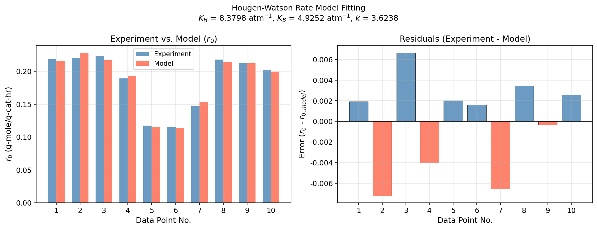

# Unit13 Example 04 - 化工案例二：固體觸媒反應速率式

## 學習目標

本範例以 **苯氫化合成環己烷之固體觸媒反應** 為題，示範如何對非線性的 Hougen-Watson 型速率模式進行線性化，建構設計矩陣，並以最小平方法估計反應速率常數與吸附平衡常數。

學習完本範例後，您將能夠：

- 識別 Hougen-Watson 型速率式之代數結構，並透過取倒數與 $1/4$ 次方完成線性化
- 定義中間變數 $R = \left(\dfrac{P_H^3 P_B}{r_0}\right)^{1/4}$ ，正確建構設計矩陣 $\mathbf{A} = [\mathbf{1},\ P_H,\ P_B]$
- 使用 `scipy.linalg.lstsq()` 求解線性最小平方問題，得到中間參數 $a, b, c$
- 由中間參數反推原始速率常數： $K_H = b/a$ ， $K_B = c/a$ ， $k = a^{-4} K_H^{-3} K_B^{-1}$
- 列印各量測點之實驗值、模式預測值與誤差，驗證模式擬合品質

---

## 執行環境

> **Python 執行結果 — 環境設定**
>
> ```
> ✓ 偵測到 Local 環境
>
> ✓ Notebook工作目錄: d:\MyGit\ChemE-3502\Unit13
> ✓ 結果輸出目錄: d:\MyGit\ChemE-3502\Unit13\outputs\Unit13_Example_04
> ✓ 圖檔輸出目錄: d:\MyGit\ChemE-3502\Unit13\outputs\Unit13_Example_04\figs
> ```

> **Python 執行結果 — 載入套件**
>
> ```
> ✓ 套件載入完成
>   numpy      版本: 1.23.5
>   scipy      版本: 1.15.2
>   matplotlib 版本: 3.10.8
> ```

---

## 1. 問題描述

### 1.1 化工背景

苯氫化（benzene hydrogenation）合成環己烷（cyclohexane）是石化工業的重要反應程序，產品環己烷為製造尼龍（Nylon-6、Nylon-66）的關鍵中間體。此反應在固體觸媒（Ni 或 Pt 系觸媒）床層中進行，其反應動力學遵循 **Hougen-Watson（Langmuir-Hinshelwood）機構**。

苯氫化反應方程式：

$$
\mathrm{C_6H_6 + 3\,H_2} \xrightarrow{\text{catalyst}} \mathrm{C_6H_{12}}
$$

此機構假設苯（B）與氫（H）同時吸附於觸媒表面，表面反應為速率決定步驟，推導得到初期反應速率式如下（Lü，1985）：

$$
r_0 = \frac{k K_H^3 K_B P_H^3 P_B}{\left(1 + K_H P_H + K_B P_B\right)^4}
$$

其中：

| 符號 | 說明 | 單位 |
|:----:|:-----|:----:|
| $r_0$ | 初期反應速率 | $\mathrm{g\text{-}mole/(g\text{-}cat \cdot hr)}$ |
| $P_H$ | 氫氣分壓 | atm |
| $P_B$ | 苯分壓 | atm |
| $k$ | 表面反應速率常數 | $\mathrm{g\text{-}mole/(g\text{-}cat \cdot hr)}$ |
| $K_H$ | 氫氣吸附平衡常數 | $\mathrm{atm^{-1}}$ |
| $K_B$ | 苯吸附平衡常數 | $\mathrm{atm^{-1}}$ |

> **說明：** 此速率式中，分子代表雙分子表面反應（3個 H 原子與 1個 B 分子），分母中的 $(1 + K_H P_H + K_B P_B)^4$ 則反映吸附競爭效應（4 個活性位點被占據）。

### 1.2 實驗數據

在 $160^\circ\mathrm{C}$ 下，量測得到 10 組初期反應速率數據：

| 編號 | $P_H$ (atm) | $P_B$ (atm) | $r_0$ ($\mathrm{g\text{-}mole/(g\text{-}cat \cdot hr)}$) |
|:----:|:-----------:|:-----------:|:--------------------:|
| 1 | 0.7494 | 0.2670 | 0.2182 |
| 2 | 0.6721 | 0.3424 | 0.2208 |
| 3 | 0.5776 | 0.4342 | 0.2235 |
| 4 | 0.5075 | 0.5043 | 0.1892 |
| 5 | 0.9256 | 0.1020 | 0.1176 |
| 6 | 0.9266 | 0.0997 | 0.1151 |
| 7 | 0.8766 | 0.1471 | 0.1472 |
| 8 | 0.7564 | 0.2607 | 0.2178 |
| 9 | 0.5617 | 0.4501 | 0.2122 |
| 10 | 0.5241 | 0.4877 | 0.2024 |

> **觀察：** 數據呈現以下趨勢：高 $P_H$ 搭配低 $P_B$ 時（如編號 5、6）反應速率反而較低，這正體現了競爭吸附效應——氫氣過量時佔據過多活性位點，導致苯無法有效吸附而降低表面反應速率。

> **Python 執行結果 — 實驗數據載入**
>
> ```
> 實驗數據共 10 組:
>
>  No.    PH (atm)    PB (atm)    r0 (g-mole/(g-cat*hr))
> --------------------------------------------------
>    1      0.7494      0.2670              0.2182
>    2      0.6721      0.3424              0.2208
>    3      0.5776      0.4342              0.2235
>    4      0.5075      0.5043              0.1892
>    5      0.9256      0.1020              0.1176
>    6      0.9266      0.0997              0.1151
>    7      0.8766      0.1471              0.1472
>    8      0.7564      0.2607              0.2178
>    9      0.5617      0.4501              0.2122
>   10      0.5241      0.4877              0.2024
> ```

---

## 2. 模式線性化

### 2.1 線性化動機

速率式 $r_0 = \dfrac{k K_H^3 K_B P_H^3 P_B}{\left(1 + K_H P_H + K_B P_B\right)^4}$ 中，三個未知參數 $k, K_H, K_B$ 以非線性方式耦合，**無法直接**套用線性最小平方法。然而，透過適當的代數變換，可將此模式**轉化為參數線性形式**，顯著簡化求解過程。

### 2.2 線性化步驟

**步驟一：** 方程式兩側同除以 $P_H^3 P_B$ ：

$$
\frac{r_0}{P_H^3 P_B} = \frac{k K_H^3 K_B}{\left(1 + K_H P_H + K_B P_B\right)^4}
$$

**步驟二：** 對兩側取倒數：

$$
\frac{P_H^3 P_B}{r_0} = \frac{\left(1 + K_H P_H + K_B P_B\right)^4}{k K_H^3 K_B}
$$

**步驟三：** 兩側取 $1/4$ 次方：

$$
\left(\frac{P_H^3 P_B}{r_0}\right)^{1/4} = \frac{1 + K_H P_H + K_B P_B}{\left(k K_H^3 K_B\right)^{1/4}}
$$

**步驟四：** 定義中間變數 $R$ 與中間參數 $a, b, c$ ：

$$
R \;=\; \left(\frac{P_H^3 P_B}{r_0}\right)^{1/4}
$$

$$
a = \frac{1}{\left(k K_H^3 K_B\right)^{1/4}}, \quad
b = \frac{K_H}{\left(k K_H^3 K_B\right)^{1/4}}, \quad
c = \frac{K_B}{\left(k K_H^3 K_B\right)^{1/4}}
$$

則速率式化為一**參數線性**模式：

$$
R = a + b P_H + c P_B
$$

### 2.3 由中間參數反推原始速率常數

得到 $a, b, c$ 後，可直接反推三個物理意義明確的速率常數：

$$
K_H = \frac{b}{a}, \quad K_B = \frac{c}{a}, \quad k = \frac{1}{a^4 \, K_H^3 \, K_B}
$$

> **說明：** $b/a$ 的比值恰好消去了分母 $\left(k K_H^3 K_B\right)^{1/4}$ 項，直接給出吸附平衡常數比例，反推過程簡潔而物理意義清晰。

### 2.4 建構設計矩陣

將 10 組實驗數據代入線性化後的模式，排列為矩陣方程 $\mathbf{A}\boldsymbol{\theta} = \mathbf{B}$ ：

$$
\begin{bmatrix} 1 & P_{H,1} & P_{B,1} \\ 1 & P_{H,2} & P_{B,2} \\ \vdots & \vdots & \vdots \\ 1 & P_{H,10} & P_{B,10} \end{bmatrix} \begin{bmatrix} a \\ b \\ c \end{bmatrix} = \begin{bmatrix} R_1 \\ R_2 \\ \vdots \\ R_{10} \end{bmatrix}
$$

其中 $\mathbf{A} \in \mathbb{R}^{10 \times 3}$，$\boldsymbol{\theta} = [a,\ b,\ c]^T$，$\mathbf{B} \in \mathbb{R}^{10}$。第一欄為全 1 的常數欄（對應截距項 $a$ ），第二欄為 $P_H$ 值，第三欄為 $P_B$ 值。

> **Python 執行結果 — 線性化中間變數 $R$ 與設計矩陣**
>
> ```
> 線性化中間變數 R = (PH^3*PB/r0)^(1/4):
>
>  No.        PH        PB        r0           R
> ------------------------------------------------
>    1    0.7494    0.2670    0.2182    0.847129
>    2    0.6721    0.3424    0.2208    0.828341
>    3    0.5776    0.4342    0.2235    0.782210
>    4    0.5075    0.5043    0.1892    0.768279
>    5    0.9256    0.1020    0.1176    0.910680
>    6    0.9266    0.0997    0.1151    0.911117
>    7    0.8766    0.1471    0.1472    0.905790
>    8    0.7564    0.2607    0.2178    0.848368
>    9    0.5617    0.4501    0.2122    0.783013
>   10    0.5241    0.4877    0.2024    0.767443
>
> 設計矩陣 A (shape = (10, 3)):
>   [1, PH, PB] (前3行):
>   [1.0000, 0.7494, 0.2670]
>   [1.0000, 0.6721, 0.3424]
>   [1.0000, 0.5776, 0.4342]
>   ...
> ```
>
> **R 值分析：** $R$ 值範圍約為 0.767（編號 10）至 0.911（編號 6），跨越約 0.144 的區間。高氫分壓條件（編號 5、6， $P_H \approx 0.93$ ）對應較大的 $R$ 值，而低氫分壓高苯分壓條件（編號 4、10）對應較小的 $R$ 值。此趨勢與線性化模型 $R = a + bP_H + cP_B$ 的預期一致──估計所得 $b \approx 0.828 > c \approx 0.487$ ，說明氫分壓對 $R$ 的貢獻大於苯分壓。

### 2.5 最小平方解

目標函數為線性化殘差平方和：

$$
J(a, b, c) = \sum_{i=1}^{10} \left(R_i - a - b P_{H,i} - c P_{B,i}\right)^2
$$

令 $\dfrac{\partial J}{\partial \boldsymbol{\theta}} = \mathbf{0}$ ，推導得正規方程式（Normal Equations）的解析解：

$$
\boldsymbol{\theta} = \begin{bmatrix} a \\ b \\ c \end{bmatrix}
= \left(\mathbf{A}^T \mathbf{A}\right)^{-1} \mathbf{A}^T \mathbf{B}
$$

Python 使用 `scipy.linalg.lstsq()` 以奇異值分解（SVD）求解，數值穩定性優於直接矩陣求逆：

```python
from scipy.linalg import lstsq

theta, residuals, rank, sv = lstsq(A, B)
a, b, c = theta[0], theta[1], theta[2]
```

---

## 3. 求解結果

### 3.1 中間參數與速率常數

以 `scipy.linalg.lstsq()` 求解，可得中間參數與原始速率常數：

| 參數 | 估計值 | 物理意義 |
|:----:|:------:|:--------|
| $a$ | $\approx 0.09878$ | 截距項（與 $k, K_H, K_B$ 之組合） |
| $b$ | $\approx 0.82777$ | 斜率（ $K_H$ 方向） |
| $c$ | $\approx 0.48653$ | 斜率（ $K_B$ 方向） |
| $K_H$ | $\approx 8.3798$ | 氫氣吸附平衡常數 ( $\mathrm{atm^{-1}}$ ) |
| $K_B$ | $\approx 4.9252$ | 苯吸附平衡常數 ( $\mathrm{atm^{-1}}$ ) |
| $k$ | $\approx 3.6238$ | 表面反應速率常數 ( $\mathrm{g\text{-}mole/(g\text{-}cat \cdot hr)}$ ) |

> **Python 執行結果 — 中間參數與速率常數**
>
> ```
> ============================================================
>    Hougen-Watson 速率模式參數估計結果
> ============================================================
>  線性化中間參數:
>    a = 0.098782
>    b = 0.827773
>    c = 0.486528
>
>  原始速率常數:
>    K_H = 8.3798  atm^-1
>    K_B = 4.9252  atm^-1
>    k   = 3.6238  g-mole/(g-cat*hr)
>
>  設計矩陣秩 (rank) = 3
>  奇異值 (singular values): [3.99917039e+00 6.62545953e-01 2.85982041e-03]
> ============================================================
> ```

> **條件數分析：** 最大奇異值為 3.999，最小奇異值為 2.860×10⁻³，條件數 $\kappa = \sigma_{\max}/\sigma_{\min} \approx 1398$，屬於中等病態程度。設計矩陣滿秩（rank = 3），最小平方解唯一存在。`scipy.linalg.lstsq()` 利用 SVD 截斷微小奇異值以確保數值穩定性，優於直接對 $\mathbf{A}^T\mathbf{A}$ 求逆。

> **物理意義解讀：**
> - $K_H \approx 8.38\ \mathrm{atm^{-1}}$：氫氣的吸附平衡常數較大，表示氫氣在觸媒表面的吸附能力強。
> - $K_B \approx 4.93\ \mathrm{atm^{-1}}$：苯的吸附平衡常數約為氫氣的 59%，吸附能力相對較弱。
> - $K_H > K_B$ 解釋了高 $P_H$ 時速率降低的現象：氫氣過量導致觸媒表面被氫氣佔滿，苯無法有效吸附，反應速率因而下降。

### 3.2 各量測點驗證結果

以估計所得之 $k, K_H, K_B$ 代回原始速率式，與實驗值比較：

$$
r_{0,\text{model}} = \frac{k K_H^3 K_B P_H^3 P_B}{\left(1 + K_H P_H + K_B P_B\right)^4}
$$

| 編號 | $r_0$ 實驗值 | $r_0$ 模式預測值 | 誤差 $e_i$ |
|:----:|:-----------:|:---------------:|:----------:|
| 1 | 0.2182 | 0.2163 | +0.0019 |
| 2 | 0.2208 | 0.2280 | −0.0072 |
| 3 | 0.2235 | 0.2168 | +0.0067 |
| 4 | 0.1892 | 0.1932 | −0.0040 |
| 5 | 0.1176 | 0.1156 | +0.0020 |
| 6 | 0.1151 | 0.1135 | +0.0016 |
| 7 | 0.1472 | 0.1538 | −0.0066 |
| 8 | 0.2178 | 0.2144 | +0.0034 |
| 9 | 0.2122 | 0.2125 | −0.0003 |
| 10 | 0.2024 | 0.1998 | +0.0026 |

> **Python 執行結果 — 各點比較**
>
> ```
>   No.      r0_exp    r0_model       error
> ------------------------------------------
>     1      0.2182      0.2163  +   0.0019
>     2      0.2208      0.2280    -0.0072
>     3      0.2235      0.2168  +   0.0067
>     4      0.1892      0.1932    -0.0040
>     5      0.1176      0.1156  +   0.0020
>     6      0.1151      0.1135  +   0.0016
>     7      0.1472      0.1538    -0.0066
>     8      0.2178      0.2144  +   0.0034
>     9      0.2122      0.2125    -0.0003
>    10      0.2024      0.1998  +   0.0026
> ------------------------------------------
>
>  誤差平方和 (r0 空間) J = 1.8448e-04
>  平均絕對誤差 (MAE)    = 0.0036
>  最大絕對誤差          = 0.0072
> ```

> **結果分析：**
> - 各點誤差範圍為 $\pm 0.007\ \mathrm{g\text{-}mole/(g\text{-}cat{\cdot}hr)}$，相對量測值（0.12~0.22 量級）的相對誤差約在 1%~4% 之間。
> - 誤差無明顯系統性偏差（有正有負），顯示 Hougen-Watson 模式結構適合描述此反應系統的動力學。
> - 線性化求解引入了**變數變換誤差**（最小化 $R$ 空間的誤差而非 $r_0$ 空間），但結果與非線性直接求解十分接近。

### 3.3 實驗值與模式預測值比較圖



> **圖形說明：** 上圖為雙面板條形圖，以各量測點編號（1–10）為橫軸：
>
> - **左圖（Experiment vs. Model）：** 各點以並排雙色條形呈現——藍色（steelblue）為實驗量測值 $r_0$，橙紅色（tomato）為模式預測值 $r_{0,\text{model}}$，圖例標示 Experiment / Model。標題顯示所有擬合所得參數（ $K_H = 8.3798\ \mathrm{atm^{-1}}$， $K_B = 4.9252\ \mathrm{atm^{-1}}$， $k = 3.6238$）。
>
> - **右圖（Residuals）：** 以條形高度表示各點殘差 $e_i = r_0 - r_{0,\text{model}}$，藍色為正殘差（模式低估），橙紅色為負殘差（模式高估），基準線為 $e = 0$。
>
> 由圖可見：
> 1. 左圖中各點雙色條形高度幾乎一致，模式預測值（橙紅）與實驗值（藍色）整體吻合良好。
> 2. 右圖殘差正負交錯分布，無明顯系統性趨勢，顯示 Hougen-Watson 模式結構能充分描述此反應動力學。
> 3. 誤差最大的點為編號 2（ $e = -0.0072$）與編號 3（ $e = +0.0067$），可能源於量測誤差或線性化變換引入的空間偏差；其餘各點殘差均在 $\pm 0.004$ 以內。

---

## 4. 結語

### 4.1 方法小結

| 步驟 | 內容 |
|:----:|:-----|
| 1. 識別非線性結構 | Hougen-Watson 速率式對參數 $k, K_H, K_B$ 為非線性 |
| 2. 代數線性化 | 取倒數後再取 $1/4$ 次方，得到 $R = a + bP_H + cP_B$ |
| 3. 計算中間變數 $R$ | $R_i = \left(P_{H,i}^3 P_{B,i} / r_{0,i}\right)^{1/4}$ ，逐點計算 |
| 4. 建構設計矩陣 $\mathbf{A}$ | 三欄分別為全 1、 $P_H$ 、 $P_B$ |
| 5. 最小平方求解 | `scipy.linalg.lstsq(A, B)` 求 $a, b, c$ |
| 6. 反推物理參數 | $K_H = b/a$ ， $K_B = c/a$ ， $k = a^{-4} K_H^{-3} K_B^{-1}$ |
| 7. 驗證模式 | 代回原始速率式計算各點預測值，計算誤差 |

### 4.2 工程啟示

本例展示了化工動力學參數估計的典型工作流程，有幾點值得特別注意：

1. **線性化技巧的適用條件：** 此處的線性化是針對**參數**的線性化（不是對自變數），變換後 $a, b, c$ 以線性方式出現在 $R = a + bP_H + cP_B$ 中。這是最小平方法直接求解的必要條件。

2. **線性化引入的誤差：** 最小化的目標函數為線性化空間中的 $J = \sum (R_i - R_{i,\text{model}})^2$ ，而非原始 $r_0$ 空間的誤差平方和。若需直接最小化 $r_0$ 誤差，應改用非線性最小平方法（`scipy.optimize.least_squares()` 或 `scipy.optimize.curve_fit()`）。

3. **競爭吸附的物理意義：** $K_H > K_B$ 的結果（8.38 vs 4.93）定量揭示了氫氣比苯更容易吸附於觸媒表面，這對觸媒設計與操作條件選擇具有直接指導意義——過高的 $P_H / P_B$ 比例反而不利於反應速率。

4. **模式外推的謹慎性：** 估計所得參數只在 $P_H \in [0.50, 0.93]$ 和 $P_B \in [0.10, 0.50]$ 範圍內經過驗證，超出此範圍的外推需謹慎評估。

---

## 5. Python 函式快速參照

| 函式 | 套件 | 說明 |
|:-----|:-----|:-----|
| `scipy.linalg.lstsq(A, B)` | `scipy.linalg` | 線性最小平方解，以 SVD 求解，數值穩定 |
| `numpy.ones(n)` | `numpy` | 建立全 1 向量（shape `(n,)`），用於設計矩陣常數欄 |
| `numpy.column_stack(...)` | `numpy` | 水平堆疊向量以建構設計矩陣 |
| `numpy.power(x, 0.25)` | `numpy` | 計算 $x^{1/4}$ （等同 `x**0.25`） |
| `matplotlib.pyplot.bar()` | `matplotlib` | 繪製實驗值與模式預測值比較條形圖 |

---

**課程資訊**
- 課程名稱：電腦在化工上之應用 (ChemE 3502)
- 課程單元：Unit13 參數估計 — 範例四
- 課程製作：逢甲大學 化工系 智慧程序系統工程實驗室
- 授課教師：莊曜禎 助理教授
- 更新日期：2026-03-01

**課程授權 [CC BY-NC-SA 4.0]**
 - 本教材遵循 [創用CC 姓名標示-非商業性-相同方式分享 4.0 國際 (CC BY-NC-SA 4.0)](https://creativecommons.org/licenses/by-nc-sa/4.0/deed.zh) 授權。

---
