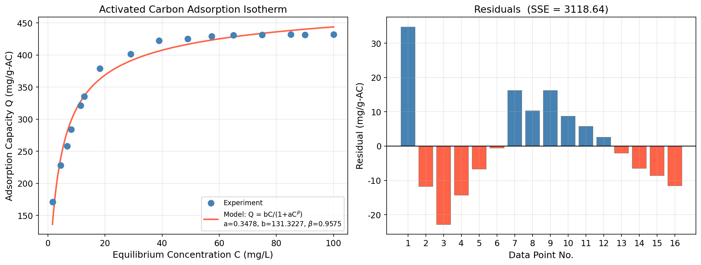

# Unit13 Example 05 - 化工案例三：活性碳吸附等溫模式

## 學習目標

本範例以 **活性碳對溶質之吸附平衡** 為題，示範如何針對含參數上下限的非線性模式，採用有界非線性最小平方法進行參數估計，並利用協方差矩陣計算各參數之 95% 置信區間。

學習完本範例後，您將能夠：

- 認識活性碳吸附等溫模式 $Q = \dfrac{bC}{1+aC^{\beta}}$ 的物理意義與適用範圍
- 設定參數上下限，使用 `scipy.optimize.least_squares(method='trf')` 進行有界非線性最小平方求解
- 以 `least_squares` 求解值作為起始猜測值，使用 `scipy.optimize.curve_fit()` 獲取協方差矩陣 `pcov`
- 由 `pcov` 推算各參數的標準差，並計算 95% 置信區間（ $t$ 分布，自由度 $= n - p$ ）
- 繪製吸附等溫線擬合結果圖與殘差分布圖，評估模式對數據的描述能力

---

## 執行環境

> **Python 執行結果 — 環境設定**
>
> ```
> ✓ 偵測到 Local 環境
>
> ✓ Notebook工作目錄: d:\MyGit\ChemE-3502\Unit13
> ✓ 結果輸出目錄: d:\MyGit\ChemE-3502\Unit13\outputs\Unit13_Example_05
> ✓ 圖檔輸出目錄: d:\MyGit\ChemE-3502\Unit13\outputs\Unit13_Example_05\figs
> ```

> **Python 執行結果 — 載入套件**
>
> ```
> ✓ 套件載入完成
>   numpy      版本: 1.23.5
>   scipy      版本: 1.15.2
>   matplotlib 版本: 3.10.8
> ```

---

## 1. 問題描述

### 1.1 化工背景

**活性碳（Activated Carbon）** 具有極高的比表面積（300–3000 m²/g），廣泛應用於水處理、空氣淨化、醫藥及食品工業中作為吸附劑。在水處理領域，活性碳可有效去除水溶液中的有機污染物（如酚類、染料、農藥）。為了設計吸附塔及預測吸附容量，需要建立可靠的吸附等溫模式（adsorption isotherm model）。

常用的吸附等溫模式包括：
- **Freundlich 吸附等溫式**：$Q = K C^{1/n}$（純經驗式）
- **Langmuir 吸附等溫式**：$Q = Q_{\max} K_L C / (1 + K_L C)$（單層吸附）
- **廣義型吸附等溫式**：$Q = bC / (1 + aC^{\beta})$（本例所用）

本例所採用的廣義型模式為：

$$
Q = \frac{bC}{1 + aC^{\beta}}
$$

其中：

| 符號 | 說明 | 單位 |
|:----:|:-----|:----:|
| $Q$ | 活性碳吸附量 | $\mathrm{mg/g\text{-}AC}$ |
| $C$ | 溶質水溶液平衡濃度 | $\mathrm{mg/L}$ |
| $a$ | 吸附競爭參數（影響等溫線彎折程度） | — |
| $b$ | 最大吸附容量相關參數 | $\mathrm{mg^{1-\beta} \cdot L^{\beta} / g\text{-}AC}$ |
| $\beta$ | 吸附非線性指數（ $\beta \to 1$ 趨近 Langmuir） | — |

> **說明：** 當 $\beta = 1$ 時，此模式退化為 Langmuir 等溫式 $Q = bC/(1+aC)$ ；當 $\beta \to 0$ 時，飽和吸附量趨近 $b/a$ 。

### 1.2 實驗數據

在某溫度下，量測得到 16 組活性碳吸附平衡數據（呂，1985）：

| 編號 | $C$ (mg/L) | $Q$ (mg/g-AC) | 編號 | $C$ (mg/L) | $Q$ (mg/g-AC) |
|:----:|:----------:|:-------------:|:----:|:----------:|:-------------:|
| 1 | 1.60 | 170.7 | 9 | 38.9 | 422.3 |
| 2 | 4.52 | 228.1 | 10 | 48.9 | 425.3 |
| 3 | 6.80 | 258.0 | 11 | 57.3 | 429.0 |
| 4 | 8.16 | 283.7 | 12 | 65.0 | 430.9 |
| 5 | 11.5 | 321.3 | 13 | 75.0 | 431.6 |
| 6 | 12.7 | 335.4 | 14 | 85.0 | 431.7 |
| 7 | 18.2 | 378.6 | 15 | 90.0 | 431.6 |
| 8 | 29.0 | 401.3 | 16 | 100.0 | 432.1 |

> **觀察：** 數據呈現典型的 **飽和型等溫線（Type I Isotherm）** 特徵——低濃度時吸附量隨濃度快速增加，高濃度時（ $C > 40\ \mathrm{mg/L}$ ）吸附量趨於飽和，約在 430 mg/g-AC 附近。此行為符合 Langmuir 型吸附機制。

> **Python 執行結果 — 實驗數據載入**
>
> ```
> 實驗數據共 16 組:
>
>  No.      C (mg/L)     Q (mg/g-AC)
> ------------------------------------
>    1          1.60           170.7
>    2          4.52           228.1
>    3          6.80           258.0
>    4          8.16           283.7
>    5         11.50           321.3
>    6         12.70           335.4
>    7         18.20           378.6
>    8         29.00           401.3
>    9         38.90           422.3
>   10         48.90           425.3
>   11         57.30           429.0
>   12         65.00           430.9
>   13         75.00           431.6
>   14         85.00           431.7
>   15         90.00           431.6
>   16        100.00           432.1
> ```

---

## 2. 參數估計方法

### 2.1 問題設定

吸附等溫模式 $Q = bC/(1+aC^{\beta})$ 中，三個參數 $a, b, \beta$ 對模式輸出皆呈非線性，**無法**透過線性代數直接求解。此外，各參數具有物理意義上的有效範圍：

$$
0 \leq a \leq 1, \quad 100 \leq b \leq 200, \quad 0 \leq \beta \leq 1
$$

因此需採用 **有界非線性最小平方法** 求解以下最小化問題：

$$
\min_{a,\, b,\, \beta} \; J = \sum_{i=1}^{n} \left[ Q_i - \frac{b C_i}{1 + a C_i^{\beta}} \right]^2
$$

### 2.2 `scipy.optimize.least_squares` 有界求解策略

`scipy.optimize.least_squares` 直接最小化殘差向量 $\mathbf{e} = [e_1, e_2, \ldots, e_n]^T$ 的 L2 範數平方，其中 $e_i = Q_i - f(C_i, \mathbf{p})$ 。設定 `method='trf'`（Trust Region Reflective）支援上下限邊界約束：

```python
from scipy.optimize import least_squares

result = least_squares(
    residual_func,          # 殘差函數: 返回 e_i 向量
    p0,                     # 起始值 = [0.5, 150, 0.5]（各範圍中點）
    args=(C_data, Q_data),
    bounds=(p_lower, p_upper),  # ([0, 100, 0], [1, 200, 1])
    method='trf',
    ftol=1e-12, xtol=1e-12, gtol=1e-12,
)
```

`trf` 演算法在每次迭代中，透過反射策略（reflective step）將更新量投影回可行域，保證解始終滿足邊界約束。

### 2.3 `scipy.optimize.curve_fit` 與置信區間

`least_squares` 本身不直接提供協方差矩陣。為了計算置信區間，使用 `curve_fit` 配合相同參數上下限求解，以 `least_squares` 的結果為起始點，同樣採用 `method='trf'` ：

```python
from scipy.optimize import curve_fit

p_opt, pcov = curve_fit(
    adsorption_model,       # 模式函數: Q = b*C/(1+a*C^beta)
    C_data, Q_data,
    p0=result.x,            # 以 least_squares 結果為起始值
    bounds=(p_lower, p_upper),
    method='trf',
)
```

`curve_fit` 回傳的 `pcov` 為參數估計值的 **協方差矩陣**，對角元素為各參數的方差估計值 $\sigma_i^2$ ，進而推算 95% 置信區間：

$$
\sigma_i = \sqrt{\mathrm{pcov}_{ii}}
$$

$$
\mathrm{CI}_{95\%} = \hat{p}_i \pm t_{0.975,\, \nu} \cdot \sigma_i, \quad \nu = n - p
$$

其中 $n = 16$ 為數據點數， $p = 3$ 為參數個數，自由度 $\nu = 13$ ， $t_{0.975, 13} \approx 2.1604$ 。

---

## 3. 求解結果

### 3.1 有界最小平方估計值

以起始值 $p_0 = [0.5, 150, 0.5]$（各參數範圍中點）進行求解：

> **Python 執行結果 — least_squares 有界估計**
>
> ```
> 參數起始猜測值 (各範圍中點):
>   a    = 0.5000  (範圍: 0.0 ~ 1.0)
>   b    = 150.0000  (範圍: 100.0 ~ 200.0)
>   beta = 0.5000  (範圍: 0.0 ~ 1.0)
>
> ============================================================
>    有界非線性最小平方參數估計結果 (least_squares)
> ============================================================
>   a    = 0.3478
>   b    = 131.3227
>   beta = 0.9575
>
>   目標函數值 J (SSE) = 3118.6391
>   求解狀態 (success) : True
>   求解訊息           : `ftol` termination condition is satisfied.
> ============================================================
> ```

### 3.2 95% 置信區間

以 `least_squares` 參數估計值為起始點，透過 `curve_fit` 獲取協方差矩陣並計算 95% 置信區間：

> **Python 執行結果 — curve_fit 置信區間**
>
> ```
> =================================================================
>    curve_fit 參數估計值與 95% 置信區間
> =================================================================
>   自由度 (dof) = 13,  t_0.975 = 2.1604
>
>       參數           估計值         標準差     95% CI 下限     95% CI 上限
> -----------------------------------------------------------------
>        a        0.3478      0.1095        0.1111        0.5844
>        b      131.3227     24.4725       78.4530      184.1924
>     beta        0.9575      0.0308        0.8909        1.0241
> =================================================================
>
>   目標函數值 J (SSE)  = 3118.6391
>   平均絕對誤差 (MAE)  = 11.2108 mg/g-活性碳
>   最大絕對誤差        = 34.7400 mg/g-活性碳
> ```

**結果與 MATLAB 比較：** 原始 MATLAB（lsqcurvefit + nlinfit + nlparci）的結果為：
- $a = 0.3478$ ，95% CI: [0.1111, 0.5844]
- $b = 131.3249$ ，95% CI: [78.4504, 184.1993]
- $\beta = 0.9575$ ，95% CI: [0.8909, 1.0241]

Python 與 MATLAB 結果高度一致，微小差異來自兩者使用不同內部演算法與舍入精度。

### 3.3 各量測點驗證結果

以估計所得參數代回模式，逐點計算預測值與誤差：

> **Python 執行結果 — 各點比較**
>
> ```
> 各量測點驗證結果:
>
>  No.    C (mg/L)       Q_exp     Q_model       error
> ----------------------------------------------------
>    1        1.60       170.7    135.9600  +  34.7400
>    2        4.52       228.1    239.8929   -11.7929
>    3        6.80       258.0    280.8242   -22.8242
>    4        8.16       283.7    298.0201   -14.3201
>    5       11.50       321.3    327.9327    -6.6327
>    6       12.70       335.4    335.9314    -0.5314
>    7       18.20       378.6    362.3778  +  16.2222
>    8       29.00       401.3    390.9507  +  10.3493
>    9       38.90       422.3    406.0768  +  16.2232
>   10       48.90       425.3    416.5560  +   8.7440
>   11       57.30       429.0    423.2364  +   5.7636
>   12       65.00       430.9    428.2483  +   2.6517
>   13       75.00       431.6    433.6448    -2.0448
>   14       85.00       431.7    438.1348    -6.4348
>   15       90.00       431.6    440.1198    -8.5198
>   16      100.00       432.1    443.6791   -11.5791
> ----------------------------------------------------
>
>   誤差平方和 (SSE)   J = 3118.6391
>   平均絕對誤差 (MAE)   = 11.2108
>   最大絕對誤差         = 34.7400
> ```

> **誤差分析：**
> - 最大誤差出現在編號 1（ $C = 1.60\ \mathrm{mg/L}$ ，誤差 = +34.74）：模型偏低估計第一點，主因是數據在極低濃度下呈現異常高的吸附量（ $Q = 170.7\ \mathrm{mg/g}$ ），高出模式曲線的預測，此可能來自量測誤差或特殊吸附機制（如孔道填充）。
> - 在中等濃度範圍（ $C = 6$–$20\ \mathrm{mg/L}$ ），模式呈系統性偏高（編號 3~5 負殘差），顯示模式結構在此區段略有不足。
> - 高濃度段（ $C > 40\ \mathrm{mg/L}$ ）模式趨勢與數據吻合，但飽和值 $Q \approx 432\ \mathrm{mg/g}$ 附近模式略有高估，因為模式的 $Q_{\max}$ 不存在硬上限。
> - 整體 MAE = 11.21 mg/g（約比 $Q$ 平均值的 2.9%），在 16 組實驗數據中屬合理擬合精度。

---

## 4. 吸附等溫線擬合結果圖

> **Python 執行結果 — 吸附等溫線擬合圖**
>
> ```
> ✓ 圖檔已儲存: d:\MyGit\ChemE-3502\Unit13\outputs\Unit13_Example_05\figs\adsorption_isotherm_fitting.png
> ```



> **圖形說明：** 上圖為雙面板圖：
>
> - **左圖（Activated Carbon Adsorption Isotherm）：** 以藍色圓點標示 16 組實驗量測值 $(C_i, Q_i)$ ，橙紅色曲線為以估計參數 $a = 0.3478$，$b = 131.3227$，$\beta = 0.9575$ 代入模式 $Q = bC/(1+aC^{\beta})$ 計算的擬合曲線。圖例顯示模式參數。
>
> - **右圖（Residuals）：** 以藍色（正殘差，模式低估）與橙紅色（負殘差，模式高估）條形顯示各點殘差 $e_i = Q_{\exp} - Q_{\text{model}}$ ，基準線為 $e = 0$ ，標題標示 SSE。
>
> 由圖可觀察：
> 1. 左圖中擬合曲線整體呈現飽和型等溫線形狀，在高濃度端（ $> 40\ \mathrm{mg/L}$ ）與數據點高度吻合。
> 2. 右圖殘差在低濃度端（編號 1）正偏差最大，中段（編號 3–5）負偏差為主，高濃度端（編號 14–16）再次轉為負偏差，呈現有規律的 S 型趨勢，說明模式結構仍有改善空間。
> 3. 儘管存在系統性殘差模式，此廣義吸附等溫式仍能捕捉等溫線的主要特徵（飽和趨勢），在工程精度上是可接受的描述。

---

## 5. 結語

### 5.1 方法小結

| 步驟 | 內容 |
|:----:|:-----|
| 1. 前置作業 | 確認模式結構（非線性，三參數）及各參數的物理有效範圍 |
| 2. 有界初步求解 | `scipy.optimize.least_squares(method='trf', bounds=...)` 以 TRF 演算法直接搜尋可行域 |
| 3. 提升起始點品質 | 以 `least_squares` 所得參數作為 `curve_fit` 的起始值，提升收斂穩定性與 CI 可靠性 |
| 4. 協方差矩陣提取 | `pcov = curve_fit(...)` 返回，對角元素 = 各參數方差估計 |
| 5. 置信區間計算 | $\hat{p}_i \pm t_{0.975, n-p} \cdot \sqrt{\text{pcov}_{ii}}$ ，自由度 $= n - p = 13$ |
| 6. 驗證與視覺化 | 各點預測誤差比較 + 吸附等溫線擬合圖 + 殘差分布圖 |

### 5.2 工程啟示

1. **有界求解的必要性：** 不設邊界時，最小化演算法可能找到物理上無意義的參數（如 $a < 0$ 或 $\beta > 1$ ），導致模式在外推時失真。TRF 演算法透過邊界反射保持解的物理合理性。

2. **兩步策略（least_squares → curve_fit）：** 直接以中點 $p_0$ 作為 `curve_fit` 起始值時，可能因局部極值導致協方差矩陣不可靠；先以 `least_squares` 充分收斂後，再用結果作為 `curve_fit` 起始點，可顯著改善 CI 的準確度。

3. **置信區間的物理解讀：**
   - $a$ 的 95% CI 為 [0.1111, 0.5844]，區間較寬（±0.23 相對估計值 0.35），說明 $a$ 的可辨識性較低，其估計受數據量測誤差影響較大。
   - $b$ 的 95% CI 為 [78.45, 184.19]，跨度極大（±53 相對估計值 131），顯示吸附容量參數 $b$ 與 $\beta$ 之間存在強參數相關性，難以獨立識別精確值。
   - $\beta$ 的 95% CI 為 [0.8909, 1.0241]，區間窄且接近 1，暗示此吸附系統的等溫線行為與 Langmuir 模式（ $\beta = 1$ ）十分相近。

4. **模式改進方向：** 殘差呈現 S 型系統性偏差，提示可嘗試 Langmuir（ $\beta = 1$ 固定）或 Freundlich 模式作為替代，或蒐集更多低濃度區數據以改善第一點的擬合。

---

## 6. Python 函式快速參照

| 函式 | 套件 | 說明 |
|:-----|:-----|:-----|
| `scipy.optimize.least_squares(fun, p0, bounds=...)` | `scipy.optimize` | 有界非線性最小平方求解，`method='trf'` 支援反射型邊界約束（Trust Region Reflective） |
| `scipy.optimize.curve_fit(f, xdata, ydata, bounds=...)` | `scipy.optimize` | 非線性曲線擬合，返回 `(p_opt, pcov)` 包含協方差矩陣 |
| `numpy.sqrt(numpy.diag(pcov))` | `numpy` | 由方差矩陣對角線提取各參數標準差 |
| `scipy.stats.t.ppf(0.975, df=dof)` | `scipy.stats` | 計算 $t$ 分布雙尾 95% 臨界值 |
| `numpy.linspace(start, stop, num)` | `numpy` | 生成等間距點序列，用於繪製平滑擬合曲線 |

---

**課程資訊**
- 課程名稱：電腦在化工上之應用 (ChemE 3502)
- 課程單元：Unit13 參數估計 — 範例五
- 課程製作：逢甲大學 化工系 智慧程序系統工程實驗室
- 授課教師：莊曜禎 助理教授
- 更新日期：2026-03-01

**課程授權 [CC BY-NC-SA 4.0]**
 - 本教材遵循 [創用CC 姓名標示-非商業性-相同方式分享 4.0 國際 (CC BY-NC-SA 4.0)](https://creativecommons.org/licenses/by-nc-sa/4.0/deed.zh) 授權。

---
