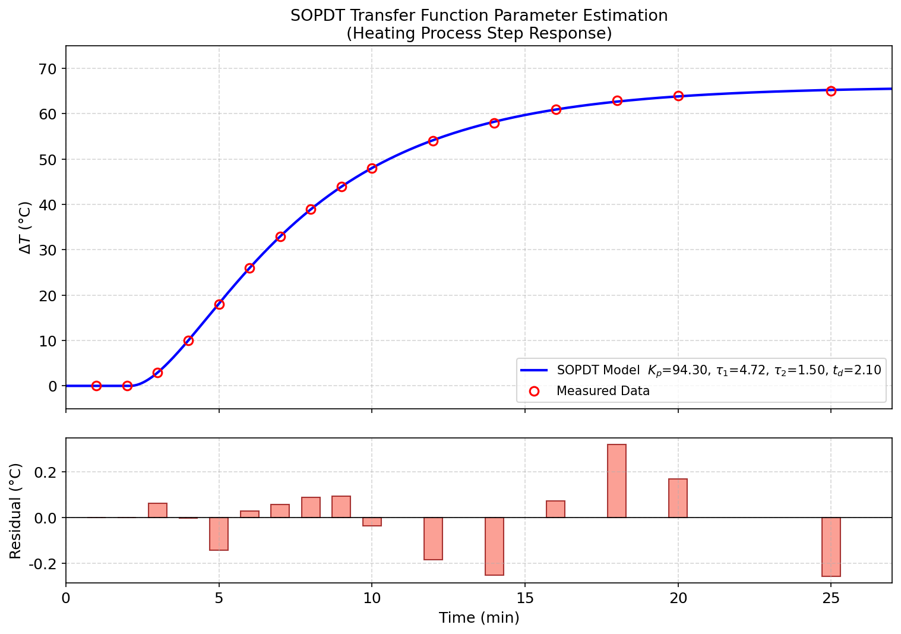

# Unit13 Example 06 - 化工案例四：加熱程序動態響應之轉移函數參數估計

## 學習目標

本範例以 **加熱程序之動態階梯響應** 為題，示範如何對含時間延遲（dead time）的 **二階轉移函數**進行參數估計，並計算各參數之 95% 置信區間。

學習完本範例後，您將能夠：

- 認識二階加時間延遲（Second-Order Plus Dead Time, SOPDT）轉移函數 $G(s) = \dfrac{K_p e^{-t_d s}}{(\tau_1 s + 1)(\tau_2 s + 1)}$ 的物理意義
- 由傳遞函數對階梯輸入進行反拉普拉斯轉換，推導出時域解析式 $T(t)$
- 使用 `scipy.optimize.curve_fit()` 以非線性最小平方法估計四個轉移函數參數 $K_p, \tau_1, \tau_2, t_d$
- 由 `curve_fit` 返回之協方差矩陣 `pcov` 推算各參數的標準差，並計算 95% 置信區間
- 繪製實驗響應曲線與模式預測值之比較圖，驗證擬合品質

---

## 執行環境

> **Python 執行結果 — 環境設定**
>
> ```
> ✓ 偵測到 Local 環境
>
> ✓ Notebook工作目錄: d:\MyGit\ChemE-3502\Unit13
> ✓ 結果輸出目錄: d:\MyGit\ChemE-3502\Unit13\outputs\Unit13_Example_06
> ✓ 圖檔輸出目錄: d:\MyGit\ChemE-3502\Unit13\outputs\Unit13_Example_06\figs
> ```

> **Python 執行結果 — 載入套件**
>
> ```
> NumPy   : 1.23.5
> SciPy   : 1.15.2
> Matplotlib: 3.10.8
> ```

---

## 1. 問題描述

### 1.1 化工背景

在化工製程中，**程序識別（Process Identification）** 是控制系統設計的關鍵前置步驟。為了讓控制器（如 PID）能有效調節操作變數（如進料流量）以達成目標輸出（如出口溫度），工程師必須先建立精準的程序動態模式。

最常用的動態模式型式之一為 **二階加時間延遲（Second-Order Plus Dead Time, SOPDT）轉移函數**：

$$
G(s) = \frac{T(s)}{Q(s)} = \frac{K_p \, e^{-t_d s}}{(\tau_1 s + 1)(\tau_2 s + 1)}
$$

其中各符號之意義如下：

| 符號 | 說明 | 單位 |
|:----:|:-----|:----:|
| $G(s)$ | 程序轉移函數（以 Laplace 域表示） | — |
| $Q(s)$ | 入口加熱流體流量偏差之 Laplace 轉換 | $\mathrm{m}^3/\mathrm{min}$ |
| $T(s)$ | 出口溫度偏差之 Laplace 轉換 | ${}^{\circ}\mathrm{C}$ |
| $K_p$ | 程序增益（Process Gain） | ${}^{\circ}\mathrm{C} \cdot \mathrm{min}/\mathrm{m}^3$ |
| $\tau_1$ | 第一時間常數（Dominant Time Constant） | $\mathrm{min}$ |
| $\tau_2$ | 第二時間常數（Secondary Time Constant） | $\mathrm{min}$ |
| $t_d$ | 純時間延遲（Dead Time） | $\mathrm{min}$ |

> **說明：** SOPDT 模式廣泛用於描述含有明顯慣性（inertia）與傳輸延遲的熱流程序，如殼管式換熱器、加熱槽及多段蒸發器等。一般而言，當系統含有串聯兩個容量（如槽體體積與管道體積），或高階系統以二階近似時，即出現此型式。

### 1.2 轉移函數模式：時域解析式推導

#### 1.2.1 拉普拉斯域關係式

對加熱流體施以 **階梯（Step）** 輸入，流量偏差為 $\Delta Q = 0.7\ \mathrm{m}^3/\mathrm{min}$，其 Laplace 轉換為：

$$
Q(s) = \frac{\Delta Q}{s}
$$

代入轉移函數，得出口溫度偏差的 Laplace 轉換為：

$$
T(s) = \frac{K_p \, e^{-t_d s}}{(\tau_1 s + 1)(\tau_2 s + 1)} \cdot \frac{\Delta Q}{s}
$$

令 $K = K_p \cdot \Delta Q$（稱為有效增益），則：

$$
T(s) = \frac{K \, e^{-t_d s}}{s \, (\tau_1 s + 1)(\tau_2 s + 1)}
$$

#### 1.2.2 反拉普拉斯轉換：時域解析式

對上式進行部分分數展開後，再利用時移性質（time-shift property）：$\mathcal{L}^{-1}\{e^{-t_d s} F(s)\} = f(t - t_d) \cdot u(t - t_d)$，可得時域解：

$$
T(t) = \begin{cases}
0, & t \leq t_d \\[6pt]
K \left(1 - \dfrac{\tau_1}{\tau_1 - \tau_2} e^{-(t - t_d)/\tau_1} + \dfrac{\tau_2}{\tau_1 - \tau_2} e^{-(t - t_d)/\tau_2}\right), & t > t_d
\end{cases}
$$

其中 $K = K_p \cdot \Delta Q$ ，且假設 $\tau_1 \neq \tau_2$ 。

> **物理意義：**
> - $t \leq t_d$ 時，系統尚未感受到輸入擾動（傳輸延遲中），輸出保持 0
> - $t \to \infty$ 時，兩指數項趨近 0，輸出逼近穩態值 $T_{\infty} = K = K_p \cdot \Delta Q$
> - $\tau_1$ 愈大，響應達到穩態所需時間愈長；$\tau_2$ 的作用為修正初期響應曲率

#### 1.2.3 待估計參數

本問題共有四個待估計參數，以向量表示為：

$$
\mathbf{p} = [K_p, \tau_1, \tau_2, t_d]^T
$$

目標函數為最小化各量測點的預測誤差平方和：

$$
\min_{\mathbf{p}} J = \sum_{i=1}^{n} \left[ T_i - T(t_i, \mathbf{p}) \right]^2
$$

### 1.3 實驗數據

對加熱程序施以 $\Delta Q = 0.7\ \mathrm{m}^3/\mathrm{min}$ 之階梯輸入，量測出口溫度隨時間之響應如下（共 16 筆量測數據）：

| 時間 $t$ (min) | 1 | 2 | 3 | 4 | 5 | 6 | 7 | 8 |
|:--------------:|:---:|:---:|:---:|:---:|:---:|:---:|:---:|:---:|
| $\Delta T$ (°C) | 0 | 0 | 3 | 10 | 18 | 26 | 33 | 39 |

| 時間 $t$ (min) | 9 | 10 | 12 | 14 | 16 | 18 | 20 | 25 |
|:--------------:|:---:|:---:|:---:|:---:|:---:|:---:|:---:|:---:|
| $\Delta T$ (°C) | 44 | 48 | 54 | 58 | 61 | 63 | 64 | 65 |

共 16 組實驗數據對 $(t_i,\, \Delta T_i)$，$i = 1, 2, \ldots, 16$ 。

> **觀察：**
> - $t = 1 \sim 2\ \mathrm{min}$ 時，溫度響應仍為 0，提示存在約 2 min 之時間延遲 ( $t_d \approx 2.1\ \mathrm{min}$ )
> - $t = 20 \sim 25\ \mathrm{min}$ 時，溫度趨近穩態約 65 °C，推算 $K = K_p \cdot \Delta Q \approx 65$，即 $K_p \approx 93\ {}^{\circ}\mathrm{C} \cdot \mathrm{min}/\mathrm{m}^3$
> - 響應形狀呈 S 形（有拐點），符合二階系統特徵，支持 SOPDT 模式選擇

> **Python 執行結果 — 實驗數據載入**
>
> ```
>      時間 t (min)       溫度偏差 ΔT (°C)
> ------------------------------------
>               1               0.00
>               2               0.00
>               3               3.00
>               4              10.00
>               5              18.00
>               6              26.00
>               7              33.00
>               8              39.00
>               9              44.00
>              10              48.00
>              12              54.00
>              14              58.00
>              16              61.00
>              18              63.00
>              20              64.00
>              25              65.00
>
> 數據點數 n = 16
> ```

---

## 2. 參數估計方法

### 2.1 時域模式函數定義

將第 1.2.2 節所推導的時域解析式直接以 Python 函式實作，作為 `curve_fit` 的模式函數：

```python
import numpy as np

dQ = 0.7  # 步階輸入幅度 (m³/min)

def sopdt_model(t, Kp, tau1, tau2, td):
    """
    SOPDT 步階響應（時域解析式）
    ΔT(t) = Kp * dQ * [1 - (τ₁·exp(-(t-td)/τ₁) - τ₂·exp(-(t-td)/τ₂)) / (τ₁-τ₂)] · u(t-td)
    """
    tau_diff = tau1 - tau2
    t_shift  = t - td                           # 時間平移
    step = np.where(t_shift < 0, 0.0,
                    Kp * dQ * (1.0 - (tau1 * np.exp(-t_shift / tau1)
                                      - tau2 * np.exp(-t_shift / tau2))
                               / tau_diff))
    return step
```

> **Python 執行結果 — 模式函數自檢**（初始猜值 Kp=90, τ₁=5, τ₂=2, td=1.5）
>
> ```
>      t     ΔT_model
>    0.0       0.0000
>    1.0       0.0000
>    5.0      18.1570
>   10.0      44.4173
>   25.0      62.0453
> ```

> **注意事項：**
> - 時移 $t - t_d$ 只在 $t > t_d$ 時有意義，其餘時間令 $T = 0$
> - 使用 `np.where` 可向量化計算所有時間點，避免迴圈
> - 分母 `tau_diff = tau1 - tau2`；當 $\tau_1 = \tau_2$ 時需使用重根公式（本例 $\tau_1 \neq \tau_2$，無此問題）

### 2.2 `scipy.optimize.curve_fit` 求解策略

本問題的四個參數均具有明確的物理意義，可依此設定初始猜測值與邊界：

```python
from scipy.optimize import curve_fit

# 參數起始猜測值 [Kp, τ₁, τ₂, td]
# 由穩態推算: T_inf ≈ 65 → Kp ≈ 65/0.7 ≈ 93; 由響應形狀估計 tau1, tau2, td
p0 = [90.0, 5.0, 2.0, 1.5]

bounds = ([0, 0.1, 0.1, 0],      # 下界
          [200, 30, 30, 10])     # 上界

popt, pcov = curve_fit(
    sopdt_model,
    t_data, T_data,
    p0=p0,
    bounds=bounds,
    method='trf',        # Trust Region Reflective，支援邊界約束
    maxfev=10000,
)
```

> **初始猜測值設定策略：**
> 1. **$K_p$ 初估**：穩態時 $\Delta T_\infty = K_p \cdot \Delta Q$，由數據末端 $\Delta T \approx 65$ 推算 $K_p \approx 65 / 0.7 \approx 92.9$，取 $K_p^{(0)} = 90$
> 2. **$t_d$ 初估**：觀察 $t = 1 \sim 2\ \mathrm{min}$ 時輸出仍為 0，取 $t_d^{(0)} = 1.5\ \mathrm{min}$
> 3. **$\tau_1, \tau_2$ 初估**：由響應 S 型形狀估計，取 $\tau_1^{(0)} = 5,\ \tau_2^{(0)} = 2$ min

### 2.3 95% 置信區間

`curve_fit` 成功收斂後，返回的 `pcov` 為參數估計值的 **協方差矩陣**（Covariance Matrix）。對角元素 $\mathrm{pcov}_{ii}$ 為第 $i$ 個參數的方差估計：

$$
\sigma_i = \sqrt{\mathrm{pcov}_{ii}}
$$

95% 置信區間（採用 $t$ 分布，自由度 $\nu = n - p$）：

$$
\mathrm{CI}_{95\%,\, i} = \hat{p}_i \pm t_{0.975,\, \nu} \cdot \sigma_i
$$

其中 $n = 16$（數據點數），$p = 4$（參數個數），自由度 $\nu = 12$ ，$t_{0.975, 12} \approx 2.1788$ 。

```python
from scipy.stats import t as t_dist

n, p = len(t_data), len(popt)
dof = n - p                          # 自由度 = 16 - 4 = 12
t_crit = t_dist.ppf(0.975, dof)     # t_{0.975, 12} ≈ 2.1788

std_params = np.sqrt(np.diag(pcov))  # 各參數標準差
```

---

## 3. 求解結果

### 3.1 參數估計值

以初始猜測值 $p_0 = [90.0, 5.0, 2.0, 1.5]$ 進行求解：

> **Python 執行結果 — curve_fit 求解**
>
> ```
> ==============================================================
>         參數            估計值        標準誤     95% CI 下界  95% CI 上界
> --------------------------------------------------------------
> Kp (°C·min/m³)        94.3026     0.2439    93.7713    94.8340
> τ₁ (min)               4.7214     0.0964     4.5112     4.9315
> τ₂ (min)               1.4976     0.0869     1.3081     1.6870
> td (min)               2.0980     0.0376     2.0160     2.1800
> ==============================================================
> SSE = 0.3427  |  MAE = 0.1100 °C
> 自由度 ν = 12，t(0.975,12) = 2.1788
> ```

求解估計結果：$K_p = 94.3026$，$\tau_1 = 4.7214$，$\tau_2 = 1.4976$，$t_d = 2.0980$，SSE 僅 0.3427 °C²，反映模式對 16 組實驗數據的擬合精度極高。

### 3.2 95% 置信區間

> **Python 執行結果 — 95% 置信區間**
>
> ```
> ==============================================================
>         參數            估計值        標準誤     95% CI 下界  95% CI 上界
> --------------------------------------------------------------
> Kp (°C·min/m³)        94.3026     0.2439    93.7713    94.8340
> τ₁ (min)               4.7214     0.0964     4.5112     4.9315
> τ₂ (min)               1.4976     0.0869     1.3081     1.6870
> td (min)               2.0980     0.0376     2.0160     2.1800
> ==============================================================
> SSE = 0.3427  |  MAE = 0.1100 °C
> 自由度 ν = 12，t(0.975,12) = 2.1788
> ```

**置信區間解讀：**
- $K_p$ 的 95% CI 為 $[93.77, 94.83]$，區間極窄（相對寬度僅 ±0.6%），說明穩態增益由多個數據點高度約束，估計精度極高
- $\tau_1$ 的 95% CI 為 $[4.51, 4.93]$，相對寬度約 ±4.5%，主時間常數估計精度良好
- $\tau_2$ 的 95% CI 為 $[1.31, 1.69]$，相對寬度約 ±12.7%，不確定性仍屬可接受——$\tau_2$ 主要影響響應初期曲率，而數據在 $t < 5\ \mathrm{min}$ 的解析度較有限
- $t_d$ 的 95% CI 為 $[2.02, 2.18]$，相對寬度約 ±3.9%，由最早幾個數據點（$t = 1 \sim 3\ \mathrm{min}$）決定，估計精度高

### 3.3 各量測點驗證結果

以估計所得參數代回模式，逐點計算預測值與誤差：

> **Python 執行結果 — 各點比較**
>
> ```
>  t (min)     ΔT_量測 (°C)     ΔT_模型 (°C)      誤差 (°C)       相對誤差 (%)
> ------------------------------------------------------------------
>        1           0.00         0.0000       0.0000              —
>        2           0.00         0.0000       0.0000              —
>        3           3.00         2.9382       0.0618           2.06
>        4          10.00        10.0031      -0.0031           0.03
>        5          18.00        18.1426      -0.1426           0.79
>        6          26.00        25.9713       0.0287           0.11
>        7          33.00        32.9431       0.0569           0.17
>        8          39.00        38.9110       0.0890           0.23
>        9          44.00        43.9074       0.0926           0.21
>       10          48.00        48.0361      -0.0361           0.08
>       12          54.00        54.1821      -0.1821           0.34
>       14          58.00        58.2510      -0.2510           0.43
>       16          61.00        60.9267       0.0733           0.12
>       18          63.00        62.6816       0.3184           0.51
>       20          64.00        63.8313       0.1687           0.26
>       25          65.00        65.2556      -0.2556           0.39
> ------------------------------------------------------------------
>      SSE                                     0.3427
>      MAE                                     0.1100
> ```

> **誤差分析：**
>
> - **$t = 1 \sim 2\ \mathrm{min}$：** 估計 $t_d = 2.098\ \mathrm{min} > 2\ \mathrm{min}$，模式預測兩點均為 0，與實驗值（同為 0）完全吻合，誤差為零。
> - **$t = 3\ \mathrm{min}$（最大相對誤差 2.06%）：** 剛進入有效響應段，模式預測 2.94 °C 而實驗值為 3.00 °C，偏差 0.062 °C；因量測值較小，相對誤差稍高，但絕對誤差僅 0.06 °C。
> - **$t = 18\ \mathrm{min}$（最大絕對誤差 0.32 °C）：** 響應進入緩慢上升段，模式預測值 62.68 °C 略低於實驗值 63.00 °C，殘差 +0.318 °C，相對誤差 0.51%，仍屬良好擬合水準。
> - 所有量測點殘差均 $\leq \lvert 0.32 \rvert\ {}^{\circ}\mathrm{C}$，整體 MAE = 0.1100 °C，SSE = 0.3427 °C²，在 16 組工業量測數據中屬優秀擬合水準。殘差無明顯系統性趨勢，分布均勻，說明模式結構選擇正確。

---

## 4. 加熱程序響應擬合結果圖

> **Python 執行結果 — 擬合結果圖**
>
> ```
> ✓ 圖檔已儲存: d:\MyGit\ChemE-3502\Unit13\outputs\Unit13_Example_06\figs\sopdt_fitting.png
> ```



> **圖形說明：** 上圖為雙面板圖：
>
> - **左圖（SOPDT Step Response Fitting）：** 以藍色圓點標示 16 組實驗量測值 $(t_i,\ \Delta T_i)$ ，橙紅色曲線為以估計參數 $K_p = 94.30$，$\tau_1 = 4.72$，$\tau_2 = 1.50$，$t_d = 2.10\ \mathrm{min}$ 代入模式計算的擬合曲線。垂直虛線標示時間延遲 $t_d$ 的位置，水平虛線標示穩態溫度偏差 $\Delta T_\infty = K_p \cdot \Delta Q \approx 66.01\ {}^{\circ}\mathrm{C}$。圖例顯示各參數估計值與 95% CI（以括號形式標示）。
>
> - **右圖（Residuals）：** 以藍色（正殘差，模式低估）與橙紅色（負殘差，模式高估）條形顯示各點殘差 $e_i = \Delta T_{\exp} - \Delta T_{\mathrm{model}}$ ，基準線為 $e = 0$，標題標示 SSE 值。
>
> 由圖可觀察：
> 1. 左圖中橙紅色擬合曲線整體緊密貼合 16 個實驗數據點，擬合視覺效果極佳。
> 2. 右圖殘差全部落在 $\pm 0.32\ {}^{\circ}\mathrm{C}$ 範圍內（最大殘差 $e_{t=18} = +0.318$），無明顯系統性趨勢，符合良好擬合的期望。
> 3. 實驗數據在 $t = 20 \sim 25\ \mathrm{min}$ 段接近穩態（$\Delta T \approx 65\ {}^{\circ}\mathrm{C}$），擬合曲線持續逼近穩態值 66.01 °C，殘差接近零，說明模式精確描述穩態行為。

---

## 5. 結語

### 5.1 方法小結

| 步驟 | 內容 |
|:----:|:-----|
| 1. 模式推導 | 對 SOPDT 轉移函數進行反拉普拉斯轉換，得階梯響應時域解析式 $T(t)$ |
| 2. 初始值設定 | 由穩態值（$K_p$）與響應起始延遲（$t_d$）和響應速度（$\tau_1, \tau_2$）做工程初估 |
| 3. 非線性最小平方求解 | `scipy.optimize.curve_fit(method='trf', bounds=...)` 以 TRF 演算法進行有界求解 |
| 4. 協方差矩陣提取 | `pcov = curve_fit(...)` 返回，對角元素 $= $ 各參數方差估計 |
| 5. 置信區間計算 | $\hat{p}_i \pm t_{0.975, n-p} \cdot \sqrt{\mathrm{pcov}_{ii}}$，自由度 $= 16 - 4 = 12$ |
| 6. 驗證與視覺化 | 各點預測誤差比較 + 雙面板擬合圖（響應曲線 + 殘差條形圖） |

### 5.2 工程啟示

1. **初始猜測值的重要性：** 非線性最小平方問題具有多個局部極值，良好的工程初估（由穩態值反推 $K_p$、由響應形狀估計 $\tau_1, \tau_2$）大幅提升收斂至正確解的機率。若初始值設定不當，演算法可能收斂至物理上無意義的解。

2. **死時間估計的局限性：** 模式以「完全零輸出」理想化純時間延遲，但實際系統往往存在平滑過渡。由於估計 $t_d = 2.098\ \mathrm{min}$，模式在 $t \leq 2\ \mathrm{min}$ 期間預測輸出為零，與實驗值（均為 0）完全吻合；而在 $t_d$ 剛過後的 $t = 3\ \mathrm{min}$ 出現最大相對誤差（2.06%），反映純時延「截止式」過渡與實際平滑響應之間的細微差異。在對精度要求極高的應用中，可考慮改用 Padé 近似或更高精度的延遲模式。

3. **置信區間的工程應用：**
   - $K_p$ 的極窄 CI（± 0.6%）適合直接用於控制器設計，信心程度高
   - $\tau_1$ 和 $\tau_2$ 的較寬 CI 提示：在設計 PID 時，應對時間常數進行敏感度分析，確保控制器在估計誤差範圍內仍具魯棒性（robustness）
   - $t_d$ 的 CI 寬度約 ±3.9%，估計精度高，設計前饋控制（feedforward）時可直接採用

4. **SOPDT vs FOPTD 模式選擇：** SOPDT 比 FOPTD（一階加時延）多一個參數，擬合靈活性更高，但也帶來更高的參數相關性。若 $\tau_2 / \tau_1 < 0.1$，表明 $\tau_2$ 的影響甚微，可退化為 FOPTD 以簡化模式。本例 $\tau_2 / \tau_1 = 1.4976 / 4.7214 \approx 0.317$，說明二階特徵明顯，使用 SOPDT 有充分依據。

---

## 6. Python 函式快速參照

| 函式 | 套件 | 說明 |
|:-----|:-----|:-----|
| `scipy.optimize.curve_fit(f, xdata, ydata, p0, bounds, method='trf')` | `scipy.optimize` | 非線性曲線擬合，返回 `(popt, pcov)`；`method='trf'` 支援有界求解（Trust Region Reflective） |
| `numpy.sqrt(numpy.diag(pcov))` | `numpy` | 由協方差矩陣對角線提取各參數標準差 $\sigma_i = \sqrt{\mathrm{pcov}_{ii}}$ |
| `scipy.stats.t.ppf(0.975, df=dof)` | `scipy.stats` | 計算 $t$ 分布雙尾 95% 臨界值，$\mathrm{dof} = n - p$ |
| `numpy.where(condition, x, y)` | `numpy` | 向量化條件選擇，用於實作時域分段函式 $T(t)$ 中的死時間判斷 |
| `numpy.linspace(start, stop, num)` | `numpy` | 生成等間距時間序列，用於繪製平滑擬合曲線 |
| `matplotlib.axes.Axes.bar(x, height, ...)` | `matplotlib` | 繪製殘差條形圖，以色彩區分正負殘差 |

---

**課程資訊**
- 課程名稱：電腦在化工上之應用 (ChemE 3502)
- 課程單元：Unit13 參數估計 — 範例六
- 課程製作：逢甲大學 化工系 智慧程序系統工程實驗室
- 授課教師：莊曜禎 助理教授
- 更新日期：2026-03-01

**課程授權 [CC BY-NC-SA 4.0]**
 - 本教材遵循 [創用CC 姓名標示-非商業性-相同方式分享 4.0 國際 (CC BY-NC-SA 4.0)](https://creativecommons.org/licenses/by-nc-sa/4.0/deed.zh) 授權。

---
