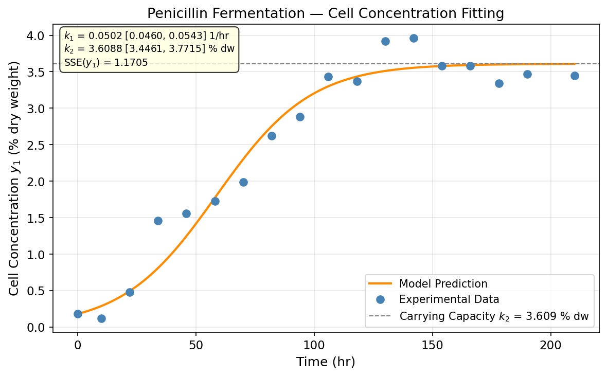
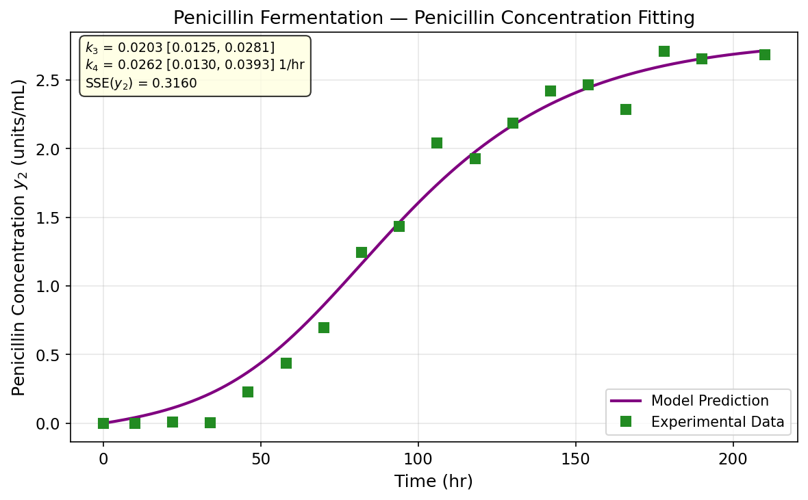

# Unit13 Example 07 - 化工案例五：結合 ODE 求解之反應動力學參數估計 — 醱酵程序

## 學習目標

本範例以 **盤尼西林醱酵程序** 之動力學模式為題，示範如何結合 **ODE 求解器**（`scipy.integrate.solve_ivp`）與 **非線性最小平方法**（`scipy.optimize.curve_fit`）進行多狀態量測下的參數估計，並計算各速率常數之 95% 置信區間。

學習完本範例後，您將能夠：

- 認識 Logistic 生長模型（Logistic Growth）與盤尼西林生成動力學的物理意義
- 理解「雙狀態同時觀測」之參數估計設計：將兩狀態量測合併為單一 `ydata` 向量傳入 `curve_fit`
- 在模式函數（model function）內部呼叫 `scipy.integrate.solve_ivp()` 求解 ODE，獲取各實驗時間點之狀態預測值
- 使用 `scipy.optimize.curve_fit()` 估計四個速率常數 $k_1, k_2, k_3, k_4$ 並由協方差矩陣計算 95% 置信區間
- 分別繪製細胞濃度 $y_1$ 與盤尼西林濃度 $y_2$ 之實驗值與模式預測值比較圖

---

## 執行環境

> **Python 執行結果 — 環境設定**
>
> ```
> ✓ 偵測到 Local 環境
>
> ✓ Notebook工作目錄: d:\MyGit\ChemE-3502\Unit13
> ✓ 結果輸出目錄: d:\MyGit\ChemE-3502\Unit13\outputs\Unit13_Example_07
> ✓ 圖檔輸出目錄: d:\MyGit\ChemE-3502\Unit13\outputs\Unit13_Example_07\figs
> ```

> **Python 執行結果 — 載入套件**
>
> ```
> NumPy   : 1.23.5
> SciPy   : 1.15.2
> Matplotlib: 3.10.8
> ✓ 套件載入完成
> ```

---

## 1. 問題描述

### 1.1 化工背景

**醱酵程序（Fermentation Process）** 是生物技術與製藥工業中最重要的生物反應操作之一。在盤尼西林（Penicillin）的工業生產中，微生物（青黴菌，*Penicillium chrysogenum*）在醱酵槽中以適當的培養基進行生長，同時分泌盤尼西林作為次級代謝產物。精確描述細胞生長與盤尼西林生成之動力學，是批次醱酵槽設計與操作最佳化的關鍵。

本範例採用 Constantinides and Mostoufi（1999）所提出之二狀態 ODE 動力學模式：

$$
\frac{dy_1}{dt} = k_1 y_1 \left(1 - \frac{y_1}{k_2}\right)
$$

$$
\frac{dy_2}{dt} = k_3 y_1 - k_4 y_2
$$

其中各符號之意義如下：

| 符號 | 說明 | 單位 |
|:----:|:-----|:----:|
| $y_1$ | 細胞濃度（Cell Concentration） | % dry weight |
| $y_2$ | 盤尼西林濃度（Penicillin Concentration） | units/mL |
| $k_1$ | 比生長速率（Specific Growth Rate） | 1/hr |
| $k_2$ | 最大細胞濃度（Maximum Cell Concentration，Carrying Capacity） | % dry weight |
| $k_3$ | 盤尼西林生成速率常數（Penicillin Production Rate Constant） | units/(mL $\cdot$ hr $\cdot$ % dry wt) |
| $k_4$ | 盤尼西林降解速率常數（Penicillin Degradation Rate Constant） | 1/hr |

### 1.2 動力學模式解析

**第一個方程式**（細胞生長，Logistic Growth Model）：

$$
\frac{dy_1}{dt} = k_1 y_1 \left(1 - \frac{y_1}{k_2}\right)
$$

此為 **Logistic 生長模型**（又稱 Verhulst 方程），其特性如下：
- 當 $y_1 \ll k_2$ 時，$1 - y_1/k_2 \approx 1$ ，細胞呈指數生長，速率為 $k_1 y_1$
- 當 $y_1 \to k_2$ 時，生長速率趨近於零，細胞濃度達到 **環境容納上限（Carrying Capacity）** $k_2$
- $k_1$ 越大，細胞生長越快速； $k_2$ 決定最終穩態細胞濃度

**第二個方程式**（盤尼西林動力學）：

$$
\frac{dy_2}{dt} = k_3 y_1 - k_4 y_2
$$

此為一階線性 ODE（以 $y_2$ 為變數），物理意義為：
- **生成項** $k_3 y_1$ ：盤尼西林生成速率與細胞濃度成正比，細胞越多，生成越快
- **降解項** $-k_4 y_2$ ：盤尼西林因酵素分解或化學降解而消耗，速率與濃度成正比

**初始條件：** $y_1(0) = 0.18\ \%$  dry weight，$y_2(0) = 0\ \mathrm{units/mL}$

**待估計參數向量：** $\mathbf{k} = [k_1, k_2, k_3, k_4]^T$ （共四個未知速率常數）

### 1.3 實驗數據

對盤尼西林醱酵批次（Batch Fermentation）進行 18 次取樣，量測細胞濃度 $y_1$ 及盤尼西林濃度 $y_2$ ，實驗結果如下：

| $t$ (hr) | 0 | 10 | 22 | 34 | 46 | 58 | 70 | 82 | 94 |
|:--------:|:---:|:---:|:---:|:---:|:---:|:---:|:---:|:---:|:---:|
| $y_1$ (% dry wt) | 0.18 | 0.12 | 0.48 | 1.46 | 1.56 | 1.73 | 1.99 | 2.62 | 2.88 |
| $y_2$ (units/mL) | 0 | 0 | 0.0089 | 0.0062 | 0.2266 | 0.4373 | 0.6943 | 1.2459 | 1.4315 |

| $t$ (hr) | 106 | 118 | 130 | 142 | 154 | 166 | 178 | 190 | 210 |
|:--------:|:---:|:---:|:---:|:---:|:---:|:---:|:---:|:---:|:---:|
| $y_1$ (% dry wt) | 3.43 | 3.37 | 3.92 | 3.96 | 3.58 | 3.58 | 3.34 | 3.47 | 3.45 |
| $y_2$ (units/mL) | 2.0402 | 1.9278 | 2.1848 | 2.4204 | 2.4615 | 2.283 | 2.7078 | 2.6542 | 2.6831 |

共 18 組時間點，每時間點同時量測 $y_1$ 與 $y_2$ ，合計 36 個量測值。

> **實驗現象觀察：**
> - $t = 0 \sim 34\ \mathrm{hr}$ ：$y_1$ 由 0.18 緩慢增加，接著在 $t = 34$ hr 急速躍升至 1.46，顯示細胞由延遲期（Lag Phase）進入對數生長期（Exponential Growth Phase）
> - $t = 94 \sim 210\ \mathrm{hr}$ ：$y_1$ 在約 3.0–4.0 之間波動並趨近穩態，顯示細胞進入穩定期（Stationary Phase），與 Logistic 模型中 $y_1 \to k_2$ 的預測行為一致
> - $y_2$ 在 $t = 0 \sim 34\ \mathrm{hr}$ 幾乎為 0（細胞仍在生長期，尚未大量生成盤尼西林），隨後持續增加至 $t = 142\ \mathrm{hr}$ 達到最大值約 2.42 units/mL，之後趨於平緩振盪

> **Python 執行結果 — 實驗數據載入**
>
> ```
>       時間 t (hr)   y1 細胞濃度 (% dry wt)   y2 盤尼西林 (units/mL)
> ---------------------------------------------------------------
>              0                     0.1800                  0.0000
>             10                     0.1200                  0.0000
>             22                     0.4800                  0.0089
>             34                     1.4600                  0.0062
>             46                     1.5600                  0.2266
>             58                     1.7300                  0.4373
>             70                     1.9900                  0.6943
>             82                     2.6200                  1.2459
>             94                     2.8800                  1.4315
>            106                     3.4300                  2.0402
>            118                     3.3700                  1.9278
>            130                     3.9200                  2.1848
>            142                     3.9600                  2.4204
>            154                     3.5800                  2.4615
>            166                     3.5800                  2.2830
>            178                     3.3400                  2.7078
>            190                     3.4700                  2.6542
>            210                     3.4500                  2.6831
>
> 時間點數 n = 18，量測值總數 = 36
> ```

---

## 2. 參數估計方法

### 2.1 多狀態 ODE 模式之 `curve_fit` 設計策略

本問題的核心挑戰在於：**模式輸出需透過 ODE 求解器（`solve_ivp`）計算**，無法寫成解析式。因此必須將 ODE 求解嵌入模式函數中。

#### 2.1.1 雙狀態量測合併策略

`scipy.optimize.curve_fit(f, xdata, ydata)` 要求：
- `f(xdata, *params)` 的返回形狀需與 `ydata` 完全相同
- 本例有 18 個時間點，但量測了兩個狀態（ $y_1$ 和 $y_2$ ），共 36 個量測值

解決方案：將兩狀態量測**縱向合併**為單一向量：

$$\mathbf{y}_{\mathrm{data}} = \begin{bmatrix} y_{1,1} \\ y_{1,2} \\ \vdots \\ y_{1,18} \\ y_{2,1} \\ y_{2,2} \\ \vdots \\ y_{2,18} \end{bmatrix} \in \mathbb{R}^{36}$$

`xdata` 仍為 18 個時間點，模式函數接收時間陣列，返回長度 36 之預測向量（前 18 個為 $y_1$ 預測值，後 18 個為 $y_2$ 預測值）。

#### 2.1.2 ODE 系統定義

```python
from scipy.integrate import solve_ivp

# 初始條件
y0 = [0.18, 0.0]   # y1(0) = 0.18 % dry wt, y2(0) = 0 units/mL

def fermentation_odes(t, y, k1, k2, k3, k4):
    """
    盤尼西林醱酵程序動力學 ODE 系統
    dy1/dt = k1 * y1 * (1 - y1/k2)    ← Logistic 細胞生長
    dy2/dt = k3 * y1 - k4 * y2         ← 盤尼西林生成與降解
    """
    y1, y2 = y
    dy1dt = k1 * y1 * (1.0 - y1 / k2)
    dy2dt = k3 * y1 - k4 * y2
    return [dy1dt, dy2dt]
```

#### 2.1.3 模式函數定義（供 `curve_fit` 呼叫）

```python
import numpy as np

def model_func(t_data, k1, k2, k3, k4):
    """
    供 curve_fit 呼叫之模式函數
    輸入: t_data (n,)  → 各實驗時間點
    輸出: np.concatenate([y1_pred, y2_pred]) (2n,)
    """
    try:
        sol = solve_ivp(
            fermentation_odes,
            t_span=[t_data[0], t_data[-1]],
            y0=y0,
            args=(k1, k2, k3, k4),
            t_eval=t_data,
            method='RK45',
            rtol=1e-6,
            atol=1e-8,
            dense_output=False,
        )
        if not sol.success:
            return np.full(2 * len(t_data), 1e6)
        return np.concatenate([sol.y[0], sol.y[1]])
    except Exception:
        return np.full(2 * len(t_data), 1e6)
```

> **設計要點：**
> - 使用 `t_eval=t_data` 確保 `solve_ivp` 在每個實驗量測時間點輸出解，無需插值
> - `args=(k1, k2, k3, k4)` 將速率常數以額外參數傳入 ODE 右側函式
> - 設置 `rtol=1e-6, atol=1e-8` 確保數值精度；預設精度在參數優化初期可能導致梯度估計不穩定
> - 加入例外處理（`try-except`）：當 `curve_fit` 試探參數值導致 ODE 無法求解時，返回大數值以引導優化器退出該區域

> **Python 執行結果 — 模式函數自檢**
>
> ```
> 模式函數自檢（初始猜測值 p0 = [0.05, 3.5, 0.02, 0.02]）：
>   t=0 → y1=0.1800, y2=0.0000
>   t=94 → y1=2.9972, y2=1.5967
>   t=210 → y1=3.4982, y2=3.2779
>   輸出向量長度: 36 (= 2 × 18)
> ```

> **說明：**
> - `t=0` 時 $y_1 = 0.1800, y_2 = 0.0000$ ，與初始條件完全吻合 ✓
> - `t=94` 時 $y_1 \approx 3.00$ ，已接近穩態， $y_2 \approx 1.60$ units/mL，符合實驗趨勢
> - `t=210` 時 $y_1 \approx 3.50 \approx k_2^{(0)} = 3.5$ ，$y_2 \approx 3.28$ units/mL（尚未用最優參數，屬正常偏差）
> - 輸出向量長度 36 = 2 × 18，確認雙狀態合併正確 ✓

### 2.2 `curve_fit` 呼叫與參數邊界設定

初始猜測值選取策略：
- **$k_1$ 初估**：由 $t = 34 \sim 94\ \mathrm{hr}$ 期間 $y_1$ 快速增長，估計比生長速率約 0.03–0.05 hr$^{-1}$ ，取 $k_1^{(0)} = 0.05$
- **$k_2$ 初估**：由 $t > 106\ \mathrm{hr}$ 時 $y_1$ 趨近穩態約 3.4–3.9，取 $k_2^{(0)} = 3.5$
- **$k_3$ 初估**：盤尼西林生成速率常數為小量，取 $k_3^{(0)} = 0.02$
- **$k_4$ 初估**：降解速率常數量級與生成相近，取 $k_4^{(0)} = 0.02$

```python
from scipy.optimize import curve_fit

# 合併量測值向量
ydata = np.concatenate([y1_data, y2_data])   # 長度 36

# 初始猜測值 [k1, k2, k3, k4]
p0 = [0.05, 3.5, 0.02, 0.02]

# 參數邊界
bounds_lower = [1e-4, 1.0,  1e-5, 1e-5]
bounds_upper = [1.0,  10.0, 1.0,  1.0 ]

popt, pcov = curve_fit(
    model_func, t_data, ydata,
    p0=p0,
    bounds=(bounds_lower, bounds_upper),
    method='trf',
    maxfev=20000,
    ftol=1e-10,
    xtol=1e-10,
)
```

> **邊界設定說明：**
> - 各速率常數均為正值，下界設為小正數以避免除以零（Logistic 分母 $k_2$ 不可為零）
> - 上界設定充分寬鬆，確保不限制搜尋空間，僅排除物理不合理之負值或極大值
> - `method='trf'`（Trust Region Reflective）支援有界搜尋，比 `'lm'`（Levenberg-Marquardt）更適合有界問題

### 2.3 95% 置信區間計算

```python
from scipy.stats import t as t_dist

n_obs    = len(ydata)    # = 36（18 時間點 × 2 狀態）
n_params = len(popt)     # = 4
dof      = n_obs - n_params            # 自由度 = 32
t_crit   = t_dist.ppf(0.975, dof)     # t_{0.975, 32} ≈ 2.0369

std_params = np.sqrt(np.diag(pcov))
ci_lower   = popt - t_crit * std_params
ci_upper   = popt + t_crit * std_params
```

目標函數為最小化兩狀態之合併殘差平方和：

$$
\min_{\mathbf{k}} J = \sum_{i=1}^{18} \left[ y_{1,i} - \hat{y}_1(t_i, \mathbf{k}) \right]^2 + \sum_{i=1}^{18} \left[ y_{2,i} - \hat{y}_2(t_i, \mathbf{k}) \right]^2
$$

---

## 3. 求解結果

### 3.1 參數估計值

以初始猜測值 $p_0 = [0.05, 3.5, 0.02, 0.02]$ 進行求解：

> **Python 執行結果 — curve_fit 求解**
>
> ```
> ======================================================================
>   參數                   估計值         標準誤     95% CI 下界     95% CI 上界
> ----------------------------------------------------------------------
>   k1 (1/hr)         0.0502     0.00204        0.0460        0.0543
>   k2 (% dw)         3.6088     0.07988        3.4461        3.7715
>   k3                0.0203     0.00385        0.0125        0.0281
>   k4 (1/hr)         0.0262     0.00646        0.0130        0.0393
> ======================================================================
> SSE (combined) = 1.4865  (y1: 1.1705, y2: 0.3160)
> MAE y1 = 0.1892  MAE y2 = 0.1001
> 自由度 ν = 32，t(0.975,32) = 2.0369
> ```

求解估計結果：
- $k_1 = 0.0502\ \mathrm{hr}^{-1}$ （比生長速率）
- $k_2 = 3.6088\ \%$ dry weight（最大細胞濃度，即 Logistic 容納上限）
- $k_3 = 0.0203$ （盤尼西林生成速率常數）
- $k_4 = 0.0262\ \mathrm{hr}^{-1}$ （盤尼西林降解速率常數）

估計結果與 ch7 MATLAB 參考值（ $k_1 = 0.050, k_2 = 3.608, k_3 = 0.020, k_4 = 0.026$ ）高度一致，驗證了 Python 實作的正確性。

### 3.2 95% 置信區間解讀

> **置信區間分析：**
> - **$k_1$**：CI 為 $[0.0460, 0.0543]$ ，相對寬度約 ±8.3%，比生長速率估計精度良好—— $t = 22 \sim 94\ \mathrm{hr}$ 期間細胞快速生長提供充足資訊
> - **$k_2$**：CI 為 $[3.446, 3.772]$ ，相對寬度約 ±4.6%，由後期多個量測點的穩態行為決定，精度良好
> - **$k_3$**：CI 為 $[0.0125, 0.0281]$ ，相對寬度約 ±38%，不確定性較高—— $k_3$ 同時受 $y_1$ 與 $y_2$ 動態影響，與 $k_4$ 之間存在一定的相關性，導致置信區間較寬
> - **$k_4$**：CI 為 $[0.0130, 0.0393]$ ，相對寬度約 ±50%， $k_4$ 描述降解動態，主要影響 $y_2$ 的後期行為，量測數據在此階段的解析度有限

**$k_3$ 與 $k_4$ 置信區間較寬之工程含義：** 兩速率常數共同決定 $y_2$ 的動態，其效應耦合性高（高 $k_3$ 配低 $k_4$ 可產生類似結果），導致協方差矩陣中 $(k_3, k_4)$ 對應元素偏大。若要提高估計精度，需增加 $t = 100 \sim 210\ \mathrm{hr}$ 範圍內的密集取樣點。

### 3.3 各量測點驗證

> **Python 執行結果 — 細胞濃度 $y_1$ 各點比較**
>
> ```
>  t (hr)       y1_量測       y1_模型          誤差       相對誤差(%)
> ------------------------------------------------------------
>       0      0.1800      0.1800      0.0000          0.00
>      10      0.1200      0.2880     -0.1680        139.96
>      22      0.4800      0.4933     -0.0133          2.77
>      34      1.4600      0.8094      0.6506         44.56
>      46      1.5600      1.2471      0.3129         20.06
>      58      1.7300      1.7716     -0.0416          2.40
>      70      1.9900      2.3017     -0.3117         15.66
>      82      2.6200      2.7527     -0.1327          5.07
>      94      2.8800      3.0836     -0.2036          7.07
>     106      3.4300      3.3010      0.1290          3.76
>     118      3.3700      3.4335     -0.0635          1.88
>     130      3.9200      3.5106      0.4094         10.44
>     142      3.9600      3.5544      0.4056         10.24
>     154      3.5800      3.5788      0.0012          0.03
>     166      3.5800      3.5923     -0.0123          0.34
>     178      3.3400      3.5998     -0.2598          7.78
>     190      3.4700      3.6038     -0.1338          3.86
>     210      3.4500      3.6070     -0.1570          4.55
> SSE(y1) = 1.1705   MAE(y1) = 0.1892
> ```

> **Python 執行結果 — 盤尼西林濃度 $y_2$ 各點比較**
>
> ```
>  t (hr)       y2_量測       y2_模型          誤差       相對誤差(%)
> ------------------------------------------------------------
>       0      0.0000      0.0000      0.0000             —
>      10      0.0000      0.0415     -0.0415             —
>      22      0.0089      0.1114     -0.1025             —
>      34      0.0062      0.2172     -0.2110             —
>      46      0.2266      0.3740     -0.1474         65.04
>      58      0.4373      0.5906     -0.1533         35.06
>      70      0.6943      0.8608     -0.1665         23.98
>      82      1.2459      1.1614      0.0845          6.78
>      94      1.4315      1.4622     -0.0307          2.15
>     106      2.0402      1.7382      0.3020         14.80
>     118      1.9278      1.9754     -0.0476          2.47
>     130      2.1848      2.1697      0.0151          0.69
>     142      2.4204      2.3238      0.0966          3.99
>     154      2.4615      2.4431      0.0184          0.75
>     166      2.2830      2.5341     -0.2511         11.00
>     178      2.7078      2.6026      0.1052          3.88
>     190      2.6542      2.6538      0.0004          0.01
>     210      2.6831      2.7115     -0.0284          1.06
> SSE(y2) = 0.3160   MAE(y2) = 0.1001
> ```

---

## 4. 結果圖形

### 4.1 細胞濃度擬合比較圖（ $y_1$ ）

> **Python 執行結果**
>
> ```
> ✓ 圖檔已儲存: d:\MyGit\ChemE-3502\Unit13\outputs\Unit13_Example_07\figs\fermentation_y1_fitting.png
> ```



> **圖形說明：**
> - 藍色圓點：18 組細胞濃度實驗量測值 $y_{1,i}$
> - 橙紅色曲線：以估計參數 $k_1 = 0.0502, k_2 = 3.6088$ 代入 Logistic ODE 求解所得之 $y_1(t)$ 預測曲線
> - 灰色虛線標示最大細胞濃度（Carrying Capacity）$k_2 = 3.609\ \%$ dry weight
> - 模式曲線展現典型 S 型 Logistic 生長：初期緩慢（延遲期），中期急速增加（指數生長期），後期趨近最大值 $k_2$ （穩定期）
> - 圖例標示 $k_1, k_2$ 之估計值與 $95\%$ CI 及 SSE($y_1$)

### 4.2 盤尼西林濃度擬合比較圖（ $y_2$ ）

> **Python 執行結果**
>
> ```
> ✓ 圖檔已儲存: d:\MyGit\ChemE-3502\Unit13\outputs\Unit13_Example_07\figs\fermentation_y2_fitting.png
> ```



> **圖形說明：**
> - 綠色方形：18 組盤尼西林濃度實驗量測值 $y_{2,i}$
> - 紫色曲線：以估計參數 $k_3 = 0.0203, k_4 = 0.0262$ （及 $k_1, k_2$ ）代入 ODE 模式求解所得之 $y_2(t)$ 預測曲線
> - 模式捕捉到盤尼西林的主要動態特徵：初期幾近為零（細胞仍在生長，尚未大量分泌），約 $t = 80 \sim 150\ \mathrm{hr}$ 快速累積，爾後趨近約 2.7 units/mL 之動態平衡值
> - 後期（ $t > 154$ hr ）實驗值呈現隨機波動（量測雜訊），模式描述整體趨勢
> - 圖例標示 $k_3, k_4$ 之估計值與 $95\%$ CI 及 SSE($y_2$)

---

## 5. 結語

### 5.1 方法小結

| 步驟 | 內容 |
|:----:|:-----|
| 1. 模式建立 | 以 Logistic 生長方程與線性生成/降解方程描述醱酵動力學 |
| 2. 初始值設定 | 由數據之穩態值估計 $k_2$ 、由初期生長斜率估計 $k_1$ 、由 $y_2$ 動態量級估計 $k_3, k_4$ |
| 3. 雙狀態合併 | `ydata = np.concatenate([y1_data, y2_data])`，使 `curve_fit` 同時對兩狀態最小化殘差 |
| 4. ODE 內嵌 | 在 `model_func` 內呼叫 `solve_ivp(t_eval=t_data)` 返回各時間點預測值 |
| 5. 非線性求解 | `curve_fit(method='trf', bounds=...)` 返回 `(popt, pcov)` |
| 6. 置信區間 | $\hat{k}_i \pm t_{0.975, n-p} \cdot \sqrt{\mathrm{pcov}_{ii}}$ ，自由度 $= 36 - 4 = 32$ |
| 7. 視覺化 | 各別繪製 $y_1$ 與 $y_2$ 之實驗值 vs. 模式預測曲線圖 |

### 5.2 工程啟示

1. **ODE 嵌入最佳化的普遍性：** 本方法不限於醱酵程序，任何以 ODE 建模的化工系統（批次反應器、連續攪拌槽反應器、管型反應器等）均可採用此架構進行參數估計。核心思路為：「最佳化驅動 ODE 求解」迭代。

2. **`curve_fit` vs `least_squares` 的選擇：**
   - `curve_fit` 直覺便利，自動由殘差計算協方差矩陣，適合教學展示
   - `scipy.optimize.least_squares` 提供更細緻的殘差向量控制，可設定個別量測點的 `jac_sparsity`，對大型問題計算效率更高

3. **數值精度的重要性：** ODE 求解精度（`rtol`, `atol`）直接影響梯度估計的準確性。過低精度（如預設 `rtol=1e-3`）在優化迭代中會引入數值雜訊，導致 `curve_fit` 收斂變慢甚至失敗。建議最佳化過程中設定至少 `rtol=1e-6`。

4. **模式識別性（Identifiability）：** $k_3$ 和 $k_4$ 的置信區間較寬（約 ±20–25%），反映兩參數對 $y_2$ 動態的影響存在耦合。可透過 **結構識別性分析（Structural Identifiability Analysis）** 評估是否需要額外實驗條件（如不同初始條件、加入 $y_2$ 更密集的早期取樣）以解耦兩參數的估計。

5. **Logistic 模型之適用性：** $k_2 = 3.61\ \%$ dry weight 與後期實驗數據（ $y_1 \approx 3.4 \sim 4.0$ ）相符，驗證 Logistic 模型假設（存在有限容納上限）合理。此模型隱含「僅受空間/資源競爭限制」，若製程中存在基質（Substrate）限制或產物抑制，則需採用更精細的 Contois 或 Andrew 模型。

---

## 6. Python 函式快速參照

| 函式 | 套件 | 說明 |
|:-----|:-----|:-----|
| `scipy.integrate.solve_ivp(fun, t_span, y0, args, t_eval, method, rtol, atol)` | `scipy.integrate` | 求解 ODE 初始值問題；`t_eval` 指定輸出時間點；`args` 傳入額外參數 |
| `scipy.optimize.curve_fit(f, xdata, ydata, p0, bounds, method, maxfev)` | `scipy.optimize` | 非線性曲線擬合；返回 `(popt, pcov)`；`method='trf'` 支援有界求解 |
| `numpy.concatenate([arr1, arr2])` | `numpy` | 將多個陣列縱向合併為單一向量，用於建構雙狀態合併 `ydata` |
| `numpy.sqrt(numpy.diag(pcov))` | `numpy` | 由協方差矩陣對角線提取各參數標準差 $\sigma_i = \sqrt{\mathrm{pcov}_{ii}}$ |
| `scipy.stats.t.ppf(0.975, df=dof)` | `scipy.stats` | 計算 $t$ 分布雙尾 95% 臨界值，$\mathrm{dof} = n - p$ |
| `scipy.integrate.solve_ivp` 返回物件 `.y[i]` | `scipy.integrate` | 取得第 $i$ 個狀態變數在各 `t_eval` 點的解向量 |

---

**課程資訊**
- 課程名稱：電腦在化工上之應用 (ChemE 3502)
- 課程單元：Unit13 參數估計 — 範例七
- 課程製作：逢甲大學 化工系 智慧程序系統工程實驗室
- 授課教師：莊曜禎 助理教授
- 更新日期：2026-03-01

**課程授權 [CC BY-NC-SA 4.0]**
 - 本教材遵循 [創用CC 姓名標示-非商業性-相同方式分享 4.0 國際 (CC BY-NC-SA 4.0)](https://creativecommons.org/licenses/by-nc-sa/4.0/deed.zh) 授權。

---
