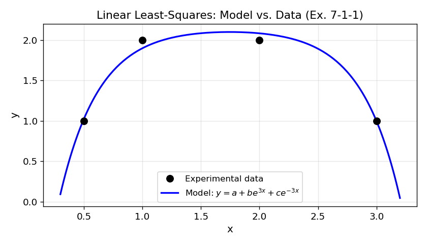
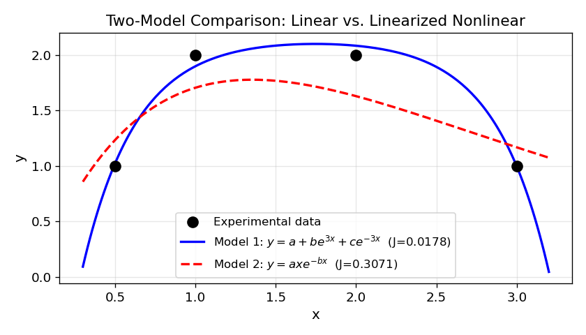
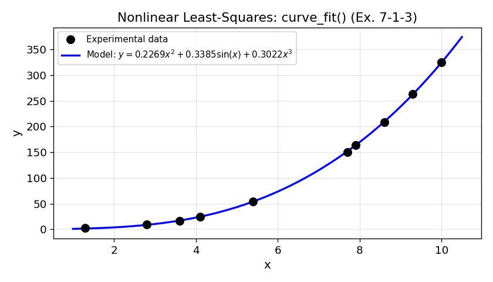
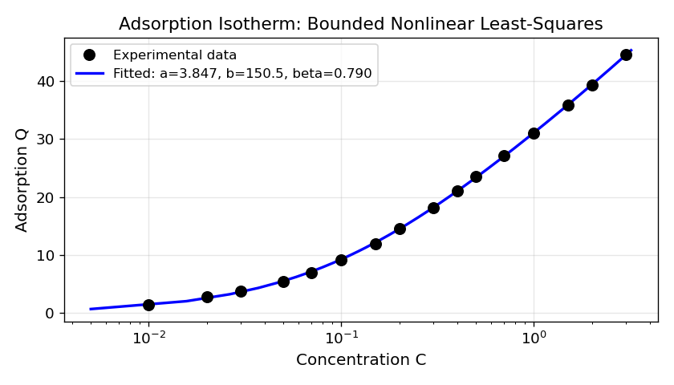

# Unit13 參數估計

本講義介紹如何以 Python（以 **SciPy** 為主要工具）建立數學模式並由實驗數據估測模式中之未知參數，並透過化工實際問題加以應用。

---

## 學習目標

完成本單元後，學生應能：

1. 描述參數估計問題的一般型式，理解誤差平方和目標函數 $J$ 之意義
2. 推導線性最小平方法之矩陣解析解 $\boldsymbol{\theta} = (\mathbf{X}^T\mathbf{X})^{-1}\mathbf{X}^T\mathbf{Y}$
3. 正確使用 `scipy.linalg.lstsq()` 求解線性模式之參數估計問題
4. 識別並處理「可線性化」之非線性模式（取對數或變數代換）
5. 正確使用 `scipy.optimize.curve_fit()` 求解非線性模式之參數估計，並獲取協方差矩陣
6. 正確使用 `scipy.optimize.least_squares()` 進行含上下限之有界非線性參數估計
7. 由協方差矩陣 `pcov` 推算各參數之 95% 置信區間，並解釋其物理意義
8. 依問題特性選擇適當之 Python 參數估計工具（線性/非線性/有界/置信區間）

---

## 目錄

1. [參數估計問題概述](#1-參數估計問題概述)
   - 1.1 參數估計在化工程序中的重要性
   - 1.2 誤差平方和目標函數
   - 1.3 參數估計問題分類
2. [線性模式之最小平方法](#2-線性模式之最小平方法)
   - 2.1 最小平方法原理
   - 2.2 矩陣型式與解析解推導
   - 2.3 `scipy.linalg.lstsq()` 函式介面
   - 2.4 可線性化之非線性模式
3. [非線性模式之參數估計法](#3-非線性模式之參數估計法)
   - 3.1 非線性最小平方法原理
   - 3.2 `scipy.optimize.curve_fit()` 函式介面
   - 3.3 `scipy.optimize.least_squares()` 含上下限之估計
   - 3.4 參數起始猜測值選取策略
4. [參數估計值之置信區間](#4-參數估計值之置信區間)
   - 4.1 置信區間概念與統計意義
   - 4.2 由協方差矩陣推算置信區間
   - 4.3 置信區間寬窄之物理意義
5. [Python 相關函式總覽](#5-python-相關函式總覽)

---

## 1. 參數估計問題概述

### 1.1 參數估計在化工程序中的重要性

如何決定一個合適的系統模式，以供程序設計分析、最適化與控制之用，對於一位程序系統工程師而言，是極其重要的。在建構模式的過程中，除了運用諸多程序系統理論推導數學模式外，通常仍須基於**實際實驗數據**來估測模式中之未知參數，方能使系統模式完備且合理。

**參數估計（Parameter Estimation）** 即是一個用以估計模式中未知參數之技術總稱。常見的化工應用情境包括：

- **反應動力學模式**：由批次反應數據估計反應速率常數與活化能
- **相平衡模式**：由實驗數據估計活性係數模式之交互參數
- **傳遞現象模式**：由量測數據估計傳熱係數、擴散係數
- **程序動態模式**：由階梯測試響應估計轉移函數之時間常數與增益

### 1.2 誤差平方和目標函數

假設進行了 $n$ 次實驗，結果為 $(x_i, y_i),\ i = 1, 2, \dots, n$ ，其中 $x_i$ 為自變數， $y_i$ 為量測值。相對於 $x_i$ ，由模式預測之輸出值為 $y_i^M$ ，則每個數據點之誤差為

$$
e_i = y_i - y_i^M, \quad i = 1, 2, \dots, n
$$

常用的目標函數為**誤差平方和（Sum of Squared Errors, SSE）**：

$$
J = \sum_{i=1}^{n} e_i^2
$$

參數估計的目標即是找出模式中一組合適的參數，使得目標函數 $J$ 愈小愈好（最小化），此即**最小平方法（Least-Squares Method）** 的核心概念。

### 1.3 參數估計問題分類

依模式中參數的線性/非線性關係，可分為：

| 問題類型 | 模式特性 | 求解方法 |
|---------|---------|---------|
| **線性參數估計** | 模式輸出可表示為參數的線性組合 | 解析解；`scipy.linalg.lstsq()` |
| **可線性化之非線性模式** | 通過變數代換或取對數化為線性問題 | 轉換後用線性法 |
| **非線性參數估計** | 模式輸出與參數呈非線性關係 | 迭代數值法；`scipy.optimize.curve_fit()` / `least_squares()` |

---

## 2. 線性模式之最小平方法

### 2.1 最小平方法原理

以簡單線性模式 $y^M = a + bx$ 為例，說明最小平方法之推導過程。將模式代入目標函數可得

$$
J(a, b) = \sum_{i=1}^{n} \left(y_i - a - bx_i\right)^2
$$

欲求得最小化之 $J$ 值，令偏微分為零：

$$
\frac{\partial J}{\partial a} = 0 = -2\sum_{i=1}^{n} \left(y_i - a - bx_i\right)
$$

$$
\frac{\partial J}{\partial b} = 0 = -2\sum_{i=1}^{n} x_i\left(y_i - a - bx_i\right)
$$

聯立求解，可得參數估計值：

$$
b = \frac{\displaystyle\sum_{i=1}^{n} x_i y_i - n\bar{x}\bar{y}}{\displaystyle\sum_{i=1}^{n} x_i^2 - n\bar{x}^2}, \qquad a = \bar{y} - b\bar{x}
$$

其中 $\bar{x} = \dfrac{1}{n}\displaystyle\sum_{i=1}^{n} x_i$ ， $\bar{y} = \dfrac{1}{n}\displaystyle\sum_{i=1}^{n} y_i$ 。

### 2.2 矩陣型式與解析解推導

為方便擴展至多參數系統，將上述過程以**矩陣型式**表示。對於包含多個基底函數的一般線性模式：

$$
y^M = \theta_1 \phi_1(x) + \theta_2 \phi_2(x) + \cdots + \theta_p \phi_p(x)
$$

將所有數據點排成矩陣，建立**設計矩陣（Design Matrix）** $\mathbf{X}$ ：

$$
\underbrace{\begin{bmatrix} y_1^M \\ y_2^M \\ \vdots \\ y_n^M \end{bmatrix}}_{\mathbf{Y}^M} = \underbrace{\begin{bmatrix} \phi_1(x_1) & \phi_2(x_1) & \cdots & \phi_p(x_1) \\ \phi_1(x_2) & \phi_2(x_2) & \cdots & \phi_p(x_2) \\ \vdots & \vdots & \ddots & \vdots \\ \phi_1(x_n) & \phi_2(x_n) & \cdots & \phi_p(x_n) \end{bmatrix}}_{\mathbf{X}} \underbrace{\begin{bmatrix} \theta_1 \\ \theta_2 \\ \vdots \\ \theta_p \end{bmatrix}}_{\boldsymbol{\theta}}
$$

即 $\mathbf{Y}^M = \mathbf{X}\boldsymbol{\theta}$ ，目標函數可表示成

$$
J(\boldsymbol{\theta}) = (\mathbf{Y} - \mathbf{Y}^M)^T(\mathbf{Y} - \mathbf{Y}^M) = (\mathbf{Y} - \mathbf{X}\boldsymbol{\theta})^T(\mathbf{Y} - \mathbf{X}\boldsymbol{\theta})
$$

令 $\dfrac{\partial J(\boldsymbol{\theta})}{\partial \boldsymbol{\theta}} = 0$ ，得**正規方程組（Normal Equations）**：

$$
2\mathbf{X}^T(\mathbf{Y} - \mathbf{X}\boldsymbol{\theta}) = 0
$$

求解可得**線性最小平方解（Linear Least-Squares Solution）**：

$$
\boxed{\boldsymbol{\theta} = \left(\mathbf{X}^T\mathbf{X}\right)^{-1}\mathbf{X}^T\mathbf{Y}}
$$

> **注意**：此解存在的條件為 $\mathbf{X}^T\mathbf{X}$ 為非奇異矩陣，即設計矩陣 $\mathbf{X}$ 之各行線性獨立（無共線性問題）。

### 2.3 `scipy.linalg.lstsq()` 函式介面

在 Python 中，線性最小平方問題可由 `scipy.linalg.lstsq()` 一步求解，無需手動計算 $(\mathbf{X}^T\mathbf{X})^{-1}\mathbf{X}^T\mathbf{Y}$ ：

```python
from scipy.linalg import lstsq

theta, residuals, rank, sv = lstsq(X, Y)
```

| 參數 | 說明 |
|------|------|
| `X` | 設計矩陣，形狀 `(n, p)` |
| `Y` | 量測值向量，形狀 `(n,)` |
| `theta` | 估計參數向量，形狀 `(p,)` |
| `residuals` | 殘差平方和 $J$ （僅在 `n > p` 且矩陣滿秩時返回） |
| `rank` | 設計矩陣的秩 |
| `sv` | 設計矩陣的奇異值 |

`lstsq()` 內部使用 **SVD（奇異值分解）** 演算法，比直接計算 $(\mathbf{X}^T\mathbf{X})^{-1}$ 更穩定、更精確，是求解線性最小平方問題的**首選方法**。

#### 範例 7-1-1 執行結果

**問題**：給定 4 組實驗數據，估計線性模式 $y = a + be^{3x} + ce^{-3x}$ 的三個參數 $a, b, c$ 。

**實驗數據**：

| $x$ | 0.5 | 1.0 | 2.0 | 3.0 |
|-----|-----|-----|-----|-----|
| $y$ | 1.0 | 2.0 | 2.0 | 1.0 |

**數值結果**：

```
設計矩陣 X（各行依次為 [1, exp(3x), exp(-3x)]）:
[[1.00000000e+00  4.48168907e+00  2.23130160e-01]
 [1.00000000e+00  2.00855369e+01  4.97870684e-02]
 [1.00000000e+00  4.03428793e+02  2.47875218e-03]
 [1.00000000e+00  8.10308393e+03  1.23409804e-04]]

方法一 (手動矩陣運算): a = 2.1539,  b = -0.000143,  c = -5.0711
方法二 (scipy.linalg.lstsq): a = 2.1539,  b = -0.000143,  c = -5.0711

設計矩陣秩 rank = 3  (滿秩: True)
目標函數 J = 0.017787
各點誤差: [-0.021714  0.101474 -0.083687  0.003927]
```

**擬合結果圖**：



**結果討論**：

- **手動矩陣運算與 `lstsq()` 結果完全一致**，驗證了矩陣解析解 $\boldsymbol{\theta} = (\mathbf{X}^T\mathbf{X})^{-1}\mathbf{X}^T\mathbf{Y}$ 的正確性
- **設計矩陣秩 = 3（滿秩）**，表示三個基底函數 $\{1,\ e^{3x},\ e^{-3x}\}$ 線性獨立，解唯一存在
- **目標函數 $J = 0.0178$** 極小，擬合曲線幾乎通過所有數據點，說明模式選擇適當
- 係數 $b \approx -1.43 \times 10^{-4}$ 極小，表示 $e^{3x}$ 項隨 $x$ 增大迅速主導，但在此數據範圍內其絕對貢獻被 $e^{-3x}$ 抵消
- 圖中藍色曲線與黑色實驗點吻合良好，模式在 $x \in [0.3, 3.2]$ 的插值範圍內表現穩定

### 2.4 可線性化之非線性模式

部分表面上為非線性的模式，可透過適當的**變數代換**或**取對數**等操作，化為線性問題後求解。

**常用線性化方法**：

| 原始非線性模式 | 線性化方法 | 線性化後之形式 |
|-------------|---------|-------------|
| $y = ae^{bx}$ | 兩側取自然對數 | $\ln y = \ln a + bx$ |
| $y = ax^b$ | 兩側取對數 | $\ln y = \ln a + b\ln x$ |
| $y = axe^{-bx}$ | 兩側取對數並整理 | $\ln(y/x) = \ln a - bx$ |
| $y = \dfrac{1}{a + bx}$ | 取倒數 | $1/y = a + bx$ |

**線性化方法的限制**：
線性化後，最小平方法所最小化的是**變換後空間**中的誤差平方和，而非原始空間的誤差平方和。因此，即使線性化後的 $J$ 值很小，原始空間的擬合效果也可能較差。建議在線性化求解後，計算原始空間中的 $J$ 值以驗證模式品質，並與非線性方法所得之結果比較。

#### 範例 7-1-2 執行結果

**問題**：同樣使用範例 7-1-1 的 4 組數據，改以模式 $y = axe^{-bx}$ 擬合，並與模式一比較。

**線性化步驟**：兩側除以 $x$ 後取對數得 $\ln(y/x) = \alpha - bx$ ，其中 $\alpha = \ln a$ ，藉 `lstsq()` 求得 $\alpha, b$ 後回推 $a = e^\alpha$ 。

**數值結果**：

```
可線性化非線性模式 y = a*x*exp(-b*x)
  α = ln(a) = 1.2722
  b         = 0.7386
  a = exp(α) = 3.5685

各點模式預測值: [1.2333  1.7050  1.6292  1.1676]
各點誤差:       [-0.2333  0.2950  0.3708 -0.1676]
目標函數 J = 0.3071
```

**兩模式目標函數比較**：

| 模式 | 函式形式 | 目標函數 $J$ |
|------|---------|:-----------:|
| 模式一（7-1-1） | $y = a + be^{3x} + ce^{-3x}$ | **0.0178** |
| 模式二（7-1-2） | $y = axe^{-bx}$ | 0.3071 |

**擬合比較圖**：



**結果討論**：

- 模式一的 $J = 0.0178$ 遠小於模式二的 $J = 0.3071$ ，**模式一擬合效果明顯更佳**
- 模式二雖然形式簡單（僅 2 個參數），但此數據集呈現先升後降的對稱鐘型，而 $axe^{-bx}$ 在 $x$ 較大時衰減過快，無法良好描述 $x = 2.0$ 後的高原趨勢
- **線性化方法的代價**：模式二在對數空間中的擬合可能看似合理，但轉回原始空間後殘差顯著增大，體現了線性化方法的局限性
- 圖中紅色虛線（模式二）與藍色實線（模式一）的差異清晰可見，模式一在 $x \in [0.5, 3.0]$ 全段均能緊密追蹤實驗數據

---

## 3. 非線性模式之參數估計法

### 3.1 非線性最小平方法原理

在化工領域中，許多模式的參數與模式輸出呈**非線性關係**，無法直接排列成矩陣標準式求解。此類問題的一般型式為

$$
y = f(x, \mathbf{p})
$$

其中 $y$ 為系統輸出， $x$ 為輸入， $\mathbf{p} = [p_1, p_2, \dots, p_m]^T$ 為待估測之參數向量。

給定 $n$ 組量測數據 $(x_i, y_i)$ ，參數估計問題可視為：

$$
\min_{\mathbf{p}} J = \sum_{i=1}^{n} e_i^2(\mathbf{p}), \quad e_i(\mathbf{p}) = y_i - f(x_i, \mathbf{p})
$$

此為**非線性最小平方問題（Nonlinear Least-Squares Problem）**，須使用迭代數值方法求解。

常用的求解演算法包括：

- **Gauss-Newton 法**：利用 Jacobian 矩陣線性化目標函數，收斂快但須良好初始猜測值
- **Levenberg-Marquardt 法**：結合 Gauss-Newton 法與梯度下降法，對初始猜測值較不敏感，是 `scipy.optimize.curve_fit()` 的預設演算法

### 3.2 `scipy.optimize.curve_fit()` 函式介面

`curve_fit()` 是 SciPy 中最常用的非線性曲線擬合函式，其格式如下：

```python
from scipy.optimize import curve_fit

popt, pcov = curve_fit(f, xdata, ydata, p0=None, bounds=(-np.inf, np.inf))
```

| 參數 | 說明 |
|------|------|
| `f` | 模式函數，格式為 `f(x, p1, p2, ...)` |
| `xdata` | 自變數量測值，形狀 `(n,)` |
| `ydata` | 依變數量測值，形狀 `(n,)` |
| `p0` | 參數起始猜測值，形狀 `(m,)`；若省略則預設為全 1 |
| `bounds` | 參數上下限，格式 `(lb, ub)`，預設為 $(-\infty, +\infty)$ |
| `popt` | 最優化後之參數估計值，形狀 `(m,)` |
| `pcov` | 參數估計值之**協方差矩陣**，形狀 `(m, m)`；對角元素之開方即為各參數標準差 |

**模式函數格式規範**：
```python
def model(x, p1, p2, p3):
    """
    x : 自變數（純量或陣列）
    p1, p2, p3 : 待估參數
    return : 模式預測值（與 x 相同形狀）
    """
    return p1 * x**2 + p2 * np.sin(x) + p3 * x**3
```

#### 範例 7-1-3 執行結果

**問題**：給定 10 組實驗數據，估計非線性模式 $y = \alpha x^2 + \beta \sin(x) + \gamma x^3$ 的三個參數。

**實驗數據**：

| $x$ | 3.6 | 7.7 | 9.3 | 4.1 | 8.6 | 2.8 | 1.3 | 7.9 | 10.0 | 5.4 |
|-----|-----|-----|-----|-----|-----|-----|-----|-----|------|-----|
| $y$ | 16.5 | 150.6 | 263.1 | 24.7 | 208.5 | 9.9 | 2.7 | 163.9 | 325.0 | 54.3 |

**數值結果**：

```
非線性模式 y = α·x² + β·sin(x) + γ·x³

參數估計值:
  α (alpha) = 0.2269
  β (beta)  = 0.3385
  γ (gamma) = 0.3022

目標函數 J = 6.2950

協方差矩陣 pcov:
[[ 1.567e-03 -2.359e-03 -1.730e-04]
 [-2.359e-03  1.802e-01  2.060e-04]
 [-1.730e-04  2.060e-04  1.900e-05]]
```

**擬合結果圖**：



**結果討論**：

- 三個參數估計値： $\alpha = 0.2269$ ， $\beta = 0.3385$ ， $\gamma = 0.3022$ ，均為正値，符合物理直覺
- **目標函數 $J = 6.2950$**：10 組數據總誤差平方和，平均每點誤差約 $\sqrt{6.295/10} = 0.79$ ，相較於量測值 $y \in [2.7, 325.0]$ 的大範圍，相對誤差合理
- 從協方差矩陣可看出：
  - $\sigma_\alpha = 0.0396$ 、 $\sigma_\gamma = 0.0044$ 較小 → 參數可辨識性佳
  - $\sigma_\beta = 0.4245$ 較大 → $\beta\sin(x)$ 項的貢獻相對不確定（ $\sin(x)$ 在大 $x$ 時震盪，與 $x^2$ 和 $x^3$ 難以區分）
- 圖中藍色曲線在全範圍 $x \in [1, 10.5]$ 均能良好追蹤數據，模式結構選擇合理

### 3.3 `scipy.optimize.least_squares()` 含上下限之估計

當參數有明確的物理約束範圍時（如速率常數必須為正），應使用 `least_squares()` 設定 `bounds` 參數：

```python
from scipy.optimize import least_squares

result = least_squares(residuals, p0, bounds=(lb, ub))
```

| 參數 | 說明 |
|------|------|
| `residuals` | 殘差函數，格式為 `residuals(p)` 回傳向量 $\mathbf{e}(\mathbf{p})$ |
| `p0` | 參數起始猜測值 |
| `bounds` | 參數上下限，格式 `(lb_array, ub_array)` |
| `result.x` | 最優化後之參數估計值 |
| `result.cost` | 目標函數值 $J/2$ （`least_squares` 最小化 $\Vert\mathbf{e}\Vert^2 / 2$ ） |
| `result.fun` | 最優化後之殘差向量 |

> **實務建議**：使用 `least_squares()` 進行有界估計後，再以相同的最優參數作為初始值，呼叫 `curve_fit()` 獲取協方差矩陣以計算置信區間。

#### 範例 7-2-3 執行結果（活性碳吸附等溫模式）

**問題**：給定 16 組活性碳吸附實驗數據，在物理限制範圍內估計吸附等溫模式 $Q = \dfrac{bC}{1 + aC^\beta}$ 的三個參數。

**參數上下限設定**：

| 參數 | 物理意義 | 下限 | 上限 | 初始猜測 |
|-----|---------|:---:|:---:|:------:|
| $a$ | 非線性飽和係數 | 0.0 | 10.0 | 4.0 |
| $b$ | 最大吸附容量相關係數 | 100.0 | 200.0 | 150.0 |
| $\beta$ | Freundlich 非線性指數 | 0.0 | 1.0 | 0.8 |

**數值結果**：

```
有界非線性最小平方 (least_squares with bounds):
  a    = 3.8466  [0, 10]
  b    = 150.5087  [100, 200]
  beta = 0.7904  [0, 1]
  J    = 0.2206

curve_fit() (with bounds, for pcov):
  a    = 3.8466
  b    = 150.5087
  beta = 0.7904
  J    = 0.2206
```

**結果討論**：

- `least_squares()` 與 `curve_fit()` 兩種方法給出完全相同的最優解，驗證有界估計的一致性
- **目標函數 $J = 0.2206$**：16 組數據的總誤差平方和極小，平均殘差僅 $\sqrt{0.2206/16} \approx 0.12$ ，擬合精度相當高
- 最優參數 $a = 3.847$ 、 $\beta = 0.7904$ （ $\beta < 1$ ）符合典型活性碳吸附的非線性特徵（Freundlich 型態）
- 設定物理上下限的重要性：若不設定 $a \leq 10$ ，優化器在高濃度區可能收斂至不具物理意義的解

### 3.4 參數起始猜測值選取策略

非線性最小平方法的求解品質高度依賴初始猜測值，建議採用以下策略：

1. **物理先驗知識**：依據物理意義估計參數的數量級
2. **圖形分析**：繪製數據圖，觀察函數行為以估計初始值
3. **線性化法**：若模式可近似線性化，先以線性法得到初始估計值
4. **網格搜尋**：在合理範圍內進行粗略網格搜尋，找到低目標函數值的起始點
5. **多點重啟**：以不同初始值多次求解，比較各次結果，選取目標函數最小者

---

## 4. 參數估計值之置信區間

### 4.1 置信區間概念與統計意義

**置信區間（Confidence Interval, CI）** 是統計上對參數估計值不確定性的量化描述。對於參數 $\theta^*$ 之 95% 置信區間，其統計意義為：

> 若以相同方式重複實驗大量次，則約 95% 的情況下，真實參數值 $\theta$ 會落在計算所得的置信區間內。

對於單一參數 $p_k$ ，其近似 95% 置信區間由下式給出：

$$
\hat{p}_k \pm 1.96 \cdot \sigma_{p_k}
$$

其中 $\hat{p}_k$ 為參數估計値， $\sigma_{p_k}$ 為參數估計値之標準差。

### 4.2 由協方差矩陣推算置信區間

`scipy.optimize.curve_fit()` 返回的 `pcov` 為**參數估計值之協方差矩陣**：

$$
\mathbf{P}_{\text{cov}} = \begin{bmatrix}
\sigma_{p_1}^2 & \sigma_{p_1 p_2} & \cdots \\
\sigma_{p_2 p_1} & \sigma_{p_2}^2 & \cdots \\
\vdots & \vdots & \ddots
\end{bmatrix}
$$

對角線元素即為各參數估計值之**方差（Variance）**，開方後得到**標準差（Standard Deviation）**：

```python
# 從協方差矩陣提取各參數之標準差
perr = np.sqrt(np.diag(pcov))

# 計算 95% 置信區間（近似正態分布假設）
ci_95 = 1.96 * perr  # 雙側 95% CI 之半寬度

# 列印各參數之估計值與 95% 置信區間
for i, (p, err) in enumerate(zip(popt, ci_95)):
    print(f"  p{i+1} = {p:.4f} ± {err:.4f}  (95% CI: [{p-err:.4f}, {p+err:.4f}])")
```

> **注意**：上述近似基於 **大樣本正態分布假設**（Central Limit Theorem）。對於非線性模式，此近似在樣本數較小或模式高度非線性時可能不準確，可考慮使用 Bootstrap 方法或 Profile Likelihood 方法獲取更精確的置信區間。

#### 4.2.1 範例 7-1-3：非線性模式 95% 置信區間

**數值結果**：

```
非線性模式 y = α·x² + β·sin(x) + γ·x³  之 95% 置信區間
------------------------------------------------------------
參數           估計值       標準差     95% CI 下限   95% CI 上限
------------------------------------------------------------
α (alpha)     0.2269       0.0396       0.1493       0.3045
β (beta)      0.3385       0.4245      -0.4936       1.1706
γ (gamma)     0.3022       0.0044       0.2935       0.3108
------------------------------------------------------------
```

**結果討論**：

- **$\alpha$ 的 95% CI** 為 $[0.1493,\ 0.3045]$ ，半寬 $0.0776$ ，相對估計值之比例約 34%，可辨識性中等
- **$\beta$ 的 95% CI** 為 $[-0.4936,\ 1.1706]$ ，**區間跨越零點**，表示從統計上無法確認 $\sin(x)$ 項是否顯著；此為模式中最不確定的參數
- **$\gamma$ 的 95% CI** 為 $[0.2935,\ 0.3108]$ ，半寬僅 $0.0087$ ，精度極高， $x^3$ 項為此模式的主要決定性項

#### 4.2.2 範例 7-2-3：吸附等溫模式 95% 置信區間

**數值結果**：

```
吸附等溫模式 Q = b·C / (1 + a·C^β)  之 95% 置信區間
------------------------------------------------------------
參數           估計值       標準差     95% CI 下限   95% CI 上限
------------------------------------------------------------
a              3.8466       0.0985       3.6535       4.0398
b            150.5087       2.8896     144.8451     156.1723
beta (β)       0.7904       0.0054       0.7798       0.8011
------------------------------------------------------------
```

**吸附等溫線擬合圖**（半對數座標）：



**結果討論**：

- 三個參數之置信區間均不含零點，且上下限均在物理合理範圍內，表示模式具有良好的**參數可辨識性**
- **$a$ 的 95% CI**： $[3.65,\ 4.04]$ ，標準差 $\sigma_a = 0.0985$ （相對誤差 2.6%），精度高
- **$b$ 的 95% CI**： $[144.8,\ 156.2]$ ，半寬約 5.7， $b \approx 150.5$ 顯示此活性碳在高濃度下最大吸附量約 150 mg/g
- **$\beta$ 的 95% CI**： $[0.780,\ 0.801]$ ，半寬僅 0.011，精度最高； $\beta \approx 0.79 < 1$ 為典型的次線性吸附行為（Freundlich 型），符合活性碳的物理化學特性
- 半對數圖中，擬合曲線（藍線）在 $C \in [0.01, 3.0]$ 的三個量級濃度範圍內均緊密追蹤 16 個實驗數據點

#### 4.2.3 範例結果彙整

| 範例 | 模式 | 目標函數 $J$ |
|------|------|:-----------:|
| 7-1-1 | 線性： $y = a + be^{3x} + ce^{-3x}$ | **0.0178** |
| 7-1-2 | 線性化非線性： $y = axe^{-bx}$ | 0.3071 |
| 7-1-3 | 非線性 `curve_fit`： $y = \alpha x^2 + \beta\sin(x) + \gamma x^3$ | 6.2950 |
| 7-2-3 | 有界非線性： $Q = bC/(1+aC^\beta)$ | **0.2206** |

### 4.3 置信區間寬窄之物理意義

| 置信區間特性 | 物理意義 | 可能原因 |
|-----------|---------|---------|
| **窄置信區間** | 參數估計值精確可靠 | 實驗數據量充足、雜訊小、模式結構適當 |
| **寬置信區間** | 參數估計值不確定性高 | 數據量不足、測量誤差大、模式 overparameterized |
| **部分參數寬、部分窄** | 模式可辨識性（Identifiability）問題 | 參數間存在相關性（協方差矩陣非對角元素大） |
| **pcov 接近奇異** | 模式不可辨識 | 模式包含冗餘參數，或數據無法區分各參數效應 |

**模式選擇原則**：在相同擬合精度（相近的 $J$ 值）下，置信區間較窄且參數具有明確物理意義的模式，通常是更好的選擇。

---

## 5. Python 相關函式總覽

### 5.1 三大工具比較表

| 函式 | 適用情境 | 優點 | 限制 |
|------|---------|------|------|
| `scipy.linalg.lstsq(X, Y)` | 線性參數模式 | 解析解，快速穩定，有秩診斷 | 僅限線性模式 |
| `scipy.optimize.curve_fit(f, x, y)` | 非線性模式，需置信區間 | 自動返回協方差矩陣 `pcov` | 無法直接設定嚴格上下限 |
| `scipy.optimize.least_squares(res, p0, bounds=)` | 非線性模式，需上下限約束 | 嚴格支援上下限，多種求解演算法 | 不直接返回協方差矩陣，需後續處理 |

### 5.2 方法選擇決策流程

```
問題類型判斷
│
├── 線性參數模式（模式輸出為參數之線性組合）
│   └── 使用 scipy.linalg.lstsq()
│
├── 可線性化之非線性模式（可透過變數代換化為線性）
│   └── 線性化後使用 scipy.linalg.lstsq()
│       （注意：最小化之為變換空間的誤差，非原始空間）
│
└── 非線性模式（無法線性化）
    │
    ├── 無上下限限制，需置信區間
    │   └── 使用 scipy.optimize.curve_fit()
    │
    ├── 有上下限限制，需置信區間
    │   ├── 先用 scipy.optimize.least_squares(bounds=) 求解
    │   └── 再用 curve_fit(bounds=) 獲取協方差矩陣
    │
    └── 有上下限限制，不需置信區間
        └── 使用 scipy.optimize.least_squares(bounds=)
```

### 5.3 函式調用摘要

```python
# ── 線性最小平方 ──────────────────────────────────────────
from scipy.linalg import lstsq
theta, res, rank, sv = lstsq(X, Y)
J = np.sum((Y - X @ theta)**2)

# ── 非線性曲線擬合（返回置信區間用協方差矩陣）──────────────
from scipy.optimize import curve_fit
popt, pcov = curve_fit(model_func, xdata, ydata, p0=p0_init)
perr = np.sqrt(np.diag(pcov))   # 各參數標準差
ci95 = 1.96 * perr              # 95% CI 半寬度

# ── 有界非線性最小平方 ────────────────────────────────────
from scipy.optimize import least_squares
result = least_squares(residual_func, p0_init, bounds=(lb, ub))
p_opt = result.x
J = 2 * result.cost    # result.cost = J/2
```

---

**課程資訊**
- 課程名稱：電腦在化工上之應用 (ChemE 3502)
- 課程單元：Unit13 參數估計
- 課程製作：逢甲大學 化工系 智慧程序系統工程實驗室
- 授課教師：莊曜禎 助理教授
- 更新日期：2026-02-28

**課程授權 [CC BY-NC-SA 4.0]**
 - 本教材遵循 [創用CC 姓名標示-非商業性-相同方式分享 4.0 國際 (CC BY-NC-SA 4.0)](https://creativecommons.org/licenses/by-nc-sa/4.0/deed.zh) 授權。

---
