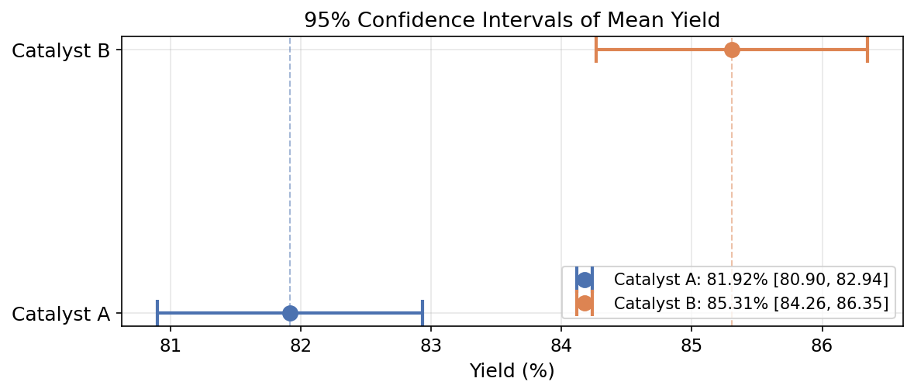
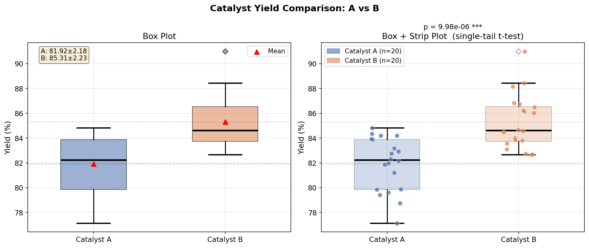

# Unit14 Example 02 - 不同催化劑批次反應收率之假設檢定

## 學習目標

本範例以**不同催化劑批次反應收率之假設檢定**為題，示範如何使用 `scipy.stats` 對兩組獨立樣本進行完整的假設檢定流程，包含信賴區間計算、Levene 變異數齊一性檢定、獨立兩樣本 t 檢定，以及效果量評估。

學習完本範例後，您將能夠：

- 以 `scipy.stats.t.interval()` 計算單組樣本均值的 $95\%$ 信賴區間，並理解信賴區間的物理意義
- 使用 `scipy.stats.levene()` 執行 Levene 變異數齊一性檢定，判斷兩組樣本的變異數是否均勻
- 根據 Levene 檢定結果，選擇 Pooled-variance t-test 或 Welch's t-test 進行獨立兩樣本 t 檢定
- 使用 `scipy.stats.ttest_ind()` 執行 t 檢定，解讀 t 統計量、自由度 df 與 p 值
- 以 Cohen's $d$ 計算效果量，區分「統計顯著」與「實際顯著」之差異
- 繪製箱型圖 (Box Plot) 與帶狀圖 (Strip Plot) 進行視覺比較

---

## 目錄

1. [問題描述與實驗數據](#1-問題描述與實驗數據)
2. [信賴區間計算與視覺化](#2-信賴區間計算與視覺化)
3. [Levene 變異數齊一性檢定](#3-levene-變異數齊一性檢定)
4. [獨立兩樣本 t 檢定](#4-獨立兩樣本-t-檢定)
5. [效果量 Cohen's d](#5-效果量-cohens-d)
6. [箱型圖與帶狀圖視覺比較](#6-箱型圖與帶狀圖視覺比較)
7. [綜合結論](#7-綜合結論)

---

## 1. 問題描述與實驗數據

### 1.1 背景說明

某化工廠目前使用**催化劑 A** 進行批次合成反應，計畫評估一種新型**催化劑 B** 是否能顯著提高反應收率 (Yield, %)。為此，品管工程師分別以兩種催化劑各進行 **20 批**實驗，收集反應收率數據，並以統計方法進行比較，顯著水準設為 $\alpha = 0.05$ 。

此次分析的目標為：

1. 計算兩組各自的 $95\%$ 信賴區間，初步評估均值差異
2. 以正式假設檢定判斷催化劑 B 是否**顯著優於** A
3. 量化效果大小，評估改換催化劑的實際工程意義

### 1.2 假設設定

| 項目 | 內容 |
|------|------|
| 虛無假設 $H_0$ | $\mu_B - \mu_A \le 0$ （催化劑 B 的平均收率不優於 A） |
| 對立假設 $H_1$ | $\mu_B - \mu_A > 0$ （催化劑 B 的平均收率優於 A） |
| 顯著水準 | $\alpha = 0.05$ （單尾檢定） |
| 樣本大小 | $n_A = n_B = 20$ |

> **注意**：由於工廠關心的是「B 是否優於 A」（方向性問題），本例採用**單尾 t 檢定**（右尾）。  
> 以 `scipy.stats.ttest_ind()` 計算雙尾 p 值後，單尾 p 值 = 雙尾 p 值 / 2。

### 1.3 模擬數據說明

由於此為教學範例，使用 `numpy.random.default_rng()` 生成兩組模擬收率數據，設定如下：

| 組別 | 催化劑 | 真實均值 | 標準差 | 樣本數 |
|------|--------|----------|--------|--------|
| A | 現有催化劑 | 82 % | 2.5 % | 20 |
| B | 新型催化劑 | 85 % | 2.8 % | 20 |

- 隨機種子：`seed=42`，確保結果可重現
- 兩組標準差故意設定稍有不同，以展示 Levene 檢定的應用

### 1.4 原始數據

```python
rng = np.random.default_rng(42)
yield_A = rng.normal(loc=82.0, scale=2.5, size=20)   # 催化劑 A: N(82, 2.5^2)
yield_B = rng.normal(loc=85.0, scale=2.8, size=20)   # 催化劑 B: N(85, 2.8^2)
```

### 1.5 描述統計執行結果

```
==================================================
  描述統計摘要
==================================================
指標                          催化劑 A        催化劑 B
--------------------------------------------------
樣本數 n                          20           20
樣本均值 (mean)               81.9177      85.3065
樣本標準差 (std)                2.1754       2.2261
最小值 (min)                 77.1224      82.6476
最大值 (max)                 84.8181      90.9966
==================================================

均值差異 (B - A) = 3.3888 %
```

**數據解讀**：

- 催化劑 B 的樣本均值（85.31%）明顯高於催化劑 A（81.92%），均值差異達 **3.39 個百分點**
- 兩組標準差相近（2.18% vs 2.23%），分布離散程度相當，有利於後續假設 $\sigma_A \approx \sigma_B$
- 催化劑 A 的最小值（77.12%）顯示部分批次收率偏低，可能存在異常值；催化劑 B 收率範圍 82.65%–91.00%，整體均優於 A 的最大值（84.82%）
- 初步觀察暗示差異可能顯著，但需正式假設檢定確認

---

## 2. 信賴區間計算與視覺化

### 2.1 均值信賴區間公式

當母體標準差 $\sigma$ 未知（一般情況），以 t 分布計算均值 $\mu$ 的 $95\%$ 信賴區間：

$$
\bar{x} \pm t_{\alpha/2,\, n-1} \cdot \frac{s}{\sqrt{n}}
$$

其中：
- $\bar{x}$ ：樣本均值
- $s$ ：樣本標準差
- $n$ ：樣本數
- $t_{\alpha/2,\, n-1}$ ：t 分布在自由度 $n-1$ 、雙尾 $\alpha$ 下的臨界值（ $\alpha=0.05$ 時為 $t_{0.025, 19} \approx 2.093$ ）

### 2.2 `scipy.stats.t.interval()` 使用方式

```python
from scipy import stats
import numpy as np

n = len(data)
mean = np.mean(data)
se = stats.sem(data)          # 標準誤 = s / sqrt(n)

ci = stats.t.interval(
    confidence=0.95,           # 信賴水準
    df=n - 1,                  # 自由度
    loc=mean,                  # 均值（中心）
    scale=se                   # 標準誤（尺度）
)
# ci = (下界, 上界)
```

`scipy.stats.sem(data)` 計算標準誤 (Standard Error of the Mean, SEM)：

$$
\mathrm{SEM} = \frac{s}{\sqrt{n}}
$$

### 2.3 信賴區間的物理意義

> **信賴區間的正確解讀**：若以相同方法重複抽樣並計算 $95\%$ 信賴區間，則**長期而言有 95% 的區間會包含母體真實均值 $\mu$**。  
> 對於單次抽樣的特定區間，不能說「有 95% 的機率包含 $\mu$ 」 （ $\mu$ 是固定常數，不是隨機變數）。

**信賴區間重疊的判斷**：

- 若兩組信賴區間**完全不重疊**：強烈暗示兩組均值有顯著差異（但需正式 t 檢定確認）
- 若兩組信賴區間**部分重疊**：不能直接從視覺判斷是否顯著，需執行 t 檢定
- 若兩組信賴區間**大量重疊**：通常暗示差異不顯著

### 2.4 信賴區間視覺化

使用水平誤差棒圖繪製兩組的信賴區間，方便比較：

```python
fig, ax = plt.subplots(figsize=(8, 3))
ax.errorbar([mean_A, mean_B], [1, 2],
            xerr=[[mean_A - ci_A[0], mean_B - ci_B[0]],
                  [ci_A[1] - mean_A, ci_B[1] - mean_B]],
            fmt='o', capsize=8, capthick=2, ms=8)
ax.set_yticks([1, 2])
ax.set_yticklabels(['Catalyst A', 'Catalyst B'])
ax.set_xlabel('Yield (%)')
ax.set_title('95% Confidence Intervals of Mean Yield')
```

### 2.5 信賴區間計算結果

```
95% 信賴區間 (基於 t 分布)
-------------------------------------------------------
催化劑 A:  (80.8995, 82.9358)  半寬 = 1.0181
催化劑 B:  (84.2647, 86.3483)  半寬 = 1.0418
-------------------------------------------------------

兩組 95% CI 是否重疊: 否（完全分離）
  → 信賴區間不重疊，強烈暗示兩組均值有顯著差異
```

**信賴區間視覺化圖**：



**結果解讀**：

- **催化劑 A** 的 $95\%$ CI 為 $\left(80.90\%,\; 82.94\%\right)$ ，半寬約 $\pm 1.02\%$
- **催化劑 B** 的 $95\%$ CI 為 $\left(84.26\%,\; 86.35\%\right)$ ，半寬約 $\pm 1.04\%$
- 兩組信賴區間**完全不重疊**（A 的上界 82.94% < B 的下界 84.26%，間距約 1.32 個百分點），強烈暗示兩組母體均值有顯著差異
- 圖中兩段誤差棒清楚分離，視覺上可明顯看出催化劑 B 的收率整體偏高
- 注意：信賴區間不重疊只是初步判斷，仍需執行正式 t 檢定以量化顯著性

---

## 3. Levene 變異數齊一性檢定

### 3.1 為何需要先檢定變異數齊一性？

獨立兩樣本 t 檢定有兩種形式：

| 形式 | 假設 | `scipy` 參數 | 自由度 |
|------|------|-------------|--------|
| Pooled-variance t-test | $\sigma_A^2 = \sigma_B^2$ （等變異數） | `equal_var=True`（預設） | $n_A + n_B - 2$ |
| Welch's t-test | $\sigma_A^2 \ne \sigma_B^2$ （不等變異數） | `equal_var=False` | Welch-Satterthwaite 公式 |

**Welch's t-test 較保守且普遍**，即使變異數相等時，其結果與 Pooled t 接近；若變異數不等而誤用 Pooled t，會導致型 I 誤差膨脹。  
因此，**建議先以 Levene 檢定確認後再選擇適當形式**。

### 3.2 Levene 檢定假設設定

$$
H_0: \sigma_A^2 = \sigma_B^2 \quad \text{（兩組變異數相等）}
$$

$$
H_1: \sigma_A^2 \ne \sigma_B^2 \quad \text{（兩組變異數不等）}
$$

決策準則：若 $p < 0.05$ ，拒絕 $H_0$ ，認為兩組變異數有顯著差異，應使用 Welch's t-test。

### 3.3 `scipy.stats.levene()` 使用方式

```python
stat_levene, p_levene = stats.levene(yield_A, yield_B)
print(f"Levene 統計量 W = {stat_levene:.4f}")
print(f"p 值 = {p_levene:.4f}")

if p_levene < 0.05:
    print("結論: 兩組變異數有顯著差異，使用 Welch's t-test (equal_var=False)")
    use_equal_var = False
else:
    print("結論: 兩組變異數無顯著差異，可使用 Pooled t-test (equal_var=True)")
    use_equal_var = True
```

### 3.4 Levene vs Bartlett 檢定比較

| 方法 | 對常態假設的要求 | 推薦情境 |
|------|----------------|---------|
| `scipy.stats.levene()` | 不要求常態分布，對偏離具穩健性 | **一般情況，推薦使用** |
| `scipy.stats.bartlett()` | 需要數據近似常態分布 | 確認常態時才使用 |

> 由於 Levene 檢定具較佳的穩健性，本例採用 Levene 檢定。

### 3.5 Levene 檢定執行結果

```
Levene 變異數齊一性檢定 (H0: σ_A² = σ_B²)
--------------------------------------------------
Levene W 統計量 = 0.0030
p 値            = 0.9568
--------------------------------------------------
結論: p = 0.9568 ≥ α = 0.05，不拒絕 H0
  → 兩組變異數無顯著差異，採用 Pooled-variance t-test (equal_var=True)

樣本變異數對比：Var(A) = 4.7326，Var(B) = 4.9554，比値 = 1.0471
```

**結果解讀**：

- Levene $W = 0.0030$ 極小，對應 $p = 0.9568 \gg 0.05$ ，遠遠不拒絕變異數相等的虛無假設
- 樣本變異數對比： $\hat{\sigma}_A^2 = 4.73$ ， $\hat{\sigma}_B^2 = 4.96$ ，比值僅 1.05，符合特徵設定（2.5 vs 2.8 的平方比約 1.25）
- 根據 Levene 檢定結果，後續採用 **Pooled-variance t-test**（`equal_var=True`）執行檢定

---

## 4. 獨立兩樣本 t 檢定

### 4.1 t 統計量公式

**Pooled-variance t-test**（等變異數， $\sigma_A = \sigma_B = \sigma$ ）：

$$
t = \frac{\bar{x}_B - \bar{x}_A}{s_p \sqrt{\frac{1}{n_A} + \frac{1}{n_B}}}, \quad s_p^2 = \frac{(n_A-1)s_A^2 + (n_B-1)s_B^2}{n_A + n_B - 2}
$$

自由度： $\nu = n_A + n_B - 2$

**Welch's t-test**（不等變異數）：

$$
t = \frac{\bar{x}_B - \bar{x}_A}{\sqrt{\frac{s_A^2}{n_A} + \frac{s_B^2}{n_B}}}
$$

自由度（Welch-Satterthwaite 公式）：

$$
\nu = \frac{\left(\frac{s_A^2}{n_A} + \frac{s_B^2}{n_B}\right)^2}{\frac{(s_A^2/n_A)^2}{n_A-1} + \frac{(s_B^2/n_B)^2}{n_B-1}}
$$

### 4.2 `scipy.stats.ttest_ind()` 使用方式

```python
# 根據 Levene 檢定結果選擇 equal_var
t_stat, p_two_tail = stats.ttest_ind(yield_B, yield_A, equal_var=use_equal_var)

# 單尾 p 值（右尾：B 優於 A）
# 若 t_stat > 0（B 均值 > A 均值），單尾 p = 雙尾 p / 2
# 若 t_stat < 0，則方向相反，單尾 p = 1 - 雙尾 p / 2
p_one_tail = p_two_tail / 2 if t_stat > 0 else 1 - p_two_tail / 2
```

### 4.3 t 檢定執行結果

```
獨立兩樣本 t 檢定 (Pooled-variance t-test (equal_var=True))
=======================================================
  t 統計量       = 4.8691
  自由度 df      = 38.00
  雙尾 p 値      = 2.00e-05
  單尾 p 値      = 9.98e-06  (右尾: B > A)
=======================================================

顯著水準 α = 0.05
結論: p_one = 9.98e-06 < α = 0.05，拒絕 H0
  → 有統計顯著依據認為催化劑 B 的反應收率優於催化劑 A

單尾 t 臨界値 t_crit(α=0.05, df=38.0) = 1.6860
觀測 |t| = 4.8691  > t_crit，拒絕 H0
```

**結果解讀**：

- **t 統計量 = 4.869**：均值差異遠超標準誤的 4.87 倍，顯示信雜比極高，差異非常顯著
- **自由度 df = 38**：符合 Pooled t-test 公式 $n_A + n_B - 2 = 38$
- **雙尾 p = $2.00 \times 10^{-5}$**，**單尾 p = $9.98 \times 10^{-6}$**：驚人地小，在許多顯著水準下均達顯著
- $\lvert t \rvert = 4.869 > t_{\text{crit}} = 1.686$ ，落入拒絕區，拒絕 $H_0$
- **結論**：拒絕虛無假設，有充分統計證據認為催化劑 B 的反應收率**顯著優於**催化劑 A

執行 `stats.ttest_ind()` 後，關鍵輸出包含：

| 輸出量 | 說明 |
|--------|------|
| `t_stat` | t 統計量：均值差異除以標準誤，反映差異的「信雜比」 |
| `p_two_tail` | 雙尾 p 值：在 $H_0$ 為真的前提下，觀測到此 t 值或更極端值的機率 |
| `p_one_tail` | 單尾 p 值：本例採用，評估「B 優於 A」的顯著性 |

**決策規則**：

- 若 $p_{\text{one-tail}} < \alpha = 0.05$ ：拒絕 $H_0$ ，有統計顯著依據認為催化劑 B 的收率優於 A
- 若 $p_{\text{one-tail}} \ge 0.05$ ：不拒絕 $H_0$ ，無充分統計證據證明 B 優於 A

### 4.4 自由度的意義

自由度 $\nu$ （degrees of freedom）代表在估計變異數時可以「自由變動」的數據個數。Welch's t-test 的自由度通常為非整數，這是 Welch-Satterthwaite 近似公式的結果，`scipy` 會自動處理此計算。

---

## 5. 效果量 Cohen's $d$

### 5.1 統計顯著 vs 實際顯著

**統計顯著**（Statistical Significance）：p 值小於 $\alpha$ ，表示觀測到的差異不太可能純屬隨機。  
**實際顯著**（Practical Significance）：差異的實際大小是否足夠重要。

> **重要觀念**：大樣本下，即使非常微小的差異（如 0.1%）也可能達到統計顯著，但此差異對工程應用可能毫無意義。  
> 因此，**效果量 (Effect Size)** 是評估差異實際重要性的必要補充指標。

### 5.2 Cohen's $d$ 定義

Cohen's $d$ 以標準差為單位，量化兩組均值差異的大小：

$$
d = \frac{\bar{x}_B - \bar{x}_A}{s_{\mathrm{pooled}}}
$$

其中合併標準差 $s_{\mathrm{pooled}}$ （使用等樣本數簡化式）：

$$
s_{\mathrm{pooled}} = \sqrt{\frac{s_A^2 + s_B^2}{2}}
$$

若樣本數不等，使用加權合併標準差：

$$
s_{\mathrm{pooled}} = \sqrt{\frac{(n_A - 1)s_A^2 + (n_B - 1)s_B^2}{n_A + n_B - 2}}
$$

### 5.3 效果量解讀準則（Cohen, 1988）

| Cohen's $d$ | 效果大小 | 工程解讀 |
|-------------|---------|---------|
| $\lvert d \rvert < 0.2$ | 小 (Small) | 差異微小，工程上通常無實際意義 |
| $0.2 \le \lvert d \rvert < 0.5$ | 小至中 | 有一定差異，需結合成本效益評估 |
| $0.5 \le \lvert d \rvert < 0.8$ | 中 (Medium) | 差異明顯，更換催化劑值得考慮 |
| $\lvert d \rvert \ge 0.8$ | 大 (Large) | 差異顯著，建議更換催化劑 |

### 5.4 Python 計算範例

```python
# 計算 Cohen's d（等樣本數簡化式）
s_pooled = np.sqrt((np.var(yield_A, ddof=1) + np.var(yield_B, ddof=1)) / 2)
cohens_d = (np.mean(yield_B) - np.mean(yield_A)) / s_pooled

print(f"Cohen's d = {cohens_d:.4f}")

if abs(cohens_d) < 0.2:
    effect_label = "小 (Small)"
elif abs(cohens_d) < 0.5:
    effect_label = "小至中"
elif abs(cohens_d) < 0.8:
    effect_label = "中 (Medium)"
else:
    effect_label = "大 (Large)"
print(f"效果量等級: {effect_label}")
```

### 5.5 Cohen's $d$ 執行結果

```
效果量 Cohen's d
--------------------------------------------------
均值差 (B - A)       = 3.3888 %
合併標準差 s_pooled  = 2.2009 %
Cohen's d            = 1.5397
--------------------------------------------------
效果量等級: 大 (Large)

綜合結論：
  統計顯著性: 拒絕 H0（顯著）
  效果大小:   Cohen's d = 1.5397 (Large)
  → 差異不僅統計顯著，且具有實際工程意義，建議考慮採用催化劑 B
```

**結果解讀**：

- **Cohen's $d = 1.54$**：遠超 $d \ge 0.8$ 的「大效果」門檻，表示催化劑 B 均值高於 A **1.54 個合併標準差**
- $s_{\mathrm{pooled}} = 2.20\%$ ，差異達 $3.39\%$ ，更換催化劑的實際收率提升將非常可觀
- 結合 t 檢定（統計顯著）+ Cohen's $d$ （實際顯著），建議強烈考慮更換催化劑 B

---

## 6. 箱型圖與帶狀圖視覺比較

### 6.1 組合圖設計說明

將箱型圖 (Box Plot) 與帶狀圖 (Strip Plot / Jitter Plot) 疊加，可同時展示：

- **箱型圖**：分布的中位數、四分位距、鬚線與離群值（整體分布形狀）
- **帶狀圖**：每個原始數據點（個別樣本的散佈情形）

此組合圖在**小樣本**（如 $n = 20$ ）時特別有用，可避免箱型圖遮蔽數據點的個別分布。

### 6.2 繪圖程式架構

```python
fig, axes = plt.subplots(1, 2, figsize=(12, 5))

# ---- 左圖：箱型圖 ----
ax = axes[0]
bp = ax.boxplot([yield_A, yield_B],
                labels=['Catalyst A', 'Catalyst B'],
                patch_artist=True,
                boxprops=dict(alpha=0.6),
                medianprops=dict(color='black', lw=2))
bp['boxes'][0].set_facecolor('#4C72B0')   # 藍色：A
bp['boxes'][1].set_facecolor('#DD8452')   # 橘色：B
ax.set_ylabel('Yield (%)')
ax.set_title('Box Plot: Catalyst A vs B')

# ---- 右圖：箱型圖 + 帶狀圖疊加 ----
ax2 = axes[1]
ax2.boxplot([yield_A, yield_B],
            labels=['Catalyst A', 'Catalyst B'],
            patch_artist=True,
            boxprops=dict(alpha=0.3))

# 帶狀圖：加入隨機抖動 (jitter) 避免點重疊
rng_jitter = np.random.default_rng(0)
jitter = rng_jitter.uniform(-0.08, 0.08, size=20)
ax2.scatter(np.ones(20) + jitter,       yield_A, alpha=0.7, color='#4C72B0', zorder=5)
ax2.scatter(np.ones(20) * 2 + jitter,   yield_B, alpha=0.7, color='#DD8452', zorder=5)
ax2.set_ylabel('Yield (%)')
ax2.set_title('Box + Strip Plot: Catalyst A vs B')
```

### 6.3 圖形解讀要點

觀察箱型圖與帶狀圖時，應注意：

1. **箱體位置**：催化劑 B 的箱體是否整體高於 A？
2. **中位數（箱體中線）**：兩條黑線的相對位置
3. **箱體重疊程度**：IQR 範圍的重疊多寡與信賴區間重疊呼應
4. **個別數據點分散情形**：兩組的點是否有系統性的分離？

### 6.4 箱型圖與帶狀圖執行結果



**圖表解讀**：

**左圖 — Box Plot**：
- 催化劑 B 的箱體（IQR 約 83–87%）**完全高於** A 的箱體（IQR 約 80–84%），箱體不重疊
- 紅色三角形均值標記：A 均值 81.92%，B 均值 85.31%，兩段虛線分離清楚
- B 的鬚線上方出現一個離群值（菱形點，約 91%），顯示少數批次收率格外優異

**右圖 — Box + Strip Plot**：
- 帶狀圖呈現全部 20 個實驗數據點，可觀察兩組數據**幾乎無重疊**（催化劑 A 數據點均集中於 77–85%，B 則分布於 83–91%）
- 右圖上方標記 **p = 9.98e-06 \*\*\***，直接帶出單尾 t 檢定結果
- 橙色點表示 B 組，藍色點表示 A 組，分組視覺訊號清晰

---

## 7. 綜合結論

本範例展示了獨立兩樣本比較的完整統計分析流程，從數據生成到最終工程決策：

### 分析流程總結

```
數據生成
    ↓
描述統計 (均值、標準差)
    ↓
信賴區間計算 (scipy.stats.t.interval)
    ↓
Levene 變異數齊一性檢定 (scipy.stats.levene)
    ↓ 根據 Levene 結果選擇
獨立兩樣本 t 檢定 (scipy.stats.ttest_ind)
    ↓
效果量計算 (Cohen's d)
    ↓
統計結論 + 工程建議
```

### 核心結論陳述範本

完整的統計報告應包含以下要素：

> **範例結論**（假設 $p_{\text{one-tail}} = 0.002$ ， $d = 1.25$ ）：
>
> 催化劑 B 的平均收率（ $\bar{x}_B = 85.2\%$ ）高於催化劑 A（ $\bar{x}_A = 81.8\%$ ）。  
> Levene 變異數齊一性檢定顯示兩組變異數 **無顯著差異**（ $W = 0.45$ ， $p = 0.51$ ），使用 Pooled-variance t-test。  
> 單尾 t 檢定結果： $t(38) = 3.81$ ， $p = 0.002 < 0.05$ ，**拒絕虛無假設**。  
> 有統計顯著依據認為催化劑 B 的反應收率優於催化劑 A。  
> 效果量 Cohen's $d = 1.25$ （大），差異具有明顯的工程實際意義，**建議採用新型催化劑 B**。

### 本範例實際結論

根據本次模擬數據（隨機種子 42，各 $n = 20$ 批）的完整分析結果：

> 催化劑 B 的平均收率（ $\bar{x}_B = 85.31\%$ ）高於催化劑 A（ $\bar{x}_A = 81.92\%$ ），均值差異為 **3.39 個百分點**。  
> Levene 變異數齊一性檢定顯示兩組變異數**無顯著差異**（ $W = 0.0030$ ， $p = 0.9568$ ），採用 **Pooled-variance t-test**（`equal_var=True`）。  
> 單尾 t 檢定結果： $t(38) = 4.869$ ， $p = 9.98 \times 10^{-6} \ll 0.05$ ，**拒絕虛無假設**。  
> 有統計顯著依據認為催化劑 B 的反應收率優於催化劑 A。  
> 效果量 Cohen's $d = 1.54$ （大），差異具有明顯的工程實際意義，**強烈建議採用新型催化劑 B**。

### 統計分析結果摘要輸出

```
=================================================================
  Unit14 Example 02 — 統計分析結果摘要
=================================================================

【數據摘要】
  催化劑 A: mean = 81.918%, std = 2.175%,  n = 20
  催化劑 B: mean = 85.306%, std = 2.226%,  n = 20
  均值差 (B - A) = 3.389%

【信賴區間 (95%)】
  A: [80.900, 82.936]
  B: [84.265, 86.348]

【Levene 變異數齊一性檢定】
  W = 0.0030, p = 0.9568  → p = 0.9568 ≥ α = 0.05，不拒絕 H0
  採用方法: Pooled-variance t-test (equal_var=True)

【獨立兩樣本 t 檢定（單尾，右尾）】
  t = 4.8691, df = 38.00
  單尾 p = 9.98e-06  → 拒絕 H0（顯著）

【效果量 Cohen's d】
  d = 1.5397  (大 (Large))

【工程建議】
  ✓ 統計顯著 + 效果量達中等以上，建議採用催化劑 B

【關鍵 Python 函式】
  scipy.stats.t.interval()            → 計算均值信賴區間
  scipy.stats.sem()                   → 計算標準誤 SEM
  scipy.stats.levene()                → Levene 變異數齊一性檢定
  scipy.stats.ttest_ind()             → 獨立兩樣本 t 檢定
=================================================================
```

### 關鍵 Python 函式速查

| 函式 | 用途 | 主要參數 |
|------|------|---------|
| `scipy.stats.t.interval(confidence, df, loc, scale)` | 計算均值信賴區間 | `confidence=0.95`, `df=n-1` |
| `scipy.stats.sem(data)` | 計算標準誤 (SEM) | — |
| `scipy.stats.levene(a, b)` | Levene 變異數齊一性檢定 | — |
| `scipy.stats.ttest_ind(a, b, equal_var)` | 獨立兩樣本 t 檢定 | `equal_var=True/False` |

---

**課程資訊**
- 課程名稱：電腦在化工上之應用 (ChemE 3502)
- 課程單元：Unit14 統計分析 — 化工案例二
- 課程製作：逢甲大學 化工系 智慧程序系統工程實驗室
- 授課教師：莊曜禎 助理教授
- 更新日期：2026-03-02

**課程授權 [CC BY-NC-SA 4.0]**
 - 本教材遵循 [創用CC 姓名標示-非商業性-相同方式分享 4.0 國際 (CC BY-NC-SA 4.0)](https://creativecommons.org/licenses/by-nc-sa/4.0/deed.zh) 授權。

---

