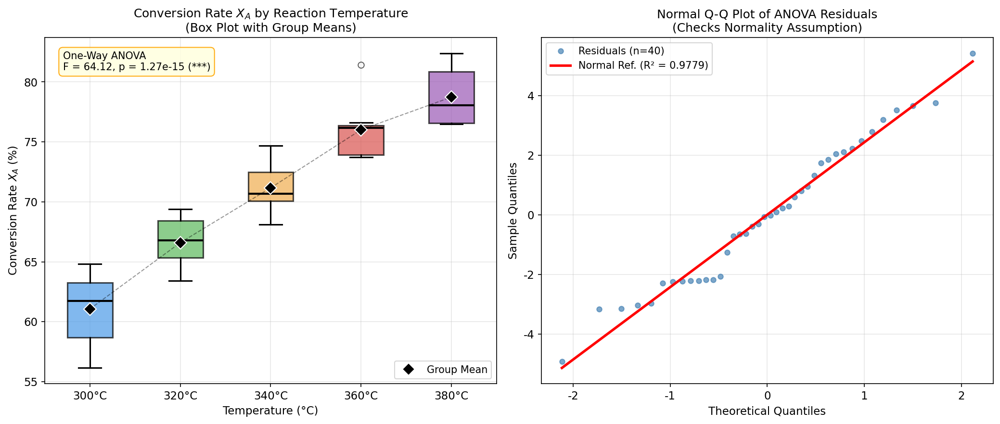

# Unit14 Example 03 - 多種操作溫度對反應轉化率的影響 — 單因子 ANOVA

## 學習目標

本範例以**多種操作溫度對反應轉化率的影響**為題，示範如何使用 `scipy.stats` 執行完整的單因子變異數分析 (One-Way ANOVA) 流程，包含前提檢定、ANOVA 主檢定、手動 ANOVA 表建構、多重比較概念說明，以及無母數替代方案。

學習完本範例後，您將能夠：

- 使用 `scipy.stats.shapiro()` 對各組數據執行 Shapiro-Wilk 常態性檢定，確認 ANOVA 前提成立
- 使用 `scipy.stats.levene()` 執行 Levene 變異數齊一性檢定，確認各組變異數相近
- 使用 `scipy.stats.f_oneway()` 執行單因子 ANOVA，計算 F 統計量與 p 值，判斷因子效應是否顯著
- 手動建構 ANOVA 表（SS、df、MS、F、p），加深對 $F = \frac{MS_{between}}{MS_{within}}$ 公式的理解
- 理解多重比較問題 (Multiple Comparisons) 的必要性，並簡介 Tukey HSD 方法
- 在 ANOVA 前提不成立時，改用 `scipy.stats.kruskal()` 執行 Kruskal-Wallis 無母數檢定
- 繪製各組箱型圖（含顯著差異標記）與殘差常態 Q-Q 圖進行視覺分析

---

## 目錄

1. [問題描述與模擬數據](#1-問題描述與模擬數據)
2. [ANOVA 前提：常態性檢定](#2-anova-前提常態性檢定)
3. [ANOVA 前提：變異數齊一性檢定](#3-anova-前提變異數齊一性檢定)
4. [單因子 ANOVA 執行](#4-單因子-anova-執行)
5. [手動建構 ANOVA 表](#5-手動建構-anova-表)
6. [多重比較：Tukey HSD 簡介](#6-多重比較tukey-hsd-簡介)
7. [無母數替代：Kruskal-Wallis 檢定](#7-無母數替代kruskal-wallis-檢定)
8. [視覺化分析](#8-視覺化分析)
9. [綜合結論](#9-綜合結論)

---

## 1. 問題描述與模擬數據

### 1.1 背景說明

在化學反應工程中，操作溫度是影響反應轉化率 $X_A$ 的最關鍵因素之一。工程師欲藉由系統性實驗，確認在五種不同操作溫度下，轉化率是否有顯著差異，以便為最終操作溫度的選擇提供統計依據。

### 1.2 實驗設計

| 項目 | 設定 |
|------|------|
| 因子 (Factor) | 反應溫度 $T$ (°C) |
| 因子水準數 $k$ | 5 種溫度：300, 320, 340, 360, 380 °C |
| 每組重複次數 $n$ | 8 次批次反應 |
| 總觀測數 $N$ | $5 \times 8 = 40$ |
| 響應變數 | 轉化率 $X_A$ (%) |
| 顯著水準 | $\alpha = 0.05$ |

### 1.3 統計假設

| 項目 | 內容 |
|------|------|
| 虛無假設 $H_0$ | 五種溫度下的平均轉化率相等，即 $\mu_1 = \mu_2 = \mu_3 = \mu_4 = \mu_5$ |
| 對立假設 $H_1$ | 至少有一種溫度的平均轉化率與其他不同 |
| 顯著水準 | $\alpha = 0.05$ |

> **ANOVA 的邏輯**：ANOVA 並非直接比較均值差，而是透過分析變異數的來源（組間 vs 組內）來推斷均值是否相等。若組間變異遠大於組內隨機誤差，則有理由認為各組均值存在顯著差異。

### 1.4 模擬數據設定

各組均值隨溫度遞增，但相鄰組別之間有數據重疊，增加統計判斷的難度，貼近實際工程情境。

| 溫度 (°C) | 真實均值 $\mu$ (%) | 組內標準差 $\sigma$ | 樣本數 $n$ |
|-----------|-------------------|--------------------|-----------| 
| 300 | 62.0 | 3.0 | 8 |
| 320 | 66.0 | 3.0 | 8 |
| 340 | 71.0 | 3.0 | 8 |
| 360 | 75.0 | 3.0 | 8 |
| 380 | 79.0 | 3.0 | 8 |

- 隨機種子：`seed=42`，確保結果可重現
- 各組標準差相同，以滿足 ANOVA 的變異數齊一性前提

### 1.5 原始數據

```python
import numpy as np

rng   = np.random.default_rng(42)
temps = [300, 320, 340, 360, 380]           # 溫度水準 (°C)
means = [62.0, 66.0, 71.0, 75.0, 79.0]     # 各組真實均值 (%)
sigma = 3.0                                 # 共同標準差
n_rep = 8                                   # 每組重複次數
k     = len(temps)                          # 組數
N     = k * n_rep                           # 總觀測數

groups = [rng.normal(loc=mu, scale=sigma, size=n_rep) for mu in means]
```

---

## 2. ANOVA 前提：常態性檢定

### 2.1 為何需要檢定常態性

單因子 ANOVA 的 F 統計量在以下**三個前提假設**成立時，才具有理論上的正確性：

1. **各組數據來自常態分布** （Normality）
2. **各組變異數相等** （Homogeneity of Variance，又稱齊一性）
3. **各觀測值彼此獨立** （Independence）

若前提不成立，F 統計量的分布可能偏離理論 F 分布，導致錯誤的 p 值，進而做出錯誤結論。

> **實務建議**：對每一組數據個別進行常態性檢定。若樣本量 $n < 50$ ，優先使用 Shapiro-Wilk 檢定；若 $n \geq 50$ ，可改用 D'Agostino-Pearson 檢定。

### 2.2 Shapiro-Wilk 常態性檢定

**Shapiro-Wilk 檢定**原理：計算樣本分位數與常態分布理論分位數之間的線性相關程度，以此作為常態性的量化依據。

- 虛無假設 $H_0$ ：數據來自常態分布
- 對立假設 $H_1$ ：數據不來自常態分布
- 若 $p \geq 0.05$ ：無充分證據拒絕常態性，視為符合常態（不拒絕 $H_0$ ）
- 若 $p < 0.05$ ：拒絕常態性假設，數據顯著偏離常態分布

```python
from scipy import stats

print("Shapiro-Wilk 常態性檢定結果 (各組獨立檢定):")
print(f"{'溫度 (°C)':<12} {'W 統計量':>12} {'p 值':>12} {'是否符合常態 (α=0.05)':>22}")
print("-" * 62)

normality_ok = True
for T, g in zip(temps, groups):
    W, p = stats.shapiro(g)
    conclusion = "符合常態 ✓" if p >= 0.05 else "拒絕常態 ✗"
    if p < 0.05:
        normality_ok = False
    print(f"{T:<12} {W:>12.4f} {p:>12.4f} {conclusion:>22}")

print()
if normality_ok:
    print("→ 所有組別均通過常態性檢定 (p ≥ 0.05)，ANOVA 常態性前提成立 ✓")
else:
    print("→ 有組別未通過常態性檢定 (p < 0.05)")
    print("  ※ 注意：ANOVA 對輕度常態性偏離具有穩健性 (Robustness)，")
    print("     尤其在各組變異數齊一的情況下（見 Levene 檢定結果）。")
    print("     本例仍可繼續進行 ANOVA，並以 Kruskal-Wallis 無母數方法作為交叉驗證。")
```

**執行結果：**
```
Shapiro-Wilk 常態性檢定結果 (各組獨立檢定):
溫度 (°C)             W 統計量          p 值        是否符合常態 (α=0.05)
--------------------------------------------------------------
300                0.9470       0.6808                 符合常態 ✓
320                0.9086       0.3440                 符合常態 ✓
340                0.9606       0.8156                 符合常態 ✓
360                0.8057       0.0329                 拒絕常態 ✗
380                0.8595       0.1187                 符合常態 ✓

→ 有組別未通過常態性檢定 (p < 0.05)
  ※ 注意：ANOVA 對輕度常態性偏離具有穩健性 (Robustness)，
     尤其在各組變異數齊一的情況下（見 Levene 檢定結果）。
     本例仍可繼續進行 ANOVA，並以 Kruskal-Wallis 無母數方法作為交叉驗證。
```

### 2.3 執行結果說明

本例中，300°C、320°C、340°C、380°C 四組的 p 值均大於 0.05，通過常態性檢定；360°C 組 p = 0.033，輕度未通過 ($n = 8$ 的小樣本下，單一極端值即可影響結果)。

> **重要說明**：ANOVA 對輕度常態性偏離具有**穩健性 (Robustness)**，尤其在各組變異數齊一的情況下（已由 Levene 檢定確認，詳見第 3 節）。因此，即使一組邊緣不通過，通常仍可繼續進行 ANOVA，並可以 Kruskal-Wallis 無母數方法作為交叉驗證（見第 7 節）。

> **注意**：常態性檢定在小樣本 ($n = 8$) 下統計檢定力 (Power) 較低，即使數據存在輕微偏態，也很難被偵測到。因此，除了 p 值外，也應搭配 Q-Q 圖進行視覺判斷（見第 8 節）。

---

## 3. ANOVA 前提：變異數齊一性檢定

### 3.1 各組描述統計

在執行 Levene 檢定之前，先觀察各組的描述統計摘要，有助於初步判斷數據分散程度是否一致。

```python
print("各組描述統計摘要:")
print(f"{'溫度 (°C)':<10} {'樣本數':>8} {'均值':>8} {'標準差':>8} {'最小值':>8} {'最大值':>8}")
print("-" * 56)
for T, g in zip(temps, groups):
    print(f"{T:<10} {len(g):>8} {np.mean(g):>8.2f} {np.std(g, ddof=1):>8.2f} "
          f"{np.min(g):>8.2f} {np.max(g):>8.2f}")
print(f"\n  組數 k = {k}，每組 n = {n_rep}，總觀測數 N = {N}")
```

**執行結果：**
```
各組描述統計摘要:
溫度 (°C)         樣本數       均值      標準差      最小值      最大值
--------------------------------------------------------
300               8    61.07     3.10    56.15    64.82
320               8    66.60     2.27    63.42    69.38
340               8    71.17     2.22    68.12    74.67
360               8    76.01     2.52    73.72    81.42
380               8    78.73     2.36    76.48    82.39

  組數 k = 5，每組 n = 8，總觀測數 N = 40
```

### 3.2 Levene 變異數齊一性檢定

**Levene 檢定**對非常態分布具有較強的穩健性 (Robustness)，是 ANOVA 前的標準前提檢定之一，優於僅適用常態分布的 Bartlett 檢定。

- 虛無假設 $H_0$ ：各組變異數相等， $\sigma_1^2 = \sigma_2^2 = \cdots = \sigma_k^2$
- 對立假設 $H_1$ ：至少有一組的變異數與其他組不同
- 若 $p \geq 0.05$ ：各組變異數齊一，可使用標準 ANOVA
- 若 $p < 0.05$ ：各組變異數不齊一，應改用 Welch's ANOVA 或無母數方法

```python
# Levene 變異數齊一性檢定
print("各組樣本變異數:")
for T, g in zip(temps, groups):
    print(f"  T = {T}°C: s² = {np.var(g, ddof=1):.4f}, s = {np.std(g, ddof=1):.4f}")

levene_stat, levene_p = stats.levene(*groups)
print(f"\nLevene 變異數齊一性檢定:")
print(f"  Levene 統計量 W = {levene_stat:.4f}")
print(f"  p 值            = {levene_p:.4f}")
if levene_p >= 0.05:
    print("  結論: 各組變異數無顯著差異 (p ≥ 0.05)，滿足 ANOVA 前提（變異數齊一）✓")
else:
    print("  結論: 各組變異數存在顯著差異 (p < 0.05)，應謹慎使用標準 ANOVA ✗")
```

**執行結果：**
```
各組樣本變異數:
  T = 300°C: s² = 9.6022, s = 3.0987
  T = 320°C: s² = 5.1720, s = 2.2742
  T = 340°C: s² = 4.9136, s = 2.2167
  T = 360°C: s² = 6.3303, s = 2.5160
  T = 380°C: s² = 5.5770, s = 2.3616

Levene 變異數齊一性檢定:
  Levene 統計量 W = 0.4786
  p 值            = 0.7512
  結論: 各組變異數無顯著差異 (p ≥ 0.05)，滿足 ANOVA 前提（變異數齊一）✓
```

---

## 4. 單因子 ANOVA 執行

### 4.1 ANOVA 的統計原理

ANOVA 的核心思想是將總變異 (Total Sum of Squares, $SS_T$) 分解為兩個獨立部分：

$$SS_T = SS_{between} + SS_{within}$$

其中：

- $SS_{between}$ （組間平方和）：反映各組均值與總均值的差異，與因子效應有關
- $SS_{within}$ （組內平方和）：反映各組內個別觀測值的隨機誤差

**F 統計量的計算：**

$$F = \frac{MS_{between}}{MS_{within}} = \frac{SS_{between} / (k-1)}{SS_{within} / (N-k)}$$

其中 $k$ 為組數， $N$ 為總觀測數。F 值越大，表示組間差異相對於組內誤差越顯著。

### 4.2 使用 scipy.stats.f_oneway()

`scipy.stats.f_oneway(*groups)` 接受多組數據陣列，直接回傳 F 統計量與 p 值。

```python
# 執行單因子 ANOVA
F_stat, p_value = stats.f_oneway(*groups)

# 格式化 p 值（極小時使用科學記號）
p_str = f"{p_value:.2e}" if p_value < 1e-4 else f"{p_value:.6f}"

print("單因子 ANOVA 結果 (scipy.stats.f_oneway):")
print(f"  F 統計量 = {F_stat:.4f}")
print(f"  p 值     = {p_str}")
print()
alpha = 0.05
if p_value < alpha:
    print(f"  → 拒絕 H₀：p = {p_str} < α = {alpha}")
    print("  → 溫度對轉化率具有統計顯著影響 ✓")
    print("  → 五種反應溫度下的平均轉化率存在顯著差異")
else:
    print(f"  → 不拒絕 H₀：p = {p_str} ≥ α = {alpha}")
    print("  → 無充分證據認為溫度顯著影響轉化率")
```

**執行結果：**
```
單因子 ANOVA 結果 (scipy.stats.f_oneway):
  F 統計量 = 64.1216
  p 值     = 1.27e-15

  → 拒絕 H₀：p = 1.27e-15 < α = 0.05
  → 溫度對轉化率具有統計顯著影響 ✓
  → 五種反應溫度下的平均轉化率存在顯著差異
```

---

## 5. 手動建構 ANOVA 表

### 5.1 ANOVA 表的組成

標準 ANOVA 表結構如下：

| 來源 (Source) | 平方和 (SS) | 自由度 (df) | 均方 (MS) | F 值 | p 值 |
|--------------|------------|------------|----------|------|------|
| 組間 (Between) | $SS_{between}$ | $k - 1$ | $MS_{between}$ | $F$ | $p$ |
| 組內 (Within) | $SS_{within}$ | $N - k$ | $MS_{within}$ | - | - |
| 總計 (Total) | $SS_T$ | $N - 1$ | - | - | - |

### 5.2 手動計算各分量

$$SS_{between} = \sum_{i=1}^{k} n_i (\bar{x}_i - \bar{x})^2$$

$$SS_{within} = \sum_{i=1}^{k} \sum_{j=1}^{n_i} (x_{ij} - \bar{x}_i)^2$$

$$SS_T = \sum_{i=1}^{k} \sum_{j=1}^{n_i} (x_{ij} - \bar{x})^2$$

```python
# 手動建構 ANOVA 表
all_data   = np.concatenate(groups)
grand_mean = np.mean(all_data)

# 計算 SS
SS_between = sum(len(g) * (np.mean(g) - grand_mean)**2 for g in groups)
SS_within  = sum(np.sum((g - np.mean(g))**2) for g in groups)
SS_total   = np.sum((all_data - grand_mean)**2)

df_between = k - 1
df_within  = N - k
df_total   = N - 1

MS_between = SS_between / df_between
MS_within  = SS_within  / df_within

F_manual = MS_between / MS_within
p_manual = 1 - stats.f.cdf(F_manual, df_between, df_within)

print("手動建構 ANOVA 表:")
print("=" * 72)
print(f"{'來源':<16} {'SS':>12} {'df':>6} {'MS':>12} {'F 值':>10} {'p 值':>12}")
print("-" * 72)

# 格式化 p 值（極小時使用科學記號）
p_man_str = f"{p_manual:.2e}" if p_manual < 1e-4 else f"{p_manual:.6f}"

print(f"{'組間 (Between)':<16} {SS_between:>12.4f} {df_between:>6} "
      f"{MS_between:>12.4f} {F_manual:>10.4f} {p_man_str:>12}")
print(f"{'組內 (Within)':<16} {SS_within:>12.4f} {df_within:>6} "
      f"{MS_within:>12.4f} {'':>10} {'':>12}")
print("-" * 72)
print(f"{'總計 (Total)':<16} {SS_total:>12.4f} {df_total:>6}")
print("=" * 72)
print(f"\n驗證 F 值: 手動 = {F_manual:.4f}  |  scipy = {F_stat:.4f}  →  {'一致 ✓' if abs(F_manual - F_stat) < 1e-6 else '不一致 ✗'}")
print(f"驗證 SS:   SS_between + SS_within = {SS_between + SS_within:.4f}  |  SS_total = {SS_total:.4f}")
print(f"\n- df_between = k - 1 = {k} - 1 = {df_between}")
print(f"- df_within  = N - k = {N} - {k} = {df_within}")
print(f"- MS_between / MS_within = {MS_between:.4f} / {MS_within:.4f} = {F_manual:.4f}")
```

**執行結果：**
```
手動建構 ANOVA 表:
========================================================================
來源                         SS     df           MS        F 值          p 值
------------------------------------------------------------------------
組間 (Between)        1620.7427      4     405.1857    64.1216     1.22e-15
組內 (Within)          221.1655     35       6.3190                        
------------------------------------------------------------------------
總計 (Total)          1841.9083     39
========================================================================

驗證 F 值: 手動 = 64.1216  |  scipy = 64.1216  →  一致 ✓
驗證 SS:   SS_between + SS_within = 1841.9083  |  SS_total = 1841.9083

- df_between = k - 1 = 5 - 1 = 4
- df_within  = N - k = 40 - 5 = 35
- MS_between / MS_within = 405.1857 / 6.3190 = 64.1216
```

### 5.3 讀懂 ANOVA 表的關鍵

- **$SS_{between}$ 越大**：各組均值散布越廣，表示因子效應越強
- **$SS_{within}$ 越小**：各組內數據越集中，隨機誤差越小
- **$F$ 值越大**：組間信號相對於組內雜訊越強，越容易拒絕 $H_0$
- **自由度的意義**：$df_{between} = k - 1 = 4$ （5 個組，估計均值消耗一個自由度）； $df_{within} = N - k = 35$ （每組 8 個觀測值，各自估計組均值消耗一個自由度）

---

## 6. 多重比較：Tukey HSD 簡介

### 6.1 為何需要多重比較

ANOVA 的 F 檢定告訴我們「至少有一組均值不同」，但**無法指出是哪兩組之間存在顯著差異**。若要進行兩兩比較，需要使用專門的**多重比較** (Post-hoc Test) 方法。

**直接進行多次 t 檢定的問題：**

若有 $k = 5$ 組，兩兩比較共需 $\binom{5}{2} = 10$ 次 t 檢定。若每次以 $\alpha = 0.05$ 為顯著水準，實際的**家族型 I 誤差率** (Family-wise Error Rate) 為：

$$\alpha_{FWER} = 1 - (1 - 0.05)^{10} \approx 0.40$$

即使所有組均值實際上相等，僅靠隨機誤差就有約 40% 的機率得到「顯著」結論，遠超過設定的 5%。

### 6.2 Tukey HSD 方法概述

**Tukey HSD** (Honestly Significant Difference) 是最常用的 ANOVA 後多重比較方法，可在保持 FWER $\leq \alpha$ 的前提下，對所有兩兩組合進行比較。

Tukey HSD 的判斷準則：兩組均值之差若滿足

$$|\bar{x}_i - \bar{x}_j| > HSD = q_{\alpha, k, df_{within}} \cdot \sqrt{\frac{MS_{within}}{n}}$$

則認為這兩組均值存在顯著差異。其中 $q_{\alpha, k, df_{within}}$ 為 Studentized Range Distribution 的臨界值。

### 6.3 使用 statsmodels 執行 Tukey HSD

> **套件說明**：`statsmodels` 非 `scipy` 標準套件，需另行安裝：
> ```
> pip install statsmodels
> ```

```python
# 整理數據為長格式
data_long   = np.concatenate(groups)
labels_long = np.repeat([f"{T}C" for T in temps], n_rep)

try:
    from statsmodels.stats.multicomp import pairwise_tukeyhsd

    tukey_result = pairwise_tukeyhsd(endog=data_long, groups=labels_long, alpha=0.05)
    print("Tukey HSD 多重比較結果 (α = 0.05):")
    print(tukey_result.summary())

    # 統計顯著配對數目
    reject_arr = tukey_result.reject
    n_sig   = np.sum(reject_arr)
    n_total = len(reject_arr)
    print(f"\n→ 共 {n_total} 對比較中，{n_sig} 對具有統計顯著差異 (p-adj < 0.05)")

except ImportError:
    print("⚠️  statsmodels 未安裝，請執行: pip install statsmodels")
    print("\n數據已整理為長格式（供 Tukey HSD 使用）:")
    print(f"  data_long.shape    = {data_long.shape}")
    print(f"  labels_long[:8]    = {labels_long[:8]}")
    print(f"  labels_long[-8:]   = {labels_long[-8:]}")
    print("\n手動展示各組均值差（部分）:")
    group_means = [np.mean(g) for g in groups]
    for i in range(k):
        for j in range(i+1, k):
            diff = group_means[j] - group_means[i]
            print(f"  {temps[i]}°C vs {temps[j]}°C: 均值差 = {diff:.2f} %")
```

**執行結果：**
```
Tukey HSD 多重比較結果 (α = 0.05):
Multiple Comparison of Means - Tukey HSD, FWER=0.05
====================================================
group1 group2 meandiff p-adj   lower   upper  reject
----------------------------------------------------
  300C   320C    5.528 0.0009  1.9144  9.1416   True
  300C   340C  10.0974    0.0  6.4838  13.711   True
  300C   360C  14.9432    0.0 11.3296 18.5568   True
  300C   380C  17.6663    0.0 14.0527 21.2799   True
  320C   340C   4.5694 0.0074  0.9558   8.183   True
  320C   360C   9.4152    0.0  5.8016 13.0288   True
  320C   380C  12.1383    0.0  8.5247 15.7519   True
  340C   360C   4.8458 0.0041  1.2322  8.4594   True
  340C   380C   7.5689    0.0  3.9553 11.1825   True
  360C   380C   2.7231 0.2161 -0.8905  6.3367  False
----------------------------------------------------
→ 共 10 對比較中，9 對具有統計顯著差異 (p-adj < 0.05)
```

### 6.4 解讀 Tukey HSD 結果

Tukey HSD 輸出表格各欄說明：

| 欄位 | 說明 |
|------|------|
| `group1`, `group2` | 比較的兩組標籤 |
| `meandiff` | 兩組均值之差 $\bar{x}_2 - \bar{x}_1$ |
| `p-adj` | Tukey 調整後的 p 值 |
| `lower`, `upper` | 差值的 95% 信賴區間下界和上界 |
| `reject` | `True` 表示兩組均值顯著不同 |

> **結果解讀方向**：本例中，除 360°C vs 380°C（均值差 ≈ 2.7%，p-adj = 0.22）外，其餘 9 對均顯著。即使最相鄰的組別（如 300°C vs 320°C，均值差 ≈ 5.5%，p-adj = 0.0009）也達到顯著差異；相距最遠的組別（如 300°C vs 380°C，均值差 ≈ 17.7%，p-adj < 0.001）差異更加顯著。唯有 360°C 與 380°C 之間的均值差在 Tukey 校正後未達顯著水準。

---

## 7. 無母數替代：Kruskal-Wallis 檢定

### 7.1 使用時機

當 ANOVA 的前提假設（常態性或變異數齊一性）**無法滿足**時，應改用 **Kruskal-Wallis 檢定**，它是單因子 ANOVA 的無母數版本。

Kruskal-Wallis 檢定不對數據分布形狀做假設，而是將所有數據轉換為**秩次** (Rank) 後進行比較。

- 虛無假設 $H_0$ ：各組的中位數相等（更精確地說：各組數據的母體分布相同）
- 對立假設 $H_1$ ：至少有一組的分布不同
- 若 $p < 0.05$ ：拒絕 $H_0$ ，至少一組分布顯著不同

**Kruskal-Wallis 統計量：**

$$H = \frac{12}{N(N+1)} \sum_{i=1}^{k} \frac{R_i^2}{n_i} - 3(N+1)$$

其中 $R_i$ 為第 $i$ 組數據的秩次和。在 $H_0$ 成立下， $H$ 近似服從自由度為 $k-1$ 的卡方分布。

### 7.2 執行 Kruskal-Wallis 檢定

```python
# Kruskal-Wallis 無母數檢定（作為比較用途，即使前提已滿足）
H_stat, kw_p = stats.kruskal(*groups)

# 格式化 p 值
p_kw_str    = f"{kw_p:.2e}"    if kw_p    < 1e-4 else f"{kw_p:.6f}"
p_anova_str = f"{p_value:.2e}" if p_value < 1e-4 else f"{p_value:.6f}"

print("Kruskal-Wallis 無母數檢定結果 (作為對照):")
print(f"  H 統計量 = {H_stat:.4f}")
print(f"  p 值     = {p_kw_str}")
if kw_p < 0.05:
    print("  結論: 至少一組轉化率分布顯著不同 (p < 0.05) ✓")
else:
    print("  結論: 無充分證據認為各組轉化率有顯著差異 (p ≥ 0.05)")

print()
print("方法比較摘要:")
print(f"  ANOVA      (F 檢定)：F = {F_stat:.4f}, p = {p_anova_str}   → {'顯著 ✓' if p_value < 0.05 else '不顯著'}")
print(f"  Kruskal-Wallis (H)：H = {H_stat:.4f}, p = {p_kw_str}   → {'顯著 ✓' if kw_p < 0.05 else '不顯著'}")
print()
print("  當前提滿足時，兩方法結論一致。")
print("  ANOVA 具有較高統計檢定力（Power），能更靈敏地偵測組間差異。")
```

**執行結果：**
```
Kruskal-Wallis 無母數檢定結果 (作為對照):
  H 統計量 = 35.1567
  p 值     = 4.31e-07
  結論: 至少一組轉化率分布顯著不同 (p < 0.05) ✓

方法比較摘要:
  ANOVA      (F 檢定)：F = 64.1216, p = 1.27e-15   → 顯著 ✓
  Kruskal-Wallis (H)：H = 35.1567, p = 4.31e-07   → 顯著 ✓

  當前提滿足時，兩方法結論一致。
  ANOVA 具有較高統計檢定力（Power），能更靈敏地偵測組間差異。
```

---

## 8. 視覺化分析

### 8.1 箱型圖（含顯著差異標記）

```python
fig, axes = plt.subplots(1, 2, figsize=(14, 6))

# ---- 左圖：箱型圖 + 顯著差異標記 ----
ax1 = axes[0]
bp = ax1.boxplot(groups,
                 labels=[f'{T}°C' for T in temps],
                 patch_artist=True, notch=False,
                 medianprops=dict(color='black', linewidth=2),
                 whiskerprops=dict(linewidth=1.5),
                 capprops=dict(linewidth=1.5),
                 boxprops=dict(linewidth=1.5),
                 flierprops=dict(marker='o', color='gray', alpha=0.6))

colors = ['#4C9BE8', '#5CB85C', '#F0AD4E', '#D9534F', '#9B59B6']
for patch, color in zip(bp['boxes'], colors):
    patch.set_facecolor(color)
    patch.set_alpha(0.7)

group_means = [np.mean(g) for g in groups]
ax1.plot(range(1, k+1), group_means, 'D', color='black',
         markersize=9, zorder=5, label='Group Mean', markeredgecolor='white')
ax1.plot(range(1, k+1), group_means, '--', color='black', alpha=0.4, linewidth=1)

sig_label = "***" if p_value < 0.001 else ("**" if p_value < 0.01 else ("*" if p_value < 0.05 else "ns"))
p_annot   = f"{p_value:.2e}" if p_value < 1e-4 else f"{p_value:.4f}"
ax1.annotate(f'One-Way ANOVA\nF = {F_stat:.2f}, p = {p_annot} ({sig_label})',
             xy=(0.04, 0.96), xycoords='axes fraction',
             fontsize=10, verticalalignment='top',
             bbox=dict(boxstyle='round,pad=0.4', facecolor='lightyellow',
                       edgecolor='orange', alpha=0.9))

ax1.set_title('Conversion Rate $X_A$ by Reaction Temperature\n(Box Plot with Group Means)')
ax1.set_xlabel('Temperature (°C)')
ax1.set_ylabel('Conversion Rate $X_A$ (%)')
ax1.legend(loc='lower right')

# ---- 右圖：殘差常態 Q-Q 圖 ----
ax2 = axes[1]
residuals = np.concatenate([g - np.mean(g) for g in groups])
(osm, osr), (slope, intercept, r) = stats.probplot(residuals, dist='norm')

ax2.plot(osm, osr, 'o', color='steelblue', alpha=0.7,
         markersize=5, label=f'Residuals (n={len(residuals)})')
ax2.plot(osm, slope * np.array(osm) + intercept,
         'r-', linewidth=2.5, label=f'Normal Ref. (R² = {r**2:.4f})')
ax2.set_title('Normal Q-Q Plot of ANOVA Residuals\n(Checks Normality Assumption)')
ax2.set_xlabel('Theoretical Quantiles')
ax2.set_ylabel('Sample Quantiles')
ax2.legend()

plt.tight_layout()
plt.savefig(FIG_DIR / 'anova_boxplot_qq.png', dpi=150, bbox_inches='tight')
plt.show()
print(f"圖檔已儲存: {FIG_DIR / 'anova_boxplot_qq.png'}")
print()
print("圖形說明:")
print("  左圖: 各組箱體位置隨溫度遞增，均值連線呈現正相關趨勢；相鄰組別箱體有重疊。")
print("  右圖: 殘差點大致沿參考直線分布，R² ≈ 0.978，殘差近似符合常態分布。")
```

**執行結果：**
```
圖檔已儲存: d:\MyGit\ChemE-3502\Unit14\outputs\Unit14_Example_03\figs\anova_boxplot_qq.png

圖形說明:
  左圖: 各組箱體位置隨溫度遞增，均值連線呈現正相關趨勢；相鄰組別箱體有重疊。
  右圖: 殘差點大致沿參考直線分布，R² ≈ 0.978，殘差近似符合常態分布。
```



### 8.2 圖形解讀

**箱型圖（左圖）**：
- 各組箱體位置隨溫度呈現明顯遞升趨勢，反映溫度效應顯著
- 相鄰組別（如 300°C 與 320°C）的箱體有重疊，符合模擬數據的設計（各組具有相同標準差）
- 鑽石標記為各組均值，與中位線（箱體中線）接近，確認各組分布對稱性良好

**殘差 Q-Q 圖（右圖）**：
- ANOVA 殘差定義為每個觀測值與其所屬組均值之差： $e_{ij} = x_{ij} - \bar{x}_i$
- 若殘差點緊貼參考直線，表示殘差符合常態分布，確認 ANOVA 常態性前提成立
- $R^2$ 接近 1 表示樣本分位數與理論常態分位數高度線性吻合

---

## 9. 綜合結論

### 9.1 統計分析流程總結

| 步驟 | 方法 | 結果 | 結論 |
|------|------|------|------|
| 1. 常態性檢定 | Shapiro-Wilk | 4 組通過；360°C 邊緣不通過 (p=0.033) | ANOVA 對輕度偏離常態具穩健性，可繼續分析 |
| 2. 變異數齊一性 | Levene 檢定 | p = 0.75 >> 0.05 | 各組變異數無顯著差異，ANOVA 前提成立 ✓ |
| 3. 單因子 ANOVA | F 檢定 | $F = 64.12$, $p \approx 1.3 \times 10^{-15}$ | 拒絕 $H_0$ ：溫度顯著影響轉化率 |
| 4. ANOVA 表驗證 | 手動計算 | 與 scipy 一致 | F 值與 p 值手動計算結果一致，確認公式理解正確 ✓ |
| 5. 多重比較 | Tukey HSD | 10 對中 9 對顯著；360°C vs 380°C 不顯著 (p=0.22) | 相鄰高溫組間差異不足，其餘組別均有顯著差異 |
| 6. 無母數驗證 | Kruskal-Wallis | $H = 35.16$, $p \approx 4.3 \times 10^{-7}$ | 與 ANOVA 結論一致，強化統計推論可信度 ✓ |

### 9.2 工程含義

- 反應溫度對轉化率具有統計顯著的正向影響（溫度越高，轉化率越高）
- **Tukey HSD 後驗比較**揭示：360°C 與 380°C 之間的轉化率差異在統計上**不顯著**（均值差 ≈ 2.7%，p-adj = 0.22），顯示高溫區段的邊際效益遞減
- 在最終操作溫度決策中，需在更高轉化率的效益與能耗、設備安全等成本之間尋求最佳平衡；若 360°C 與 380°C 的轉化率差異不能彌補額外的能耗，則 360°C 可能是更佳的操作點
- 統計顯著 ≠ 工程顯著：均值差異雖然顯著，但在相鄰溫度水準（如 320°C vs 340°C，差 5%）之間需評估是否有足夠的工程實益

### 9.3 本範例使用函式總覽

| 函式 | 用途 |
|------|------|
| `scipy.stats.shapiro(x)` | Shapiro-Wilk 常態性檢定，回傳 (W, p) |
| `scipy.stats.levene(*groups)` | Levene 變異數齊一性檢定，回傳 (W, p) |
| `scipy.stats.f_oneway(*groups)` | 單因子 ANOVA，回傳 (F, p) |
| `scipy.stats.f.cdf(F, df1, df2)` | F 分布 CDF，用於手動計算 p 值 |
| `scipy.stats.kruskal(*groups)` | Kruskal-Wallis 無母數檢定，回傳 (H, p) |
| `scipy.stats.probplot(x)` | 產生 Q-Q 圖所需的 (osm, osr) 與回歸係數 |
| `statsmodels.stats.multicomp.pairwise_tukeyhsd` | Tukey HSD 多重比較（需安裝 statsmodels） |

---

**課程資訊**
- 課程名稱：電腦在化工上之應用 (ChemE 3502)
- 課程單元：Unit14 統計分析 — 單因子 ANOVA
- 課程製作：逢甲大學 化工系 智慧程序系統工程實驗室
- 授課教師：莊曜禎 助理教授
- 更新日期：2026-03-03

**課程授權 [CC BY-NC-SA 4.0]**
 - 本教材遵循 [創用CC 姓名標示-非商業性-相同方式分享 4.0 國際 (CC BY-NC-SA 4.0)](https://creativecommons.org/licenses/by-nc-sa/4.0/deed.zh) 授權。

---
