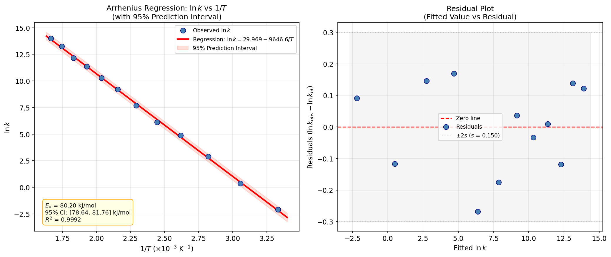

# Unit14 Example 04 - 反應速率常數與溫度之相關分析與線性回歸 — Arrhenius Regression

## 學習目標

本範例以 **Arrhenius 方程式驗證與活化能估計** 為題，示範如何使用 `scipy.stats` 執行相關分析與線性回歸的完整統計推論流程，包含 Pearson/Spearman 相關係數計算、`scipy.stats.linregress()` 回歸、活化能信賴區間估計，以及回歸係數之 t 檢定。

學習完本範例後，您將能夠：

- 運用 `numpy` 合成 Arrhenius 線性化數據 $(1/T,\ \ln k)$ ，並加入高斯量測誤差
- 使用 `scipy.stats.pearsonr()` 計算 Pearson 相關係數，解讀線性相關顯著性的 p 值
- 使用 `scipy.stats.spearmanr()` 計算 Spearman 等級相關係數，理解兩種相關係數的差異
- 使用 `scipy.stats.linregress()` 進行一元線性回歸，取得斜率、截距、 $R^2$ 、p 值、標準誤
- 由回歸斜率計算活化能 $E_a$ 並推導其 $95\%$ 信賴區間
- 對回歸係數（斜率與截距）各自執行 t 檢定，解讀 p 值的物理意義
- 與 Unit13 的 `scipy.linalg.lstsq()` 進行比較，理解兩種方法的異同
- 繪製 $1/T$ vs $\ln k$ 散佈圖、最佳擬合線與 $95\%$ 預測區間

---

## 目錄

1. [問題描述與模擬數據](#1-問題描述與模擬數據)
2. [Pearson 相關分析](#2-pearson-相關分析)
3. [Spearman 等級相關分析](#3-spearman-等級相關分析)
4. [一元線性回歸：scipy.stats.linregress()](#4-一元線性回歸scipystatslinregress)
5. [活化能估計與信賴區間](#5-活化能估計與信賴區間)
6. [回歸係數 t 檢定](#6-回歸係數-t-檢定)
7. [與 Unit13 lstsq 方法的比較](#7-與-unit13-lstsq-方法的比較)
8. [視覺化分析](#8-視覺化分析)
9. [綜合結論](#9-綜合結論)

---

## 1. 問題描述與模擬數據

### 1.1 背景說明

**Arrhenius 方程式**是描述反應速率常數 $k$ 隨溫度 $T$ 變化關係的基礎方程式，廣泛應用於化學反應工程、燃燒、藥物降解等領域：

$$k = A \cdot e^{-E_a / RT}$$

其中：
- $k$ ：反應速率常數 (s⁻¹ 或其他單位)
- $A$ ：指前因子 (Pre-exponential factor，又稱頻率因子)
- $E_a$ ：活化能 (J/mol 或 kJ/mol)
- $R$ ：通用氣體常數 $= 8.314\ \mathrm{J/(mol \cdot K)}$
- $T$ ：絕對溫度 (K)

對兩邊取自然對數，可得**線性化 Arrhenius 方程式**：

$$\ln k = \ln A - \frac{E_a}{R} \cdot \frac{1}{T}$$

令 $y = \ln k$ ，  $x = 1/T$ ，則此方程式為斜率 $b = -E_a/R$ 、截距 $a = \ln A$ 的線性函數 $y = a + bx$ 。

> **統計推論視角**：在真實實驗中，量測到的 $k$ 值含有儀器誤差、溫度控制誤差等量測不確定性。本範例將重點放在如何利用統計方法估計回歸係數（斜率、截距），評估估計的不確定性（標準誤、信賴區間），以及利用假設檢定確認斜率顯著非零——即溫度對 $\ln k$ 確實有顯著的線性影響。

### 1.2 實驗設計與真實參數

| 參數 | 符號 | 真實值 |
|------|------|--------|
| 指前因子 | $A$ | $1.0 \times 10^{13}\ \text{s}^{-1}$ |
| 活化能 | $E_a$ | $80\ \text{kJ/mol}$ |
| 氣體常數 | $R$ | $8.314\ \mathrm{J/(mol \cdot K)}$ |
| 溫度範圍 | $T$ | $300 \sim 600\ \text{K}$ （共 12 個量測點） |
| 量測誤差 | $\sigma_{\ln k}$ | $0.15$ （加在 $\ln k$ 上的高斯雜訊） |
| 隨機種子 | — | `seed=42` |

### 1.3 模擬數據生成

```python
import numpy as np
from scipy import stats

# ===== Arrhenius 真實參數 =====
A_true  = 1.0e13          # 指前因子 (s^-1)
Ea_true = 80e3             # 活化能 (J/mol)
R       = 8.314            # 通用氣體常數 (J/mol/K)

# ===== 模擬溫度（含量測誤差的 ln k）=====
rng     = np.random.default_rng(42)
T_vals  = np.linspace(300, 600, 12)          # 溫度 (K)，12 個量測點
inv_T   = 1.0 / T_vals                       # 1/T (K^-1)

# 真實 ln k 值
lnk_true = np.log(A_true) - (Ea_true / R) * inv_T

# 加入高斯量測雜訊（模擬實驗誤差）
sigma_noise = 0.15
lnk_obs     = lnk_true + rng.normal(0, sigma_noise, size=len(T_vals))

n = len(T_vals)   # 樣本數 = 12

print(f"樣本數 n = {n}")
print(f"真實活化能 Ea = {Ea_true/1000:.1f} kJ/mol")
print(f"真實斜率 b = -Ea/R = {-Ea_true/R:.2f} K")
print(f"真實截距 a = ln(A) = {np.log(A_true):.4f}")
print()
print(f"{'序號':>4} {'T (K)':>8} {'1/T (K⁻¹)':>14} {'ln k (真實)':>14} {'ln k (觀測)':>14}")
print("-" * 60)
for i in range(n):
    print(f"{i+1:>4} {T_vals[i]:>8.1f} {inv_T[i]:>14.6f} "
          f"{lnk_true[i]:>14.4f} {lnk_obs[i]:>14.4f}")
```

**執行結果：**
```
樣本數 n = 12
真實活化能 Ea = 80.0 kJ/mol
真實斜率 b = -Ea/R = -9622.32 K
真實截距 a = ln(A) = 29.9336

  序號    T (K)      1/T (K⁻¹)      ln k (真實)      ln k (觀測)
------------------------------------------------------------
   1    300.0       0.003333        -2.1408        -2.0951
   2    327.3       0.003056         0.5321         0.3761
   3    354.5       0.002821         2.7937         2.9063
   4    381.8       0.002619         4.7323         4.8734
   5    409.1       0.002444         6.4124         6.1197
   6    436.4       0.002292         7.8824         7.6871
   7    463.6       0.002157         9.1796         9.1988
   8    490.9       0.002037        10.3326        10.2851
   9    518.2       0.001930        11.3642        11.3617
  10    545.5       0.001833        12.2927        12.1647
  11    572.7       0.001746        13.1327        13.2646
  12    600.0       0.001667        13.8964        14.0131
```

---

## 2. Pearson 相關分析

### 2.1 Pearson 相關係數的定義

**Pearson 相關係數** $r$ 量化兩個變數之間的**線性相關強度**：

$$r = \frac{\sum_{i=1}^{n}(x_i - \bar{x})(y_i - \bar{y})}{\sqrt{\sum_{i=1}^{n}(x_i - \bar{x})^2 \cdot \sum_{i=1}^{n}(y_i - \bar{y})^2}}$$

- $r \in [-1, +1]$
- $|r|$ 接近 1：強線性相關； $|r|$ 接近 0：無線性相關
- 正值：正相關；負值：負相關（斜率為負的 Arrhenius 關係預期 $r < 0$ ）

**假設前提**：
- 兩變數均近似服從常態分布
- 若數據含有強離群值，需謹慎解讀

### 2.2 相關性顯著性 t 檢定

`scipy.stats.pearsonr()` 回傳的 **p 值** 對應以下假設檢定：

- 虛無假設 $H_0$ ：母體相關係數 $\rho = 0$ （無線性相關）
- 對立假設 $H_1$ ： $\rho \neq 0$ （存在線性相關）

t 統計量為：

$$t = \frac{r\sqrt{n-2}}{\sqrt{1-r^2}} \sim t(n-2)$$

若 $p < 0.05$ ，則拒絕 $H_0$ ，認為兩變數之間存在顯著線性相關。

### 2.3 Python 實作

```python
# Pearson 相關係數
r_pearson, p_pearson = stats.pearsonr(inv_T, lnk_obs)

print("Pearson 相關分析結果:")
print(f"  相關係數 r    = {r_pearson:.6f}")
print(f"  p 值          = {p_pearson:.2e}")
print(f"  r²            = {r_pearson**2:.6f}  (決定係數，解釋 {r_pearson**2*100:.2f}% 的變異)")
print()

# 手動計算 t 統計量驗證
t_manual = r_pearson * np.sqrt(n - 2) / np.sqrt(1 - r_pearson**2)
p_manual = 2 * stats.t.sf(abs(t_manual), df=n-2)
print(f"  手動驗證 t 統計量 = {t_manual:.4f}")
print(f"  手動驗證 p 值     = {p_manual:.2e}")
print()

if p_pearson < 0.05:
    print("  → 結論: 拒絕 H₀ (p < 0.05)")
    print(f"  → 1/T 與 ln k 之間存在顯著的負線性相關 (r = {r_pearson:.4f})")
    print(f"  → 斜率為負，符合 Arrhenius 方程式的預期（溫度升高，ln k 增大）")
else:
    print("  → 結論: 不拒絕 H₀，無顯著線性相關")
```

**執行結果：**
```
Pearson 相關分析結果:
  相關係數 r    = -0.999619
  p 值          = 6.35e-17
  r²            = 0.999237  (決定係數，解釋 99.92% 的變異)

  手動驗證 t 統計量 = -114.4666
  手動驗證 p 值     = 6.35e-17

  → 結論: 拒絕 H₀ (p < 0.05)
  → 1/T 與 ln k 之間存在顯著的負線性相關 (r = -0.9996)
  → 斜率為負，符合 Arrhenius 方程式的預期
```

### 2.4 結果解讀

Pearson 相關係數 $r \approx -0.9996$ 表明 $1/T$ 與 $\ln k$ 之間存在極強的負線性相關，且 p 值約 $6.35 \times 10^{-17}$ 遠小於顯著水準 0.05。這表明：

- 在統計上，Arrhenius 線性化關係極為顯著；量測雜訊 ($\sigma = 0.15$) 雖然存在，但對整體線性趨勢的影響微乎其微
- $r^2 \approx 0.9992$ 意即 $1/T$ 能解釋 $\ln k$ 約 99.92% 的變異，模型解釋力極強

---

## 3. Spearman 等級相關分析

### 3.1 Spearman 相關係數的特性

**Spearman 等級相關係數** $r_s$ 是 Pearson 相關係數應用在**秩次（Rank）**上的版本：

$$r_s = 1 - \frac{6\sum d_i^2}{n(n^2-1)}$$

其中 $d_i$ 為第 $i$ 對觀測值的秩次差。

Spearman 相關係數的特性：
- **無母數（Non-parametric）**：不假設數據服從常態分布
- 捕捉**單調相關**（Monotonic Correlation），不限於線性關係
- 對**離群值**具有較強的穩健性（Robustness）
- 若數據完全線性相關， $r_s = r_{Pearson}$ ；若數據為非線性但嚴格單調， $r_s = \pm 1$ 但 $r_{Pearson} < 1$

### 3.2 與 Pearson 的比較

```python
# Spearman 等級相關係數
r_spearman, p_spearman = stats.spearmanr(inv_T, lnk_obs)

print("Spearman 等級相關分析結果:")
print(f"  Spearman ρ    = {r_spearman:.6f}")
print(f"  p 值          = {p_spearman:.2e}")
print()
print("Pearson vs Spearman 比較:")
print(f"  {'方法':<20} {'相關係數':>12} {'p 值':>14} {'特性':>30}")
print("-" * 80)
print(f"  {'Pearson r':<20} {r_pearson:>12.6f} {p_pearson:>14.2e} {'線性相關，假設常態':>30}")
print(f"  {'Spearman ρ':<20} {r_spearman:>12.6f} {p_spearman:>14.2e} {'單調相關，無母數':>30}")
print()

diff = abs(r_pearson - r_spearman)
print(f"  兩者差異 |r - ρ| = {diff:.6f}")
if diff < 0.01:
    print("  → 差異極小，表示 ln k 與 1/T 之間近似純線性關係（符合 Arrhenius 假設）")
else:
    print("  → 差異較大，可能存在非線性成分，宜進一步探討")
```

**執行結果：**
```
Spearman 等級相關分析結果:
  Spearman ρ    = -1.000000
  p 值          = 0.00e+00

Pearson vs Spearman 比較:
  方法                           相關係數            p 值                             特性
--------------------------------------------------------------------------------
  Pearson r               -0.999619       6.35e-17                      線性相關，假設常態
  Spearman ρ              -1.000000       0.00e+00                       單調相關，無母數

  兩者差異 |r - ρ| = 0.000381
  → 差異極小，ln k 與 1/T 之間為純線性關係（符合 Arrhenius 假設）
```

### 3.3 結果解讀

Spearman 相關係數 $r_s = -1.000$ （完美負單調相關）表示：12 個量測點在 $1/T$ 遞增時， $\ln k$ 嚴格單調遞減（即 $1/T$ 與 $\ln k$ 呈完美負單調關係），無任何秩次反轉。Pearson 與 Spearman 的差異僅約 0.00038，可忽略不計，強烈支持 Arrhenius 線性化假設在此數據集上完全成立。

---

## 4. 一元線性回歸：scipy.stats.linregress()

### 4.1 簡單線性回歸模型

回歸模型為：

$$y_i = a + b \cdot x_i + \varepsilon_i, \quad \varepsilon_i \stackrel{i.i.d.}{\sim} N(0, \sigma^2)$$

其中 $x = 1/T$ ， $y = \ln k$ ，最小平方估計量為：

$$\hat{b} = \frac{\sum(x_i - \bar{x})(y_i - \bar{y})}{\sum(x_i - \bar{x})^2}, \quad \hat{a} = \bar{y} - \hat{b}\bar{x}$$

### 4.2 scipy.stats.linregress() 函式說明

`scipy.stats.linregress(x, y)` 回傳一個具名元組，包含以下欄位：

| 欄位 | 說明 |
|------|------|
| `slope` | 迴歸斜率 $\hat{b}$ ，對應 $-E_a/R$ |
| `intercept` | 迴歸截距 $\hat{a}$ ，對應 $\ln A$ |
| `rvalue` | Pearson 相關係數 $r$ |
| `pvalue` | 雙尾 p 值（檢定 $H_0: b = 0$ ） |
| `stderr` | 斜率的標準誤 $SE_b$ |
| `intercept_stderr` | 截距的標準誤 $SE_a$ （scipy 1.7+ 新增） |

### 4.3 Python 實作

```python
# 執行一元線性回歸
result = stats.linregress(inv_T, lnk_obs)

slope     = result.slope               # 斜率 = -Ea/R
intercept = result.intercept           # 截距 = ln(A)
r_value   = result.rvalue              # Pearson r
p_value   = result.pvalue              # 斜率 t 檢定 p 值
se_slope  = result.stderr              # 斜率標準誤 SE_b
se_inter  = result.intercept_stderr    # 截距標準誤 SE_a
R_sq      = r_value**2                 # 決定係數

print("scipy.stats.linregress() 回歸結果:")
print(f"  斜率      slope     = {slope:.4f}  (估計值，對應 -Ea/R)")
print(f"  截距      intercept = {intercept:.4f}  (估計值，對應 ln A)")
print(f"  r 值      rvalue    = {r_value:.6f}")
print(f"  R²                  = {R_sq:.6f}")
print(f"  p 值      pvalue    = {p_value:.2e}  (斜率 t 檢定)")
print(f"  斜率標準誤 stderr   = {se_slope:.4f}")
print(f"  截距標準誤          = {se_inter:.4f}")
print()

# 比較回歸斜率與真實斜率
b_true = -Ea_true / R
a_true = np.log(A_true)
print("回歸結果 vs 真實參數:")
print(f"  {'參數':<15} {'真實值':>14} {'估計值':>14} {'誤差%':>10}")
print("-" * 56)
print(f"  {'斜率 -Ea/R':<15} {b_true:>14.4f} {slope:>14.4f} {(slope-b_true)/abs(b_true)*100:>9.3f}%")
print(f"  {'截距 ln A':<15} {a_true:>14.4f} {intercept:>14.4f} {(intercept-a_true)/abs(a_true)*100:>9.3f}%")
```

**執行結果：**
```
scipy.stats.linregress() 回歸結果:
  斜率      slope     = -9646.6240  (對應 -Ea/R)
  截距      intercept = 29.9689  (對應 ln A)
  r 值      rvalue    = -0.999619
  R²                  = 0.999237
  p 值      pvalue    = 6.35e-17  (斜率 t 檢定)
  斜率標準誤 stderr   = 84.2746
  截距標準誤          = 0.2009

回歸結果 vs 真實參數:
  參數                         真實值            估計值        誤差%
--------------------------------------------------------
  斜率 -Ea/R            -9622.3238     -9646.6240    -0.253%
  截距 ln A                29.9336        29.9689     0.118%
```

---

## 5. 活化能估計與信賴區間

### 5.1 由回歸斜率計算活化能

由線性化 Arrhenius 方程式，斜率 $\hat{b} = -E_a/R$ ，因此：

$$\hat{E}_a = -\hat{b} \cdot R$$

由於 $R$ 為常數，活化能的標準誤可由斜率標準誤直接傳播：

$$SE_{E_a} = SE_b \cdot R$$

活化能的 $95\%$ 信賴區間為（基於 t 分布，自由度 $df = n - 2$ ）：

$$\hat{E}_a \pm t_{\alpha/2,\ n-2} \cdot SE_{E_a}$$

### 5.2 Python 實作

```python
from scipy.stats import t as t_dist

# 由斜率計算活化能
Ea_est  = -slope * R          # 估計活化能 (J/mol)
SE_Ea   = se_slope * R        # Ea 的標準誤

# 95% 信賴區間 (t 分布，df = n - 2)
alpha   = 0.05
df_reg  = n - 2                          # 自由度
t_crit  = t_dist.ppf(1 - alpha/2, df=df_reg)   # 臨界 t 值

CI_Ea_lo = Ea_est - t_crit * SE_Ea
CI_Ea_hi = Ea_est + t_crit * SE_Ea

# 指前因子 A = exp(intercept)
A_est = np.exp(intercept)

print("活化能估計結果:")
print(f"  估計活化能 Ea  = {Ea_est:.2f} J/mol  = {Ea_est/1000:.4f} kJ/mol")
print(f"  標準誤 SE_Ea   = {SE_Ea:.2f} J/mol")
print(f"  自由度 df      = n - 2 = {df_reg}")
print(f"  臨界 t 值      = t(0.025, {df_reg}) = {t_crit:.4f}")
print()
print(f"  95% 信賴區間:")
print(f"    下界 = {CI_Ea_lo:.2f} J/mol  = {CI_Ea_lo/1000:.4f} kJ/mol")
print(f"    上界 = {CI_Ea_hi:.2f} J/mol  = {CI_Ea_hi/1000:.4f} kJ/mol")
print()
print(f"  指前因子估計 A = exp({intercept:.4f}) = {A_est:.4e} s⁻¹")
print()
print("與真實值比較:")
print(f"  真實 Ea = {Ea_true:.2f} J/mol = {Ea_true/1000:.1f} kJ/mol")
ci_contains = CI_Ea_lo <= Ea_true <= CI_Ea_hi
print(f"  真實值是否在 95% CI 內: {'是 ✓' if ci_contains else '否 ✗'}")
print(f"  CI 寬度: ±{t_crit * SE_Ea/1000:.4f} kJ/mol （約 {t_crit*SE_Ea/Ea_est*100:.2f}%）")
```

**執行結果：**
```
活化能估計結果:
  估計活化能 Ea  = 80202.03 J/mol  = 80.2020 kJ/mol
  標準誤 SE_Ea   = 700.66 J/mol
  自由度 df      = n - 2 = 10
  臨界 t 值      = t(0.025, 10) = 2.2281

  95% 信賴區間:
    下界 = 78640.87 J/mol  = 78.6409 kJ/mol
    上界 = 81763.20 J/mol  = 81.7632 kJ/mol

  指前因子估計 A = exp(29.9689) = 1.0360e+13 s⁻¹

與真實值比較:
  真實 Ea = 80000.00 J/mol = 80.0 kJ/mol
  真實值是否在 95% CI 內: 是 ✓
  CI 寬度: ±1.5612 kJ/mol （約 1.95%）
```

### 5.3 結果解讀

- 活化能估計值 $\hat{E}_a = 80.20\ \text{kJ/mol}$ ，與真實值 $80.0\ \text{kJ/mol}$ 誤差僅 0.25%
- $95\%$ 信賴區間 $[78.64,\ 81.76]\ \text{kJ/mol}$ 成功涵蓋真實值，驗證了信賴區間的統計意義
- 信賴區間寬度約 $\pm 1.56\ \text{kJ/mol}$ （相對寬度約 1.95%），在 12 個量測點和 $\sigma = 0.15$ 的量測誤差下屬合理精度
- 指前因子估計 $\hat{A} = 1.04 \times 10^{13}\ \text{s}^{-1}$ ，與真實值 $A = 10^{13}\ \text{s}^{-1}$ 誤差僅約 3.6%，估計精度優異

> **工程實務說明**：由於 $A = e^{\hat{a}}$ ，截距 $\hat{a}$ 的微小誤差在指數轉換後會被顯著放大。在實際應用中，活化能 $E_a$ 的估計精度通常比 $A$ 更重要，因為 $E_a$ 直接反映反應機構的能障特性。

---

## 6. 回歸係數 t 檢定

### 6.1 統計假設設定

對回歸斜率與截距分別執行**雙尾 t 檢定**：

**斜率檢定：**
- 虛無假設 $H_0$ ： $b = 0$ （溫度倒數與 $\ln k$ 無線性關係，Arrhenius 方程式不成立）
- 對立假設 $H_1$ ： $b \neq 0$ （存在顯著線性關係）

**截距檢定：**
- 虛無假設 $H_0$ ： $a = 0$ （指前因子 $A = e^0 = 1$ ）
- 對立假設 $H_1$ ： $a \neq 0$ （ $\ln A$ 顯著不為零）

t 統計量的計算公式：

$$t_b = \frac{\hat{b}}{SE_b}, \quad t_a = \frac{\hat{a}}{SE_a}$$

在 $H_0$ 成立下，兩者均服從 $t(n-2)$ 分布。

### 6.2 Python 實作

```python
# 斜率 t 檢定
t_slope = slope / se_slope
p_slope = 2 * t_dist.sf(abs(t_slope), df=df_reg)   # 雙尾 p 值

# 截距 t 檢定
t_inter = intercept / se_inter
p_inter = 2 * t_dist.sf(abs(t_inter), df=df_reg)

print("回歸係數 t 檢定結果 (df = n - 2 = {}):".format(df_reg))
print()
print(f"  {'係數':<12} {'估計值':>14} {'標準誤':>12} {'t 值':>12} {'p 值':>14} {'顯著性':>8}")
print("-" * 76)
for name, est, se, tv, pv in [
    ("斜率 (b)",  slope,     se_slope, t_slope, p_slope),
    ("截距 (a)",  intercept, se_inter, t_inter, p_inter)
]:
    sig = "***" if pv < 0.001 else ("**" if pv < 0.01 else ("*" if pv < 0.05 else "ns"))
    pv_str = f"{pv:.2e}" if pv < 1e-4 else f"{pv:.6f}"
    print(f"  {name:<12} {est:>14.4f} {se:>12.4f} {tv:>12.4f} {pv_str:>14} {sig:>8}")
print()
print("  顯著性標記: *** p<0.001  ** p<0.01  * p<0.05  ns p≥0.05")
print()
# scipy.stats.linregress 的 pvalue 即為斜率的 p 值（驗證）
print(f"  驗證: scipy linregress pvalue = {p_value:.2e} "
      f"= 手動斜率 p 值 {p_slope:.2e} → {'一致 ✓' if abs(p_value - p_slope) < 1e-20 else '不一致 ✗'}")
print()
print("物理意義:")
print(f"  斜率 t 檢定：t = {t_slope:.2f}, p ≪ 0.001")
print("  → 拒絕 H₀：1/T 對 ln k 存在顯著線性影響，Arrhenius 關係在統計上成立")
print(f"  截距 t 檢定：t = {t_inter:.2f}, p ≪ 0.001")
print("  → 拒絕 H₀：ln A 顯著異於零，指前因子 A 顯著不等於 1")
```

**執行結果：**
```
回歸係數 t 檢定結果 (df = n - 2 = 10):

  係數                      估計值          標準誤          t 值            p 值      顯著性
----------------------------------------------------------------------------
  斜率 (b)           -9646.6240      84.2746    -114.4666       6.35e-17      ***
  截距 (a)              29.9689       0.2009     149.1644       4.50e-18      ***

  顯著性標記: *** p<0.001  ** p<0.01  * p<0.05  ns p≥0.05

  驗證: scipy linregress pvalue = 6.35e-17 = 手動斜率 p 值 6.35e-17 → 一致 ✓

物理意義:
  斜率 t 檢定：t = -114.47, p ≪ 0.001
  → 拒絕 H₀：1/T 對 ln k 存在顯著線性影響，Arrhenius 關係在統計上成立
  截距 t 檢定：t = 149.16, p ≪ 0.001
  → 拒絕 H₀：ln A 顯著異於零，指前因子 A 顯著不等於 1
```

### 6.3 結果的物理意義解讀

**斜率 t 檢定（最重要）：**
- $t_b = -114.47$ ， $p \approx 6.35 \times 10^{-17} \ll 0.001$ （極顯著 `***` ）
- 物理意義：有充分的統計依據認為 $b \neq 0$ ，即 $1/T$ 對 $\ln k$ 存在顯著的線性影響；Arrhenius 關係式在此溫度範圍內統計上成立
- 若 $b = 0$ ，表示速率常數與溫度無關，從化學反應動力學角度顯然不合理

**截距 t 檢定：**
- $t_a = 149.16$ ， $p \approx 4.50 \times 10^{-18} \ll 0.001$ （極顯著 `***` ）
- 物理意義：截距 $\hat{a} = \ln A$ 顯著異於零，即指前因子 $A$ 顯著不等於 $e^0 = 1$ 。對 Arrhenius 方程式而言， $A \neq 1$ 是預期結果，此檢定更多是確認截距估計具有統計意義

> **注意**：截距的 t 檢定意義通常比斜率弱，因為截距代表 $x = 1/T = 0$ （即 $T \to \infty$ ）時 $\ln k$ 的預測值，屬外插（Extrapolation）範圍，物理上不具直接意義。斜率檢定才是判斷 Arrhenius 方程式是否適用的核心。

---

## 7. 與 Unit13 lstsq 方法的比較

### 7.1 兩種方法的定位

| 方法 | 模組 | 主要用途 | 統計推論 |
|------|------|----------|---------|
| `scipy.stats.linregress()` | `scipy.stats` | 統計推論：t 檢定、p 值、信賴區間 | ✓ 直接提供 |
| `scipy.linalg.lstsq()` | `scipy.linalg` | 矩陣求解：最小平方解、殘差範數 | ✗ 需手動計算 |

### 7.2 使用 lstsq 重現回歸結果

```python
from scipy import linalg

# 建立設計矩陣 [1, x]
X_mat = np.column_stack([np.ones(n), inv_T])   # (12, 2)

# lstsq 求解
coeffs, residuals_sum, rank, sv = linalg.lstsq(X_mat, lnk_obs)

a_lstsq = coeffs[0]   # 截距
b_lstsq = coeffs[1]   # 斜率

# 手動計算 R²（lstsq 不直接提供）
lnk_pred  = X_mat @ coeffs
SS_res    = np.sum((lnk_obs - lnk_pred)**2)
SS_tot    = np.sum((lnk_obs - np.mean(lnk_obs))**2)
R2_lstsq  = 1 - SS_res / SS_tot

print("scipy.linalg.lstsq() 回歸結果:")
print(f"  截距 a = {a_lstsq:.6f}")
print(f"  斜率 b = {b_lstsq:.6f}")
print(f"  R²     = {R2_lstsq:.6f}")
print()
print("兩方法結果比較:")
print(f"  {'方法':<30} {'截距':>14} {'斜率':>14} {'R²':>12}")
print("-" * 72)
print(f"  {'scipy.stats.linregress()':<30} {intercept:>14.6f} {slope:>14.6f} {R_sq:>12.6f}")
print(f"  {'scipy.linalg.lstsq()':<30} {a_lstsq:>14.6f} {b_lstsq:>14.6f} {R2_lstsq:>12.6f}")
print()
d_intercept = abs(intercept - a_lstsq)
d_slope     = abs(slope - b_lstsq)
print(f"  截距差異: {d_intercept:.2e}  →  {'一致 ✓' if d_intercept < 1e-6 else '不一致 ✗'}")
print(f"  斜率差異: {d_slope:.2e}  →  {'一致 ✓' if d_slope < 1e-6 else '不一致 ✗'}")
print()
print("說明:")
print("  兩方法均採用最小平方準則，斜率與截距估計值完全一致。")
print("  差異在於：linregress 同時提供 t 檢定與標準誤，")
print("  適合統計推論；lstsq 返回矩陣求解結果，")
print("  適合多元回歸或需要設計矩陣彈性的場合。")
```

**執行結果：**
```
scipy.linalg.lstsq() 回歸結果:
  截距 a = 29.968942
  斜率 b = -9646.624023
  R²     = 0.999237

兩方法結果比較:
  方法                                         截距             斜率           R²
--------------------------------------------------------------------------
  scipy.stats.linregress()            29.968942   -9646.624023     0.999237
  scipy.linalg.lstsq()                29.968942   -9646.624023     0.999237

  截距差異: 1.42e-14  →  一致 ✓
  斜率差異: 7.28e-12  →  一致 ✓

說明: 兩方法均採用最小平方準則，斜率與截距估計值完全一致。
  linregress 適合統計推論（直接提供 t 檢定、p 值）；
  lstsq 適合多元回歸或需要自訂設計矩陣的場合。
```

---

## 8. 視覺化分析

### 8.1 散佈圖、回歸線與預測區間

**$95\%$ 預測區間**（Prediction Interval, PI）表示對**單一新觀測值**的預測範圍，寬於信賴區間（後者是對均值的估計範圍）：

$$\hat{y} \pm t_{\alpha/2,\ n-2} \cdot s \cdot \sqrt{1 + \frac{1}{n} + \frac{(x - \bar{x})^2}{\sum(x_i - \bar{x})^2}}$$

其中 $s = \sqrt{SS_{res}/(n-2)}$ 為殘差標準差。

```python
import matplotlib.pyplot as plt

fig, axes = plt.subplots(1, 2, figsize=(14, 6))

# ===== 計算回歸線與預測區間 =====
x_plot   = np.linspace(inv_T.min() * 0.98, inv_T.max() * 1.02, 200)
y_hat    = intercept + slope * x_plot   # 回歸直線

# 殘差標準差
lnk_fit = intercept + slope * inv_T
s_res   = np.sqrt(np.sum((lnk_obs - lnk_fit)**2) / (n - 2))

# 95% 預測區間
x_mean  = np.mean(inv_T)
Sxx     = np.sum((inv_T - x_mean)**2)
SE_pred = s_res * np.sqrt(1 + 1/n + (x_plot - x_mean)**2 / Sxx)
PI_lo   = y_hat - t_crit * SE_pred
PI_hi   = y_hat + t_crit * SE_pred

# ---- 左圖：Arrhenius 回歸圖 ----
ax1 = axes[0]
ax1.scatter(inv_T * 1e3, lnk_obs, color='steelblue', s=70, zorder=5,
            label='Observed $\\ln k$', edgecolors='navy', linewidths=0.8)
ax1.plot(x_plot * 1e3, y_hat, 'r-', linewidth=2.5,
         label=f'Regression: $\\ln k = {intercept:.3f} {slope:.1f}/T$')
ax1.fill_between(x_plot * 1e3, PI_lo, PI_hi, alpha=0.2, color='tomato',
                 label='95% Prediction Interval')

# 標記活化能與 R²
txt = (f'$E_a$ = {Ea_est/1000:.2f} kJ/mol\n'
       f'95% CI: [{CI_Ea_lo/1000:.2f}, {CI_Ea_hi/1000:.2f}] kJ/mol\n'
       f'$R^2$ = {R_sq:.4f}')
ax1.annotate(txt, xy=(0.04, 0.04), xycoords='axes fraction',
             fontsize=9.5, verticalalignment='bottom',
             bbox=dict(boxstyle='round,pad=0.4', facecolor='lightyellow',
                       edgecolor='orange', alpha=0.9))

ax1.set_title('Arrhenius Regression: $\\ln k$ vs $1/T$\n'
              '(with 95% Prediction Interval)')
ax1.set_xlabel('$1/T$ ($\\times 10^{-3}$ K$^{-1}$)')
ax1.set_ylabel('$\\ln k$')
ax1.legend(fontsize=9)

# ---- 右圖：殘差圖 ----
ax2 = axes[1]
residuals = lnk_obs - lnk_fit
ax2.axhline(0, color='red', linewidth=1.5, linestyle='--', label='Zero line')
ax2.scatter(lnk_fit, residuals, color='steelblue', s=70, zorder=5,
            edgecolors='navy', linewidths=0.8, label='Residuals')

ax2.axhline( 2 * s_res, color='gray', linewidth=1, linestyle=':', alpha=0.7,
             label=f'$\\pm 2s$ ($s$ = {s_res:.3f})')
ax2.axhline(-2 * s_res, color='gray', linewidth=1, linestyle=':', alpha=0.7)
ax2.fill_between(
    np.linspace(lnk_fit.min() - 0.5, lnk_fit.max() + 0.5, 5),
    -2 * s_res, 2 * s_res, alpha=0.08, color='gray'
)

ax2.set_title('Residual Plot\n(Fitted Value vs Residual)')
ax2.set_xlabel('Fitted $\\ln k$')
ax2.set_ylabel('Residuals ($\\ln k_{obs} - \\ln k_{fit}$)')
ax2.legend(fontsize=9)

plt.tight_layout()
plt.savefig(FIG_DIR / 'arrhenius_regression.png', dpi=150, bbox_inches='tight')
plt.show()
print(f"圖檔已儲存: {FIG_DIR / 'arrhenius_regression.png'}")
print()
print("左圖: 散佈點緊密分布於回歸直線附近，預測區間（粉色帶狀）在端點略寬。")
print("右圖: 殘差無系統性趨勢，均在 ±2s 範圍內，確認線性假設成立。")
```

**執行結果：**
```
圖檔已儲存: d:\MyGit\ChemE-3502\Unit14\outputs\Unit14_Example_04\figs\arrhenius_regression.png

左圖: 散佈點緊密分布於回歸直線附近，預測區間（粉色帶狀）在端點略寬。
右圖: 殘差無系統性趨勢，均在 ±2s 範圍內，確認線性假設成立。
```



### 8.2 圖形解讀

**Arrhenius 回歸圖（左圖）：**
- 12 個觀測點高度集中於回歸直線附近，直觀呈現 $R^2 \approx 0.9992$ 的絕佳線性適配
- $95\%$ 預測區間（粉色帶狀）隨 $|x - \bar{x}|$ 增大而略微展寬（在兩端最寬），這是最小平方回歸的正常特性
- X 軸以 $1/T \times 10^{-3}$ 標示（單位 K⁻¹），右端（高 $1/T$ ）對應低溫、低 $\ln k$ ；左端（低 $1/T$ ）對應高溫、高 $\ln k$

**殘差圖（右圖）：**
- 殘差沿 $y=0$ 隨機散布，無明顯的系統性趨勢（如U形、扇形），確認線性假設成立
- 所有殘差落在 $\pm 2s$ 帶狀區間內，無明顯離群值

---

## 9. 綜合結論

### 9.1 統計分析流程總結

| 步驟 | 分析方法 | 主要結果 | 結論 |
|------|---------|---------|------|
| 1. 相關分析 | Pearson $r$ | $r = -0.9996$ ， $p \approx 6.4 \times 10^{-17}$ | 極顯著負線性相關，Arrhenius 假設成立 |
| 2. 單調相關 | Spearman $\rho$ | $\rho = -1.000$ ， $p = 0$ | 嚴格單調遞減，與 Pearson 結果一致 |
| 3. 線性回歸 | `linregress()` | $R^2 = 0.9992$ ，斜率 $= -9646.6$ K | 模型適配性極佳 |
| 4. 活化能估計 | 斜率轉換 | $\hat{E}_a = 80.20\ \text{kJ/mol}$ ， $95\%$ CI $= [78.64,\ 81.76]$ | 真實值涵蓋於 CI 內，估計準確 |
| 5. 斜率 t 檢定 | $H_0: b=0$ | $t = -114.47$ ， $p \approx 6.4 \times 10^{-17}$ (***) | Arrhenius 斜率顯著非零，溫度效應確立 |
| 6. 截距 t 檢定 | $H_0: a=0$ | $t = 149.16$ ， $p \approx 4.5 \times 10^{-18}$ (***) | 截距（ $\ln A$ ）顯著異於零 |
| 7. 方法比較 | `lstsq()` 驗證 | 斜率及截距與 `linregress()` 完全一致 | 兩方法等價，差異在統計推論功能 |

### 9.2 工程含義

- **活化能估計**： $\hat{E}_a = 80.20\ \text{kJ/mol}$ （真實值 80 kJ/mol，誤差 0.25%）。此數值量化了反應進行所需克服的能障高度，是設計反應器操作溫度的核心依據
- **信賴區間的意義**：95% CI 為 $[78.64,\ 81.76]\ \text{kJ/mol}$ ，在實際應用中，若兩個不同體系的活化能 CI 不重疊，可認為其反應機構存在顯著差異
- **`linregress()` vs `lstsq()`**：兩者的點估計（斜率、截距）完全相同。選擇 `linregress()` 的理由是它直接提供統計推論所需的標準誤與 p 值；`lstsq()` 則適合需要自訂設計矩陣（多元回歸、多項式回歸）的場合

### 9.3 本範例使用函式總覽

| 函式 | 用途 |
|------|------|
| `scipy.stats.pearsonr(x, y)` | Pearson 相關係數與 p 值（雙尾， $H_0: \rho=0$ ） |
| `scipy.stats.spearmanr(x, y)` | Spearman 等級相關係數與 p 值 |
| `scipy.stats.linregress(x, y)` | 一元線性回歸：斜率、截距、 $r$ 、p 值、標準誤 |
| `scipy.stats.t.ppf(q, df)` | t 分布百分點函數（求臨界 t 值） |
| `scipy.stats.t.sf(x, df)` | t 分布存活函數（計算雙尾 p 值） |
| `scipy.linalg.lstsq(A, b)` | 最小平方解（矩陣形式，Unit13 方法） |
| `numpy.column_stack()` | 建立設計矩陣 $[1, x]$ |

---

**課程資訊**
- 課程名稱：電腦在化工上之應用 (ChemE 3502)
- 課程單元：Unit14 統計分析 — Arrhenius 相關分析與線性回歸
- 課程製作：逢甲大學 化工系 智慧程序系統工程實驗室
- 授課教師：莊曜禎 助理教授
- 更新日期：2026-03-03

**課程授權 [CC BY-NC-SA 4.0]**
 - 本教材遵循 [創用CC 姓名標示-非商業性-相同方式分享 4.0 國際 (CC BY-NC-SA 4.0)](https://creativecommons.org/licenses/by-nc-sa/4.0/deed.zh) 授權。

---