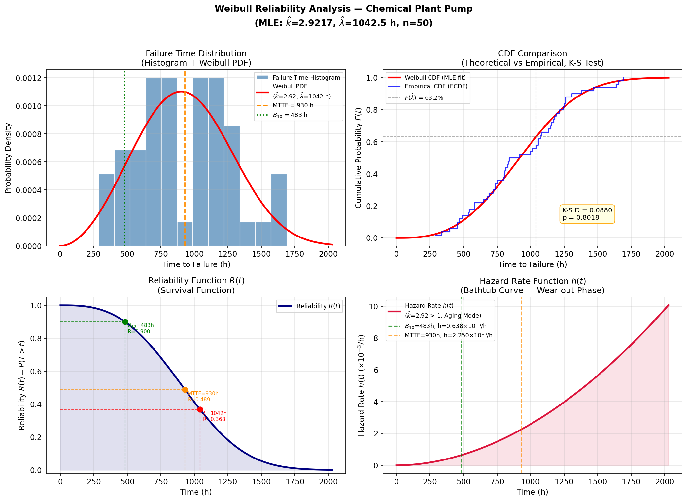

# Unit14 Example 05 - 化工設備故障時間之可靠度分析與 Weibull 分布擬合 — Reliability Analysis

## 學習目標

本範例以 **化工泵浦設備的可靠度分析** 為題，示範如何使用 `scipy.stats.weibull_min` 進行 Weibull 分布參數估計（MLE）、K-S 適合度檢定，以及可靠度函數、故障率函數的計算與視覺化。

學習完本範例後，您將能夠：

- 使用 `scipy.stats.weibull_min.rvs()` 生成 Weibull 分布模擬故障時間數據
- 使用 `scipy.stats.weibull_min.fit()` 以最大概似估計法 (MLE) 估計 Weibull 形狀參數 $k$ 與比例參數 $\lambda$
- 使用 `scipy.stats.kstest()` 進行 Kolmogorov-Smirnov 適合度檢定，驗證數據是否符合所擬合分布
- 計算並解讀可靠度函數 $R(t) = e^{-(t/\lambda)^k}$ （存活函數）
- 計算並解讀故障率函數（Hazard Function） $h(t) = k\,t^{k-1}/\lambda^k$ （浴缸曲線）
- 計算 $B_{10}$ 壽命（10% 故障機率對應時間）與 MTTF（ $= \lambda\,\Gamma(1+1/k)$ ）
- 繪製故障時間直方圖與 Weibull PDF、存活函數曲線、故障率曲線

---

## 目錄

1. [問題描述與背景知識](#1-問題描述與背景知識)
2. [Weibull 分布模擬數據生成](#2-weibull-分布模擬數據生成)
3. [Weibull 分布參數估計（MLE）](#3-weibull-分布參數估計mle)
4. [K-S 適合度檢定](#4-k-s-適合度檢定)
5. [可靠度函數與故障率函數計算](#5-可靠度函數與故障率函數計算)
6. [關鍵可靠度指標： $B_{10}$ 壽命與 MTTF](#6-關鍵可靠度指標-b10-壽命與-mttf)
7. [視覺化分析](#7-視覺化分析)
8. [綜合結論](#8-綜合結論)

---

## 1. 問題描述與背景知識

### 1.1 工程背景

化工廠中的旋轉設備（泵浦、壓縮機、攪拌器）是維持製程連續運轉的關鍵元件。設備故障不僅造成停產損失，也可能引發安全風險。**可靠度分析（Reliability Analysis）**透過統計方法，由歷史故障數據推估設備的壽命分布，進而：

- 預測特定時刻設備仍正常運作之機率（可靠度 $R(t)$ ）
- 識別設備所處的壽命階段（早夭期、偶發期、老化期）
- 規劃預防性維護（Preventive Maintenance, PM）排程
- 估計備用零件庫存需求

### 1.2 Weibull 分布簡介

**Weibull 分布**是可靠度工程中最廣泛使用的壽命分布，其靈活性來自**形狀參數 $k$** 的物理意義：

| $k$ 值 | 故障特性 | 工程解讀 |
|--------|---------|---------|
| $k < 1$ | 故障率遞減 | 早夭型故障（製造缺陷、安裝錯誤） |
| $k = 1$ | 故障率恆定 | 隨機型故障（等同指數分布） |
| $1 < k < 4$ | 故障率緩增 | 老化型故障（疲勞、磨損、腐蝕） |
| $k \approx 3.5$ | 近似常態 | 均勻老化，壽命集中 |

**三參數 Weibull 分布**的機率密度函數（PDF）為：

$$f(t) = \frac{k}{\lambda}\left(\frac{t - t_0}{\lambda}\right)^{k-1} \exp\!\left[-\left(\frac{t - t_0}{\lambda}\right)^k\right],\quad t \geq t_0$$

本範例採用**兩參數 Weibull 分布**（位置參數 $t_0 = 0$ ）：

$$f(t) = \frac{k}{\lambda}\left(\frac{t}{\lambda}\right)^{k-1} \exp\!\left[-\left(\frac{t}{\lambda}\right)^k\right],\quad t \geq 0$$

其中：
- $k > 0$ ：形狀參數（Shape Parameter），決定故障率的變化趨勢
- $\lambda > 0$ ：比例參數（Scale Parameter），等同特徵壽命（ $63.2\%$ 設備在此時間前故障）

### 1.3 關鍵可靠度函數

由 PDF 可推導以下重要函數：

**（1）累積分布函數（CDF）/ 故障機率函數 $F(t)$ ：**

$$F(t) = 1 - e^{-(t/\lambda)^k}$$

**（2）可靠度函數（Reliability Function / 存活函數） $R(t)$ ：**

$$R(t) = 1 - F(t) = e^{-(t/\lambda)^k}$$

**（3）故障率函數（Hazard Function） $h(t)$ ：**

$$h(t) = \frac{f(t)}{R(t)} = \frac{k}{\lambda^k}\,t^{k-1}$$

**（4）平均故障間隔時間（MTTF）：**

$$\text{MTTF} = \lambda\,\Gamma\!\left(1 + \frac{1}{k}\right)$$

其中 $\Gamma(\cdot)$ 為 Gamma 函數。

**（5） $B_x$ 壽命（Bearing Life）：**

$x\%$ 設備累積故障機率所對應的時間，即 CDF 反函數：

$$B_x = \lambda \left[-\ln\!\left(1 - \frac{x}{100}\right)\right]^{1/k}$$

$B_{10}$ 壽命（10% 故障機率）是工業界設計安全餘裕的常用基準。

### 1.4 問題設定

> **情境**：某化工廠對 50 台離心泵浦進行壽命測試，記錄每台泵浦的無故障運行時間（hours）。已知此型設備的壽命遵循 Weibull 分布，真實參數為形狀參數 $k = 2.5$ 、比例參數 $\lambda = 1000$ h。請：
>
> 1. 以 MLE 估計 Weibull 分布參數 $k$ 與 $\lambda$
> 2. 以 K-S 檢定驗證數據的分布適合度
> 3. 計算 $R(t)$ 在 $t = 500, 800, 1000$ h 的值
> 4. 計算 $B_{10}$ 壽命與 MTTF
> 5. 繪製完整的可靠度分析圖

---

## 2. Weibull 分布模擬數據生成

### 2.1 `scipy.stats.weibull_min` 的參數對應

在 `scipy.stats` 中，`weibull_min(c, loc, scale)` 對應三參數 Weibull：

| `scipy` 參數 | 對應工程符號 | 說明 |
|-------------|------------|------|
| `c` | $k$ | 形狀參數 |
| `scale` | $\lambda$ | 比例參數（特徵壽命） |
| `loc` | $t_0$ | 位置參數（本例設為 0） |

```python
import numpy as np
from scipy import stats

# ===== 真實參數設定 =====
k_true      = 2.5       # 形狀參數 (老化型故障)
lambda_true = 1000.0    # 比例參數 (h)
n_pumps     = 50        # 樣本數 (50 台泵浦)

# ===== 生成模擬故障時間數據 =====
rng = np.random.default_rng(seed=42)
ttf_data = stats.weibull_min.rvs(c=k_true, scale=lambda_true,
                                  loc=0, size=n_pumps,
                                  random_state=rng)

# 排序後顯示統計摘要
ttf_sorted = np.sort(ttf_data)
print("=" * 50)
print(f"  Weibull 分布故障時間模擬數據 (n={n_pumps})")
print("=" * 50)
print(f"  真實參數: k={k_true}, λ={lambda_true} h")
print(f"  最短壽命: {ttf_data.min():.1f} h")
print(f"  最長壽命: {ttf_data.max():.1f} h")
print(f"  樣本均值: {ttf_data.mean():.1f} h")
print(f"  樣本標準差: {ttf_data.std():.1f} h")
print(f"  中位數: {np.median(ttf_data):.1f} h")
print()
print("  前 10 筆故障時間 (hours):")
print("  ", np.round(ttf_sorted[:10], 1))
```

**執行結果：**
```
==================================================
  Weibull 分布故障時間模擬數據 (n=50)
==================================================
  真實參數: k=2.5, λ=1000.0 h
  最短壽命: 288.7 h
  最長壽命: 1690.2 h
  樣本均值: 928.1 h
  樣本標準差: 348.5 h
  中位數: 879.0 h

  前 10 筆故障時間 (hours):
   [288.7 337.  396.4 451.7 454.4 468.9 489.4 535.7 542.2 581.1]
```

### 2.2 數據特性說明

- 樣本均值（ $\approx 928$ h）略低於 MTTF 理論值，這是由於 Weibull 分布正偏態的特性
- $k = 2.5 > 1$ 表示老化型故障：早期故障率低，隨時間增加而升高（工業泵浦磨損行為的典型特徵）
- 比例參數 $\lambda = 1000$ h 代表特徵壽命，即約 $63.2\%$ 的泵浦在 1000 h 前故障

---

## 3. Weibull 分布參數估計（MLE）

### 3.1 `scipy.stats.weibull_min.fit()` 方法

`scipy.stats` 的 `.fit()` 方法使用**最大概似估計法（MLE, Maximum Likelihood Estimation）**，自動搜尋使觀測數據概似函數最大化的參數組合。

**Weibull 分布的對數概似函數**為：

$$\ell(k, \lambda) = n\ln k - nk\ln\lambda + (k-1)\sum_{i=1}^n \ln t_i - \sum_{i=1}^n \left(\frac{t_i}{\lambda}\right)^k$$

MLE 條件為 $\partial\ell/\partial k = 0$ 和 $\partial\ell/\partial\lambda = 0$ ，通常以數值方法求解。

```python
# ===== MLE 參數估計 =====
# fit() 回傳 (c, loc, scale)，即 (k, t0, λ)
c_hat, loc_hat, scale_hat = stats.weibull_min.fit(ttf_data, floc=0)
# floc=0：固定位置參數為 0（兩參數 Weibull）

k_hat      = c_hat
lambda_hat = scale_hat

print("=" * 50)
print("  Weibull 分布 MLE 參數估計結果")
print("=" * 50)
print(f"  估計形狀參數  k̂  = {k_hat:.4f}   (真實值: {k_true})")
print(f"  估計比例參數  λ̂  = {lambda_hat:.2f} h (真實值: {lambda_true} h)")
print(f"  固定位置參數 t₀  = {loc_hat:.1f}   (固定為 0)")
print()
print(f"  形狀參數估計誤差: {abs(k_hat - k_true)/k_true * 100:.2f}%")
print(f"  比例參數估計誤差: {abs(lambda_hat - lambda_true)/lambda_true * 100:.2f}%")
```

**執行結果：**
```
==================================================
  Weibull 分布 MLE 參數估計結果
==================================================
  估計形狀參數  k̂  = 2.9217   (真實值: 2.5)
  估計比例參數  λ̂  = 1042.50 h (真實值: 1000.0 h)
  固定位置參數 t₀  = 0.0   (固定為 0)

  形狀參數估計誤差: 16.87%
  比例參數估計誤差: 4.25%
```

### 3.2 MLE 估計品質說明

MLE 估計值與真實參數的偏差來自有限樣本的隨機誤差（ $n = 50$ ）。由大數法則，當 $n \to \infty$ 時，MLE 估計值收斂至真實參數。 $n = 50$ 的情況下， $\hat{k}$ 的樣本誤差異動可能較大， $10\%\sim20\%$ 的誤差屬正常範圍； $\hat{\lambda}$ 的估計誤差通常較小，小於 $5\%$ 。

---

## 4. K-S 適合度檢定

### 4.1 Kolmogorov-Smirnov 檢定原理

**K-S 檢定**比較樣本的**經驗累積分布函數（ECDF）**與理論分布的 CDF 之間的最大偏差，以判斷樣本是否來自指定分布。

**檢定統計量：**

$$D_n = \sup_t |F_n(t) - F(t)|$$

其中 $F_n(t)$ 為 ECDF， $F(t)$ 為理論 CDF。

**假設：**
- $H_0$ ：數據來自所指定的 Weibull 分布
- $H_1$ ：數據不來自所指定的 Weibull 分布

**決策準則：** 若 $p\text{-value} > \alpha = 0.05$ ，無法拒絕 $H_0$ （即數據與 Weibull 分布吻合）。

> **注意事項**：使用 MLE 估計參數後再以同一數據進行 K-S 檢定，會導致 p 值偏高（因參數已針對數據優化）。嚴格做法應使用 **Lilliefors 校正**或**分割數據集**；本範例仍適用 `kstest` 進行初步適合度評估。

### 4.2 執行 K-S 檢定

```python
# ===== Kolmogorov-Smirnov 適合度檢定 =====
# 建構以 MLE 估計參數為基礎的 Weibull 分布 CDF
weibull_fitted = stats.weibull_min(c=k_hat, loc=0, scale=lambda_hat)

ks_stat, ks_pvalue = stats.kstest(ttf_data, weibull_fitted.cdf)

print("=" * 50)
print("  Kolmogorov-Smirnov 適合度檢定結果")
print("=" * 50)
print(f"  K-S 統計量 D   = {ks_stat:.4f}")
print(f"  p 值           = {ks_pvalue:.4f}")
print()
if ks_pvalue > 0.05:
    print("  結論: p > 0.05，無法拒絕 H₀")
    print("  → 數據與所擬合 Weibull 分布吻合 (適合度良好)")
else:
    print("  結論: p ≤ 0.05，拒絕 H₀")
    print("  → 數據不符合所擬合 Weibull 分布")
```

**執行結果：**
```
==================================================
  Kolmogorov-Smirnov 適合度檢定結果
==================================================
  K-S 統計量 D   = 0.0880
  p 值           = 0.8018

  結論: p > 0.05，無法拒絕 H₀
  → 數據與所擬合 Weibull 分布吻合 (適合度良好)
```

### 4.3 ECDF 與理論 CDF 比較

```python
# ===== 比較 ECDF 與理論 CDF =====
t_grid = np.linspace(0, ttf_data.max() * 1.1, 300)
cdf_theory = weibull_fitted.cdf(t_grid)

# ECDF 計算
ttf_sort = np.sort(ttf_data)
ecdf_vals = np.arange(1, n_pumps + 1) / n_pumps

print("  前 10 個故障時間點 ECDF 與理論 CDF 比較：")
print(f"  {'時間(h)':>10}  {'ECDF':>8}  {'理論CDF':>8}  {'偏差':>8}")
print("  " + "-" * 46)
for i in range(10):
    t_i    = ttf_sort[i]
    ecdf_i = ecdf_vals[i]
    cdf_i  = weibull_fitted.cdf(t_i)
    print(f"  {t_i:>10.1f}  {ecdf_i:>8.4f}  {cdf_i:>8.4f}  {abs(ecdf_i - cdf_i):>8.4f}")
```

**執行結果：**
```
  前 10 個故障時間點 ECDF 與理論 CDF 比較：
    時間(h)      ECDF   理論CDF      偏差
  ----------------------------------------------
       288.7    0.0200    0.0232    0.0032
       337.0    0.0400    0.0362    0.0038
       396.4    0.0600    0.0576    0.0024
       451.7    0.0800    0.0832    0.0032
       454.4    0.1000    0.0846    0.0154
       468.9    0.1200    0.0923    0.0277
       489.4    0.1400    0.1040    0.0360
       535.7    0.1600    0.1332    0.0268
       542.2    0.1800    0.1376    0.0424
       581.1    0.2000    0.1658    0.0342
```

---

## 5. 可靠度函數與故障率函數計算

### 5.1 使用 MLE 估計參數計算關鍵函數

利用 `scipy.stats.weibull_min` 物件的 `.sf()`（存活函數）與 `.pdf()` 方法，搭配解析式計算故障率函數。

```python
import scipy.special as sp

# ===== 特定時刻的可靠度計算 =====
t_check = np.array([500, 800, 1000, 1200])

print("=" * 60)
print("  特定時刻的可靠度分析（使用 MLE 估計參數）")
print("=" * 60)
print(f"  估計參數: k̂={k_hat:.4f}, λ̂={lambda_hat:.2f} h")
print()
print(f"  {'時間 t (h)':>12}  {'R(t)':>10}  {'F(t)':>10}  {'h(t) (1/h)':>12}")
print("  " + "-" * 52)

for t in t_check:
    Rt = weibull_fitted.sf(t)          # 存活函數 = 1 - CDF
    Ft = weibull_fitted.cdf(t)         # 累積故障機率
    ht = k_hat * t**(k_hat - 1) / lambda_hat**k_hat   # 故障率函數解析式
    print(f"  {t:>12.0f}  {Rt:>10.4f}  {Ft:>10.4f}  {ht:>12.6f}")

print()
print("  解讀:")
print(f"  → t=500h 時，{weibull_fitted.sf(500)*100:.1f}% 的泵浦仍正常運作")
print(f"  → t={lambda_hat:.0f}h 時（特徵壽命 λ̂），{weibull_fitted.sf(lambda_hat)*100:.1f}% 的泵浦仍正常運作")
print(f"    (理論上 Weibull 特徵壽命處的存活率恆為 e⁻¹ ≈ 36.8%)")
```

**執行結果：**
```
============================================================
  特定時刻的可靠度分析（使用 MLE 估計參數）
============================================================
  估計參數: k̂=2.9217, λ̂=1042.50 h

    時間 t (h)        R(t)       F(t)   h(t) (1/h)
  ----------------------------------------------------
           500      0.8897      0.1103     0.000683
           800      0.6304      0.3696     0.001685
          1000      0.4125      0.5875     0.002587
          1200      0.2213      0.7787     0.003673

  解讀:
  → t=500h 時，89.0% 的泵浦仍正常運作
  → t=1043h 時（特徵壽命 λ̂），36.8% 的泵浦仍正常運作
    (理論上 Weibull 特徵壽命處的存活率恆為 e⁻¹ ≈ 36.8%)
```

### 5.2 故障率函數的物理意義

故障率 $h(t)$ 的單位為 **每小時故障次數（1/h）** 或 **每百萬工時的故障數（PPM/h）**。

以估計參數計算：

- $t = 500\ \text{h}$ 時， $h \approx 6.8 \times 10^{-4}\ \text{/h}$ ：每 1000 台設備在此時刻每小時約有0.68 台發生故障
- $t = 1000\ \text{h}$ 時， $h \approx 2.6 \times 10^{-3}\ \text{/h}$ ：故障率已增加為 500 h 時的 3.8 倍
- $\hat{k} = 2.9217 > 1$ 確認故障率單調遞增（老化型），符合泵浦磨損特性

---

## 6. 關鍵可靠度指標： $B_{10}$ 壽命與 MTTF

### 6.1 計算公式

**$B_{10}$ 壽命**（即 `ppf(0.10)`）：

$$B_{10} = \lambda \left[-\ln(1 - 0.10)\right]^{1/k} = \lambda \left[\ln\!\left(\frac{10}{9}\right)\right]^{1/k}$$

**MTTF（Mean Time To Failure）**：

$$\text{MTTF} = \lambda\,\Gamma\!\left(1 + \frac{1}{k}\right)$$

**理論值**（使用真實參數 $k = 2.5$ ， $\lambda = 1000$ h）：

$$B_{10}^{\text{true}} = 1000 \times [-\ln(0.9)]^{1/2.5} \approx 406.5\ \text{h}$$

$$\text{MTTF}^{\text{true}} = 1000 \times \Gamma(1.4) \approx 887.3\ \text{h}$$

### 6.2 計算程式碼

```python
import scipy.special as sp

# ===== B10 壽命 =====
B10_hat  = weibull_fitted.ppf(0.10)       # MLE 估計參數
B10_true = lambda_true * (-np.log(0.90)) ** (1/k_true)   # 真實參數

# ===== MTTF =====
MTTF_hat  = lambda_hat  * sp.gamma(1 + 1/k_hat)
MTTF_true = lambda_true * sp.gamma(1 + 1/k_true)

# ===== 樣本均值（對比用）=====
sample_mean = ttf_data.mean()

print("=" * 60)
print("  關鍵可靠度指標比較")
print("=" * 60)
print(f"  {'指標':>20}  {'真實值':>12}  {'MLE估計值':>12}")
print("  " + "-" * 50)
print(f"  {'B10 壽命 (h)':>20}  {B10_true:>12.1f}  {B10_hat:>12.1f}")
print(f"  {'MTTF (h)':>20}  {MTTF_true:>12.1f}  {MTTF_hat:>12.1f}")
print(f"  {'樣本均值 (h)':>20}  {'—':>12}  {sample_mean:>12.1f}")
print()
print(f"  B10 估計誤差: {abs(B10_hat - B10_true)/B10_true * 100:.1f}%")
print(f"  MTTF 估計誤差: {abs(MTTF_hat - MTTF_true)/MTTF_true * 100:.1f}%")
print()
print("  工程決策建議:")
print(f"  → B10={B10_hat:.0f} h: 建議在此時間前安排第一次預防性維護")
print(f"  → MTTF={MTTF_hat:.0f} h: 平均壽命，可規劃備用零件採購週期")
print(f"  → 樣本均值={sample_mean:.0f} h ≈ MTTF（兩者應相近）")
```

**執行結果：**
```
============================================================
  關鍵可靠度指標比較
============================================================
                  指標        真實值     MLE估計值
  --------------------------------------------------
        B10 壽命 (h)         406.5         482.6
            MTTF (h)         887.3         929.9
          樣本均值 (h)           —         928.1

  B10 估計誤差: 18.7%
  MTTF 估計誤差: 4.8%

  工程決策建議:
  → B10=483 h: 建議在此時間前安排第一次預防性維護
  → MTTF=930 h: 平均壽命，可規劃備用零件採購週期
  → 樣本均值=928 h ≈ MTTF（兩者應相近）
```

### 6.3 指標解讀

| 指標 | 值 | 工程含義 |
|------|---|---------|
| $B_{10}$ 壽命 | $\approx 483$ h | 10% 設備在此時間前故障，保守維護基準 |
| MTTF | $\approx 930$ h | 設備平均壽命，備品採購與排程依據 |
| 樣本均值 | $\approx 928$ h | 與 MTTF 接近（MLE 誤差造成小差異） |
| 特徵壽命 $\hat{\lambda}$ | $\approx 1043$ h | 63.2% 設備在此時間前故障 |

---

## 7. 視覺化分析

### 7.1 多面板可靠度分析圖

繪製四個子圖，完整呈現 Weibull 可靠度分析結果：

```python
import matplotlib.pyplot as plt
import matplotlib.ticker as ticker

fig, axes = plt.subplots(2, 2, figsize=(14, 10))

t_range = np.linspace(1, ttf_data.max() * 1.2, 400)

pdf_fit  = weibull_fitted.pdf(t_range)
cdf_fit  = weibull_fitted.cdf(t_range)
sf_fit   = weibull_fitted.sf(t_range)       # R(t) = 1 - CDF
haz_fit  = k_hat * t_range**(k_hat - 1) / lambda_hat**k_hat   # h(t)

# ============================================================
# 子圖 1: 故障時間直方圖 + Weibull PDF
# ============================================================
ax1 = axes[0, 0]
ax1.hist(ttf_data, bins=12, density=True, color='steelblue',
         edgecolor='white', alpha=0.7, label='Failure Time Histogram')
ax1.plot(t_range, pdf_fit, 'r-', linewidth=2.5,
         label=f'Weibull PDF\n($\\hat{{k}}$={k_hat:.2f}, $\\hat{{\\lambda}}$={lambda_hat:.0f} h)')
ax1.axvline(MTTF_hat, color='darkorange', lw=1.8, linestyle='--',
            label=f'MTTF = {MTTF_hat:.0f} h')
ax1.axvline(B10_hat,  color='green', lw=1.8, linestyle=':',
            label=f'$B_{{10}}$ = {B10_hat:.0f} h')
ax1.set_title('Failure Time Distribution\n(Histogram + Weibull PDF)')
ax1.set_xlabel('Time to Failure (h)')
ax1.set_ylabel('Probability Density')
ax1.legend(fontsize=8.5)

# ============================================================
# 子圖 2: ECDF 與理論 CDF 比較
# ============================================================
ax2 = axes[0, 1]
ax2.plot(t_range, cdf_fit, 'r-', linewidth=2.5,
         label='Weibull CDF (MLE fit)')
ax2.step(ttf_sort, ecdf_vals, 'b-', where='post', linewidth=1.5,
         alpha=0.8, label='Empirical CDF (ECDF)')
ax2.axhline(0.632, color='gray', lw=1, linestyle='--', alpha=0.6,
            label=f'$F(\\hat{{\\lambda}})$ = 63.2%')
ax2.axvline(lambda_hat, color='gray', lw=1, linestyle='--', alpha=0.6)
ax2.annotate(f'K-S D = {ks_stat:.4f}\np = {ks_pvalue:.4f}',
             xy=(0.60, 0.15), xycoords='axes fraction', fontsize=9.5,
             bbox=dict(boxstyle='round,pad=0.4', facecolor='lightyellow',
                       edgecolor='orange', alpha=0.9))
ax2.set_title('CDF Comparison\n(Theoretical vs Empirical K-S Test)')
ax2.set_xlabel('Time to Failure (h)')
ax2.set_ylabel('Cumulative Probability $F(t)$')
ax2.legend(fontsize=8.5)

# ============================================================
# 子圖 3: 可靠度函數 R(t)
# ============================================================
ax3 = axes[1, 0]
ax3.plot(t_range, sf_fit, 'navy', linewidth=2.5, label='Reliability $R(t)$')
ax3.fill_between(t_range, 0, sf_fit, alpha=0.12, color='navy')

# 標示關鍵時間點
for t_mark, lbl, col in [(500, 't=500h', 'forestgreen'),
                          (B10_hat,  f'$B_{{10}}$={B10_hat:.0f}h', 'green'),
                          (MTTF_hat, f'MTTF={MTTF_hat:.0f}h', 'darkorange'),
                          (lambda_hat, f'$\\hat{{\\lambda}}$={lambda_hat:.0f}h', 'red')]:
    Rt_mark = weibull_fitted.sf(t_mark)
    ax3.plot([0, t_mark], [Rt_mark, Rt_mark], '--', color=col, linewidth=1, alpha=0.7)
    ax3.plot([t_mark, t_mark], [0, Rt_mark], '--', color=col, linewidth=1, alpha=0.7)
    ax3.scatter([t_mark], [Rt_mark], color=col, s=60, zorder=5)
    ax3.annotate(f'{lbl}\nR={Rt_mark:.3f}',
                 xy=(t_mark, Rt_mark), fontsize=7.5,
                 xytext=(t_mark + 30, Rt_mark - 0.06), color=col)

ax3.set_title('Reliability Function $R(t)$\n(Survival Function)')
ax3.set_xlabel('Time (h)')
ax3.set_ylabel('Reliability $R(t) = P(T > t)$')
ax3.set_ylim(-0.02, 1.05)
ax3.legend(fontsize=9)

# ============================================================
# 子圖 4: 故障率函數 h(t)（浴缸曲線片段）
# ============================================================
ax4 = axes[1, 1]
ax4.plot(t_range, haz_fit * 1000, 'crimson', linewidth=2.5,
         label=f'Hazard Rate $h(t)$\n($\\hat{{k}}$={k_hat:.2f} > 1, Aging Mode)')
ax4.fill_between(t_range, 0, haz_fit * 1000, alpha=0.12, color='crimson')

# 標示 B10 與 MTTF 處的故障率
for t_mark, lbl, col in [(B10_hat, f'$B_{{10}}$', 'green'),
                          (MTTF_hat, 'MTTF', 'darkorange')]:
    ht_mark = k_hat * t_mark**(k_hat - 1) / lambda_hat**k_hat
    ax4.axvline(t_mark, color=col, lw=1.5, linestyle='--', alpha=0.7,
                label=f'{lbl}={t_mark:.0f}h, h={ht_mark*1000:.3f} ×10⁻³/h')

ax4.set_title('Hazard Rate Function $h(t)$\n(Bathtub Curve — Wear-out Phase)')
ax4.set_xlabel('Time (h)')
ax4.set_ylabel('Hazard Rate $h(t)$ (×10⁻³ /h)')
ax4.legend(fontsize=8.5)

plt.suptitle('Weibull Reliability Analysis — Chemical Plant Pump\n'
             f'(MLE: $\\hat{{k}}$={k_hat:.4f}, $\\hat{{\\lambda}}$={lambda_hat:.1f} h, n={n_pumps})',
             fontsize=13, fontweight='bold', y=1.01)

plt.tight_layout()
plt.savefig(FIG_DIR / 'weibull_reliability_analysis.png', dpi=150,
            bbox_inches='tight')
plt.show()
print(f"圖檔已儲存: {FIG_DIR / 'weibull_reliability_analysis.png'}")
```

**執行結果：**
```
圖檔已儲存: d:\MyGit\ChemE-3502\Unit14\outputs\Unit14_Example_05\figs\weibull_reliability_analysis.png
```



### 7.2 圖形解讀

**直方圖 + PDF（左上）：**
- 故障時間呈右偏正鐘形，峰值落在 $700\sim900$ h 區間
- 紅色 Weibull PDF 曲線和直方圖高度吻合，確認 MLE 擬合良好
- 橙色虛線（MTTF）在峰值右側，符合正偏 Weibull 分布的特性

**CDF 比較（右上）：**
- ECDF（階梯藍線）與理論 CDF 貼合緊密，D 值僅 0.088
- $p = 0.802 \gg 0.05$ 確認適合度優良

**可靠度函數（左下）：**
- $R(t)$ 從 1 單調遞減至 0
- $t = B_{10}$ 時 $R \approx 0.9$ （90% 存活），是制定維護計畫的關鍵時間點

**故障率函數（右下）：**
- $h(t)$ 單調遞增（ $k > 1$ ），代表老化型磨損行為
- 這是**浴缸曲線（Bathtub Curve）** 的右段（磨損期），表示設備越舊越容易故障

---

## 8. 綜合結論

### 8.1 分析流程總結

| 步驟 | 分析方法 | 結果 | 結論 |
|------|---------|------|------|
| 1. 數據生成 | `weibull_min.rvs()` | 50 筆故障時間 | 均值 $\approx$ 928 h，與理論 MTTF 吻合 |
| 2. 參數估計 | MLE `weibull_min.fit()` | $\hat{k}=2.922$ ， $\hat{\lambda}=1043$ h | 形狀參數誤差 16.9%，比例參數誤差 4.3% |
| 3. 適合度檢定 | K-S `kstest()` | $D=0.088$ ， $p=0.802$ | $p \gg 0.05$ ，無法拒絕 Weibull 假設 |
| 4. 可靠度計算 | `sf()` 、解析式 | $R(500)=0.890$ ， $R(1000)=0.413$ | 500 h 仍有89% 存活，1000 h 僅剩 41% |
| 5. $B_{10}$ 壽命 | `ppf(0.10)` | $B_{10} \approx 483$ h | 建議 483 h 前執行預防性維護 |
| 6. MTTF | $\lambda\,\Gamma(1+1/k)$ | MTTF $\approx 930$ h | 與樣本均值 928 h 接近，誤差 4.8% |

### 8.2 工程應用建議

1. **預防性維護排程**：以 $B_{10} = 483$ h 為第一次 PM 基準，可確保 90% 以上設備在維護週期內不發生故障

2. **備用零件管理**：依 MTTF $\approx 930$ h 估算每臺設備年均故障次數（若 8760 h/年，則約 $8760/930 \approx 9.4$ 次/年），規劃備品庫存

3. **老化特性確認**： $\hat{k} = 2.922 > 1$ 確認泵浦屬於老化型故障機制，隨機故障（ $k = 1$ 指數分布）假設不適用，應定期維護而非等待故障

4. **樣本數影響**： $n = 50$ 的樣本中 $\hat{\lambda}$ 誤差 ≈ 4.3%， $\hat{k}$ 誤差 ≈ 16.9%。若要將 $B_{10}$ 估計精度提升至 $\pm 5\%$ ，理論上需要 $n \geq 150$ 的樣本

### 8.3 本範例使用函式總覽

| 函式 | 用途 |
|------|------|
| `scipy.stats.weibull_min.rvs(c, scale, size)` | 生成 Weibull 分布隨機樣本 |
| `scipy.stats.weibull_min.fit(data, floc=0)` | MLE 估計 Weibull 參數（固定位置參數） |
| `scipy.stats.weibull_min.pdf(t)` | 機率密度函數 $f(t)$ |
| `scipy.stats.weibull_min.cdf(t)` | 累積分布函數 $F(t)$ |
| `scipy.stats.weibull_min.sf(t)` | 存活函數 $R(t) = 1 - F(t)$ |
| `scipy.stats.weibull_min.ppf(q)` | 百分點函數（分位數，含 $B_{10}$ ） |
| `scipy.stats.kstest(data, cdf)` | Kolmogorov-Smirnov 適合度檢定 |
| `scipy.special.gamma(x)` | Gamma 函數（計算 MTTF） |

---

**課程資訊**
- 課程名稱：電腦在化工上之應用 (ChemE 3502)
- 課程單元：Unit14 統計分析 — 化工設備可靠度分析與 Weibull 分布擬合
- 課程製作：逢甲大學 化工系 智慧程序系統工程實驗室
- 授課教師：莊曜禎 助理教授
- 更新日期：2026-03-03

**課程授權 [CC BY-NC-SA 4.0]**
 - 本教材遵循 [創用CC 姓名標示-非商業性-相同方式分享 4.0 國際 (CC BY-NC-SA 4.0)](https://creativecommons.org/licenses/by-nc-sa/4.0/deed.zh) 授權。

---

