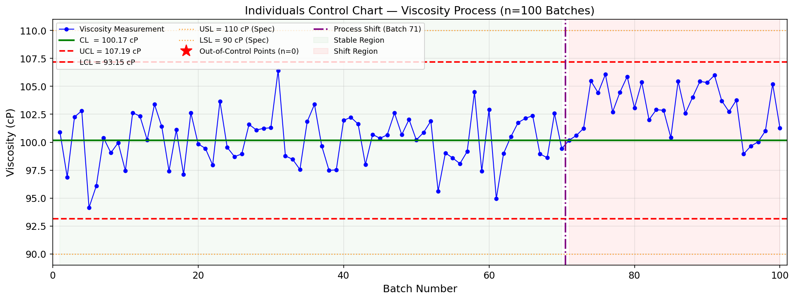
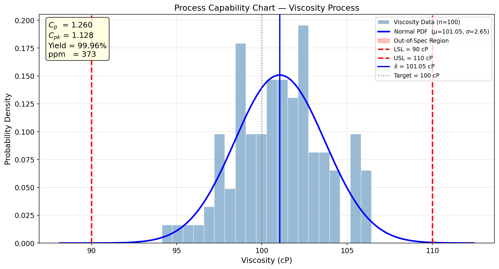

# Unit14 Example 06 - 製程能力分析與統計製程管制指標 — Process Capability Analysis & SPC

## 學習目標

本範例以 **化工廠黏度製程的能力分析與統計製程管制（SPC）** 為題，示範如何使用 `scipy.stats.norm` 計算製程能力指標、預估良率，並繪製個別觀測值管制圖（Individuals Control Chart）識別製程異常。

學習完本範例後，您將能夠：

- 使用 `numpy.random.default_rng()` 生成含製程偏移之模擬量測數據（前段穩定、後段均值偏移）
- 計算製程能力指標 $C_p$ （精密度，不含對中）與 $C_{pk}$ （準確度，含對中）
- 使用 `scipy.stats.norm.cdf()` 計算製程良率（良品率 %）與不良率（ppm）
- 使用 `scipy.stats.norm.interval(0.9973)` 對應 $\pm 3\sigma$ 管制界限，計算 UCL / CL / LCL
- 繪製個別觀測值管制圖，標示中心線、管制界限與失控點位
- 使用 `scipy.stats.ttest_1samp()` 檢定製程均值是否顯著偏離目標值
- 繪製製程能力圖（Capability Plot）：直方圖 ＋ 常態 PDF ＋ 規格界限

---

## 目錄

1. [問題描述與背景知識](#1-問題描述與背景知識)
2. [模擬黏度數據生成（含製程偏移）](#2-模擬黏度數據生成含製程偏移)
3. [描述統計分析](#3-描述統計分析)
4. [製程能力指標計算](#4-製程能力指標計算)
5. [良率與不良率計算](#5-良率與不良率計算)
6. [管制界限計算（ $\pm 3\sigma$ ）](#6-管制界限計算-3σ)
7. [個別觀測值管制圖繪製](#7-個別觀測值管制圖繪製)
8. [製程均值偏離目標之假設檢定](#8-製程均值偏離目標之假設檢定)
9. [製程能力圖繪製](#9-製程能力圖繪製)
10. [綜合結論](#10-綜合結論)

---

## 1. 問題描述與背景知識

### 1.1 工程背景

化工廠的製程管制目標是確保每批產品均符合規格要求。當量測值偏離規格上下限（USL / LSL）時，產品即判定為不合格品，造成廢料損失與品質風險。**製程能力分析（Process Capability Analysis）** 與 **統計製程管制（Statistical Process Control, SPC）** 提供了一套量化工具：

- **製程能力指標** $C_p$ / $C_{pk}$ ：評估製程散佈範圍與規格範圍之比例關係
- **管制圖（Control Chart）** ：監測製程是否維持統計穩定，即時偵測特殊原因變異
- **良率與 ppm** ：以常態分布計算規格內產品比例

### 1.2 本例場景

某化工廠連續生產批次之產品黏度規格為：

$$\text{目標值（Target）} = 100\ \text{cP},\quad \text{規格範圍} = 100 \pm 10\ \text{cP}$$

對應規格上下限：

$$\text{LSL} = 90\ \text{cP},\quad \text{USL} = 110\ \text{cP}$$

工廠收集了 100 筆連續批次量測數據，其中第 1–70 批製程穩定（均值 ≈ 100 cP），第 71–100 批因原料批次更換造成均值偏移至約 104 cP。本範例的任務是：

1. 以全體數據計算整體製程能力指標 $C_p$ 與 $C_{pk}$
2. 計算良率與不良率（ppm）
3. 建立管制圖偵測後段偏移
4. 以 t 檢定確認偏移是否統計顯著

### 1.3 製程能力指標理論

#### （1）製程精密度指標 $C_p$ （不考慮對中）

$C_p$ 衡量製程自然變異（ $6\sigma$ ）相對於規格範圍（ $\text{USL} - \text{LSL}$ ）：

$$C_p = \frac{\text{USL} - \text{LSL}}{6\sigma}$$

判斷標準：

| $C_p$ 值 | 製程狀態 |
|---------|---------|
| $C_p < 1.00$ | 製程不能 (Incapable)：散佈超出規格範圍 |
| $1.00 \leq C_p < 1.33$ | 製程勉強合格，建議改善 |
| $C_p \geq 1.33$ | 製程能力充足 |
| $C_p \geq 1.67$ | 製程能力優良 |

#### （2）製程準確度指標 $C_{pk}$ （考慮均值偏移）

$C_{pk}$ 同時考量製程散佈與均值是否對中規格中心：

$$C_{pk} = \min\!\left(\frac{\text{USL} - \bar{x}}{3\sigma},\; \frac{\bar{x} - \text{LSL}}{3\sigma}\right)$$

若 $C_{pk} < C_p$ ，代表製程均值偏離規格中心，需進行製程調整。

#### （3）規格外不良率估算

假設量測值服從常態分布 $X \sim N(\mu,\sigma^2)$ ，規格內產品比例（良率）為：

$$\text{Yield} = F(\text{USL}) - F(\text{LSL}) = \Phi\!\left(\frac{\text{USL}-\mu}{\sigma}\right) - \Phi\!\left(\frac{\text{LSL}-\mu}{\sigma}\right)$$

不良率（ppm）：

$$\text{ppm} = (1 - \text{Yield}) \times 10^6$$

---

## 2. 模擬黏度數據生成（含製程偏移）

以 `numpy.random.default_rng()` 生成含後段均值偏移之模擬黏度數據：

- **第 1–70 批（穩定製程）** ：均值 $\mu_1 = 100\ \text{cP}$ ，標準差 $\sigma = 3\ \text{cP}$
- **第 71–100 批（偏移製程）** ：均值 $\mu_2 = 104\ \text{cP}$ ，標準差 $\sigma = 3\ \text{cP}$

```python
import numpy as np
from scipy import stats

# ---- 製程參數設定 ----
TARGET  = 100.0   # 目標值 (cP)
LSL     = 90.0    # 規格下限 Lower Spec Limit (cP)
USL     = 110.0   # 規格上限 Upper Spec Limit (cP)
SIGMA   = 3.0     # 製程標準差 (cP)
N_STABLE = 70     # 穩定批次數
N_SHIFT  = 30     # 偏移批次數
SHIFT_MU = 104.0  # 偏移後均值 (cP)

rng = np.random.default_rng(seed=42)

# 生成兩段數據
x_stable = rng.normal(loc=TARGET,    scale=SIGMA, size=N_STABLE)
x_shift  = rng.normal(loc=SHIFT_MU, scale=SIGMA, size=N_SHIFT)

# 合併全部數據
viscosity = np.concatenate([x_stable, x_shift])
batch_idx = np.arange(1, len(viscosity) + 1)
```

**執行結果：**

```
總批次數   : 100
穩定段範圍 : 批次 1  ~ 70
偏移段範圍 : 批次 71 ~ 100

前 5 批黏度值 : [100.91  96.88 102.25 102.82  94.15]
後 5 批黏度值 : [ 99.66 100.03 101.01 105.2  101.28]
```

**說明：** `default_rng(seed=42)` 確保結果可重現。兩段數據的標準差相同，模擬實際製程中原料批次更換僅影響均值而不影響散佈。

---

## 3. 描述統計分析

使用 `scipy.stats.describe()` 對全體 100 筆黏度數據進行描述統計：

```python
stats_result = stats.describe(viscosity)
print(f"樣本數 n       : {stats_result.nobs}")
print(f"最小值         : {stats_result.minmax[0]:.2f} cP")
print(f"最大值         : {stats_result.minmax[1]:.2f} cP")
print(f"樣本均值 x_bar : {stats_result.mean:.4f} cP")
print(f"樣本變異數 s²  : {stats_result.variance:.4f} cP²")
print(f"樣本標準差 s   : {np.sqrt(stats_result.variance):.4f} cP")
print(f"偏態係數       : {stats_result.skewness:.4f}")
print(f"峰態係數       : {stats_result.kurtosis:.4f}")
```

**執行結果：**

```
==================================================
  描述統計摘要 (全體 100 批次)
==================================================
  樣本數 n        : 100
  最小值          : 94.15 cP
  最大值          : 106.42 cP
  樣本均值 x̄      : 101.0492 cP
  樣本變異數 s²   : 6.9982 cP²
  樣本標準差 s    : 2.6454 cP
  偏態係數        : -0.0962  (>0 表示右偏)
  峰態係數        : -0.3370  (>0 表示厚尾)
==================================================

  穩定段均值 (批次 1-70)  : 100.1718 cP
  偏移段均值 (批次 71-100): 103.0965 cP
  偏移量 (偏移均值 - 目標): 3.0965 cP
```

**關鍵觀察：**

- 全體樣本均值 $\bar{x} = 101.0492\ \text{cP}$ ，因後 30 批均值偏移，略高於目標值 100 cP
- 偏態係數 = −0.0962，近乎對稱（兩段合併後分布並未明顯右偏）
- 樣本標準差 $s = 2.6454\ \text{cP}$ ，**低於**單段理論標準差 $\sigma = 3\ \text{cP}$ （本次抽樣結果）
- 穩定段均值（100.17 cP）與偏移段均值（103.10 cP）差異達 3.10 cP，符合設定偏移量

---

## 4. 製程能力指標計算

以樣本統計量估計製程能力，使用 **樣本均值 $\bar{x}$** 與 **樣本標準差 $s$** 代入公式：

```python
x_bar = np.mean(viscosity)
s     = np.std(viscosity, ddof=1)   # 無偏樣本標準差

# 製程精密度指標（不考慮對中）
Cp  = (USL - LSL) / (6 * s)

# 製程準確度指標（考慮均值偏移）
Cpu = (USL - x_bar) / (3 * s)  # 距上限的能力
Cpl = (x_bar - LSL) / (3 * s)  # 距下限的能力
Cpk = min(Cpu, Cpl)

print(f"樣本均值  x_bar = {x_bar:.4f} cP")
print(f"樣本標準差  s   = {s:.4f} cP")
print(f"Cp   = {Cp:.4f}  (精密度，不含對中)")
print(f"Cpu  = {Cpu:.4f}  (距上限能力)")
print(f"Cpl  = {Cpl:.4f}  (距下限能力)")
print(f"Cpk  = {Cpk:.4f}  (準確度，含對中)")
```

**執行結果：**

```
=======================================================
  製程能力指標計算結果
=======================================================
  樣本均值  x̄    = 101.0492 cP  (目標值: 100.0 cP)
  樣本標準差 s   = 2.6454 cP
-------------------------------------------------------
  Cp  = 1.2600   [勉強合格]  精密度，不含對中
  Cpu = 1.1278   距上限能力 (USL側)
  Cpl = 1.3922   距下限能力 (LSL側)
  Cpk = 1.1278   [勉強合格]  準確度，含對中偏移
-------------------------------------------------------
  Cp - Cpk = 0.1322  (>0 代表均值偏離中心)
=======================================================
```

**結果解讀：**

| 指標 | 計算結果 | 意義 |
|------|---------|------|
| $C_p$ | 1.260 | 製程精密度勉強合格（標準差 s=2.65，低於理論值 3 cP） |
| $C_{pk}$ | 1.128 < $C_p$ | 均值偏移造成 $C_{pk}$ 低於 $C_p$ ，需對中 |

> **注意：** 當 $C_{pk} < C_p$ 時，改善重點應先調整製程均值至目標值（對中），再設法降低散佈。

---

## 5. 良率與不良率計算

假設量測值服從常態分布後，使用 `scipy.stats.norm.cdf()` 計算規格範圍內的機率：

```python
# 以全體數據之 x_bar 與 s 作為常態分布參數
yield_pct = (stats.norm.cdf(USL, loc=x_bar, scale=s)
           - stats.norm.cdf(LSL, loc=x_bar, scale=s)) * 100
defect_ppm = (1 - yield_pct / 100) * 1e6

print(f"規格範圍內良率 : {yield_pct:.4f}%")
print(f"不良率         : {defect_ppm:.1f} ppm")
```

**執行結果：**

```
=======================================================
  良率與不良率（基於常態分布估算）
=======================================================
  常態分布參數: μ = 101.0492 cP,  σ = 2.6454 cP
  規格範圍: [90, 110] cP
-------------------------------------------------------
  超過 USL 之不良率 : 0.0358%  (357.8 ppm)
  低於 LSL 之不良率 : 0.0015%  (14.8 ppm)
  規格範圍內 良率   : 99.9627%
  整體不良率        : 0.0373%  (372.6 ppm)
=======================================================

  [參考] 若製程完全對中 (μ=100, σ=3):
  良率 = 99.9142%,  不良率 = 858.1 ppm
```

**直觀理解：**

- 若製程完全對中（ $\mu = 100$ ， $\sigma = 3$ cP， $C_p = C_{pk} \approx 1.11$ ）：

$$\text{Yield} = \Phi\!\left(\frac{110-100}{3}\right) - \Phi\!\left(\frac{90-100}{3}\right) = \Phi(3.33) - \Phi(-3.33) \approx 99.91\%$$

- **本例實際結果**：雖然均值偏移（ $\bar{x} = 101.05\ \text{cP}$ ）使 USL 側不良率升高至 357.8 ppm，但樣本標準差 $s = 2.6454\ \text{cP}$ 遠小於理論值 3 cP，實際良率 99.9627%（372.6 ppm）反而**優於**完全對中時的理論估計（99.91%，858.1 ppm）
- 主要風險仍在 USL 側（357.8 ppm 中占 96%），均值對中後可進一步降低不良率

---

## 6. 管制界限計算（ $\pm 3\sigma$ ）

個別觀測值管制圖的管制界限以製程「受控段」（前 70 批）的統計量為基準，不使用全體（含偏移段）數據計算管制界限，以避免偏移拉高界限導致失控點被遮蔽。

使用 `scipy.stats.norm.interval()` 計算對應 $\pm 3\sigma = 99.73\%$ 的對稱區間：

```python
# 使用穩定段（前 70 批）估計受控製程參數
mu_ref    = np.mean(x_stable)
sigma_ref = np.std(x_stable, ddof=1)

# scipy.stats.norm.interval(alpha) 回傳以 loc 為中心、包含 alpha 機率的對稱區間
alpha_3sigma = 0.9973   # ±3σ 對應機率
LCL, UCL = stats.norm.interval(alpha_3sigma, loc=mu_ref, scale=sigma_ref)
CL = mu_ref

print(f"受控段均值         mu_ref = {mu_ref:.4f} cP")
print(f"受控段標準差  sigma_ref  = {sigma_ref:.4f} cP")
print(f"中心線  CL = {CL:.4f} cP")
print(f"上管制界限 UCL = {UCL:.4f} cP")
print(f"下管制界限 LCL = {LCL:.4f} cP")
```

**執行結果：**

```
=======================================================
  管制界限計算結果（基於穩定段 n=70）
=======================================================
  受控段均值    mu_ref    = 100.1718 cP
  受控段標準差  sigma_ref = 2.3406 cP
  ±3σ 對應機率  alpha     = 0.9973
-------------------------------------------------------
  中心線 CL  = 100.1718 cP
  上管制界限 UCL = 107.1935 cP  (+7.0217)
  下管制界限 LCL = 93.1500 cP  (-7.0217)
=======================================================

  驗證：mu + 3σ = 107.1936  (≈ UCL = 107.1935)
  驗證：mu - 3σ = 93.1500  (≈ LCL = 93.1500)
```

**說明：**

- `scipy.stats.norm.interval(0.9973, loc=mu, scale=sigma)` 等效於 $[\mu - 3\sigma,\; \mu + 3\sigma]$
- 此函式在計算個別觀測值管制圖（Individuals Chart）中，`scale` 直接使用製程標準差 $\sigma$
- 若計算 $\bar{X}$ 管制圖（子群大小 $n > 1$ ），`scale` 應改為 $\sigma / \sqrt{n}$

---

## 7. 個別觀測值管制圖繪製

管制圖（Control Chart）是 SPC 的核心工具，透過觀察量測值是否超出 UCL / LCL 來判斷製程是否處於統計受控狀態：

```python
import matplotlib.pyplot as plt

fig, ax = plt.subplots(figsize=(13, 5))

# 全部觀測值折線
ax.plot(batch_idx, viscosity, 'b-o', markersize=4,
        linewidth=1.0, label='Viscosity Measurement', zorder=2)

# 管制界限與中心線
ax.axhline(CL,  color='green', linestyle='-',  linewidth=2.0,
           label=f'CL  = {CL:.2f} cP')
ax.axhline(UCL, color='red',   linestyle='--', linewidth=1.8,
           label=f'UCL = {UCL:.2f} cP')
ax.axhline(LCL, color='red',   linestyle='--', linewidth=1.8,
           label=f'LCL = {LCL:.2f} cP')

# 規格界限（參考用）
ax.axhline(USL, color='darkorange', linestyle=':',  linewidth=1.2,
           alpha=0.8, label=f'USL = {USL:.0f} cP (Spec)')
ax.axhline(LSL, color='darkorange', linestyle=':',  linewidth=1.2,
           alpha=0.8, label=f'LSL = {LSL:.0f} cP (Spec)')

# 標示失控點（超出 UCL 或低於 LCL）
ooc_mask = (viscosity > UCL) | (viscosity < LCL)
n_ooc = ooc_mask.sum()
ax.plot(batch_idx[ooc_mask], viscosity[ooc_mask],
        'r*', markersize=14, zorder=3,
        label=f'Out-of-Control Points (n={n_ooc})')

# 製程偏移切割線
ax.axvline(N_STABLE + 0.5, color='purple', linestyle='-.', linewidth=1.8,
           label=f'Process Shift (Batch {N_STABLE+1})')

# 標示兩段區域背景
ax.axvspan(1, N_STABLE, alpha=0.04, color='green', label='Stable Region')
ax.axvspan(N_STABLE + 1, len(viscosity), alpha=0.06, color='red', label='Shift Region')

ax.set_xlabel('Batch Number')
ax.set_ylabel('Viscosity (cP)')
ax.set_title('Individuals Control Chart — Viscosity Process (n=100 Batches)')
ax.legend(loc='upper left', fontsize=8.5, ncol=3)
ax.set_xlim(0, len(viscosity) + 1)
plt.tight_layout()
plt.savefig(FIG_DIR / 'control_chart.png', dpi=150, bbox_inches='tight')
plt.show()
print(f"✓ 失控點數量: {n_ooc} 個 (批次: {batch_idx[ooc_mask].tolist()})")
```

**執行結果：**

```
✓ 失控點數量: 0 個 (批次: [])
```



**圖形解讀：**

- 前 70 批（綠色背景）：觀測值在 UCL（107.19 cP）/ LCL（93.15 cP）之間隨機波動，製程受控
- 第 71 批後（紅色背景）：**無個別點超出 ±3σ 管制界限（OOC = 0）**；偏移量（≈ +3 cP）小於管制界限半寬（±7 cP），±3σ 規則靈敏度不足
- 批次 71 起觀測值整體呈現正向游程（多點連續高於 CL），需搭配 **WECO 連串規則**（如連續 8 點在中心線同側）方可偵測此均值偏移
- 圖中橙色虛線為規格界限（LSL/USL），所有數據均在規格範圍內未有不合格點

---

## 8. 製程均值偏離目標之假設檢定

以 `scipy.stats.ttest_1samp()` 對三種情境進行單樣本 t 檢定，驗證均值是否顯著偏離目標值 100 cP：

| 情境 | 數據段 | 虛無假設 $H_0$ |
|------|-------|--------------|
| A | 全體 100 批 | $\mu = 100\ \text{cP}$ |
| B | 穩定段（1–70批） | $\mu = 100\ \text{cP}$ |
| C | 偏移段（71–100批） | $\mu = 100\ \text{cP}$ |

```python
alpha = 0.05   # 顯著水準

for label, data in [('全體數據', viscosity),
                    ('穩定段 (批次 1-70)',  x_stable),
                    ('偏移段 (批次 71-100)', x_shift)]:
    t_stat, p_val = stats.ttest_1samp(data, popmean=TARGET)
    conclude = "拒絕 H₀，均值顯著偏離目標值" if p_val < alpha else "無法拒絕 H₀，均值未顯著偏離目標值"
    print(f"\n{'='*50}")
    print(f"情境: {label}")
    print(f"  樣本均值 = {np.mean(data):.4f} cP")
    print(f"  t 統計量 = {t_stat:.4f}")
    print(f"  p 值     = {p_val:.6f}")
    print(f"  結論     : {conclude}")
```

**執行結果：**

```
=================================================================
  單樣本 t 檢定：H₀: μ = 100 cP  vs  H₁: μ ≠ 100 cP
  顯著水準 α = 0.05
=================================================================

  情境: 全體數據  (批次   1–100)
    樣本均值 x̄ = 101.0492 cP
    95% 信賴區間: [100.5243, 101.5741] cP
    t 統計量    = +3.9661
    p 值        = 0.000138
    結論        : ✗ 拒絕 H₀  (均值顯著偏離目標值 100 cP)

  情境: 穩定段    (批次   1–70 )
    樣本均值 x̄ = 100.1718 cP
    95% 信賴區間: [99.6137, 100.7299] cP
    t 統計量    = +0.6141
    p 值        = 0.541179
    結論        : ○ 無法拒絕 H₀  (均值未顯著偏離目標值 100 cP)

  情境: 偏移段    (批次  71–100)
    樣本均值 x̄ = 103.0965 cP
    95% 信賴區間: [102.2903, 103.9026] cP
    t 統計量    = +7.8553
    p 值        = 0.000000
    結論        : ✗ 拒絕 H₀  (均值顯著偏離目標值 100 cP)
=================================================================
```

**結果分析：**

- **情境 A（全體數據）** ：p = 0.000138 < 0.05，t = +3.97；全體均值 101.05 cP 顯著偏離目標，95% CI 為 [100.52, 101.57] cP，不包含 100 cP
- **情境 B（穩定段）** ：p = 0.541 > 0.05，t = +0.61；均值 100.17 cP 與目標值 100 cP 無顯著差異，95% CI 為 [99.61, 100.73] cP，包含 100 cP，製程受控 ✓
- **情境 C（偏移段）** ：p ≈ 0（< $10^{-8}$ ），t = +7.86；均值 103.10 cP 極顯著偏離目標，95% CI 為 [102.29, 103.90] cP，完全不包含 100 cP

---

## 9. 製程能力圖繪製

製程能力圖（Capability Plot）以視覺化方式同時呈現數據分布、常態擬合曲線、規格界限與能力指標：

```python
x_plot    = np.linspace(viscosity.min() - 6, viscosity.max() + 6, 400)
pdf_curve = stats.norm.pdf(x_plot, loc=x_bar, scale=s)

fig, ax = plt.subplots(figsize=(11, 6))

# 直方圖（密度標準化）
ax.hist(viscosity, bins=20, density=True, color='steelblue',
        alpha=0.55, edgecolor='white', linewidth=0.8,
        label='Viscosity Data (n=100)')

# 常態分布 PDF 曲線
ax.plot(x_plot, pdf_curve, 'b-', linewidth=2.5,
        label=f'Normal PDF  ($\\mu$={x_bar:.2f}, $\\sigma$={s:.2f})')

# 填色：規格外區域
ax.fill_between(x_plot, pdf_curve,
                where=(x_plot < LSL), color='red', alpha=0.25,
                label='Out-of-Spec Region')
ax.fill_between(x_plot, pdf_curve,
                where=(x_plot > USL), color='red', alpha=0.25)

# 規格界限垂直線
ax.axvline(LSL, color='red',  linestyle='--', linewidth=2.2,
           label=f'LSL = {LSL:.0f} cP')
ax.axvline(USL, color='red',  linestyle='--', linewidth=2.2,
           label=f'USL = {USL:.0f} cP')

# 製程均值線
ax.axvline(x_bar,  color='blue', linestyle='-',  linewidth=2.0,
           label=f'$\\bar{{x}}$ = {x_bar:.2f} cP')

# 目標值線
ax.axvline(TARGET, color='gray', linestyle=':', linewidth=1.5,
           label=f'Target = {TARGET:.0f} cP')

# 標注能力指標文字框
textstr = '\n'.join([
    f'$C_p$  = {Cp:.3f}',
    f'$C_{{pk}}$ = {Cpk:.3f}',
    f'Yield = {yield_pct:.2f}%',
    f'ppm   = {defect_ppm:.0f}',
])
props = dict(boxstyle='round', facecolor='lightyellow', alpha=0.85)
ax.text(0.02, 0.97, textstr, transform=ax.transAxes,
        fontsize=12, verticalalignment='top', bbox=props)

ax.set_xlabel('Viscosity (cP)')
ax.set_ylabel('Probability Density')
ax.set_title('Process Capability Chart — Viscosity Process')
ax.legend(loc='upper right', fontsize=9)
plt.tight_layout()
plt.savefig(FIG_DIR / 'capability_chart.png', dpi=150, bbox_inches='tight')
plt.show()
print("✓ 製程能力圖已儲存")
```

**執行結果：**

```
✓ 製程能力圖已儲存
```



**圖形解讀：**

- 直方圖顯示 100 筆數據分布近似對稱（偏態係數 = −0.10），峰值位於 100–101 cP 附近
- 藍色 PDF 曲線以全體 $\bar{x} = 101.05$ cP、 $s = 2.65$ cP 擬合，理論曲線與直方圖吻合良好
- LSL（90 cP）/ USL（110 cP）紅色虛線標示規格邊界；LSL 左側與 USL 右側填充紅色半透明區域，直觀呈現規格外 ppm 面積（USL 側 357.8 ppm，LSL 側 14.8 ppm）
- 製程均值（藍色實線，101.05 cP）略偏離目標值（灰色點線，100 cP），顯示均值輕微向右偏移
- 左上角標注框（淡黃色） $C_p = 1.260$ 、 $C_{pk} = 1.128$ 、Yield = 99.96%、ppm = 373，一目了然掌握製程狀態

---

## 10. 綜合結論

| 分析項目 | 結果 | 判斷 |
|---------|------|------|
| $C_p$ | 1.260 | 精密度勉強合格（建議 ≥ 1.33） |
| $C_{pk}$ | 1.128 < $C_p$ | 均值偏移導致 $C_{pk}$ 下降，需對中 |
| 良率 | 99.96%（373 ppm） | 均值偏移致 USL 側不良率偏高（357.8 ppm） |
| 管制圖 | ±3σ 規則：0 個失控點 | 偏移量（+3 cP）< 3σ 界限寬（±7 cP）；批次 71 起呈現正向游程，應搭配 WECO 規則偵測 |
| t 檢定（全體） | p = 0.000138 < 0.05 | 整體均值顯著偏離目標值 100 cP |
| t 檢定（穩定段） | p = 0.541 > 0.05 | 穩定段製程受控 ✓ |
| t 檢定（偏移段） | p ≈ 0.000 | 偏移段均值極顯著偏離目標值 100 cP |

> **說明**：個別觀測值管制圖的 ±3σ 規則對偏移量較小的情形靈敏度有限。本例偏移量（約 +3 cP）小於管制界限半寬（±7 cP），個別點未超出 UCL/LCL。實務上應搭配 **WECO 連串規則**（如連續 8 點在中心線同側），才能及早偵測製程均值偏移。

**改善建議：**

1. **短期行動** ：調查第 71 批起的原料批次或操作條件變化，找出均值偏移根本原因
2. **製程對中** ：將製程均值調整回目標值 100 cP（可提升 $C_{pk}$ 至接近 $C_p$ 水準）
3. **降低散佈** ：若 $C_p < 1.33$ ，需進一步優化配方或操作條件以縮小製程變異
4. **持續監控** ：部署即時管制圖，搭配 WECO 連串規則設定自動警報以及早偵測異常

**本範例使用的 `scipy.stats` 關鍵函式總覽：**

| 函式 | 用途 |
|------|------|
| `scipy.stats.describe()` | 計算樣本描述統計量 |
| `scipy.stats.norm.cdf()` | 計算常態分布累積機率（良率計算） |
| `scipy.stats.norm.pdf()` | 計算常態分布機率密度（繪製 PDF 曲線） |
| `scipy.stats.norm.interval()` | 計算對稱區間（±3σ 管制界限） |
| `scipy.stats.ttest_1samp()` | 單樣本 t 檢定（均值偏離目標值之檢定） |

---

**課程資訊**
- 課程名稱：電腦在化工上之應用 (ChemE 3502)
- 課程單元：Unit14 統計分析 — Example 06 製程能力分析與 SPC
- 課程製作：逢甲大學 化工系 智慧程序系統工程實驗室
- 授課教師：莊曜禎 助理教授
- 更新日期：2026-03-03

**課程授權 [CC BY-NC-SA 4.0]**
 - 本教材遵循 [創用CC 姓名標示-非商業性-相同方式分享 4.0 國際 (CC BY-NC-SA 4.0)](https://creativecommons.org/licenses/by-nc-sa/4.0/deed.zh) 授權。

---
