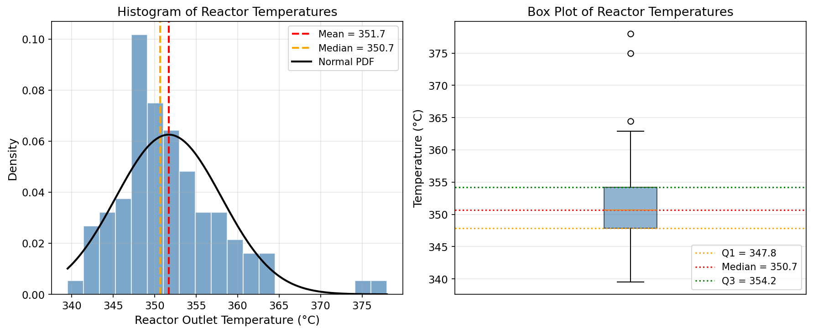
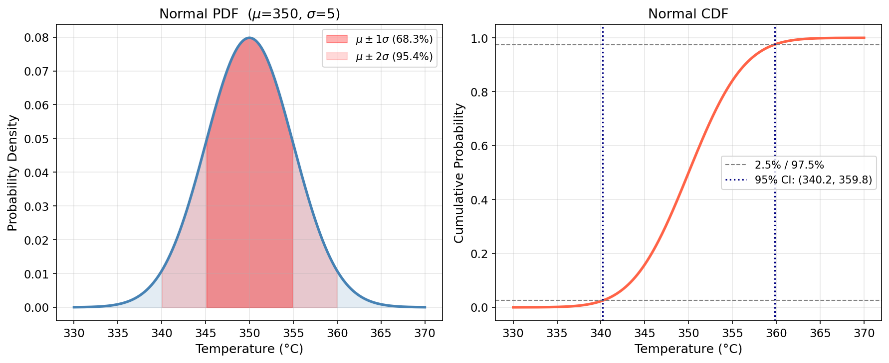
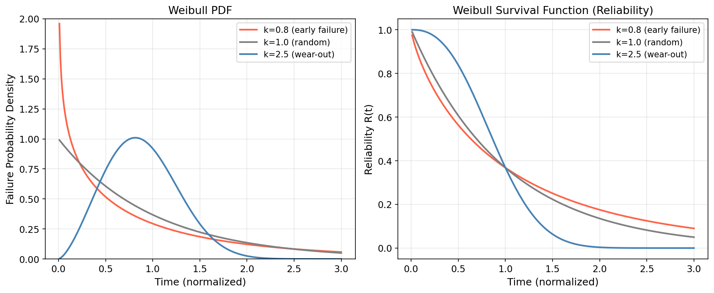
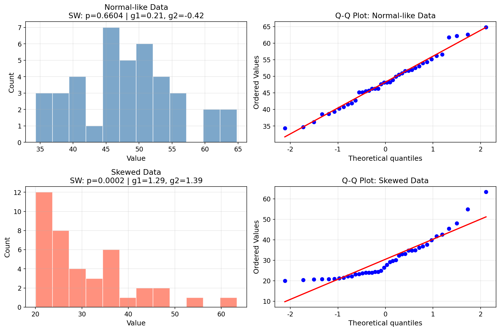
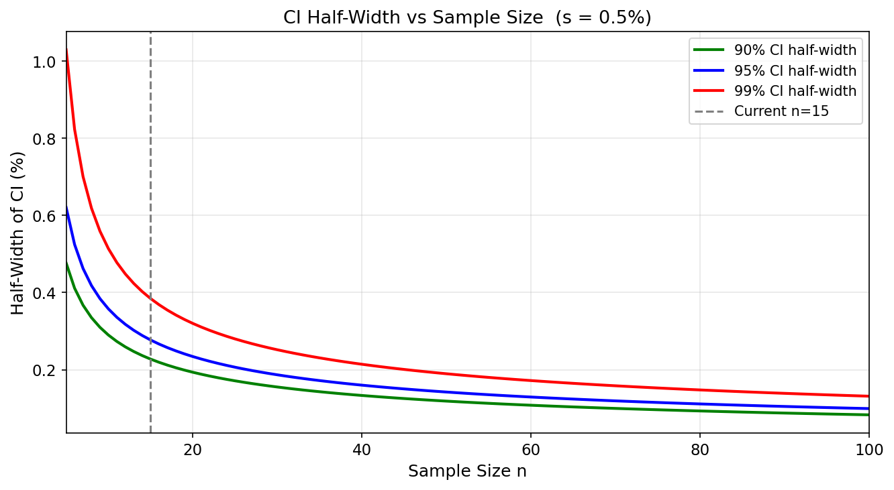
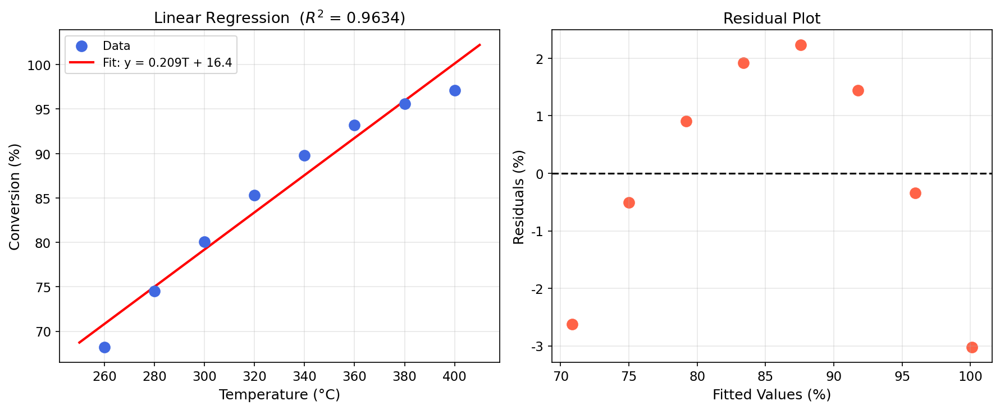

# Unit14 統計分析

本講義介紹如何以 Python（以 **SciPy** 為主要工具）進行化工程序數據的統計分析，涵蓋描述統計、機率分布、信賴區間、假設檢定與相關回歸分析，並透過化工實際問題加以應用。

---

## 學習目標

完成本單元後，學生應能：

1. 使用 `scipy.stats.describe()` 等函式進行描述統計，解讀偏態與峰態之物理意義
2. 操作 `scipy.stats` 分布物件（`norm`、`t`、`f`、`chi2`、`weibull_min`），計算 PDF/CDF/PPF 及生成隨機樣本
3. 使用 Shapiro-Wilk 與 D'Agostino-Pearson 檢定判斷數據常態性，並繪製 Q-Q 圖
4. 計算母體均值與變異數之信賴區間，理解信賴水準與樣本數對區間寬度的影響
5. 正確執行單樣本 t 檢定、兩樣本 t 檢定、配對 t 檢定，並解讀 p 值與決策結論
6. 執行單因子 ANOVA（`scipy.stats.f_oneway()`），解讀 F 值與 ANOVA 表結構
7. 執行卡方檢定（適合度與獨立性），以及 Mann-Whitney U 等無母數檢定
8. 計算 Pearson/Spearman 相關係數，並使用 `scipy.stats.linregress()` 進行含統計推論之簡單線性回歸

---

## 目錄

1. [統計分析在化工中的重要性](#1-統計分析在化工中的重要性)
   - 1.1 化工程序數據的不確定性來源
   - 1.2 統計分析的目的與流程
   - 1.3 `scipy.stats` 模組定位
2. [描述統計與數據摘要](#2-描述統計與數據摘要)
   - 2.1 集中趨勢量度
   - 2.2 離散程度量度
   - 2.3 形狀量度：偏態與峰態
   - 2.4 百分位數與箱型圖
3. [機率分布物件與常用分布](#3-機率分布物件與常用分布)
   - 3.1 `scipy.stats` 分布物件統一介面
   - 3.2 常態分布
   - 3.3 t 分布與 F 分布
   - 3.4 卡方分布與指數分布
   - 3.5 Weibull 分布與可靠度分析
   - 3.6 常態性檢定
4. [信賴區間](#4-信賴區間)
   - 4.1 母體均值之信賴區間
   - 4.2 母體變異數之信賴區間
   - 4.3 信賴區間寬度的影響因素
5. [假設檢定](#5-假設檢定)
   - 5.1 假設檢定架構
   - 5.2 t 檢定
   - 5.3 變異數齊一性檢定
   - 5.4 單因子變異數分析 (ANOVA)
   - 5.5 卡方檢定
   - 5.6 無母數統計檢定
6. [相關分析與線性回歸](#6-相關分析與線性回歸)
   - 6.1 相關係數
   - 6.2 簡單線性回歸
7. [Python 相關函式總覽](#7-python-相關函式總覽)

---

## 1. 統計分析在化工中的重要性

### 1.1 化工程序數據的不確定性來源

在化工程序的實際操作與量測中，每一筆數據都包含程度不一的不確定性（Uncertainty）。主要的不確定性來源包括：

- **量測誤差（Measurement Error）**：儀器精度限制、校正偏差、讀數誤差
- **製程擾動（Process Disturbance）**：進料組成波動、操作條件漂移、環境溫度變化
- **儀器漂移（Instrument Drift）**：感測器長時間老化導致的系統性偏差
- **取樣誤差（Sampling Error）**：樣本量不足或取樣位置不代表性

因此，對實驗或量測所得的數據，不能單純以「一個數字」表達結果，而應以**統計分析**的方式呈現，量化不確定性並提供可信賴的估計範圍。

### 1.2 統計分析的目的與流程

統計分析在化工中的主要目的：

1. **從樣本推斷母體特性**：以有限的量測數據推估真實程序特性
2. **量化不確定性**：計算信賴區間，提供估計結果的可靠性
3. **協助決策**：以假設檢定判斷程序是否符合規格、兩方法是否有顯著差異

典型的統計分析流程：

$$
\text{數據收集} \rightarrow \text{描述統計} \rightarrow \text{分布鑑別} \rightarrow \text{推論統計} \rightarrow \text{結論}
$$

### 1.3 `scipy.stats` 模組定位

`scipy.stats` 是 SciPy 科學運算套件中專門負責統計計算的子模組，提供：

- **機率分布物件**：超過 100 種連續與離散分布，統一介面操作
- **統計檢定函式**：t 檢定、F 檢定、卡方檢定、無母數檢定等
- **描述統計函式**：集中趨勢、離散程度、偏態、峰態等
- **回歸分析工具**：簡單線性回歸（含統計推論）

---

## 2. 描述統計與數據摘要

### 2.1 集中趨勢量度

描述數據「中心位置」的統計量：

| 統計量 | 符號 | 公式 | 特性 |
|--------|------|------|------|
| 算術平均值 | $\bar{x}$ | $\bar{x} = \frac{1}{n}\sum_{i=1}^{n} x_i$ | 受離群值影響大 |
| 中位數 | $\tilde{x}$ | 排序後第 $(n+1)/2$ 個值 | 對離群值穩健 |
| 眾數 | — | 出現頻率最高之值 | 適用類別型數據 |

### 2.2 離散程度量度

描述數據「分散程度」的統計量：

| 統計量 | 符號 | 公式 |
|--------|------|------|
| 樣本變異數 | $s^2$ | $s^2 = \frac{1}{n-1}\sum_{i=1}^{n}(x_i - \bar{x})^2$ |
| 樣本標準差 | $s$ | $s = \sqrt{s^2}$ |
| 全距 | $R$ | $R = x_{\max} - x_{\min}$ |
| 四分位距 | $\mathrm{IQR}$ | $\mathrm{IQR} = Q_3 - Q_1$ |

> **注意**：分母使用 $n-1$ （自由度修正）以獲得 $s^2$ 的**不偏估計量**，而非 $n$ 。

### 2.3 形狀量度：偏態與峰態

**偏態係數（Skewness）** $g_1$ 描述分布的不對稱程度：

$$
g_1 = \frac{1}{n} \sum_{i=1}^{n} \left(\frac{x_i - \bar{x}}{s}\right)^3
$$

- $g_1 > 0$ ：右偏（正偏），右尾較長，均值 $>$ 中位數
- $g_1 = 0$ ：對稱分布
- $g_1 < 0$ ：左偏（負偏），左尾較長，均值 $<$ 中位數

**峰態係數（Kurtosis）** $g_2$ 描述分布的尖峭程度（相對常態分布）：

$$
g_2 = \frac{1}{n} \sum_{i=1}^{n} \left(\frac{x_i - \bar{x}}{s}\right)^4 - 3
$$

- $g_2 > 0$ ：尖峭峰態（Leptokurtic），尾部較常態厚
- $g_2 = 0$ ：常態分布標準值
- $g_2 < 0$ ：平坦峰態（Platykurtic），尾部較常態薄

**`scipy.stats` 相關函式**：

```python
from scipy import stats

# 一次輸出所有描述統計
result = stats.describe(data)
# result.nobs      : 樣本數
# result.minmax    : (最小值, 最大值)
# result.mean      : 均值
# result.variance  : 變異數 (ddof=1)
# result.skewness  : 偏態係數
# result.kurtosis  : 峰態係數 (excess kurtosis, 常態=0)

# 單獨計算偏態與峰態
g1 = stats.skew(data)
g2 = stats.kurtosis(data)   # excess kurtosis
```

### 2.4 百分位數與箱型圖

**百分位數（Percentile）** $P_k$ 表示數據中有 $k\%$ 的值小於等於此值：

```python
import numpy as np

P25 = np.percentile(data, 25)   # Q1
P50 = np.percentile(data, 50)   # 中位數
P75 = np.percentile(data, 75)   # Q3
IQR = P75 - P25
```

**箱型圖（Box Plot）解讀**：

- **箱體（Box）**：從 $Q_1$ 到 $Q_3$ ，表示中間 50% 的數據範圍
- **中線（Median Line）**： $Q_2$ （中位數）
- **鬚線（Whiskers）**：延伸至 $Q_1 - 1.5 \times \mathrm{IQR}$ 與 $Q_3 + 1.5 \times \mathrm{IQR}$ 範圍內的最極端值
- **離群值（Outliers）**：超出鬚線範圍的點，以個別符號標示
  - 定義： $x < Q_1 - 1.5 \times \mathrm{IQR}$ 或 $x > Q_3 + 1.5 \times \mathrm{IQR}$

```python
import matplotlib.pyplot as plt

fig, ax = plt.subplots()
ax.boxplot(data, vert=True)
ax.set_title('Box Plot of Process Data')
ax.set_ylabel('Measured Value')
plt.show()
```

#### 範例演練結果

**數值輸出：**

```
樣本數: 97

【集中趨勢】
  平均值 (mean):    351.705 °C
  中位數 (median):  350.685 °C
  眾數 (mode):      339.521 °C

【離散程度】
  樣本標準差 s:     6.378 °C
  樣本變異數 s²:    40.684 °C²
  Q1:               347.822 °C
  Q3:               354.228 °C
  IQR:              6.406 °C
  全距 (range):     38.479 °C

【形狀量度】
  偏態係數 g1:      1.2965  (>0 右偏)
  峰態係數 g2:      3.1324  (excess, 常態=0)

【scipy.stats.describe() 一次輸出】
  DescribeResult(nobs=97, minmax=(339.521, 378.0), mean=351.705,
                 variance=40.684, skewness=1.2965, kurtosis=3.1324)
```

**圖形輸出：**



**結果分析與討論：**

本範例以模擬反應器出口溫度數據（ $n = 97$ ）為例，由常態主體（均值 350°C、標準差 4°C）混合少數高溫事件及兩個極端離群值（375°C、378°C）組成。

- **集中趨勢**：均值（351.705°C）略高於中位數（350.685°C），為右偏分布的典型特徵——少數高溫點拉高了均值，但中位數對此不敏感，更能代表「典型」操作溫度
- **離散程度**：IQR = 6.406°C，中間 50% 的數據非常集中；全距 = 38.479°C 受離群值影響大，說明以全距描述製程散布容易被誤導，IQR 是更穩健的選擇
- **偏態係數** $g_1 = 1.2965 > 0$ ：明顯右偏，與直方圖中右側長尾吻合，均值 $>$ 中位數，直方圖可見高溫側有較寬尾部
- **峰態係數** $g_2 = 3.1324 > 0$ ：正超額峰態（Leptokurtic），尾部比標準常態更厚，由離群值群造成；若數據符合常態分布，此值應接近 0

**箱型圖解讀**：Q1 = 347.8°C，中位數 = 350.7°C，Q3 = 354.2°C，中箱寬度 IQR = 6.4°C 反映製程的「日常」波動。超出 $Q_3 + 1.5 \times \mathrm{IQR}$ 鬚線的 3 個離群點（約 365°C、375°C、378°C）標示為圓圈，代表偶發性高溫異常事件，在製程品質監控中具有警示意義。

---

## 3. 機率分布物件與常用分布

### 3.1 `scipy.stats` 分布物件統一介面

`scipy.stats` 中所有分布物件均提供一致的方法介面：

| 方法 | 說明 | 範例 |
|------|------|------|
| `rvs(size)` | 產生隨機樣本 | `norm.rvs(size=100)` |
| `pdf(x)` | 機率密度函數（連續） | `norm.pdf(x)` |
| `pmf(x)` | 機率質量函數（離散） | `poisson.pmf(k)` |
| `cdf(x)` | 累積分布函數 $F(x) = P(X \leq x)$ | `norm.cdf(1.96)` |
| `ppf(q)` | 分位數函數（`cdf` 之反函數） | `norm.ppf(0.975)` |
| `sf(x)` | 存活函數 $S(x) = 1 - F(x)$ | `norm.sf(x)` |
| `fit(data)` | 最大概似估計法 (MLE) 擬合參數 | `norm.fit(data)` |
| `interval(alpha)` | 包含 $\alpha$ 機率之對稱區間 | `norm.interval(0.95)` |

```python
from scipy import stats

# 建立分布物件 (常態分布，均值=10，標準差=2)
dist = stats.norm(loc=10, scale=2)

# 各項計算
print(dist.pdf(10))          # 在 x=10 的機率密度
print(dist.cdf(12))          # P(X <= 12)
print(dist.ppf(0.975))       # 97.5 百分位數
print(dist.interval(0.95))   # 95% 中央區間
samples = dist.rvs(size=200) # 產生 200 個隨機樣本
```

### 3.2 常態分布

常態分布（Normal Distribution）是統計學中最重要的分布，許多自然與工程量測數據近似常態：

$$
f(x) = \frac{1}{\sigma\sqrt{2\pi}} \exp\!\left(-\frac{(x-\mu)^2}{2\sigma^2}\right), \quad -\infty < x < \infty
$$

其中 $\mu$ 為均值（位置參數 `loc`）， $\sigma$ 為標準差（尺度參數 `scale`）。

**標準化（Standardization）**：

$$
z = \frac{x - \mu}{\sigma} \sim \mathcal{N}(0, 1)
$$

**重要臨界值**：

| 信賴水準 $1-\alpha$ | $z_{\alpha/2}$ |
|---------------------|----------------|
| 90% | 1.645 |
| 95% | 1.960 |
| 99% | 2.576 |

```python
from scipy import stats

# 標準常態分布
z = stats.norm(loc=0, scale=1)
print(z.ppf(0.975))   # 1.96

# 一般常態分布
mu, sigma = 100, 5
dist = stats.norm(loc=mu, scale=sigma)
print(dist.cdf(110))            # P(X <= 110)
print(dist.interval(0.95))      # 95% 中央區間
```

**中心極限定理（Central Limit Theorem, CLT）**：
無論母體分布形態如何，當樣本數 $n$ 夠大時，樣本均值 $\bar{x}$ 的分布趨近常態分布：

$$
\bar{x} \sim \mathcal{N}\!\left(\mu,\, \frac{\sigma^2}{n}\right)
$$

#### 範例演練結果（常態分布）

**數值輸出：**

```
P(T ≤ 360) = 0.9772
P(T > 355) = 0.1587
95% 中央區間: (340.200, 359.800)
z_0.975 = 1.9600
```

**圖形輸出：**



**結果分析與討論：**

以反應器溫度服從 $\mathcal{N}(350, 5^2)$ 為例：

- **左圖（PDF）**：鐘形曲線對稱於均值 350°C，紅色深色陰影為 $\mu \pm 1\sigma$ 區間（涵蓋 68.3% 的機率），淺色陰影延伸至 $\mu \pm 2\sigma$ （涵蓋 95.4%），直觀呈現常態分布的「68-95-99.7 法則」
- **右圖（CDF）**： $P(T \leq 360) = 0.9772$ ，即操作溫度低於 360°C 的機率達 97.72%； $P(T > 355) = 0.1587$ ，即約 15.87% 的時間溫度超過 355°C
- **95% 中央區間**（340.2°C, 359.8°C）：對應 $z_{0.025} = -1.96$ 與 $z_{0.975} = +1.96$ ，是設定製程管制界限的常用依據
- **z 臨界值** $z_{0.975} = 1.9600$ ：此為統計推論中最常用的臨界值，對應雙尾 5% 顯著水準

### 3.3 t 分布與 F 分布

**t 分布（Student's t-distribution）**：

當母體標準差 $\sigma$ 未知且需由樣本估計時，使用 t 分布進行推論。自由度 $\nu = n - 1$ ：

$$
t = \frac{\bar{x} - \mu}{s/\sqrt{n}} \sim t(\nu)
$$

- $\nu$ 越小： 尾部越厚（不確定性越大）
- 當 $\nu \to \infty$ ：t 分布趨近標準常態分布 $\mathcal{N}(0,1)$

```python
from scipy import stats

# t 分布，自由度 df=10
t_dist = stats.t(df=10)
print(t_dist.ppf(0.975))   # t 臨界值 (df=10, 雙尾 alpha=0.05)
```

**F 分布（F-distribution）**：

F 分布為兩個卡方分布之比，用於比較兩組樣本的變異數：

$$
F = \frac{s_1^2 / \sigma_1^2}{s_2^2 / \sigma_2^2} \sim F(\nu_1, \nu_2)
$$

其中 $\nu_1 = n_1 - 1$ ， $\nu_2 = n_2 - 1$ 為兩組的自由度。

```python
f_dist = stats.f(dfn=5, dfd=20)
print(f_dist.ppf(0.95))   # F 臨界值 (dfn=5, dfd=20, alpha=0.05)
```

### 3.4 卡方分布與指數分布

**卡方分布（Chi-squared Distribution）**：

$\nu$ 個獨立標準常態變數的平方和服從自由度為 $\nu$ 的卡方分布：

$$
\chi^2 = \sum_{i=1}^{\nu} Z_i^2, \quad Z_i \sim \mathcal{N}(0,1)
$$

用於母體變異數推論與適合度檢定。

**指數分布（Exponential Distribution）**：

描述設備連續運作下的**無故障壽命（Time to Failure）**，具有**無記憶性（Memoryless Property）**：

$$
f(t) = \lambda e^{-\lambda t}, \quad t \geq 0
$$

其中 $\lambda = 1/\theta$ 為故障率，`scale` $= \theta$ 為平均壽命（MTBF）。

```python
# 指數分布，平均壽命 1000 小時
expon_dist = stats.expon(scale=1000)
print(expon_dist.sf(500))    # P(T > 500)，可靠度
print(expon_dist.ppf(0.5))   # 中位壽命 (median life)
```

### 3.5 Weibull 分布與可靠度分析

Weibull 分布是化工設備可靠度（Reliability）分析中使用最廣泛的分布，能靈活描述設備不同生命週期的故障特性：

$$
f(t) = \frac{k}{\lambda}\left(\frac{t}{\lambda}\right)^{k-1} \exp\!\left[-\left(\frac{t}{\lambda}\right)^k\right], \quad t \geq 0
$$

**形狀參數 $k$ 的物理意義**：

| 形狀參數 $k$ | 故障模式 | 物理意義 |
|-------------|---------|---------|
| $k < 1$ | 早夭型（Infant Mortality） | 故障率隨時間遞減 |
| $k = 1$ | 隨機型（Random Failures） | 故障率恆定 = 指數分布 |
| $k > 1$ | 老化型（Wear-out） | 故障率隨時間遞增 |

```python
from scipy import stats

# Weibull 分布 (k=2 老化型，scale=1000)
weibull_dist = stats.weibull_min(c=2, scale=1000)
print(weibull_dist.mean())       # 平均壽命
print(weibull_dist.sf(800))      # 可靠度 R(t=800)

# 由數據擬合 Weibull 參數 (MLE)
failure_times = [320, 450, 560, 710, 850, 930]
c, loc, scale = stats.weibull_min.fit(failure_times, floc=0)
print(f"k = {c:.3f}, scale = {scale:.1f}")
```

#### 範例演練結果（Weibull 分布）

**數值輸出：**

```
真實參數: k=2.5, scale=1000
MLE 擬合: k=2.919, scale=1101.0
```

**圖形輸出：**



**結果分析與討論：**

圖形清晰呈現三種形狀參數 $k$ 代表的不同故障模式：

- **$k = 0.8$ （紅線，早夭型）**：PDF 在 $t=0$ 有最高值並單調遞減——設備剛啟動時故障率最高（如安裝不良、材料缺陷），之後逐漸降低；可靠度曲線在初期快速下降後趨於平緩
- **$k = 1.0$ （灰線，隨機型）**：PDF 為指數分布形狀，故障率恆定；可靠度呈指數衰減 $R(t) = e^{-t}$ ，無記憶性（Memoryless），適用於電子元件隨機失效
- **$k = 2.5$ （藍線，老化型）**：PDF 形成明顯峰值（約在 $t = 0.9$ ），之後衰減；可靠度在前段維持高水準後急速下降，反映設備磨耗老化現象，適用於機械元件疲勞失效

**MLE 擬合結果**：由 30 組模擬故障時間（真實 $k=2.5$, scale=1000）擬合得 $k=2.919$, scale=1101.0，存在約 17% 的偏差，符合小樣本 MLE 估計的統計誤差範圍（樣本數越大估計越準確）。

### 3.6 常態性檢定

在進行 t 檢定、ANOVA 等參數統計檢定前，通常需要先驗證數據是否符合常態分布假設。

**Shapiro-Wilk 檢定**（小樣本推薦， $n < 50$ ）：

$$
H_0: \text{數據來自常態分布} \quad H_1: \text{數據非常態分布}
$$

```python
from scipy import stats

stat, p_value = stats.shapiro(data)
print(f"Shapiro-Wilk: W = {stat:.4f}, p = {p_value:.4f}")
if p_value > 0.05:
    print("結論: 無法拒絕 H0，數據符合常態分布 (alpha=0.05)")
else:
    print("結論: 拒絕 H0，數據不符合常態分布 (alpha=0.05)")
```

**D'Agostino-Pearson 檢定**（大樣本，基於偏態與峰態）：

```python
stat, p_value = stats.normaltest(data)
print(f"D'Agostino-Pearson: stat = {stat:.4f}, p = {p_value:.4f}")
```

**Q-Q 圖（Quantile-Quantile Plot）視覺化**：

Q-Q 圖將樣本分位數（y 軸）對照理論常態分位數（x 軸），若數據近似常態分布，點應落在 $y = x$ 對角線附近：

```python
import matplotlib.pyplot as plt
from scipy import stats

fig, ax = plt.subplots()
stats.probplot(data, dist="norm", plot=ax)
ax.set_title('Q-Q Plot (Normal)')
plt.tight_layout()
plt.show()
```

#### 範例演練結果（常態性檢定）

**數值輸出：**

```
==================================================

Normal-like:
  Shapiro-Wilk: W=0.9792, p=0.6604  → 符合常態
  D'Agostino:   stat=0.4692, p=0.7909

Skewed:
  Shapiro-Wilk: W=0.8623, p=0.0002  → 不符合常態
  D'Agostino:   stat=13.7535, p=0.0010
```

**圖形輸出：**



**結果分析與討論：**

兩組各 40 筆數據的常態性檢定結果對比，完整驗證了理論：

- **常態型數據**（來自 $\mathcal{N}(50, 8^2)$ ）：
  - Shapiro-Wilk 統計量 $W = 0.9792$ （接近 1.0）， $p = 0.6604 \gg 0.05$ ，無法拒絕常態假設
  - D'Agostino-Pearson $p = 0.7909$ ：偏態（ $g_1 = 0.21$ ）與峰態（ $g_2 = -0.42$ ）均無顯著偏離
  - Q-Q 圖各點緊密落在對角線上，確認常態性

- **偏態數據**（來自指數分布，均值約 30）：
  - Shapiro-Wilk $W = 0.8623$ ， $p = 0.0002 \ll 0.05$ ，強力拒絕常態假設
  - D'Agostino $p = 0.0010$ ： $g_1 = 1.29$ （明顯右偏）， $g_2 = 1.39$ （尖峭）
  - Q-Q 圖尾部偏離對角線呈彎曲形狀，為右偏非常態分布的典型圖形

> **實務建議**：在執行 t 檢定或 ANOVA 前，應先以 Shapiro-Wilk（小樣本）或 D'Agostino-Pearson（大樣本）搭配 Q-Q 圖進行常態性驗證；若不符合常態，優先考慮無母數方法（如 Mann-Whitney U 或 Kruskal-Wallis）。

---

## 4. 信賴區間

### 4.1 母體均值之信賴區間

信賴區間（Confidence Interval, CI）提供母體參數的估計範圍，使我們能以指定的信賴水準 $1-\alpha$ 確信真實參數落在該區間內。

**情況一：母體標準差 $\sigma$ 已知（使用常態分布）**

$$
\bar{x} \pm z_{\alpha/2} \cdot \frac{\sigma}{\sqrt{n}}
$$

**情況二：母體標準差 $\sigma$ 未知（使用 t 分布，實際最常見）**

$$
\bar{x} \pm t_{\alpha/2,\, n-1} \cdot \frac{s}{\sqrt{n}}
$$

其中 $t_{\alpha/2, n-1}$ 為 t 分布在自由度 $n-1$ 、雙尾顯著水準 $\alpha$ 下的臨界值。

```python
import numpy as np
from scipy import stats

data = np.array([98.5, 99.2, 100.1, 98.8, 99.5, 100.3, 99.7, 100.0])
n = len(data)
x_bar = np.mean(data)
s = np.std(data, ddof=1)
confidence = 0.95   # 95% 信賴區間

# 方法一: 直接使用 stats.t.interval()
ci = stats.t.interval(confidence, df=n-1, loc=x_bar, scale=s/np.sqrt(n))
print(f"樣本均值: {x_bar:.4f}")
print(f"95% 信賴區間: ({ci[0]:.4f}, {ci[1]:.4f})")

# 方法二: 手動計算
t_crit = stats.t.ppf(1 - (1 - confidence)/2, df=n-1)
margin = t_crit * s / np.sqrt(n)
print(f"誤差邊界 (Margin of Error): ±{margin:.4f}")
```

### 4.2 母體變異數之信賴區間

母體變異數 $\sigma^2$ 的信賴區間使用卡方分布：

$$
\left[\frac{(n-1)s^2}{\chi^2_{1-\alpha/2,\, n-1}},\; \frac{(n-1)s^2}{\chi^2_{\alpha/2,\, n-1}}\right]
$$

注意：卡方分布**不對稱**，因此上下界需分別計算。下界除以較大的 $\chi^2_{1-\alpha/2}$ ，上界除以較小的 $\chi^2_{\alpha/2}$ ，確保下界 $<$ 上界。

```python
import numpy as np
from scipy import stats

n = len(data)
s2 = np.var(data, ddof=1)   # 樣本變異數
alpha = 0.05

chi2_lower = stats.chi2.ppf(alpha/2, df=n-1)
chi2_upper = stats.chi2.ppf(1 - alpha/2, df=n-1)

ci_var_lower = (n-1) * s2 / chi2_upper
ci_var_upper = (n-1) * s2 / chi2_lower

print(f"樣本標準差 s = {np.sqrt(s2):.4f}")
print(f"95% 變異數信賴區間: ({ci_var_lower:.4f}, {ci_var_upper:.4f})")
print(f"95% 標準差信賴區間: ({np.sqrt(ci_var_lower):.4f}, {np.sqrt(ci_var_upper):.4f})")
```

#### 範例演練結果（化工產品純度信賴區間）

**數值輸出：**

```
樣本量: n = 15
樣本均值: x̄ = 99.4533%
樣本標準差: s = 0.5730%

  90% CI: (99.1927, 99.7139)  ± 0.2606%   [t_crit = 1.7613]
  95% CI: (99.1360, 99.7707)  ± 0.3173%   [t_crit = 2.1448]
  99% CI: (99.0129, 99.8938)  ± 0.4405%   [t_crit = 2.9768]

95% 變異數信賴區間: (0.1760, 0.8168) %²
95% 標準差信賴區間: (0.4195, 0.9037) %
```

**結果分析與討論：**

以 15 筆化工產品純度量測數據（ $\bar{x} = 99.45\%$ ， $s = 0.5730\%$ ）為例：

- **均值信賴區間**：95% CI 為 (99.136%, 99.771%)，相較 90% CI 區間更寬（±0.317% vs ±0.261%），99% CI 更進一步擴大至 ±0.441%。這體現了「信心越高，區間越寬」的基本取捨——以更大不確定範圍換取更高把握度
- **t 臨界值**： $t_{0.975, 14} = 2.1448$ （較常態分布 $z_{0.975} = 1.960$ 略大），原因在於 $n = 15$ 樣本量較小，t 分布尾部較厚，反映小樣本估計的額外不確定性
- **變異數信賴區間**：95% CI 為 $(0.1760, 0.8168)\,\%^2$ ，注意卡方分布的**不對稱性**——區間並非對稱於 $s^2 = 0.3283\,\%^2$ 。相應標準差的 95% CI 為 (0.4195%, 0.9037%)，製程操作員可依此判斷製程變異是否在可接受範圍

### 4.3 信賴區間寬度的影響因素

信賴區間的寬度（精確度）受以下因素影響：

| 因素 | 影響 | 說明 |
|------|------|------|
| 樣本數 $n$ 增大 | 區間**縮窄** | $\propto 1/\sqrt{n}$ ，需增加 4 倍樣本數才能縮半 |
| 信賴水準 $1-\alpha$ 提高 | 區間**加寬** | 更有把握但區間更大（準確性與精確性的取捨） |
| 樣本標準差 $s$ 增大 | 區間**加寬** | 數據變異性越大，估計越不精確 |

#### 範例演練結果（信賴區間寬度 vs 樣本數）

**圖形輸出：**



**結果分析與討論：**

圖中以固定標準差 $s = 0.5\%$ 計算 90%/95%/99% 三條 CI 半寬曲線（樣本數 $n = 5$ 至 $100$ ）：

- **樣本數效應**：三條曲線均呈 $1/\sqrt{n}$ 形狀快速遞減。在 $n = 15$ （虛線標示，即本範例的純度數據）時，95% CI 半寬約為 0.31%；若增加至 $n = 60$ （4 倍），半寬縮減至約 0.13%（縮小至約一半），印證 $\propto 1/\sqrt{n}$ 的關係
- **信賴水準效應**：在相同樣本數下，99% CI（紅）始終最寬，90% CI（綠）最窄。小樣本（ $n < 20$ ）時三條曲線間距較大，表示此時信賴水準選擇對結果影響顯著
- **實務意義**：在化工品質管制中，若需將 95% CI 半寬縮至目標值（例如 ±0.15%），可由圖中直接讀取所需最小樣本數（約 $n = 50$ ），為實驗設計提供依據

---

## 5. 假設檢定

### 5.1 假設檢定架構

假設檢定（Hypothesis Testing）是根據樣本數據對母體特性進行推論的統計方法：

- **虛無假設 $H_0$ （Null Hypothesis）**：預設的基準假設，通常表示「無差異」或「符合規格」
- **對立假設 $H_1$ （Alternative Hypothesis）**：欲驗證的假設
- **型 I 誤差（Type I Error） $\alpha$**： $H_0$ 為真但拒絕 $H_0$ （誤判，假陽性）
- **型 II 誤差（Type II Error） $\beta$**： $H_1$ 為真但接受 $H_0$ （漏判，假陰性）
- **p 值（p-value）**：在 $H_0$ 為真的前提下，觀測到當前或更極端結果的機率

**決策準則**：

$$
p < \alpha \Rightarrow \text{拒絕 } H_0 \quad(\text{常用顯著水準 } \alpha = 0.05)
$$

| 結論 | 意義 |
|------|------|
| $p < 0.05$ | 統計上顯著，有足夠證據拒絕 $H_0$ |
| $p \geq 0.05$ | 統計上不顯著，無足夠證據拒絕 $H_0$ |

> **注意**：「無法拒絕 $H_0$ 」**不等於** $H_0$ 一定為真，只是樣本證據不足以推翻它。

### 5.2 t 檢定

**單樣本 t 檢定（One-Sample t-test）**

檢定樣本均值是否等於目標值 $\mu_0$ ：

$$
H_0: \mu = \mu_0 \quad \text{vs.} \quad H_1: \mu \neq \mu_0
$$

$$
t = \frac{\bar{x} - \mu_0}{s/\sqrt{n}}, \quad \nu = n - 1
$$

```python
from scipy import stats
import numpy as np

# 例：某批次產品純度數據，檢定是否符合規格均值 99.5%
purity = np.array([99.2, 99.8, 99.4, 99.6, 99.1, 99.7, 99.3, 99.5])
target = 99.5

t_stat, p_value = stats.ttest_1samp(purity, popmean=target)
print(f"t 統計量: {t_stat:.4f}")
print(f"p 值 (雙尾): {p_value:.4f}")

# 單尾檢定 (例: H1: mu < 99.5)
p_one_tail = p_value / 2 if t_stat < 0 else 1 - p_value / 2
print(f"p 值 (單尾, H1: mu < {target}): {p_one_tail:.4f}")
```

**獨立兩樣本 t 檢定（Independent Two-Sample t-test）**

比較兩組獨立樣本的均值是否相同：

$$
H_0: \mu_1 = \mu_2 \quad \text{vs.} \quad H_1: \mu_1 \neq \mu_2
$$

```python
# 例：比較兩種催化劑的反應轉化率
conv_A = np.array([85.2, 86.1, 84.8, 85.5, 86.3])
conv_B = np.array([87.1, 88.0, 86.5, 87.8, 88.2])

# Welch's t-test (不假設等變異數，更通用)
t_stat, p_value = stats.ttest_ind(conv_A, conv_B, equal_var=False)
print(f"Welch's t-test: t = {t_stat:.4f}, p = {p_value:.4f}")

# 等變異數 t-test (Pooled, 適用於變異數相等時)
t_stat2, p_value2 = stats.ttest_ind(conv_A, conv_B, equal_var=True)
print(f"Pooled t-test: t = {t_stat2:.4f}, p = {p_value2:.4f}")
```

**配對樣本 t 檢定（Paired t-test）**

適用於同一批樣本在兩種不同條件下的比較（before/after）：

```python
# 例：同一批反應器在改善操作條件前後的產率
before = np.array([78.5, 79.2, 77.8, 80.1, 78.9])
after  = np.array([81.3, 82.0, 80.5, 83.2, 81.8])

t_stat, p_value = stats.ttest_rel(before, after)
print(f"配對 t-test: t = {t_stat:.4f}, p = {p_value:.4f}")
mean_diff = np.mean(after - before)
print(f"平均改善量: {mean_diff:.2f}%")
```

#### 範例演練結果（t 檢定）

**單樣本 t 檢定輸出（純度規格檢定）：**

```
[單樣本 t 檢定]
  H0: μ = 99.5%  (符合規格)
  H1: μ ≠ 99.5%  (不符合規格)

  樣本均值:     x̄ = 99.4533%
  t 統計量:     t = -0.3154
  p 値 (雙尾): p = 0.7571

  結論: 無法拒絕 H0 (p ≥ 0.05) — 產品純度符合規格

  單尾 p 値 (H1: μ > 99.5): p = 0.6214
```

**兩樣本 t 檢定輸出（催化劑轉化率比較）：**

```
[獨立兩樣本 t 檢定：催化劑轉化率比較]
  催化劑 A: n=12, mean=85.20%, sd=2.56%
  催化劑 B: n=12, mean=86.85%, sd=2.72%

  Levene 等變異數檢定: stat=0.2604, p=0.6149
  → 等變異數 (Pooled) t 檢定

  Welch's t-test: t=-1.5358, p=0.1389
  Pooled t-test:  t=-1.5358, p=0.1389

  結論 (Welch, α=0.05): 兩種催化劑轉化率無顯著差異
```

**結果分析與討論：**

- **單樣本 t 檢定**： $t = -0.3154$ ， $p = 0.7571$ ，遠大於 0.05。樣本均值 99.453% 與目標規格 99.5% 的差異在統計上不顯著，偏低可能只是隨機波動所致，無法拒絕產品符合規格的假設
- **Levene 檢定** $p = 0.6149 > 0.05$ ：兩組變異數無顯著差異，可使用 Pooled t 檢定；從結果看 Welch 與 Pooled 輸出完全相同（兩組變異數相近時此為必然結果）
- **催化劑比較**：B 組均值（86.85%）高於 A 組（85.20%），但 $p = 0.139 > 0.05$ ，表示目前樣本量（ $n = 12$ 每組）不足以在統計上確認差異，需增加實驗次數

> **注意**：「統計上不顯著」不代表兩組「相同」，只是現有樣本證據不足以下定結論。

### 5.3 變異數齊一性檢定

在進行兩樣本 t 檢定或 ANOVA 前，可先檢驗各組數據的變異數是否相等：

**Levene 檢定**（對非常態分布具穩健性，推薦使用）：

$$
H_0: \sigma_1^2 = \sigma_2^2 = \cdots = \sigma_k^2
$$

```python
# Levene 檢定
stat, p = stats.levene(conv_A, conv_B)
print(f"Levene 檢定: stat = {stat:.4f}, p = {p:.4f}")

# Bartlett 檢定 (僅適用於常態分布數據，靈敏度較高)
stat2, p2 = stats.bartlett(conv_A, conv_B)
print(f"Bartlett 檢定: stat = {stat2:.4f}, p = {p2:.4f}")
```

### 5.4 單因子變異數分析 (ANOVA)

**單因子 ANOVA（One-Way ANOVA）** 用於比較三組或以上樣本的均值：

$$
H_0: \mu_1 = \mu_2 = \cdots = \mu_k \quad \text{vs.} \quad H_1: \text{至少有一組均值不同}
$$

**ANOVA 表結構**：

| 變異來源 | 平方和 SS | 自由度 df | 均方 MS | F 值 |
|----------|-----------|-----------|---------|------|
| 組間（Between） | $SS_B$ | $k-1$ | $MS_B = SS_B/(k-1)$ | $F = MS_B/MS_W$ |
| 組內（Within） | $SS_W$ | $N-k$ | $MS_W = SS_W/(N-k)$ | — |
| 總計 | $SS_T$ | $N-1$ | — | — |

```python
# 例：比較三種操作溫度對反應轉化率的影響
temp_300 = np.array([85.2, 86.1, 84.8, 85.5, 86.3])
temp_320 = np.array([88.1, 89.0, 87.5, 88.8, 89.2])
temp_340 = np.array([91.3, 92.0, 90.5, 91.8, 92.1])

f_stat, p_value = stats.f_oneway(temp_300, temp_320, temp_340)
print(f"One-Way ANOVA: F = {f_stat:.4f}, p = {p_value:.4f}")
if p_value < 0.05:
    print("結論: 不同溫度對轉化率有顯著影響 (p < 0.05)")
```

#### 範例演練結果（單因子 ANOVA）

**數值輸出：**

```
[單因子 ANOVA：三種操作溫度對轉化率的影響]
  300°C: mean=82.19%, sd=2.40%
  320°C: mean=86.79%, sd=1.83%
  340°C: mean=91.97%, sd=3.31%

  F 統計量: F = 35.8039
  p 値:     p = 0.000000

  結論: 拒絕 H0 — 操作溫度對轉化率有顯著影響 (p < 0.05)

  ANOVA 表
  來源                      SS    df         MS        F
  -------------------------------------------------------
  組間 (Between)       479.507     2    239.754  35.8039
  組內 (Within)        180.800    27      6.696
  總計 (Total)         660.308    29
```

**結果分析與討論：**

三種操作溫度（300°C、320°C、340°C）各 10 筆樣本的單因子 ANOVA 結果：

- **F 統計量** $F = 35.80 \gg 1$ ：組間均方 $MS_B = 239.754$ 遠大於組內均方 $MS_W = 6.696$ ，表示溫度因素對轉化率的解釋力極強
- **p 値 $\approx 0$**：強力拒絕 $H_0$ ，至少有一組均值與其他組有顯著差異
- **ANOVA 表解讀**： $SS_B = 479.5$ 占總變異 $SS_T = 660.3$ 的 72.6%，即 $\eta^2 = SS_B / SS_T \approx 0.73$ ，操作溫度可解釋 73% 的轉化率變異，為一個非常顯著的定量效應
- **後續檢定**：若需進一步確認「哪兩溫度組有顯著差異」，可使用 Tukey HSD 或 Bonferroni 多重比較

> **多重比較（Post-hoc Test）**：ANOVA 顯著後，需進一步確定哪些組間有差異。常用 Tukey HSD 法（`statsmodels` 套件提供完整實作）。

### 5.5 卡方檢定

**卡方適合度檢定（Chi-square Goodness-of-Fit Test）**：

檢定觀測頻率是否符合理論期望分布：

$$
\chi^2 = \sum_{i=1}^{k} \frac{(O_i - E_i)^2}{E_i}
$$

```python
# 例：檢定某反應的產物分布是否符合理論比例 1:2:1
observed = np.array([28, 45, 27])   # 觀測頻數
expected_ratio = np.array([1, 2, 1])
expected = expected_ratio / expected_ratio.sum() * observed.sum()

chi2_stat, p_value = stats.chisquare(f_obs=observed, f_exp=expected)
print(f"卡方適合度: chi2 = {chi2_stat:.4f}, p = {p_value:.4f}")
```

**卡方獨立性檢定（Chi-square Test of Independence）**：

檢定兩類別變數是否相互獨立。輸入**列聯表（Contingency Table）**：

```python
# 例：操作班別與產品缺陷類型是否相關
contingency = np.array([
    [20, 10, 5],   # 早班
    [15, 18, 7],   # 中班
    [12, 14, 9],   # 晚班
])

chi2_stat, p_value, df, expected = stats.chi2_contingency(contingency)
print(f"卡方獨立性: chi2 = {chi2_stat:.4f}, p = {p_value:.4f}, df = {df}")
```

### 5.6 無母數統計檢定

當數據**不符合常態分布**或**樣本數很小**時，使用無母數方法：

**Mann-Whitney U 檢定**（兩樣本中位數比較，不假設常態）：

```python
# 兩樣本中位數比較 (Wilcoxon rank-sum test)
stat, p = stats.mannwhitneyu(conv_A, conv_B, alternative='two-sided')
print(f"Mann-Whitney U: stat = {stat:.0f}, p = {p:.4f}")
```

**Kruskal-Wallis 檢定**（k 組樣本比較，ANOVA 的無母數版本）：

```python
stat, p = stats.kruskal(temp_300, temp_320, temp_340)
print(f"Kruskal-Wallis: H = {stat:.4f}, p = {p:.4f}")
```

#### 範例演練結果（卡方檢定 + 無母數檢定）

**數值輸出：**

```
[卡方適合度檢定：反應產物分布是否符合理論比例 1:2:1]
  觀測:   [22 48 30]
  期望:   [25. 50. 25.]
  chi2 = 1.4400, p = 0.4868
  結論: 分布符合理論比例 1:2:1

[卡方獨立性檢定：操作班別 vs 產品等級是否相關]
  chi2 = 1.6992, p = 0.7909, df = 4
  結論: 班別與產品等級無顯著相關

[Mann-Whitney U 無母數檢定（兩樣本中位數比較）]
  U = 42, p = 0.0885

[Kruskal-Wallis 無母數 ANOVA]
  H = 22.3510, p = 0.000014
```

**結果分析與討論：**

- **卡方適合度檢定**： $\chi^2 = 1.44$ ， $p = 0.4868 > 0.05$ ，無法拒絕產物分布符合 1:2:1 比例的假設。檢驗典型化學反應產物分布，若觀察對期望偏離不大，可認為分布符合理論比例
- **卡方獨立性檢定**： $\chi^2 = 1.70$ ， $p = 0.791$ ，自由度 $df = 4 = (3-1) \times (3-1)$ 。班別與產品品質等級之間無顯著相關性（ $p = 0.791 > 0.05$ ），各班別的產品品質分布相似
- **Mann-Whitney U 檢定**： $U = 42$ ， $p = 0.0885 > 0.05$ ，不拒絕 $H_0$ （催化劑 A 與 B 轉化率中位數相同），與 Welch t 檢定結論一致，且此檢定不假設常態性，對小樣本更穩健
- **Kruskal-Wallis 檢定**： $H = 22.35$ ， $p = 0.000014 \ll 0.05$ ，與參數型 ANOVA（ $F = 35.80$ ）結論一致，確認三種溫度組的轉化率呈顯著差異，且可靠性更高（不假設常態性）

---

## 6. 相關分析與線性回歸

### 6.1 相關係數

相關係數量化兩個變數間的統計關聯程度。

**Pearson 相關係數**（假設兩變數均來自常態分布，測量線性相關）：

$$
r = \frac{\sum_{i=1}^{n}(x_i - \bar{x})(y_i - \bar{y})}{\sqrt{\sum(x_i-\bar{x})^2} \cdot \sqrt{\sum(y_i-\bar{y})^2}}
$$

- $r \in [-1, 1]$ ； $|r|$ 越大線性關係越強
- 同時輸出 r 值與 p 值（用以檢定相關係數是否顯著不為零）

**Spearman 等級相關係數**（無母數，適用非線性單調關係或非常態數據）：

- 將數據轉換為秩次（Rank）後計算 Pearson 相關

**Kendall Tau**（基於序對一致性的相關係數，對離群值更穩健）：

```python
import numpy as np
from scipy import stats

# 例：反應溫度與轉化率之相關分析
temperature = np.array([280, 300, 320, 340, 360, 380])
conversion  = np.array([72.3, 80.1, 86.5, 91.2, 94.8, 97.1])

# Pearson 線性相關
r, p = stats.pearsonr(temperature, conversion)
print(f"Pearson r = {r:.4f}, p = {p:.4f}")

# Spearman 秩次相關 (非母數)
rho, p_sp = stats.spearmanr(temperature, conversion)
print(f"Spearman rho = {rho:.4f}, p = {p_sp:.4f}")

# Kendall Tau
tau, p_kt = stats.kendalltau(temperature, conversion)
print(f"Kendall tau = {tau:.4f}, p = {p_kt:.4f}")
```

**相關係數強度解讀指引**：

| $|r|$ 值 | 相關程度 |
|---------|---------|
| 0.00 – 0.19 | 極弱或無相關 |
| 0.20 – 0.39 | 弱相關 |
| 0.40 – 0.59 | 中等相關 |
| 0.60 – 0.79 | 強相關 |
| 0.80 – 1.00 | 極強相關 |

#### 範例演練結果（相關係數）

**數值輸出：**

```
[相關係數比較：反應溫度 vs 轉化率]
  Pearson  r  = 0.9815  (p = 0.000016)
  Spearman ρ  = 1.0000  (p = 0.000000)
  Kendall  τ  = 1.0000  (p = 0.000050)

  解讀: 正相關，極強相關 (|r| = 0.9815)
```

**結果分析與討論：**

反應溫度（280–380°C）與轉化率的三種相關係數均顯示極強正相關：

- **Pearson $r = 0.9815$**：線性相關極強，表示溫度與轉化率呈很好的線性關係； $p = 0.000016 \ll 0.05$ ，在虛無假設「相關係數為零」下統計上極顯著
- **Spearman $\rho = 1.0000$**：秩次相關完美為 1，即轉化率樣本排列與溫度樣本排列完全一致，呈完全單調遞增；Spearman 不假設線性，結果顯示即便在非線性框架下關係依然完美單調
- **Kendall $\tau = 1.0000$**：序對一致性完美，對離群值更穩健，進一步支持完全單調關係

三種相關係數結果一致，都指向極強正相關結論：提高操作溫度對轉化率有非常顯著的正向提升效果。

### 6.2 簡單線性回歸

`scipy.stats.linregress()` 適合進行**含統計推論**的簡單線性回歸（一個自變數）：

$$
y = \beta_0 + \beta_1 x + \varepsilon, \quad \varepsilon \sim \mathcal{N}\left(0, \sigma^2\right)
$$

**與 Unit13 的差異說明**：
- Unit13 介紹 `scipy.linalg.lstsq()` 與 `scipy.optimize.curve_fit()`，著重**多變數**與**非線性**問題
- 本單元以 `scipy.stats.linregress()` 著重**統計推論**面向（斜率/截距的 t 檢定、信賴區間）

```python
from scipy import stats
import numpy as np
import matplotlib.pyplot as plt

temperature = np.array([280, 300, 320, 340, 360, 380], dtype=float)
conversion  = np.array([72.3, 80.1, 86.5, 91.2, 94.8, 97.1])

result = stats.linregress(temperature, conversion)

print(f"斜率 (slope): {result.slope:.4f}")
print(f"截距 (intercept): {result.intercept:.4f}")
print(f"相關係數 r: {result.rvalue:.4f}")
print(f"決定係數 R²: {result.rvalue**2:.4f}")
print(f"p 值 (斜率顯著性): {result.pvalue:.6f}")
print(f"斜率標準誤: {result.stderr:.4f}")

# 95% 信賴區間 for 斜率
n = len(temperature)
t_crit = stats.t.ppf(0.975, df=n-2)
beta1_ci = (result.slope - t_crit*result.stderr,
            result.slope + t_crit*result.stderr)
print(f"斜率 95% CI: ({beta1_ci[0]:.4f}, {beta1_ci[1]:.4f})")

# 繪圖
x_fit = np.linspace(270, 390, 100)
y_fit = result.slope * x_fit + result.intercept

fig, ax = plt.subplots(figsize=(7, 5))
ax.scatter(temperature, conversion, color='royalblue', zorder=5,
           label='Experimental Data')
ax.plot(x_fit, y_fit, 'r-', linewidth=2,
        label=f'Fitted Line: y = {result.slope:.3f}x + {result.intercept:.2f}')
ax.set_xlabel('Temperature (°C)')
ax.set_ylabel('Conversion (%)')
ax.set_title(f'Linear Regression  ($R^2$ = {result.rvalue**2:.4f})')
ax.legend()
ax.grid(True, alpha=0.3)
plt.tight_layout()
plt.show()
```

**決定係數 $R^2$ 的意義**：

$$
R^2 = r^2 = 1 - \frac{SS_{\text{res}}}{SS_{\text{tot}}}
$$

$R^2 \in [0, 1]$ ，表示迴歸模型能解釋因變數總變異之比例。 $R^2 = 1$ 為完美擬合； $R^2 = 0$ 表示模型無解釋能力。

#### 範例演練結果（簡單線性回歸）

**數值輸出：**

```
【簡單線性回歸：轉化率 vs 溫度】
  迴歸模型: y = 0.2093 * T + 16.41
  相關係數  r      = 0.9815
  決定係數  R²     = 0.9634
  p 值 (斜率顯著性) = 0.000016
  斜率標準誤        = 0.016663

  斜率 95% CI: (0.1685, 0.2501)
  → 溫度每升高 1°C，轉化率平均增加 0.2093% (95% CI: 0.1685~0.2501%)
```

**圖形輸出：**



**結果分析與討論：**

使用 `scipy.stats.linregress()` 對六組實驗數據（280–380°C，轉化率梯度數據）擬合出一元線性回歸模型：

$$
\hat{y} = 0.2093\,T + 16.41
$$

- **斜率** $\hat{\beta}_1 = 0.2093$ ：溫度每升高 1°C，轉化率平均上升 0.2093%；95% CI (0.1685, 0.2501) 不包含 0，確認斜率統計上顯著不為零
- **$R^2 = 0.9634$**：線性模型能解釋 96.34% 的轉化率變異，擬合效果優秀
- **p 值 ($p = 1.6 \times 10^{-5}$)**：斜率檢定之 p 值極小，溫度與轉化率的線性關係統計上極顯著
- **散點圖**（左）：實驗點（藍色）緊密分布於回歸線（紅色）附近，規則性好；可觀察到轉化率在高溫段增幅略趨放緩，提示若擴展溫度範圍可能呈現飽和趨勢，線性模型在寬範圍外推時需謹慎
- **殘差圖**（右）：各殘差點隨機分布於零線兩側，目前樣本數小（ $n=6$ ）難以判斷殘差是否系統性偏，建議補充實驗數據進行更嚴謹的殘差分析

> **統計推論技巧**：`scipy.stats.linregress()` 直接輸出斜率、截距、r、p 值和誤差，適合快速重要摘要註釋；若需詳細的迴歸診斷圖或多變數模型，可進一步使用 `statsmodels` 或 `sklearn`。

---

## 7. Python 相關函式總覽

| 功能類別 | 函式 | 說明 |
|----------|------|------|
| **描述統計** | `scipy.stats.describe(data)` | 樣本數、最小最大值、均值、變異數、偏態、峰態 |
| | `scipy.stats.skew(data)` | 偏態係數 |
| | `scipy.stats.kurtosis(data)` | 峰態係數 (excess) |
| | `numpy.percentile(data, q)` | 百分位數 |
| **機率分布** | `scipy.stats.norm(loc, scale)` | 常態分布 |
| | `scipy.stats.t(df)` | t 分布 |
| | `scipy.stats.f(dfn, dfd)` | F 分布 |
| | `scipy.stats.chi2(df)` | 卡方分布 |
| | `scipy.stats.expon(scale)` | 指數分布 |
| | `scipy.stats.weibull_min(c, scale)` | Weibull 分布 |
| **常態性檢定** | `scipy.stats.shapiro(data)` | Shapiro-Wilk（小樣本 $n<50$ ） |
| | `scipy.stats.normaltest(data)` | D'Agostino-Pearson（大樣本） |
| | `scipy.stats.probplot(data, plot=ax)` | Q-Q 圖 |
| **t 檢定** | `scipy.stats.ttest_1samp(a, popmean)` | 單樣本 t 檢定 |
| | `scipy.stats.ttest_ind(a, b)` | 獨立兩樣本 t 檢定 |
| | `scipy.stats.ttest_rel(a, b)` | 配對樣本 t 檢定 |
| **變異數檢定** | `scipy.stats.levene(*groups)` | Levene 變異數齊一性（推薦） |
| | `scipy.stats.bartlett(*groups)` | Bartlett 變異數齊一性（常態假設） |
| **ANOVA** | `scipy.stats.f_oneway(*groups)` | 單因子變異數分析 |
| **卡方檢定** | `scipy.stats.chisquare(f_obs, f_exp)` | 卡方適合度檢定 |
| | `scipy.stats.chi2_contingency(table)` | 卡方獨立性檢定 |
| **無母數檢定** | `scipy.stats.mannwhitneyu(a, b)` | Mann-Whitney U 檢定 |
| | `scipy.stats.kruskal(*groups)` | Kruskal-Wallis 檢定 |
| **相關係數** | `scipy.stats.pearsonr(x, y)` | Pearson 線性相關 |
| | `scipy.stats.spearmanr(x, y)` | Spearman 秩次相關 |
| | `scipy.stats.kendalltau(x, y)` | Kendall Tau |
| **線性回歸** | `scipy.stats.linregress(x, y)` | 簡單線性回歸（含統計推論） |

---

**課程資訊**
- 課程名稱：電腦在化工上之應用 (ChemE 3502)
- 課程單元：Unit14 統計分析
- 課程製作：逢甲大學 化工系 智慧程序系統工程實驗室
- 授課教師：莊曜禎 助理教授
- 更新日期：2026-03-02

**課程授權 [CC BY-NC-SA 4.0]**
 - 本教材遵循 [創用CC 姓名標示-非商業性-相同方式分享 4.0 國際 (CC BY-NC-SA 4.0)](https://creativecommons.org/licenses/by-nc-sa/4.0/deed.zh) 授權。

---

